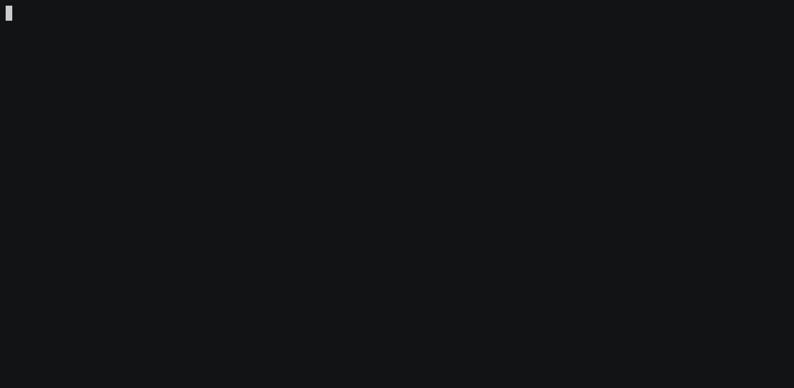
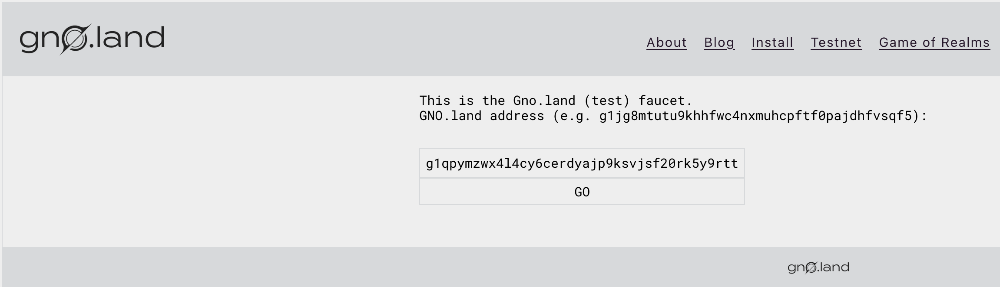

# Running a Faucet

## Overview

In this tutorial, we will cover how to run a local native currency faucet that works seamlessly with a Gno node.
Using the faucet, any address can get a hold of native currency funds in case they
haven't [premined a balance beforehand](../../../getting-started/local-setup/premining-balances.md).

## Prerequisites

- **`gnoland`, `gnofaucet` and `gnoweb` set up. Reference
  the [Installation](../../../getting-started/local-setup/local-setup.md#3-installing-other-gno-tools) guide for steps**

## 1. Ensure a topped-up faucet address

The Gno faucet works by designating a single address as a faucet address that will distribute funds.

Ensure the faucet account will have enough funds by [premining its balance](../../../getting-started/local-setup/premining-balances.md) to a high value.
In case you do not have an existing address added to `gnokey`, you can consult
the [Working with Key Pairs](../../../getting-started/local-setup/working-with-key-pairs.md) guide.

## 2. Start the local chain

After ensuring the faucet address will have enough funds in the premine, we
can [run the local blockchain node](../../../getting-started/local-setup/setting-up-a-local-chain.md).
Navigate to the `gno.land` sub-folder and run the appropriate make command:

```bash
cd gno.land
gnoland start
```

## 3. Start the faucet

After the chain is up and running locally, you can start the faucet by running the following command:

```bash
gnofaucet serve --chain-id dev MyKey
```

The command will prompt you to enter the decryption password for the key you've provided.

- **`--chain-id`** - the chain ID of the local running node. The default value is `dev`
- **`MyKey`** - the name of the faucet key (you can also use the address) we premined in
  the [previous steps](#1-ensure-a-topped-up-faucet-address)

This will initialize the faucet to listen on port `5050`, by default.



## 4. Start the `gnoweb` interface

To access the faucet UI, we need to start the local `gnoweb` interface.

Navigate to the `gno.land` subfolder, and run the appropriate binary:

```bash
cd gno.land
gnoweb
```

This will initialize the `gnoweb` interface on `http://127.0.0.1:8888`.


## 5. Use the deployed faucet

Once `gnoweb` has been started, you can navigate to http://127.0.0.1:8888/faucet.

Simply input the desired address you wish to receive funds on (`1 GNOT` by default), and press the `GO` button.



After you've added the address, you should see a success message in the browser:

```
faucet success
```

In the terminal where `gnofaucet` is running, you should see a success message as well, something along the lines of:

```bash
will deliver: {"msg":[{"@type":"/bank.MsgSend","from_address":"g155n659f89cfak0zgy575yqma64sm4tv6exqk99","to_address":"g1qpymzwx4l4cy6cerdyajp9ksvjsf20rk5y9rtt","amount":"1000000ugnot"}],"fee":{"gas_wanted":"50000","gas_fee":"1000000ugnot"},"signatures":[{"pub_key":{"@type":"/tm.PubKeySecp256k1","value":"A10ufcOV5WP71K+KvLagJi+3TSCkx8EWKep3NbjVclU8"},"signature":"7Y0hkdPBruzMiANAHXWx3luAMhQN6SF3AQtstvOSZJI5P4uep8RIntw2c8W5blFiCd9HoMiEZFNf5dgWYwkjmA=="}],"memo":""}

OK!
GAS WANTED: 50000
GAS USED:   41971
127.0.0.1 faucet success
```

## Conclusion

That's it 🎉

You have successfully set up a GNOT faucet on a locally-running Gno chain!
Additionally, you have also learned how to utilize the `gnoweb` tool for a visual faucet UI.
