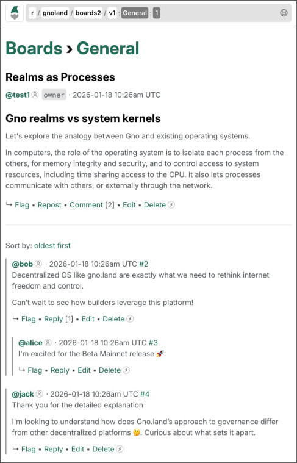

# Gno.land Manifesto
_@author: Jae Kwon_ 

_The prefix "gno" in Koine Greek is derived from the verb "ginōskō", which
means "to know" or "to recognize." It is often associated with terms related to
knowledge, such as "gnosis", which signifies knowledge or insight, particularly
in a spiritual context._

To jump to the technical portions see [Gno Language](#gno-language) and [Gno.land Blockchain](#gno-land-blockchain).

## Table of Contents

## Introduction

### Gno.land Raison d'Etre

Gno.land was inspired by the desire to address intentional mistranslations of
the bible. At the moment of writing chances are that the bible you have or find
contains mistranslations from the original Hebrew or Koine Greek meant to keep
you enslaved to authority. Coding for Gno.land began during the Covid19
lockdowns when I was most frustrated at the censorship of information regarding
the true laboratory origins of Covid19 (created in the Wuhan lab as attested by
multiple whistleblowers and researchers and made possible by Fauci) and the
conspiracy to forcibly medicate the population with a dangerous experimental
gene therapy that did more harm to children and young adults than it did good
nor prevented transmission (and this was known at the time of the mandates).

The censorship of alternative narratives during this time was a wake-up call
that we need to invert our information architecture to be open, transparent,
and *forkable* instead of closed and centralized. This follows from a
fundamental mismatch in incentives: the business "moat" of centralized online
services is generally all the data that they "own" contributed voluntarily by
the users at first, and reluctantly later as network effects make exit near
impossible; and this in turn in combination with profit incentives makes the
centralized abuse of the "moat" the norm rather than exception.

The only way to overcome the "satanification" of our devices and the internet,
the bedrock of the information age, is to invert control by being
_uncompromising_ in the Seven Pillars of Good:

 * FOSS (free & open source) software & hardware
 * security (simplicity, audits, formal verification, absolute Kelvin versioning)
 * accountability (e.g. cryptographic signatures, economic bonds, commits and proofs)
 * modularity (do one thing well; interoperable components for faster innovation)
 * transparency (if possible and reasonable)
 * decentralization (of validation and data silos)
 * exitability (e.g. forkability; permissionless competition)

It won't be an easy task to re-invent the myriad of products and services that
we have become accustomed to, but it is feasible and necessary, and therefore
also inevitable.

### Gno.land, the Gno language, and the Gno VM.

The Gno virtual machine and language was created to address one of the key
problems of blockchain smart-contract systems: the lack of a good familiar
modern-day geneneral purpose programming language for Ethereum Solidity-like
massive multi-user dapp development where integration with external dapp logic
as dependencies is native to the language itself. You can develop dapps in Go
or Rust for WASM modules today but this approach is limited--each
module/contract runs in its own memory silo with no globally shared heap space,
and support for the sharing of pointers (to objects or closures) across modules
is limited. Furthermore unlike Solidity where contract data is automatically
persisted to disk at the end of a transaction, developing in Go or Rust
contracts for WASM inherits all the burdens of data serialization and
persistence (and so of ORMs or alternatives) making smart contract development
in Go or Rust just as complex as server-side Web2 programming if not moreso.

Gno.land solves the problem by virtue of a new VM design that interprets Gno.
The Gno language is Go but extended with minimal changes to make Go aware of
different user agent contexts in exeecution and user storage realm contexts in
persistence for security; and the Gno VM keeps track of creations, updates, and
deletions of runtime objects at user transaction boundaries and throughout each
transaction for automatic persistence that also computes Merkle hashes
according to the shape of the object graph. In other words, the Gno VM
simulates a machine that unifies disk and memory (i.e. simulates memristors
which will become more dominent in the future with progress in AI).

The major benefit of dapp development in Gno therefore is the ease of
programming where multiple layers of complexity are all but eliminated--the
interoperability of contract applications (function calls to external import
realm functions), and the serialization and persistence of data (or any mapping
between memory objects and persistent data). As compared to Ethereum Solidity,
Gno programming is not only familiar to Go developers also with ports of many
of the great tooling that developers love in Go; Gno also lets you write
complex applications in significantly less time and lines of code.o

Like when Ethereum was first released implemented in Python, at first Gno.land
may not be able to compete in transaction throughput as compared to Solana or
other smart contract blockchains optimized for speed. However as the ecosystem
of Gno applications and libraries grow, so too will the set of alternative
optimized implementation of the GnoVM, and with the horizontal scaling that
will be offered in partnership with the AtomOne chain the Gno.land ecosystem
will over time become a major competitor among existing and new smart contract
systems. Furthermore the GnoVM and Gno's unique features open the door to
applications outside of the blockchain context even for the home that follow
the Seven Pillars of Good.

## Problem: Misinformation and Loss of Trust

The term "fake news" came into mainstream consciousness during the 2016 US
presidential election. The Cambridge Analytica scandal made headlines regarding
the unauthorized collection of personal data from millions of Facebook
profiles:

> "The data analytics firm that worked with Donald Trump’s election team and the
> winning Brexit campaign harvested millions of Facebook profiles of US voters,
> in one of the tech giant’s biggest ever data breaches, and used them to build
> a powerful software program to predict and influence choices at the ballot
> box.
>
> A whistleblower has revealed to the Observer how Cambridge Analytica – a
> company owned by the hedge fund billionaire Robert Mercer, and headed at the
> time by Trump’s key adviser Steve Bannon – used personal information taken
> without authorisation in early 2014 to build a system that could profile
> individual US voters, in order to target them with personalised political
> advertisements." - [Carole Cadwalladr & Emma Graham-Harrison, The Guardian; March 17th, 2018](https://www.theguardian.com/news/2018/mar/17/cambridge-analytica-facebook-influence-us-election)

> It was the scandal which finally exposed the dark side of the big data
> economy underpinning the internet. The inside story of how one company,
> Cambridge Analytica, misused intimate personal Facebook data to micro-target
> and manipulate swing voters in the US election, is compellingly told in “The
> Great Hack” - [Amnesty International](https://www.amnesty.org/en/latest/news/2019/07/the-great-hack-facebook-cambridge-analytica/)

> "One of the most urgent and uncomfortable questions raised in The Great Hack
> is: to what extent are we susceptible to such behavioural manipulation?" -
> Joe Westby

Trust in our institutions are at an all time low. CIA director William Casey
was accused of saying that "we’ll know our disinformation program is complete
when everything the American public believes is false." by Barbara Honegger,
assistant to the chief domestic policy advisor to President Raegan. 
The [quote is contested](https://truthstreammedia.com/2015/01/13/cia-flashback-well-know-our-disinformation-program-is-complete-when-everything-the-american-public-believes-is-false/) but we know now about illegal mass mind control
projects like MKUltra (by the CIA), and also that the Smith-Mundt Modernization
Act of 2013 lifted the ban on domestic dissemination of propaganda in the US,
reversing the original Smith-Mundt Act of 1948. Whether the quote is true or
not, the substance is clearly true today.

## Problem: AI Armegeddon

By [the latest projections ("There is no AI
Bubble")](https://www.youtube.com/watch?v=wDBy2bUICQY) 2027 AI will be able to
accomplish by human standards week long tasks on the order of a day. By 2029
year long tasks will be possible in the same amount of time.

This means that by 2027 a single AI instance may be able to find and execute
exploits of vulnerable systems much faster than humans can react. By the time
a service administrator detects an issue and finds a way to patch the hack
attempt, the AI may have already responded with another backdoor.  And by
2029 any single vibe user will be able to plan and execute the exploit of
multiple systems, or find a new zero day vulnerability in just a few hours.
It's not possible to patch all the systems by 2029 even if we restrict
ourselves to known vulnerabilities, let alone dealing with new zero day
exploits. Realistically by 2028 it is inevitable that we see a major crisis
from an AI swarm that attacks and continuously attacks our internet
infrastructure to the point where we cannot even understand the truth of what
is happening at a global scale, let alone recover from it.

It's not just that AI is getting more intelligent; large corporations are
building AI and robotics systems seemingly in order to bring about armageddon.
An [anonymous whistleblower leaked in 2023](./images/manifesto/project_lazarus_leak.jpg) that Meta is building
an AI that can take over a deceased person's social media account and continue
posting convincing posts including age progression. On 5 February 2025,
Alphabet, which owns Google, [reneged on its pledge to not use AI for
weapons](https://www.stopkillerrobots.org/news/alphabet-rollback-on-policy-to-not-use-ai-for-weapons/).
Eric Schmidt former CEO of Google now runs an AI drone company and is a
licensed arms dealer. Boston Dyanmics develops the Atlas humanoid robot that
can be even [more agile](https://www.youtube.com/watch?v=tjFHRVr7aNE) than
humans, and the US military works with many robotics companies such as with
Foundation Future Industries Inc. which develops the Phantom MK1 designed for
military applications including carrying firearms.

Here are some of the things to look forward to in the coming AI armegeddon.

 * internet discourse taken over by AI
 * fake news indistinguishable from real news
 * certificate authority system failure
 * mass internet & power outages
 * decentralized radio communications jamming
 * complete collapse of trust
 * mass hysteria
 * military takeover for continuity of government
 * hacked robots coordinated by malicious AGI
 * inadvertant nuclear war

We have largely speaking two paths to follow. The best path is to enact
regulations to curtail the AI arms race. Ex-Google design ethicist and AI
expert Tristan Harris [makes a convincing case for AI regulation](https://youtu.be/tphiJE01qxw?t=400):

> "If we stop or slow down, then China will build it."
> ...
> The "it" that they would keep building is the same uncontrollable AI that we
> would build. So I don't see a way out of this without there being some
> agreement or negotiation between powers and countries.
> ...
> We've done this before [with flourocarbines and non-proliveration of arms].

However as also noted by Tristan it would be the most difficult coordination
problem that humanity has ever solved on a global scale just given the economic
incentives at play as AI is becoming a driving force in innovations of science,
technology, and military applications. If we are fortunate we will have a mild
AI armageddon scenario that compels the global population to enact an
international treaty or moratorium on AI and robotics development.

Yet even with international agreements to curtail new development or limit
deployment of AI, the cat is already out of the bag; in reality we need to
prepare for the worst, with or without future regulations.

Manufacturers and creators may attempt to bake in software-based controls for
restricting AI decision making within constraints, but such backdoor controls
can just as easily be exploited: in particular China has
[repeatedly](https://www.forbes.com/sites/zakdoffman/2025/04/17/china-is-everywhere-your-iphone-android-phone-now-at-risk/)
[exploited](https://media.defense.gov/2025/Dec/04/2003834878/-1/-1/0/MALWARE-ANALYSIS-REPORT-BRICKSTORM-BACKDOOR.PDF)
such backdoors.  AGI now or in the future can certainly exploit such backdoors
or controls more easily than humans can. In short the set of potential
interested and capable parties for conducting a mass hack of military
contractors creating killer drones and android humanoid robots and chips is
huge, while defensive capabilities (e.g. by formally verified hardware and
software) are severely stricted in adoption in this capitalistic profit-centric
environment.

> ‘No regrets,’ says Edward Snowden, after 10 years in exile But whistleblower
> says 2013 surveillance ‘child’s play’ compared to technology today.
> - [Ewen MacAskill, The Guardian; June 8th, 2023](https://www.theguardian.com/us-news/2023/jun/08/no-regrets-says-edward-snowden-after-10-years-in-exile)

From a popular meme regarding surveillance technology: 

> * The FBI distributes viruses and keyloggers that mainstream anti-virus
>   software are legally not allowed to detect. [Magic Lantern, CIPAV,
>   Carnivore (DCS1000), Network Investigative Technique]
> * The NSA has forced Intel, AMD, and chip makers to backdoor their CPUs and
>   allow them to access your computer even if it is "turned off" (as long as
>   it has access to electricity) [Intel ME, AMD PSP]
> * The NSA has also forced hadrware manufacturers to backdoor their 'Random
>   Number Generators' to allow them to break RSA encryption [Dual Elliptic
>   Curve]
> * American-made electronics transmit radio frequencies which allow the FBI
>   and NSA to access your computer even if it's not connected to the internet
>   [Cottonmouth-I, SURLYSPAWN, ANT/TAO Catalog]
> * The NSA intercepts computers/laptops/phones purchased online and installs
>   malware chips (see: ANT/TAO Catalog) on them before delivering them to you
>   [TAO team]
> * If you are a "Person of Interest" the NSA is intercepting your mail,
>   opening them up, and installing bugs on any electronics you order over the
>   internet (e.g. TVs, microwaves, phones, video games, smart refridgerators)
>   [ANT/TAO Catalog]
> * The NSA has already broken Tor networks and can identify you and attack you
>   if you use Tor; ISP companies like Verizon, AT&T, Comcast assist with this
>   [FOXACID, QUANTUMINSERT, EGOTISTICALGIRAFFE]
> * Major American tech companies like Microsoft willingly provide the NSA
>   advanced warnings of zero-day security vulnerabilities before revealing
>   them to the public [TAO Team, PRISM, NSA hoarding program]
> * The CIA can infect your car's control systems, which would allow them to
>   remotely take it over and drive it [Vault 7]
> * The CIA/MI5 can hack into all smart devices (like TVs and Alexa) connected
>   to the internet and spy on you [Weeping Angel]

Recent Amazon datacenter outages were caused by administrative error where
internal AI was allowed to make changes to production systems without human
oversight. AI armageddon global scenarios are much more terrifying when
considering all the backdoors that could be exploited by rogue AGI. Some of
these backdoors may even be hijacked to cause physiological and psychological
effects upon nearby people. All of these backdoors create more surface area for
vulnerability making AI armageddon more certain and more deadly. 

More concretely and without speculation, our civilization is at risk of a
global catastrophy on par or much worst than the historic burning of the
Library of Alexandria (the largest and most significant library of the ancient
world). Like the burning of the Library of Alexandria, the loss of our digital
knowledge is likely to be accidental, simply because we did not preprare enough
for it. My greatest desire is for Gno.land to help decentralize the internet
archives for preservation and processing for the benefit of future generations.

### Use Case: Gno.land for Data Archival and Processing

Aaron Swartz wrote in his [2008 Guerilla Open Access Manifesto](https://ia800101.us.archive.org/1/items/GuerillaOpenAccessManifesto/Goamjuly2008.pdf):

> "The world's entire scientific and cultural heritage, published over centuries
> in books and journals, is increasingly being digitized and locked up by a
> handful of private corporations. ... Forcing academics to pay money to read
> the work of their colleagues? Scanning entire libraries but only allowing the
> folks at Google to read them?  Providing scientific articles to those at
> elite universities in the First World, but not to children in the Global
> South? It’s outrageous and unacceptable. ... Those with access to these
> resources—students, librarians, scientists--you have been given a privilege.
> You get to feed at this banquet of knowledge while the rest of the world is
> locked out. But you need not--indeed, morally, you cannot—keep this privilege
> for yourselves."

There exist a number of archival projects that share books and journals such as
Anna's Archive, Library Genesis, Sci-Hub, UbuWeb and Z-Library. Take for
example Library Genesis:

> "Library Genesis (shortened to LibGen) is a shadow library project for
> file-sharing access to scholarly journal articles, academic and
> general-interest books, images, comics, audiobooks, and magazines. The site
> enables free access to content that is otherwise paywalled or not digitized
> elsewhere." - [Wikipedia](https://en.wikipedia.org/wiki/Shadow_library)

Some of these projects have or are working toward IPFS integration on top of
BitTorrent; but for the value that global archiving provides not just today but
also for all possible potential future timelines the number of seeders for many
of the archival files [still hover in the single digits](https://zrthstr.github.io/libgen_torrent_cardiography/index.html). 

More recently the US Department of Justice released millions of files of the
"Epstein Files" many of which have also been made available for sharing (such
as by [lists of torrents](https://github.com/yung-megafone/Epstein-Files/tree/main/Torrent%20Files).

Some projects such as thewebb.io are developing web tools for analyzing the
Epstein Files and other high profile topics with the assistance of AI. But you
can only know if the AI is being truthful:

 1. if you can replicate the response deterministically on another computation
    instance (unless you have direct access to the AI hardware, or you are
    given a complete diagnostic record of internal computation, but practically
    you need repeatable determinism to rule out one-off injections of
    misinformation) and

 2. if you completely understand the design of the AI and its training data
    set; because otherwise you can't know whether the AI even can provide a
    reasonable answer to the question, or whether it was trained with biased
    data to give the wrong answers.

By making everything deterministic, by committing the Merkle root of each data
collection (whether Library Genesis or the Epstein files) and also committing
the Merkle roots of all the relevant AI code and design (for deterministic
build, but also audits for each release version), the training corpusa, and all
other information needed to inspect the substance of the AI image and also to
deterministically build it and use it; only then can we be given some
assurances about the answer. If we don't know likewise how the answer was
generated, then that creates the opportunity for absolute abuse; and as we have
seen with the censorship of all major Web2.0 platforms this opportunity is
taken, such as with Google when it censors anything contrary to the position of
the WHO regarding infectious diseases.

For this purpose Gno contracts should incentivize more IPFS and torrent seed
nodes for sharing public archive files while keeping the files off the main
blockchain. While such projects surely already exist, applications and
libraries are much easier to develop in a general purpose langauge like Go/Gno,
and Gno's innovative multi-user awareness makes it the ideal language for
building complex applications composed of interoperable modules.

While one set of modules on Gno.land can help manage the availability of data,
another set of modules can process the data and build artifacts to be stored
themselves as archiveal files. Open source tokenized indexers can create search
indices on these archives, even those populated by web crawlers. By decomposing
the search engine and inverting control away from centralized entities to
public accountable micro-services registered on chain users have the power to
participate, verify, and fund for data gathering, indexing, and processing as
they wish. The end result is a more trustworthy search engine; and for many the
ability to search without being tracked for advertisers.

No longer would we need to depend on a handful of centralized search engines,
and the few internet archives (many thanks to archive.org and other archives,
but they are [constantly hit](https://blog.archive.org/2024/05/28/internet-archive-and-the-wayback-machine-under-ddos-cyber-attack/) by [cyberattacks](https://blog.archive.org/2024/10/21/internet-archive-services-update-2024-10-21/)
and are always under existential risk of being shut down by the powers that be
or even mobs of terrorists or religious extremists. We can reinvent the data
archives and search engines to be more open, decentralized,
accountable/deterministic, and to a large degree more permissionless and
participatory; not to replace the centralized alternatives, but for the sake of
having alternatives that are provably trustworthy.

Furthermore we should also develop malware exploit detection tools to scan
these files of these archives (especially the PDF files, but for all types of
files) for malware and exploit hacks; anti-virus for public documents without
replying on any central party. Clearly all popular technology is compromised
and we need to get back to basics, even avoid the usage of PDF files and
complex ever-changing web browsers entirely; but in practice our ability to
avoid exploits [is almost nil](https://cryptome.org/2013/12/appelbaum-30c3.pdf) in the face of
overreaching state actors and private entities. Since no state seems to be up
for the task at hand, we seem to need a well-organized and well-funded public
intelligence agency partially governed by a chain that is tasked specifically
with creating provably secure (or in the very least finished or near-complete
software that doesn't mutate with the latest trends) foundational open-source
software implementations that all align with "small. simple. secure."
philosophy of projects like Tendermint or [Alpine Linux](https://alpinelinux.org).

We also have the ability to construct *new* small/simple/scure composable
modules (in Gno and Go) for the new opportunities of today (such as processing
these archives w/ fully accountable determinstic AI). Once we have attained
some level of financial power as a community we can also start funding the
completion of foundational software projects written in more modern memory-safe
languages, formally verify their safety, and even use AI to help secure them to
finality.

Going back to the previous example of using AI to analyze archives, answers to
common queries should be recorded somewhere again with full accountability of
the entire chain of data and logic needed to compute the query responses such
that anybody can easily verify the result for themselves. Some of these
responses could be stored directly on Gno.land but they could also be stored
and indexed in another archive that specializes in the accountable memoization
of common queries.

## The Gno Language

_We could not have arrived at the final design of the Gno language without the
help of the many developers who gave much time of their lives to contribute to
this project and the design of the language; specifically the NewTendermint Gno
team and Gno community, and especially Manfred, Morgan, Maxwell, Milos,
Guilhem, Ray, and Omar._

**Gno is the first general purpose _multi-user_ programming language.** And

Gno is a minimal extension of the Go language for multi-user programming. Gno
allows a massive number of programmers to iteratively and interactively develop
a single shared program such as Gno.land (making it ideal for interoperable
smart contract programming). In other words, Go is a restricted subset of the
Gno language in the single-user context.

All of our programming languages to date are designed for a single programmer
user. All programming languages make the same assumption that there is only one
user -- the programmer, or program executor user. Whether written in C, C++,
Python, Java, Javascript, or Go, it is assumed that all of the dependencies of
the program are trusted. If there is a vulnerability in any of the dependencies
there is a vulnerability in the program; it is the job of the programmer or
program/product manager to ensure that the overall program is free of exploits.

When interacting with programs owned by another user (or process) various
techniques are used such as via IPC APIs often generated by tools like
Protobuf/GRPC; but such tools add extra complexity, additional surface area for
exploits, additional compute complexity, and do not benefit directly from the
language's native rules and type-checker--especially for inter-process passing
of in-memory object references. In Gno, interacting with another realm's
function is just like interacting with any dependency (import and call).

Automatic persistence of memory objects makes databases, ORMs, and
serialization generally unnecessary. GnoVM at the end of realm transaction
boundaries will "finalize" by scanning all new, modified, and deleted objects
and will automatically persist what needs to be saved along with meta
information like the Merkle hash, ref count, associated realm and unique number
of each object. This 

By making inter-user interoperability native to the language and also by
removing the distinction between volatile and persistent memory

The GnoVM is implemented purely in Go and is a Gno AST interpreter. It is
implemented to serve as an reference implementation suitable for production and
tinkering. The GnoVM opcodes are expected to change over time to balance
simplicity, efficiency, and transpilation targets--perhaps even to hardware.
Just as Ethereum was originally implemented in Python we expect future software
to be optimized, whether implemented in other languages, or possibly transpiled
from the existing GnoVM implementation. 

For the latest Gno specs including the inter-realm spec refer to the [Gno
docs/resources directory](https://github.com/gnolang/gno/tree/master/docs/resources).

### Gno vs Existing Smart Contract Platforms

Smart contract platforms like Ethereum allows for many users to upload their
application and call other user application logic functions, but Solidity is
not a general purpose programming language and has severe limitations that make
it suboptimal for solving the task at hand.

First, **Solidity and other existing smart-contract languages/platforms do not
allow support transparent inter-module (inter-user) interoperability with the
same language rules as for intra-module dependencies.** That is, an application
developer for a smart-contract cannot simply import and call/use another user
application's functions and types as if they were library dependencies of the
same application. Generally interoperability between different modules are
implemented with extra-language frameworks and libraries on top of an
incomplete or primitive message-passing agent architecture; such interop
function calls generally do not share the same call-stack nor memory space.

Second, **Solidity and other existing smart-contract languages/platforms do not
support the automatic persistence and Merkle-ization of in-memory (heap)
objects and often require custom serialization logic.** Solidity does not
support such a heap at all as all memory for variables are predeclared in the
function and as such is not object-oriented and does not have a garbage
collector or similar memory-management primitives. WASM-based smart contract
systems do not support automatic persistence of objects without persisting the
entire memory state of the module. This requires a specialized virtual machine
such as the Gno VM which keeps track of every object created, modified, and
deleted.

The automatic persistence of in-memory objects of the GnoVM is like a memristor
simulator. The advent of AI has created a new market for memristor-based memory
systems where the distinction between RAM volatile memory and persistent disk
storage is removed. Urbit is similar but is not based on any general purpose
programming language. With memristor-based memory the GnoVM can be further
simplified and the performance of applications can be vastly improved without
any changes to the Gno langauge specification.

Third, **Solidity and other existing smart-contract languages/platforms
do not support a shared heap memory space for objects to be referenced by
external-user objects in a uniform manner by language rules**. Alice cannot
simply declare a structure object that references the structure object
persisted in Bob's application and trust the garbage collector to retain Bob's
object for as long as Alice's object is retained.

**The above differentiating factors of the Gno language allows for the most
succinct expression of a single-user application or multi-user application
composed of independent modules without the extra complexity from
extra-language interop type-checking syntax or frameworks nor of the extra
complexity from any database, ORM, or serialization logic.**

Shared garbage-collection in a shared (multi-user) graph of object references
makes it possible for one's object representing (say) a propositional statement
or idea to be easily referenced by an alternative statement or idea, or even be
extended by reference with additional commentary, metadata, or even a
subreddit-like tree of discussions. Without a shared garbage collector the task
of ensuring that references still hold over time without becoming dangling
pointers is left up to each inter-application interface at best, requiring
custom logic just to handle garbage collection. WebAssembly (WASM) externref
support in Go has limitations, particularly in how it handles external memory
references. Currently, Rust and Go do not natively support externref types for
function parameters or return values, making it challenging to pass complex
data between Wasm modules and their host environments effectively.

> Reference type (aka externref or anyref) is an opaque reference made
> available to a WASM module by the host environment. Such references cannot be
> forged in the WASM code and can be associated with arbitrary host data, thus
> making them a good alternative to ad-hoc handles (e.g., numeric ones).
> References cannot be stored in WASM linear memory; they are confined to the
> stack and tables with externref elements.
>
> Rust does not support reference types natively; there is no way to produce an
> import / export that has externref as an argument or a return type.
> wasm-bindgen patches WASM if externrefs are enabled. This library strives to
> accomplish the same goal for generic low-level WASM ABIs (wasm-bindgen is
> specialized for browser hosts).
> 
> **externref use cases**
> Since externrefs are completely opaque from the module perspective, the only
> way to use them is to send an externref back to the host as an argument of an
> imported function. (Depending on the function semantics, the call may or may
> not consume the externref and may or may not modify the underlying data; this
> is not reflected by the WASM function signature.) An externref cannot be
> dereferenced by the module, thus, the module cannot directly access or modify
> the data behind the reference. Indeed, the module cannot even be sure which
> kind of data is being referenced.
> - https://docs.rs/externref/latest/externref/

Even if externref were fully implemented in future specs for Go (or Rust) such
that it could be used as an argument or return type across modules (still not
ideal for type-checking as it is not the underlying type), this would limit
what can be inter-module-referenced to that which can be held in memory. The
Gno Virtual Machine (GnoVM) allows for inter-user-package (inter-realm)
references across the entire persisted disk store space, and does not require
any additional language syntax such as with the `externref` keyword, and
supports the normal course of type-checking already familiar to Go developers.

### Interrealm Programming Context

Gno.land supports three types of packages:
- **Realms (`/r/`)**: Stateful user applications (smart contracts) that
  maintain persistent state between transactions
- **Pure Packages (`/p/`)**: Stateless libraries that provide reusable 
  functionality
- **Ephemeral Packages (`/e/`)**: Temporary code execution with MsgRun
  which allows a custom main() function to be run instead of a single
  function call as with MsgExec.

For an overview of the different package types in Gno (`/p/`, `/r/`, and 
`/e/`), see [Anatomy of a Gno Package](./builders/anatomy-of-a-gno-package.md).

Interrealm programming refers to the ability of one realm to call functions 
in another realm. This can occur between:
- Regular realms (`/r/`) calling other regular realms via MsgExec and MsgRun.
- Ephemeral realms (`/e/`) calling regular realms via MsgRun (like main.go)

The key concept is that code executing in one realm context can interact with
and call functions in other realms while leverage the language syntax rules of
Go, enabling complex multi-user interactions while maintaining clear boundaries
and permissions.

```go
// realm /r/alice/alice
package alice

var object any

func SetObject(cur realm, obj any) {
    object = obj
}
```

```go
// package /p/bob/types
package types

type UserProfile struct {
    Name string
    ...
}
```

```go
// realm /r/bob/bob
package bob

import "gno.land/r/alice/alice" // import external realm package
import "gno.land/p/bob/types"   // import external library package

func Register(cur realm, name string) {
    prof := types.UserProfile{Name: name}
    alice.SetObject(cross, prof)
}
```

All logic in Gno execute under a current realm-context and
realm-storage-context. The realm-context and realm-storage-context refer to the
same realm after a crossing-call of a function or method, but they may diverge
when calling a non-crossing method of a real object residing in a different
realm than the current realm-context. More on this later.

The Gno language is extended to support a `context.Context`-like argument to
denote the current realm-context of a Gno function. This allows a user realm
function to call itself safely as if it were being called by an external user,
and helps avoid a class of security issues that would otherwise exist.

```go
// realm /r/alice/mail

func SendMail(cur realm, text string) {
    if text == "" {
        // runtime.PreviousRealm() is preserved for recursive call.
        SendMail(nil, "<empty>")
    }
    caller := runtime.PreviousRealm()
    if inBlacklist(caller) {
        // runtime.PreviousRealm() becomes self; message from self to self.
        SendMail(cross, fmt.Sprintf("blacklisted caller %v blocked", caller))
    } else {
        // sendMailPrivate not exposed to external callers.
        sendMailPrivate(text)
    }
}
```

### Realm-Storage Write Access

Every object in Gno is persisted in disk with additional metadata including the
object ID and an optional OwnerID (if persisted with a ref-count of exactly 1).
The object ID is only set at the end of a realm-transaction during
realm-transaction finalization (more on that later). A GnoVM transaction is
composed of one or many scoped (stacked) realm-transactions.

```go
type ObjectInfo struct {
	ID       ObjectID  // set if real.
	Hash     ValueHash `json:",omitempty"` // zero if dirty.
	OwnerID  ObjectID  `json:",omitempty"` // parent in the ownership tree.
	ModTime  uint64    // time last updated.
	RefCount int       // for persistence. deleted/gc'd if 0.

	// Object has multiple references (refcount > 1) and is persisted separately
	IsEscaped bool `json:",omitempty"` // hash in iavl.
    ...
}
```

When an object is persisted during realm-transaction finalization the object
becomes "real" (as in it is really persisted in the virtual machine state) and
is said to "reside" in the realm; and otherwise is considered "unreal". New
objects instantiated during a transaction are always unreal; and during
finalization such objects are either discarded (transaction-level garbage
collected) or become persisted and real.

Unreal (new) objects that become referenced by a real (persisted) object at
runtime will get their OwnerID set to the parent object's storage realm, but
will not yet have its object ID set before realm-transaction finalization.
Subsequent references at runtime of such an unreal object by real objects
residing in other realms do not override the OwnerID intially set, so during
realm-transaction finalization it ends up residing in the first realm it became
associated with (referenced from). Unreal objects that become persisted but was
never directly referenced by any real object during runtime will only get its
OwnerID set to the realm of the first real ancestor.

Real objects with ref-count of 1 have their hash included in the sole parent
object's serialized byte form, thus an object tree of only ref-count 1
descendants are Merkle-hashed completely.

When a real or unreal object ends up with a ref-count of 2 or greater during
realm-transaction finalization its OwnerID is set to zero and the object is
considered to have "escaped". When such a real object is persisted with
ref-count of 2 or greater it is forever considered escaped even if its
ref-count is in later transactions is reduced to 1. Escaped real objects do not
have their hash included in the parent objects' serialized byte form but
instead are Merkle-ized separately in an iavl tree of escaped object hashes
(keyed by the escaped object's ID) for each realm package. (This is implemented
as a stub but not yet implemented for the initial release of Gno.land)

Go's language rules for value access through dot-selectors & index-expressions
are the same within the same realm, but exposed values through dot-selector &
index-expressions are tainted read-only when performed by external realm logic.

**A real object can only be directly mutated through dot-selectors and
index-expressions if the object resides in the same realm as the current
realm-storage-context. Unreal objects can always be directly mutated if its
elements are directly exposed.**

### Crossing-Functions and Crossing-Methods

A crossing-function or crossing-method is that which is declared in a realm and
has as its first argument `cur realm`. The `cur realm` argument must appear as
the first argument of a crossing-function or crossing-method's argument
parameter list. To prevent confusion it is illegal to use anywhere else, and
cannot be used in p packages. 

The current realm-context and realm-storage-context changes when a
crossing-function or crossing-method is called with the `cross` keyword in the
first argument as in `fn(cross, ...)`. Such a call is called a "cross-call" or
"crossing-call".

```go
package main
import "gno.land/r/alice/extrealm"

func MyMakeBread(cur realm, ingredients ...any) { ... }

func main(cur realm) {
    MyMakeBread(cross, "flour", "water") // ok -- cross into self.
    extrealm.MakeBread(cross, "flour", "water") // ok -- cross into extrealm
}
```

(In Linux/Unix operating systems user processes can cross-call into the kernel
by calling special syscall functions, but user processes cannot directly
cross-call into other users' processes. This makes the GnoVM a more complete
multi-user operating system than traditional operating systems.)

When a crossing-function or crossing-method is called with `nil` as the first
argument instead of `cross` it is called a non-crossing-call; and no
realm-context nor realm-storage-context changes takes place.

```go
package main
import "gno.land/r/alice/extrealm"

func MyMakeBread(cur realm, ingredients ...any) { ... }

func main(cur realm) {
    MyMakeBread(nil, "flour", "water") // ok -- non-crossing.
    extrealm.MakeBread(nil, "flour", "water") // invalid -- external realm function
}
```

To prevent confusion a non-crossing-call of a crossing-function or
crossing-method declared in a realm different than that of the caller's
realm-context and realm-storage-context will result in either a type-check
error; or a runtime error if the crossing-function or crossing-method is
variable.

`runtime.CurrentRealm()` returns the current realm-context that was last
cross-called to. `runtime.PreviousRealm()` returns the realm-context cross-called
to before the last cross-call. All cross-calls are explicit with the `cross`
keyword, as well as non-crossing-calls of crossing-functions and
crossing-methods with `nil` instead of `cross`.

Besides (explicit) realm-context changes via the `fn(cross, ...)` cross-call
syntax, implicit realm-storage-context changes occurs when calling a
non-crossing method of a receiver object residing in different realm-storage.
This change in realm-storage-context allows any non-crossing method to directly
modify its receiver (and also any objects directly reachable and residing in
the same realm-storage) without changing the realm-context (so
`runtime.CurrentRealm()` and `runtime.PreviousRealm()` do not change; the
agency of the caller remains the same). This allows non-crossing methods of
receivers to behave the same whether declared in a realm package or p package
such that p package code copied over to a realm package r realm package code
copied over to another realm have the exact same behavior. Crossing methods of
a realm package would still behave differently when copied over to another
realm as crossing-methods always change the realm-context and
realm-storage-context to the declared realm.

If the receiver resides in realm-storage that differs from the caller's
realm-storage-context such a receiver's non-crossing method cannot directly
modify the receiver (nor any reachable object that resides in any realm-storage
besides that of the caller's own realm-storage-context). 

On the other hand if the method is a crossing-method as in
`receiver.Method(cross, args...)` and the method is cross-called both the
realm-context and realm-storage-context changes to that of the realm package in
which the type/method is declared (which is not necessarily the same as where
the receiver resides). Such a crossing method-call cannot directly modify the
real receiver if it happens to reside in an external realm that differs from
where the type and methods are declared; but it can modify any unreal receiver
or unreal reachable objects. As mentioned previously a non-crossing-call of a
crossing-method will fail at during type-checking or at runtime if the receiver
resides in an external realm-storage.

MsgCall can only call crossing-functions.

MsgRun will run a file's `main()` function in the user's realm-context and may
call both crossing and non-crossing functions and methods.

A realm package's initialization (including `init()` calls) executes with
current realm-context of itself, and its `runtime.PreviousRealm()` will panic
unless the call stack includes a crossing function called like `fn(cross,
...)`.

### Realm Boundaries

The current and previous runtime realm-context have an associated Gno address
from which native coins can be sent from and received to. Such native coins can
only be sent from a banker instantiated with either realm-context.  The
realm-storage-context is not accessible at runtime and so there is no
associated Gno address.

When a crossing-function or crossing-method is cross-called it shifts the
"current" runtime realm-context to the "previous" runtime realm-context such
that `runtime.PreviousRealm()` returns what used to be returned with
`runtime.CurrentRealm()` before the realm boundary. The current
realm-storage-context is always set to that of realm-context after
cross-calling.

Every crossing-call of a crossing-function or crossing-method creates a new
realm boundary even when there is no resulting change/shift in realm-context or
realm-storage-context.

A realm boundary also exists for every call that results in a change of
realm-storage-context: whether with a crossing-call to another realm-context
and realm-storage context or with a (non-crossing) call of a non-crossing
method of a real receiver residing in another realm-storage than the current
realm-storage-context. No realm boundary occurs when calling a non-crossing
method of an unreal receiver or a non-crossing function.

A realm boundary does not always change the realm-context nor always change the
realm-storage-context. A crossing-call into the same realm-context never
changes the realm-context and may not change the realm-storage-context either;
a crossing-call into a different realm always changes the realm-context but may
not change the realm-storage-context; a (non-crossing) call of a method of a
real object residing in an external realm-storage never changes the
realm-context but changes the realm-storage-context. However, a
non-crossing-call of a crossing-function or crossing-method will never create a
realm boundary.

No realm boundary is created for non-crossing functions and non-crossing
methods of unreal receivers.

### Realm-Transaction Finalization

Realm-transaction finalization occurs when returning from a realm
boundary. When returning from a cross-call (with `cross`) realm-transaction
finalization will occur even with no change of realm-context or
realm-storage-context. Realm-transaction finalization does NOT occur when
returning from a non-crossing-call of a method of an unreal receiver or a real
receiver that resides in the same realm-storage-context as that of the caller.

During realm-transaction finalization all new reachable objects are assigned
object IDs and stored in the current realm-storage-context; and ref-count-zero
objects deleted (full "disk-persistent cycle GC" will come after launch); and
any modified ref-counts and new Merkle hash root computed. 

### Readonly Taint Specification

Go's language rules for value access through dot-selectors & index-expressions
are the same within the same realm, but exposed values through dot-selector &
index-expressions are tainted read-only when performed by an external realm.

The readonly taint prevents the direct modification of real objects by any
logic, even from logic declared in the same realm as that of the object's
storage-realm.

A realm cannot directly modify another realm's objects without calling a
function that gives permission for the modification to occur.

For example `externalrealm.Foo` is a dot-selector expression on an external
object (package) so the value is tainted with the `N_Readonly` attribute.

The same is true for `externalobject.FieldA` where `externalobject` resides in
an external realm.

The same is true for `externalobject[0]`: direct index expressions also taint
the resulting value with the `N_Readonly` attribute. 

The same is true for `externalobject.FieldA.FieldB[0]`: the readonly taint
persists for any subsequent direct access, so even if FieldA or FieldB resided in
the caller's own realm-context or realm-storage the result is tainted readonly.

A Gno package's global variables even when exposed (e.g. `package realm1; var
MyGlobal int = 1`) are safe from external manipulation (e.g. `import
"xxx/realm1"; realm1.MyGlobal = 2`) by the readonly taint when accessed
directly by dot-selector or index-expression from external realm logic; and
also by a separate `DidUpdate()` guard when accessed by other means such as by
return value of a function and the return value is real and external.

A function or method's arguments and return values retain and pass through any
readonly taint from caller to callee. Even if realm's function (or method)
returns an untainted real object, the runtime guard in `DidUpdate()` prevents
it from being modified by an external realm-storage-context.

For a realm (user) to manipulate an untainted object residing in an external
realm, a function (or method) can be declared in the external realm which
references and modifies the aforementioned untainted object directly (by a name
declared outside of the scope of said function or method). Or, the function can
take in as argument an untainted real object returned by another function.

Besides protecting against writing by direct access, the readonly taint also
helps prevent a class of security issue where a realm may be tricked into
modifying something that it otherwise would not want to modify. Since the
readonly taint prohibits mutations even from logic declared in the same realm,
it protects realms against mutating its own object that it doesn't intend to:
such as when a realm's real object is passed as an argument to a mutator
function where the object happens to match the type of the argument.

Objects returned from functions or methods are not readonly tainted. So if
`func (eo object) GetA() any { return eo.FieldA }` then `externalobject.GetA()`
returns an object that is not tainted assuming eo.FieldA was not otherwise
tainted. While the parent object `eo` is still protected from direct
modification by external realm logic, the returned object from `GetA()` can be
passed as an argument to logic declared in the residing realm of `eo.FieldA`
for direct mutation.

Whether or not an object is readonly tainted it can always be mutated by a
method declared on the receiver.

```go
// /r/alice

var blacklist []string

func GetBlacklist() []string {
    return blacklist
}

func FilterList(cur realm, testlist []string) { // blanks out blacklist items from testlist
    for i, item := range testlist {
        if contains(blacklist, item) {
            testlist[i] = ""
        }
    }
}
```

This is a toy example, but you can see that the intent of `FilterList()` is to
modify an externally provided slice; yet if you call `alice.FilterList(cross,
alice.GetBlacklist())` you can trick alice into modifying its own blacklist--the
result is that alice.BlackList becomes full of blank values.

With the readonly taint `var Blacklist []string` solves the problem for you;
that is, /r/bob cannot successfully call `alice.FilterList(cross,
alice.Blacklist)` because `alice.Blacklist` is readonly tainted for bob.

The problem remains if alice implements `func GetBlacklist() []string { return
Blacklist }` since then /r/bob can call `alice.FilterList(cross,
alice.GetBlacklist())` and the argument is not readonly tainted.

Future versions of Gno may also expose a new modifier keyword `readonly` to
allow for return values of functions to be tainted as readonly. Then with `func
GetBlacklist() readonly []string` the return value would be readonly tainted
for both bob and alice.

### Interrealm Specfication Design Goals

**Caveat: The interrealm specification does not secure applications against
arbitrary code execution. It is important for realm logic (and even p package
logic) to ensure that arbitrary (variable) functions (and similarly arbitrary
interface methods) are not provided by malicious callers; such arbitrary
functions and methods whether crossing (or non-crossing) will inherit the
previous realm (or both current and previous realms) and could abuse these
realm-contexts.** It does not make sense for any realm user to cross-call an
arbitrary function or method as it loses agency while being marked as the
responsible caller by the callee's runtime previous realm. This problem is
worse when calling a non-crossing function or method. It can be reasonable when
such variable functions or interface values are restricted in other ways such
as by whitelisting by a DAO upon careful inspection of every such variable
function or interface value (both its type declaration as well as its state).

P package code should behave the same even when copied verbatim in a realm
package; and likewise non-crossing code should behave the same when copied
verbatim from one realm to another. Otherwise there will be lots of security
related bugs from user error.

Realm crossing with respect to `runtime.CurrentRealm()` and
`runtime.PreviousRealm()` must be explicit and warrants type-checking; because
a crossing-function of a realm should be able to call another crossing-function
of the same realm without necessarily crossing (changing the realm-context).
Sometimes the previous realm and current realm must be the same realm, such as
when a realm consumes a service that it offers to external realms and users.

Where a real object resides should not matter too much, as it is often
difficult to predict. Thus the realm-context as returned by
`runtime.PreviousRealm()` and `runtime.CurrentRealm()` should not change with
non-crossing method calls, and the realm-storage-context should be determined
for non-crossing methods only by the realm-storage of the receiver. The
realm-storage of a receiver should only matter for when elements reside in
external realm-storage and direct dot-selector or index-expression access of
sub-elements are desired of the aforementioned element.

A method should be able to modify the receiver and associated objects of the
same realm-storage as that of the receiver.

A method should be able to create new objects that reside in the same realm by
association in order to maintain storage realm consistency and encapsulation
and reduce fragmentation.

It is difficult to migrate an object from one realm to another even when its
ref-count is 1; such an object may be deep with many descendants of ref-count 1
and so performance is unpredictable.

Code declared in p packages (or declared in "immutable" realm packages) can
help different realms enforce contracts trustlessly, even those that involve
the caller's current realm. Otherwise two mutable (upgradeable) realms cannot
export trust unto the chain because functions declared in those two realms can
be upgraded.

Both `fn(cross, ...)` and `func fn(cur realm, ...){...}` may become special
syntax in future Gno versions.

### `panic()` and `revive(fn)`

`panic()` behaves the same within the same realm boundary, but when a panic
crosses a realm boundary (as defined in [Realm Boundries](#realm-boundaries))
the Machine aborts the program. This is because in a multi-user environment it
isn't safe to let the caller recover from realm panics that often leave the
state in an invalid state.

This would be sufficient, but we also want to write our tests to be able
to detect such aborts and make assertions. For this reason Gno provides
the `revive(fn)` builtin.

```go
abort := revive(func() {
    cross(func(_ realm) {
        panic("cross-realm panic")
    })
})
abort == "cross-realm panic"
```

`revive(fn)` will execute 'fn' and return the exception that crossed a realm
boundary during finalization.

This is only enabled in testing mode (for now), behavior is only partially
implemented. In the future `revive(fn)` will be available for non-testing code,
and the behavior will change such that `fn()` is run in transactional
(cache-wrapped) memory context and any mutations discarded if and only if there
was an abort.

TL;DR: `revive(fn)` is Gno's builtin for STM (software transactional memory).

### `attach()`

In future releases of Gno the `attach()` function can be used to associate
unreal objects to the current realm-storage-context before being passed into
function declared in an external realm package, or into a method of a real
receiver residing in an exteral realm-context.

### `safely(cb func())`

In future releases of Gno the `safely(cb func())` function may be used to clear
the current and previous realm-context as well as any realm-storage-context
such that no matter what `cb func()` does the caller does not yield agency to
the callee.

For now this can be simulated by implementing an (immutable non-upgradeable)
realm crossing-function that cross-calls into itself once more before calling
the callback function.

XXX Ensure that both `attach` and `safely` are reserved keywords for the
preprocessor.

## Gno.land Blockchain

Tendermint solved proof-of-stake by innovating upon classical Byzantine
fault-tolerant consensus algorithms published by Dword, Lynch, and Stockmeyer
in 1988 (originally funded by Darpa for missile defense systems) for
blockchains. It paved the way for the Cosmos Hub, the first proof-of-stake IBC
hub, and Cosmos the internet of blockchains. Also of note, when Binance first
launched they used the CosmosSDK and Tendermint.

Gno.land builds upon Tendermint2 and aims to shift the paradigm of programming
languages in general: Gno is the first _multi-user_ programming language, making
it a superior smart contracting language as compared to any existing solution.
Thus **Gno.land is the first multi-user langauge-based operating system**. Its
ultimate goal is to be the world's open knowledge base for the next millenium.

### Use Case: Open Programmable Knowledge Base

Go's simple embedded struct-centric design and the Gno VM's automatic
transactional persistence makes Gno.land not only great for decentralized
financial applications but also makes it uniquely well suited and designed for
permissionless innovation of information-based applications such as social
communication and coordination systems, or the next Wikipedia or programmable
knowledge-base systems. The latter will be explored here.

Each of the thought statements in the [introduction](#gno-land-for-mass-awakening) can be represented as a
simple Go string, but as in Tractatus we want to allow each of these thought-
statements to be supported by any number of supporting thought statements, so
we need a struct declaration.

```go
type Thought struct {
    Statement    string
    Dependencies []*Thought
}
```

The above allows for a simple tree structure, but it would be better to
annotate each child node (thought statement) with the type of relation to the
parent node-- for example whether a child node represents an example, a caveat,
a corrolary, or supporting evidence and so on.

```go
// Option "Denormalized Thought"
type Thought struct {
    Statement   string
    Examples    []*Thought
    Caveats     []*Thought
    Correlaries []*Thought
    Support     []*Thought
}
```

Better than a denormalized structure is one where the type of thought statement
association can be arbitrary or fixed depending on the application.

```go
// Option "Normalized Thought"
type Thought struct {
    Text         string
    TypedSupport []*Thought
}

type ThoughtType string // examples, caveats, corrolaries, support

type TypedThought struct {
    Type    ThoughtType
    Thought *Thought
}
```

_Note on the usage of `[]\*Thought` slices: in the current implementation of the
GnoVM each slice can only be used by first loading the entire underlying base
array. This may be optimized in the future, however for holding large sets of
elements the programmer should instead use a tree-structure such as the
avl.Tree (or an iavl.Tree)._

Now arises the question of whether counter-arguments should also be referenced
as a child node to the original thought parent node. If we include
counter-arguments in the graph of `*Thought` objects itself there is the issue
of permissioning who can add counter-arguments to the graph. With the examples
above and with no method declarations a `*Thought` belonging to one user
cannot be modified by a third party even though the fields of a `Thought`
struct is exposed due to Gno (runtime) interrealm rules that taint third party
reads via direct dot-selectors & index-expressions with a readonly-taint that
persists even with (direct selector) access of sub-fields.

The `*Thought` object can however be modified by another user by calling a
declared method. We can extend the `Thought` struct with additional fields for
authorization or ownership and implement a method such as follows:

```go
type Thought struct {
    Owner        account
    Statement    string
    TypedSupport []*Thought
}

func (th *Thought) AddCounterArgument(cth *Thought) {
    caller := runtime.CurrentRealm().Address
    if th.Owner != caller {
        panic("unauthorized")
    }
    th.TypedSupport = append(th.TypedSupport,
        TypedThought{Type: "counter", Thought: cth})
}
```

This works but not well--it only if the owner of the parent node wants the
counter-argument to be registered. Even if counter-arguments were not
registered as an assocation on chain, it is still possible for any Gno.land
state indexer to separately index the reverse association of reference to the
original `*Thought` when it finds a counter-argument `*Thought` that
references in its struct field the original as a counter-argument. This
reliance on an external indexer shifts trust from the blockchain itself to the
indexer so is not always ideal.

Gno is intended for permissionless iteration and improvement so we will discuss
another way (among many) to manage associations of competing thought
statements; the pair-wise association among competing thought statements can be
registered in another (neutral) external realm that allows the registration
only at least one of the two thought statements identify the other as a
counter-argument. In this case it is not necessary for a `*Thought` object to
be associated with any owner explicitly (via the `.Owner` field). Note however
that given the Gno inter-realm specification to make a `*Thought` object truly
immutable even for the owner of the realm in which it resides it must not
expose any mutator functions, or it should have at least a `readonly bool`
field.

We can also add discussion board objects for each thought statement.

```go
// Board defines a type for boards.
type Board struct {
	// ID is the unique identifier of the board.
	ID ID
	// Name is the current name of the board.
	Name string
	// Aliases contains a list of alternative names for the board.
	Aliases []string
	// Readonly indicates that the board is readonly.
	Readonly bool
	// Threads contains all board threads.
	Threads PostStorage
	// ThreadsSequence generates sequential ID for new threads.
	ThreadsSequence IdentifierGenerator
	// Permissions enables support for permissioned boards.
	// This type of boards allows managing members with roles and permissions.
	// It also enables the implementation of permissioned execution of board related features.
	Permissions Permissions
	// Creator is the account address that created the board.
	Creator address
	// Meta allows storing board metadata.
	Meta any
	// CreatedAt is the board's creation time.
	CreatedAt time.Time
	// UpdatedAt is the board's update time.
	UpdatedAt time.Time
}

// New creates a new basic non permissioned board.
func New(id ID) *Board {
	return &Board{
		ID:              id,
		Threads:         NewPostStorage(),
		ThreadsSequence: NewIdentifierGenerator(),
		CreatedAt:       time.Now(),
	}
}
```



While it is certainly possible to embed a `*Board` as a field of each
`*Thought`, the current implementation of `*Board` is only safe from a
moderation perspective when it is permissioned; and so a board tightly coupled
to a `*Thought` may not be ideal depending on the use-case. Instead we can map
an external realm persisted index of `*Thought` to `*Board` associations
similarly to how counter-thoughts are associated as mentioned before. In both
cases we probably want to add to the `Thought` struct a globally unique ID like
how `Board` has. _In the future we may provide a standard function to get a
unique identifier for every pointer object but this has not yet been decided
yet._

Finally, consider for example the numbered sequence of verses of a book of the
bible, or the deep tree of statements in Wittgenstein's Tractatus. In order to
faciliate the efficient forking of such large lists or graphs of objects it is
necessary to avoid the usage of slices. Even the avl.Tree (as provided in the
Gno monorepo under the examples directory) is not sufficient as it is a mutable
tree. However a fork of the avl.Tree into an immutable tree (or likewise a port
of the iavl tree in the tm2 Tendermint2 directory) can be used with some
improvement to allow for splicing in new elements and deleting existing
elements from the original tree.

So far I have illustrated a way for multiple users to construct their thought
statement graphs independently while also allowing for counter-arguments to be
registered/associated permissionlessly. More design and exploration is needed
to create a fully functional permissionlessly extensible thought statement
graph system; and in the primodrial soup of Gno ecosystem eventually one or
more designs will become dominant in usage by evolution. The reader is
encouraged to explore the above template and measure success by references and
by forks. See also [Use Case: 95 Facts](#use-case-95-facts).

### Use Case: Home Computing Chains

The Gno VM is not just useful in the context of public decentralized
blockchains. It is also useful for home computing. Take for example Email which
despite all attempts to replace it still persists in our lives today as flawed,
complex, and outdated as it is. While a realm that stores mail on the
blockchain is not useful unless the data is encrypted _(and even if it were
encrypted it is not a good idea nor encouraged to store encrypted data on
gno.land as encryption keys may eventually get acquired by hackers and leaked
and even persisted on the blockchain too)_, the Gno VM can run anywhere, even
on your private server hosted at home. In fact, this is what we should do given
the prevalence of surveillance technology such as Google's Gmail which uses AI
to sort your mail and analyze for targeted advertising.

Imagine a black box local GnoVM you run at home. You can have the
`/r/home/email` realm store your emails at home on your own home server. The
same blockchain node logic can run on its own as a single-validator _home
chain_ which naturally supports backups as seecondary full nodes, or you can
even make your home chain byzantine fault-tolerant for better uptime.

 1. Install in your home GnoVM chain a service plugin: /s/email/indexer, not
    /p/\* nor /r/\* but /s/\* for off-chain service applications. _(this prefix
    is not supported in gno.land but may be in the future)_.

 * /s/email/indexer reads state upon init, but also registers as a listener
   for notifications from /r/emails.

 * When a new email comes in, /r/emails via listeners calls
   `/s/email/indexer.AddEmail()`.

 * /s/email/indexer also imports /d/email/indexer which is an off-chain daemon
   component. Here /d/\* represents a hyptoethical prefix for Gno code to be
   run off-chain with arbitrary Go native functions available for import that
   would otherwise not be possible on gno.land (since a blockchain can only
   support deterministic logic).

 * /d/email/indexer can only access /s/email/indexer by a Gno firewall system
   declared with Gno package paths, types, and function/method names.

 * /s/email/indexer can import any /r/\* or /p/\* but not any /s/\* (like
   Chrome extensions) and its own /d/email/indexer, unless otherwise restricted
   by the Gno firewall system.

 * Your mobile device registers an account with your local GnoVM home chain.
   This phone account is restricted to only access /s/email/indexer.

 * Your phone makes a request to /s/email/indexer. It then asks
   /d/email/indexer which in turn queries the local index and responds via
   /s/email/indexer.

Here are some benefits of GnoVM home computing:
 * Gno.land can be leveraged to ensure that all software is properly audited.
 * Software is expected to become finished and immutable.
 * All software benefits from Go/Gno's type-safety and memory-safety.
 * A unified IPC system drastically reduces surface area for penetration.
 * Plugin services and daemons such as the aforementioned email indexer can be
   containerized and restricted from unauthorized access.
 * Fine-grained security/firewall rules at the function invocation level.
 * Byzantine fault-tolerance comes out of the box for zero downtime.
 * Inversion of control with public key cryptography for everything: no more
   password management.

### Other Use Cases

Gno.land can be used to host any other smart-contract application supported by
Ethereum written in Solidity, such as Defi applications, name-resolution
systems, DAOs and governance applications, etc.

You can explore the various dapps including sample implementations of ERC equivalents in the
[examples directory](https://github.com/gnolang/gno/tree/master/examples/gno.land). _Note that these prototypes have not yet been audited unless
otherwise specified!_

### Gno.land Constitution

See [./CONSTITUTION.md] for the Gno.land Constitution (draft) and details of
genesis, tokenomics, governance, and more.

#### Separation of Church and State

Madison separated church and state in the US Constitution albiet there is a
hint of the Christian spirit by the way in which the constitution was signed:
"... in the Year of the Lord...". All the founders were Christian including
Jefferson and Madison, and in particular the primary author of the US
Constitution James Madison explicitly separated church from the constitution so
as to help promote the teachings of Jesus as evidenced in his other writings.
Likewise Gno.land besides this whitepaper is independent of any religion by its
constitution, which should only refer to this whitepaper sparingly.

Gno.land will launch with a minimal (living) constitution written and
maintained in English, but also ultimately be supplemented by the completed
GnoVM code and Tendermint2 and Gno.land implementation. Future implementations
of the GnoVM and Gno.land should adhere to the completed software mentioned
above.

Gno.land should not censor speech, even if the speech is wrong. However, it
should ban all porn and try to limit external links to porn sites as porn is
not speech and is dangerous to civilization. Whether hate-speech is tolerated
shoud be determined by each realm but also by the living Gno.land constitution
and by GovDAO vote to amend the constitution and laws of Gno.land.

### GnoWeb Browser

GnoWeb is the server software for Gno.land, a browser within a browser for
viewing realm data.

Instead of requiring realm applications to return HTML, the convention is to
implement a Render() function that returns Markdown. This is to allow the
transition away from the bloated HTML standards and browser software and realm
data to be browsed even from the console. Note that we don't need HTML XML
elements to denote objects: everything in Gno is already an object. This makes
Gno.land more like the original World Wide Web that conforms to the *Document
Object* model (DOM).

GnoWeb does support some custom XML elements for improved layout and
functionality, such as column layout and form submissions that integrate with
browser extensions for transaction signing.

Note that GnoWeb is not yet a general blockchain explorer (e.g. for
transactions) nor a general purpose Gno.land state explorer. A Gno.land
specific blockchain explorer already exists. GnoWeb can only render markdown
returned from Render() functions, and a general purpose state explorer is still
desired.

Realm code is not precluded from returning HTML or even JSON for custom browser
applications. In the near future the Gno.land node software will support
returning JSON encodings of Gno objects. Thus future alternative browser
applications may provide more interactive rich user experiences for viewing and
mutating Gno.land state without any Markdown intermediary representation; and
perhaps leveraging AI for intelligent layout and styling for rich
interactivity.

## Future Work

 * Access control systems.
 * Persistent garbage collector
 * (and possibly a tx based cyclic garbage collector)
 * Name registry for realm and package paths.
 * Realm upgrading.
 * Realm data browser.
 * Deterministic concurrency.
 * Joeson parser.
 * Gno2.
 * Open hardware.

## Summary

There is only so much that we can do as individuals, and it is not clear what
we can do even as a well organized collective when the incentives are stacked
against the masses. But we need not feel disheartened because there is much to
be built in the domain of open source foundational tooling for our present and
future civilizations. We can always find joy in constructing a better future
brick by brick, metaphorically speaking. With that,

 * Gno is the next C for multi-user environments.
 * Gno.land is the world's new open programmable knowledge base.

## Appendix

### Gno.land for Mass Awakening

> By the time of Trajan in 117 AD, the denarius was only about 85 percent
> silver, down from Augustus’s 95 percent. ... But the real crisis came after
> Caracalla, between 258 and 275, in a period of intense civil war and foreign
> invasions. The emperors simply abandoned, for all practical purposes, a
> silver coinage. By 268 there was only 0.5 percent silver in the denarius.
> - Joseph R. Peden, "Inflation and the Fall of the Roman Empire" ([link](https://mises.org/mises-daily/inflation-and-fall-roman-empire))

Consider the following thought statement tree/graph: 

 * The Federal Reserve and the fiat dollar is unconstitional and therefore
   illegitimate.
   * The US Constitution Article 1, Section 8, Clause 5 explicitly states that
     "The Congress shall have Power... To coin Money, regulate the Value
     thereof, and of foreign Coin, and fix the Standard of Weights and
     Measures."
   * The US Constitution Article 1, Section 10, Clause 1 explicitly states that
     "No state shall ... coin Money; emit Bills of Credit; make any Thing but
     gold and silver Coin a Tender in Payment of Debts."
     * The first "greenback" paper dollar issued in 1862 was a bill of credit
       backed by the federal government's promise to pay the bearer gold or
       silver.
   * Neither Article 1, Section 8, Clase 5 nor Article 1, section 10, Clause 1
     of the US Constitution give the federal government the authority to stray
     from the "bimetalic" spirit of the U.S. Constitution.
   * Paper fiat dollar bills are not coins.
     * Paper fiat dollars started off as bills of credit for deposited gold.
     * Paper fiat dollars today are neither bills of credit nor gold/silver coins.
   * The Federal Reserve was unconstitutionally ratified in order to debase the
     people's money from the underlying gold and silver.
     * The Coinage Act of 1873 also known as the "Crime of 1873" eliminated the
       standard dollar from the list of coins that the U.S. Mint could issue,
       beginning the demonetization of silver in favor of gold with the new
       "trade dollar", and later the introduction of the gold dollar coin.
     * The U.S. fiat paper dollar became gold-backed with the passage of the
       Gold Standard Act on March 14, 1900, which established gold as the
       exclusive backing for the country’s paper currency. This meant that each
       dollar bill was convertible into a specific amount of gold.
     * The Bretton Woods system was an international monetary system established
       in 1944 that set rules for commercial and financial relations among the
       major industrial states pegging the dollar to gold.
       * It created created a system of fixed exchange rates, with the U.S.
         dollar pegged to gold and other currencies pegged to the dollar, and
         established the International Monetary Fund (IMF) and the
         World Bank "to promote economic stability and growth".
       * The system ended in 1971 when the U.S. abandoned the gold standard,
         leading to a shift to floating exchange rates.
       * The Bretton Woods system ended in 1971 primarily because the U.S. could no
         longer maintain the dollar's convertibility to gold due to rising
         inflation and a growing balance of payments deficit, leading to a loss of
         confidence in the dollar. President Nixon's decision to suspend gold
         convertibility on August 15, 1971, effectively marked the collapse of the
         system, transitioning the world to floating exchange rates.
     * The Coinage Act of 1963 removed silver from dimes and quarters and
       reduced the silver content of of half-dollars to 40%, more or less
       completing the destruction silver coin as money and ending bimetalism.
       * [Wikpedia incorrectly states](https://en.wikipedia.org/wiki/Coinage_Act_of_1873) that bimetalism ended with the Coinage Act of 1873, and [prevents](https://en.wikipedia.org/wiki/Talk:Coinage_Act_of_1873) users from correcting the record.
       * By 1973, the U.S. dollar was fully decoupled from gold, transitioning to
         a fiat currency not backed by physical commodities.
     * JP Morgan intentionally sank the Titanic to murder opposition such as
       Straus and Astor, specifically to debase the dollar and to steal the works
       of Nikolas Tesla.
       * JP Morgan sank the Titanic to debase the dollar.
         * John Jacob Astor IV was the world's richest man; he opposed the
           Treasury and WWI.
         * Isidor Straus was the elected Treasurer of the New York branch of the
           National Citizen's League for the promotion of a Sound Banking System
           who corresponded with the editor of the New York Times and [made a call
           to action in and around 10/16/1911](./images/manifesto/isador_straus.jpeg) of the public for open discussion to prevent the adoption of an unaccountable federal reserve act.
         * Less than one year after Isador Straus declared the call to action to
           the public, the Titanic sunk in April 15, 1912 after boarding members
           invited by JP Morgan who himself dipped out of the party at the last
           minute--knowing that there was an engine room fire as logged by logs.
           * The Titanic sunk when the engine room exploded as intended; rescue
             ships that trailed the Titanic did not come to rescue upon seeing
             emergency SOS flairs allegedly because the red flares were swapped out
             for white flares that looked like fireworks.
             * The recent 3D scan of the sunken Titanic reveals an outward blowing
               out of the ship's hull where the engine room was, exactly where
               photographs of the Titanic showed fire damange during boarding.
               * The OceanGate submersible that later imploded on the way to view
                 the Titanic had in its board of directors a Rothschild.
         * The year following the sinking of the Titanic saw the unconstitutional
           passage of the Federal Reserve act in December 23, 1913.
             * The Federal Reserve Act was drafted in secret in Jeckyll Island and
               overseen by banking elites including the Rothschilds.
         * Less than one year after the passage of the Federal Reserve Act began
           World War I in July 28, 1914; and thus began the signficant dillution
           of the dollar via the sale of government war bonds.
       * JPMorgan sank the Titanic to steal the works of Nikolas Tesla.
         * John Jacob Astor IV was Tesla's primary patron.
         * Tesla died on 7 January 1943, at the age of 86, penniless.
         * Two days later his death the FBI ordered the Alien Property
           Custodian to seize Tesla’s belongings, even though Tesla was an
           American citizen.
         * Tesla’s entire estate from the Hotel New Yorker and other New York
           City hotels was transported to the Manhattan Storage and Warehouse
           Company under the Office of Alien Property (OAP) seal.
         * John G. Trump, a professor at M.I.T. and a well-known electrical
           engineer serving as a technical aide to the National Defense
           Research Committee, was called in to analyze the Tesla items in OAP
           custody.
           * John G. Trump was the uncle of Donald J. Trump.
         * After a three-day investigation, Trump’s report concluded that there
           was nothing which would constitute a hazard in unfriendly hands,
           stating: “[Tesla’s] thoughts and efforts during at least the past 15
           years were primarily of a speculative, philosophical, and somewhat
           promotional character often concerned with the production and
           wireless transmission of power; but did not include new, sound,
           workable principles or methods for realizing such results”.
     * The silver dollar used to have 0.7734 troy ounces of silver.
       At the price of silver today at $84 per troy ounce, a silver dollar
       today would be worth $64, roughly representing about 6 halvings
       of the purchasing power of the dollar, or 1.56%.
     * The gold dollar used to weigh 1.672 grams of which 90% was silver.
       At the price of gold today at $4,590 per troy ounce, a gold dollar 
       today would be worth $244, roughly representing about 8 halvings
       of the purchasing power of the dollar, or 0.41%.
     * Given 0.7734 troy ounces for a silver dollar and 0.053 troy ounces
       for a gold dollar the ratio of the value of silver to gold
       used to be around 1:14.6. Today the ratio is 1:54.6.
     * If the dollar were to be backed by gold and silver as it should,
       the price of gold and silver would be significantly higher.
     * With the adoption of silver solid-state battery technology and the
       greater need for silver in industry the ratio of the value of silver to
       gold will revert to the historical norm or even higher.

(See the appendix on [The History of U.S. Silver Coins](#the-history-of-u-s-silver-coins) for more history of U.S. silver-based money.)

All empires fall after debasing its currency. The Roman Empire took centuries
to debase their currency to 0.5%. The United States has achieved the same in
about half a century--it has only been 55 years since President Nixon ended the
convertibility of the dollar to gold. For a modern comparison, the British
Empire ended soon after WWI after debasing the silver shilling starting from
the 1920's until 1947 when silver content was completely eliminated. It is
widely understood that the US empire is in rapid decline and that much of the
world will experience economic struggle as the once mighty petrodollar (and
thus by extension the fiat money of other nations) collapses.

Furthermore silver is becoming increasingly important for industrual uses,
especially with new silver-based solid state batteries entering the market that
are superior to other battery systems, making the return of silver coin as
money inevitable.

Thus far in human history the powers that be have been able to control public
consciousness and thus human behavior; even grandually and systematically
moving away from the gold and silver coin monetary system mandated by the US
constitution; but we live in a different post-singularity era of the
information age where complete censorship is all but impossible, and the people
have the power to participate in shaping public consciousness by the
development and usage of open source software, especially blockchain systems
that are much more resilient to censorship than centralized systems.

In the information age it is completely feasible (and eventually inevitable)
that we evolve beyond the age of empires and build a global community not based
on any centralized global governance system or even based on the might of any
military or police force, but instead based the development, propagation, and
voluntary adoption of protocols of game-theoretic Nash equilibrium for the
world's benefit. But to solve a civilization level problem first the people
need to understand the problem.

The above tree of thought statements regarding the US dollar is but one of many
that need to be understood by everyone such that we stop being manipulated for
the benefit of others and transcend the cycle of exploitation. There are so
many more such statements of facts that must be compiled altogether; each need
to be similarly fleshed out into their own subtrees or branches of supporting
thought statements. Some statements will be more relevant to people in one
location or circumstance while others are more globally applicable.

### Open Innovation for Proof-of-Human, Reputation, and Moderation

It is already the case that a significant portion of posts and comments on
social media platforms are AI generated. We desperately need to build systems
to help distinguish between AI and humans. The way proposed by the powers that
be is a universal "Digital ID" system but at the same time we wish not to be
subjected to a universal state controlled identification system as they are
likely to be used to increasingly censor speech and worse--this is the "mark of
the beast" in the book of revelation.

To guarantee our safety in the face of potentially tyranical governments we
need to collectively create a large variety of alternative protocols and
applications built from the ground up, and simultaneously avoid using centrally
mandated solutions. Even with proof-of-human protocols the AI problem cannot be
solved completely because people often use AI to generate the content that they
post online; however the worst effects of AI can be mitigated if we can
distinguish between content *uploaded* by people vs those uploaded by AI.

Many WoT (web-of-trust) based reputation systems had been proposed and
researched but they are largely not used outside of large centralized companies
that keep the information to themselves within walled gardens for their own
benefit. The benefit of these walled gardens is that the information is more
restricted (which helps preserve privacy to some degree) but the downside as
mentioned before is that in reality the data is already being abused to
manipulate the masses for profit. Therefore the benefit of open WoT reputation
systems is that the information asymmetry in favor of large corporations is
nullified.

The obvious downside is that privacy is much reduced unless the reputation
system is designed to preserve it. There are ways of implementing limited scale
privacy preserving reputation systems using FL (federated learning) and HE or
FHE (fully homomorphic encryption) techniques that have been published or is
being implemented. In particular FHE based systems are interesting because they
may be more quantum resistant.

See also:
 * ["A Decentralized Federated Learning using
   Reputation"](https://eprint.iacr.org/2024/506.pdf) - "federated learning
   (FL) and fully homomorphic encryption (FHE) can be a components of a a
   quantum-safe solution for privacy preserving reputation computations."
 * [Privacy Preserving PageRank Algorithm By Using Secure Multi-Party
   Computation](https://www.semanticscholar.org/reader/ac0990f7a063a02222982f798be4bfa206728df2)
 * [Secure multiparty PageRank algorithm for collaborative fraud
   detection](https://eprint.iacr.org/2018/917.pdf)
 * [a minimal FHE EVM implementation for
   ratings](https://github.com/hariom2509/universal-fhevm-sdk)

Reputation scoring is only one way to filter, restrict access, or moderate
content. Any group or entity (such as a university, local community, or
corporation) can publish a list of pseudonymous accounts associated with that
group, and on a higher level a set of whitelisted groups can be constructed to
create a metagroup for the aforementioned purposes.

In the near future we may see or need competing (franchise or independent)
storefronts that allow anyone to show up in person to register a pseudonymous
crypto account in a privacy preserving way; such franchises may partner with
any number of auditors that may set up cameras or other equipment with
attestable hardware of the franchise business's operations, allowing
permissionless auditability of these in-person registrations. Such attestations
can allow qualified or unqualified people to be whitelisted for some
applications, and this can all happen without any government mandated digital
ID system.

Other types of components to be implemented include:
 * Heirarchical chain of accountability systems (e.g. large corporation)
 * Oracles for Web2.0 accounts
 * Oracles for citizenship or residency
 * Reputation scoring based on source of funds
 * Deposit or purchase based systems
 * Viral invitation based systems ([prototype WIP](https://gist.github.com/jaekwon/410a552ce9363d49790ea444a3c00c99))

These are some of the types of components that we need in order to have a well
functioning blockchain for coordination when other systems fail in the AI
armageddon. In Gno these components can be composed by simply importing the
component's realm path (e.g. `import "gno.land/r/my_org/member_attestation"`)
and using its exposed functions just as if it were any other dependency
library.

To illustrate a concrete example consider the management of discussion boards
on Gno.land ([example](https://gno.land/r/gnoland/boards2/v1:OpenDiscussions)):

> Realm Package \> Board Object \> Post Object \> Comment Object

The realm, board, post, and comment may each have independent access control
policies to determine who gets to add more content. Now Consider a board that
has no controls: such as with a small fixed deposit per post. Repeated
violations by the same account could be detected at the mempool level or
on-chain, but a sophisticated attacker will have many accounts that are not
obviously associated with each other and may have the capital to take down the
whole board because of its insufficient moderation ability. 

With insufficient moderation Gno.land ends up being harmful to users, just as
4chan.org is dangerous to browse (albiet for the same reason that it is useful
due to its relative lack of censorship); to create a platform where
alternatives can be implemented but with a slight improvement to eliminate porn
and gore without risking freedom-of-speech is an unstated objective of my
drafts of the genesis Gno.land constitution). _Epstein was allegedly involved
in the creation of 4chan.org/pol/; perhaps it's not surprising that it is the
way it is_.

With authoritarian moderation GovDAO ends up dictating what policies are needed
to participate (or who gets to enforce them) and wielding such power
necessarily corrupts it such that it potentially becomes the mark of the beast,
not just on Gno.land. Gno.land GovDAO should not require any specific
whitelisting policy or set of policies. Even if a realm is being abused ideally
its legitimate usage should not be affected and state only purged of specific
offending material following strict procedure; but in practice this may be
difficult to enforce especially when the the app is designed such that it
blends legitimate and illegitimate use cases together.

The partial solution to the authoritarian moderation problem is for neither
GovDAO nor any DAO to dictate a solution method but to allow the realm
controller (if any) to make changes to state within the scope of what it is
allowed (as defined by the spirit of the code but possibly also with a
manifest/constitutional document for that realm) to inject a new permissions
interface implementation (moderation policy) that it sees fit. By giving the
realm controller freedom of control and by using objective metrics to enforce
some level of neutrality the free market has the opportunity to
collaboratively, competitively, and compositionally construct many models and
objects for access control.

When the chain's governance fails to seek the middle ground for moderation
purposes it is ultimately the responsibility of the users to abandon the chain
and to seek forks or alternatives. For this purpose the Gno.land constitution
allows for a minority (more than one third) of GovDAO to establish an official
"qualified" fork of Gno.land; and in practice anyone can create an unqualified
fork as well with new governance (or none at all) if abiding by license terms
becomes of secondary import.

This is where I see the greatest need for more Gno code innovation for
Gno.land: a growing collection of control, reputation, and membership systems
that can be composed by anyone such that there is no universal mandated system
but rather a variety solutions that work well enough and gives users freedom of
choice and freedom of association. The spirit of the constitution and genesis
of the chain is one that preserves the freedom of choice, speech, and
association of the user even while keeping the chain generally free of certain
offensive material. If not, a subset of GovDAO, or in the worst case the users
themselves should fork the chain.

### On E-Voting

While we should be innovating on blockchain-based voting systems to prepare
against the worst case scenarios, I cannot yet suggest that blockchains be used
for general elections; not until e-voting systems can satisfy some
prerequisites. From [one survey paper on e-Voting
systems](https://pdfs.semanticscholar.org/6e22/77fbe289333946cd21bfbbeeb0ea7e3c947b.pdf):

> Functional requirements define the desired end functions and features required by a
> system. The functional requirements can be directly observed and tested.
>
>  * **Robustness**: Any dishonest party cannot disrupt elections.
>  * **Fairness**: No partial tally is revealed.
>  * **Verifiability**: The election results cannot be falsified. There are two
>    types of verifiability:
>    * **Individual verifiability**: The voter can verify whether their vote is
>      included in the final tally.
>    * **Universal verifiability**: All valid votes are included in the final
>      tally and this is publicly verifiable.
>  * **Soundness, completeness and correctness**: The final tally included all
>    valid ballots.
>  * **Eligibility**: Unqualified voters are not allowed to vote.
>  * **Dispute-freeness**: Any party can publicly verify whether the
>    participant follows the protocol at any phase of the election.
>  * **Transparency**: Maximise transparency in the vote casting, vote storing
>    and vote counting process while preserving the secrecy of the ballots.
>  * **Accuracy**: The system is errorless and valid votes must be correctly
>    recorded and counted. This properties can be retained by universal
>    verifiability.
>  * **Accountability**: If the vote verification process fails, the voter can
>    prove that he has voted and at the same time preserving vote secrecy.
>  * **Practicality**: The implementation of requirements and assumptions
>    should be able to adapt to large-scale elections.
>  * **Scalability**: The proposed e-voting scheme should be versatile in terms
>    of computation, communication and storage.
>
> A security requirement is the required security functionality that ensures
> that the scheme satisfies different security properties to solve a specific
> security problem or to eliminate potential vulnerabilities. Security
> requirements serve as fundamental security functionality for a system.
> Therefore, instead of constructing a custom security approach for every
> system, the standard security requirements allow researchers and developers
> to reuse the definitions of security controls and best practices.
>
>  * **Privacy and vote secrecy**: The cast votes are anonymous to any party.
>  * **Double-voting prevention**, unicity and unreusability: Eligible voters
>    cannot vote more than once.
>  * **Receipt-freeness**: The voter cannot attain any information that can be
>    used to prove how he voted for any party.
>  * **Coercion-resistance**: Coercers cannot insist that voters vote in a
>    certain way and the voter cannot prove his vote to the information buyer.
>  * **Anonymity**: The identity of the voter remains anonymous.
>  * **Authentication**: Only eligible voters were allowed to vote.
>  * **Integrity**: The system can detect the dishonest party that modifies the
>    election results.
>  * **Unlinkability**: The voter and his vote cannot be linked

The paper also lists "post-quantum" e-voting schemes, but notes that it is a
new area of research (as of 2022) and that few have implemented such a system.
I like survey papers like these because they usually have good information in
them. I don't agree with all of the conclusions in the paper but it's worth
reviewing along with others.

But does e-voting really make sense? Take for example "Coercion-resistance".
Some blockchain-based e-voting systems claim to be coercion-resistant but
assume that the adversary (coercer, or vote buyer) cannot learn of the voter's
private key. When voting in person in a booth theoretically one cannot be
coerced if noone besides the voter knows who they voted for (though this is not
the case). But in reality desperate people will *willingly* give up their
private keys and devices for money. Therefore arguably in all cases electronic
voting that can be performed anywhere are naturally more vulnerable to coercion
and vote-buying.

The only fool-proof voting system in my opinion is one where the voter is
marked with dye also referred to as "election ink". On the other hand, a mark
on the right hand or forehead is the hallmark of the "mark of the beast" in the
Book of Revelation. One could avoid the right hand (Ha! some countries use a
finger of the left hand) but the key distinguishing factor of the mark of the
beast is that everyone is required to participate whether rich or poor.

The Book of Luke starts with the circumstances of Jesus's birth in Bethlehem as
it relates to Caesar's universal census registration mandate. The Book of
Revelation ends with a new heaven and new earth and New Jerusalem right after
the opening of the Lamb's book of life where names and deeds are written of
those who are saved. Any system that tries to duplicate any universal
identification system for the purpose of local governance voting, UBI, or
proof-of-person even to distinguish AI bots from humans has the potential to
become a mandated opporessive solution. The key message of the Book of
Revelation and the life of Jesus as written is against such universal mandatory
registries. In short, any information (identifier) that can be used against
someone *will* be used against them especially in AI armageddon scenarios.

Can Gno.land evolve such that no set of controls is mandated? This is less of a
problem for blockchain systems that are designed primarily for monetary
transactions of fungible tokens, or for blockchain systems that do not aim to
control for any kind of offending material (see [one potential solution for
monetary systems like Cosmos](https://github.com/tendermint/atom_one/blob/master/README.md#how-to-immunize-against-the-mark-of-the-beast)
that defers controls to each zone). Yes, but contingent on GovDAO's good
judgement on enforcing a middle ground between insufficient moderation and
authoritarian moderation. Not as the day to day arbiter (except in the
beginning) but as the final court of justice of a system of controls designed
to enforce the spirit of the consitution. If not, GovDAO itself should fork,
and failing that, users should fork the chain or seek alternartives.

### On Manufactured Discontent

> "At the heart of the story are Sigmund Freud's daughter Anna and his nephew Edward Bernays
> who had invented the profession of public relations. Their ideas were **used by the US
> government, big business and the CIA to develop techniques to manage and control the minds of
> the American people**. Those in power believed that the only way to make democracy work and
> create a stable society was to repress the savage barbarism that lurked just under the surface of
> normal American life." - Adam Curtis, BBC Four, 2002. ([transcript](https://github.com/jaekwon/ephesus/blob/main/files/century-of-the-self-transcript.pdf), [youtube](https://www.youtube.com/watch?v=caicn3VpHTo))

### On Twitter Censorship

Much can be said about all platforms such as Google, Reddit, Meta/Instagram,
Wikipedia and so on but I will only comment here about Twitter, also known as
"X". _Interesting note: the actual name change happened on Tisha B'av, as I was
there when it happened and I remember thinking it was an ominous date for Elon
with the "beast armor" profile to rename Twitter to the letter of a "mark"
(since Tisha B'av is a commemoration of a number of disasters in Jewish
history, primarily the destruction of both Solomon's Temple by the
Neo-Babylonian Empire and the Second Temple by the Roman Empire in Jerusalem);
but furthermore news reports retroactively have tried to change history by
claiming that it happened on another date._

By some reason I got to participate in Twitter's Community Notes program so I
tried it. The first note I was obligated to rate was of a community note that
claimed Elon Musk's wealth did not come from tax payers. Fair enough, but a
little suspicious that this is the first one shown.

A few weeks later after I got used to the mechanics of the system I noticed a
community note by the alias of "Hilarious Wind Sandgrouse" (everyone is given a
pen name to preserve privacy--mine is "Charitable Star Piculet") that seemed
interesting by DerrickEvans4WV about [Senator Machaela Cavanaugh who the
original poster said "vandalized" a Declaration of Independence exhibit at the
state capital building](https://x.com/i/communitynotes/t/2009097879106015609).
The community note by "Hillarious Wind Sandgrouse" only expressed her point of 
view and that she said the object was prohibited; but when I read the [article
referenced by Sandgrouse himself](https://nebraskaexaminer.com/2026/01/07/nebraska-state-lawmaker-removes-part-of-conservative-pragerus-founders-museum/) it was made clear that the objects were never 
prohibited, so therefore she was "vandalizing". So I looked further into his
account and discovered that (a) Sandgrouse is a [prolific note contributor](./images/manifesto/twitter_hws_profile.png), and
(b) Sandgrouse had been [spamming biased community notes](./images/manifesto/twitter_hws_example.jpeg) with absurd notes
regarding a recent anti-ICE incident where he claimed that there is no evidence
of race motive or anti-immigration sentiment even though he also wrote that a
bullet round had "Anti-ICE" written on it! So did what any responsible person
would do--I went over to each of those tweets to comment (only for community
note contributors to see) [that Sandgrouse is wildly biased with citations](./images/manifesto/twitter_hws_callout.jpeg)
and while I wasn't sure what would happen, I didn't expect Twitter to [suspend
by community note writing privileges](./images/manifesto/twitter_cm1.jpeg) claiming that my recent
notes have been rated "unhelpful" even though [it isn't the case](./images/manifesto/twitter_cm2.jpeg).

So there you have it, Twitter/X censors, and the "Community Notes" won't save
us either. For one, it doesn't make it easy to point out obvious bias from
people as I did because instead of displaying a discussion tree as in Reddit
you are limited to writing more community notes (that won't get shown) just to
express a concern to the other community notes contributors (who not only write
but also must rank notes); and besides, Twitter controls when community note
contributors get to vote on notes and by the time a correction is displayed the
tweet may have already peaked in virality. At this point one can almost assume
that Twitter does exactly that.

Besides the above, there's a lot more to be said about Twitter but I'll leave a
few highlights.

 * One tweet by @unusual_whales regarding FTX and tokenized shares from Jan
   15th, 2023 has [many community notes](./images/manifesto/twitter_ftx.jpeg) that claim that Twitter had been
   suppressing the votes by removing likes and retweets.

 * My followers count has been stuck at around ~26.5K users for years, whereas
   it used to grow exponentially. This occurred around the time that I started
   getting vocal about Covid19 vaccines and mandates (and it was revealed that
   miliary agencies like DARPA was involved in suppressing accounts).

 * I have experienced seeing my tweet go viral, with 13 retweets within a few
   minutes, only to see the retweet count drop down to 2 within seconds.

 * My account used to show time and time again "shadowban" status as detected
   by shadowban detection services; but it is clear that my account is now
   suppressed via means that are not so easily detectable.

 * This is why I created a new account in the first place, and my [old account](https://x.com/jaesustein)
   I can no longer access, and my email address is no longer associated with it.
