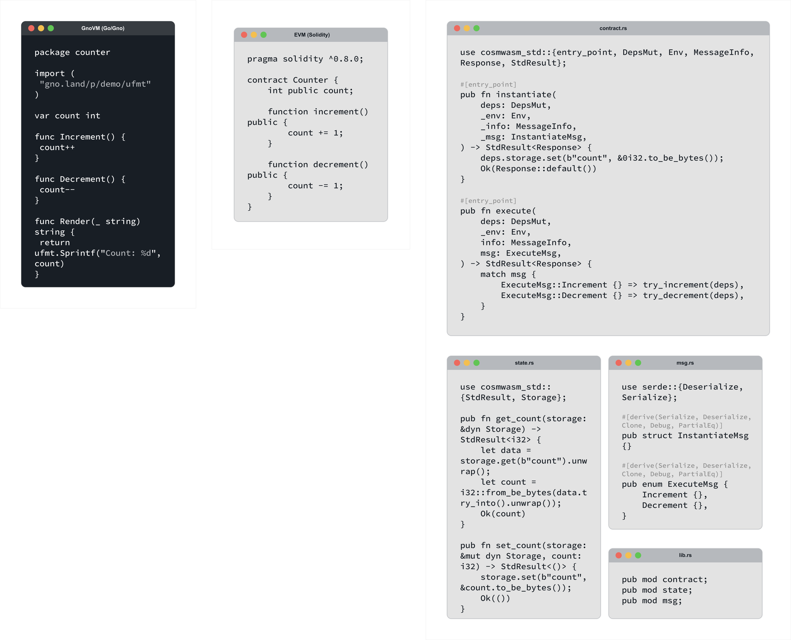

# Comparing the GnoVM, EVM and CosmWasm

The Gno Virtual Machine, or GnoVM, is a virtual environment for running Gno, a deterministic, interpreted version of Go optimized for smart contract development.

When deciding whether to use the GnoVM, developers may consider other virtual machines, especially the Ethereum Virtual Machine (EVM) and Cosmos Web Assembly (CosmWasm). This explainer will compare these three platforms, laying out the key differences developers should consider when choosing where to host their smart contracts.

See the image below for a side-by-side comparison of code written for all three virtual machines. It depicts three versions of the same smart contract: one in Gno for the GnoVM, one in Solidity for the EVM, and one in Rust for CosmWasm. The program is a simple counter [from the Gno documentation](../how-to-guides/simple-contract/counter.gno). For plain text versions of these code blocks, see the [Code Examples section](#code-examples).





## Succinct Composability Eases Developer Onboarding

The most obvious difference between the three programs is length, with the CosmWasm smart contract requiring substantially more characters than the other two put together. This is standard; the GnoVM and the EVM allow for much more succinct code than CosmWasm does. In CosmWasm, the same counter that the GnoVM and the EVM each handle in one short program is split into four files. While this modular approach may allow for composability, it makes for a challenging initiation for developers new to smart contracts.

Language choice is another key factor that influences the ease of onboarding. In this case, the GnoVM comes out comfortably ahead of both CosmWasm and the EVM. Rust is a verbose language with syntax and memory-management rules that many consider complex. The need for developers to learn Rust, on top of familiarizing themselves with the actor-model rules about passing messages between components, steepens CosmWasm's learning curve.

The EVM asks a lot of new developers as well. While Solidity may not be as syntactically complex as Rust, it is not a widely used or general-purpose language, nor is it the sole language used in EVM-compatible tech stacks. This means developers looking to use Solidity must not only learn a completely new language, but also may need to learn other tools that are based on different languages. For example, they may need to learn Javascript-based environments for Solidity smart contract development such as Hardhat or Truffle, or libraries such as the Python-based web3.py or the Javascript-based Web3.js or Ether.js.

Meanwhile, the GnoVM operates entirely on Gno, which is [nearly indistinguishable from Go](https://docs.gno.land/reference/go-gno-compatibility/), a concise, readable and widely used programming language. Developers new to blockchain are much more likely to know Go than they are to know Solidity or Rust. The ability for developers to tap into the Go ecosystem and access type checking, garbage collection, and many of the standard libraries, among other features and tooling, makes Gno highly usable even compared to Rust—and certainly compared to a narrowly specialized language like Solidity.

## State Persistence Boosts Efficiency

Smart contracts on the GnoVM have state persistence, meaning they can be frozen and resumed and their memory will be automatically saved. This decreases the likelihood of programming errors and provides a smoother development experience. It also improves program succinctness, because programmers need not manually reference databases to store objects in memory.

CosmWasm's state management is made more complex by its use of actor-model message passing. This complexity places a higher burden on the developer, often requiring them to split even a simple smart contract into multiple files across which they must simultaneously manage state persistence.

The EVM’s use of state persistence in smart contracts is more straightforward than CosmWasm’s, since it typically does not require developers to monitor and manage state across as many files. However, it still requires developers to be vigilant about the distinction between memory, which is transient between transactions, and storage, which is persistent. A developer mistakenly recording a variable into memory versus storage might result in confusion or error when the value is not recorded automatically. 

Consider the example of a voting smart contract. The Gno developer’s vote count variables are automatically persisted after each voting transaction, ensuring ongoing election updates. On CosmWasm, the developer must manually manage the state of variables across several different files. The EVM developer may also be able to leverage automatic persistence if the variables are recorded in storage, but if they are mistakenly recorded in memory, users may be caught off guard when the counts are reset after each vote.  

## The Go Ecosystem Provides Security

The EVM is known to be [vulnerable to reentrancy attacks](https://www.quicknode.com/guides/ethereum-development/smart-contracts/a-broad-overview-of-reentrancy-attacks-in-solidity-contracts), which occur when a function externally calls an untrusted contract. 

Both the GnoVM and CosmWasm offer robust protection against this type of attack. CosmWasm’s actor-model message passing prevents any contract from directly calling another contract, mitigating the risks of these types of attacks. The design of GnoVM also shields against reentrancy by managing state changes internally through a controlled process, as opposed to allowing direct external interactions that could interrupt the execution flow. GnoVM restricts direct memory access, meaning contracts cannot arbitrarily read from or write to the memory space of other contracts. These restrictions help in maintaining a clear boundary between contract states, preventing unauthorized access.

The GnoVM also leverages the strong security principles of Go. The language's simplicity reduces the chance of programming errors. Many aspects of its design and syntax also make Go especially compatible with the principle of least privilege–for example, the ease of distinguishing between exported and non-exported fields using capitalization. The principle of least privilege minimizes attack surface and reduces the risk of vulnerabilities by dictating that each user or program should have only the permissions it needs to perform its function, and nothing more.

Gno developers can also tap into the robust tooling of the Go ecosystem, accessing analysis tools that would make it easier to design secure smart contracts. Some of these include the vulnerability scanner [govulncheck](https://pkg.go.dev/golang.org/x/vuln/cmd/govulncheck), as well as the command [go vet](https://pkg.go.dev/cmd/vet), which examines source code and reports suspicious constructs. 

## On-chain Readability Promotes Transparency

Lowering the barrier to entry for web3 smart contract solutions is not just about developer onboarding–it’s also about the accessibility of information. To this point, one of the most crucial differences between the GnoVM, the EVM and CosmWasm lies in the verifiability of their smart contracts. While the GnoVM interpreter parses Gno code into an abstract syntax tree before executing it, the EVM and CosmWasm must first convert Solidity and Rust into bytecode. This means that GnoVM smart contracts are recorded on the blockchain in human-readable code, while the EVM and CosmWasm blockchains only have machine-readable bytecode. The transparency is unique among blockchains.

## Code Examples

The following examples are three versions of the same smart contract counter.

### GnoVM (Go/Gno):

```go
package counter

import (
	"gno.land/p/demo/ufmt"
)

var count int

func Increment() {
	count++
}

func Decrement() {
	count--
}

func Render(_ string) string {
	return ufmt.Sprintf("Count: %d", count)
}
```

### EVM (Solidity):

```solidity
pragma solidity ^0.8.0;

contract Counter {
    int public count;

    function increment() public {
        count += 1;
    }

    function decrement() public {
        count -= 1;
    }
}
```

### CosmWasm (Rust):

1. contract.rs: Contains the main entry points for the contract, including instantiate and execute functions.

```rust
#[entry_point]
pub fn instantiate(
    deps: DepsMut,
    _env: Env,
    _info: MessageInfo,
    _msg: InstantiateMsg,
) -> StdResult<Response> {
    deps.storage.set(b"count", &0i32.to_be_bytes());
    Ok(Response::default())
}

#[entry_point]
pub fn execute(
    deps: DepsMut,
    _env: Env,
    info: MessageInfo,
    msg: ExecuteMsg,
) -> StdResult<Response> {
    match msg {
        ExecuteMsg::Increment {} => try_increment(deps),
        ExecuteMsg::Decrement {} => try_decrement(deps),
    }
}
```

2. state.rs: Manages the state, including functions to get and set the counter value.

```rust
use cosmwasm_std::{StdResult, Storage};

pub fn get_count(storage: &dyn Storage) -> StdResult<i32> {
    let data = storage.get(b"count").unwrap();
    let count = i32::from_be_bytes(data.try_into().unwrap());
    Ok(count)
}

pub fn set_count(storage: &mut dyn Storage, count: i32) -> StdResult<()> {
    storage.set(b"count", &count.to_be_bytes());
    Ok(())
}
```

3. msg.rs: Defines the messages used for instantiation and execution.

```rust
use serde::{Deserialize, Serialize};

#[derive(Serialize, Deserialize, Clone, Debug, PartialEq)]
pub struct InstantiateMsg {}

#[derive(Serialize, Deserialize, Clone, Debug, PartialEq)]
pub enum ExecuteMsg {
    Increment {},
    Decrement {},
}
```

4. lib.rs: Serves as the main module file, linking all parts of the contract together.

```rust
pub mod contract;
pub mod state;
pub mod msg;
```


