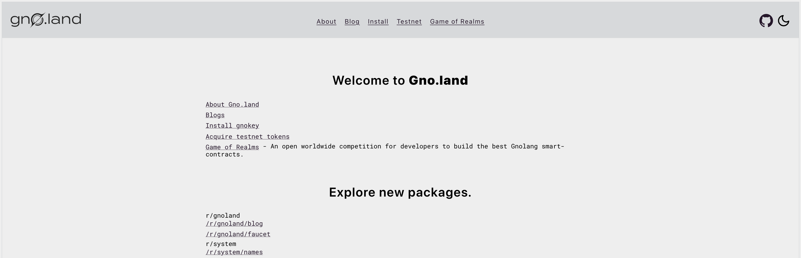
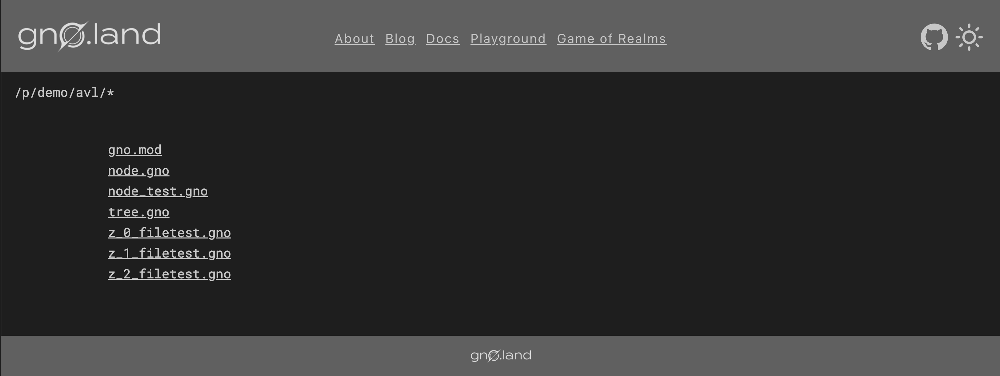
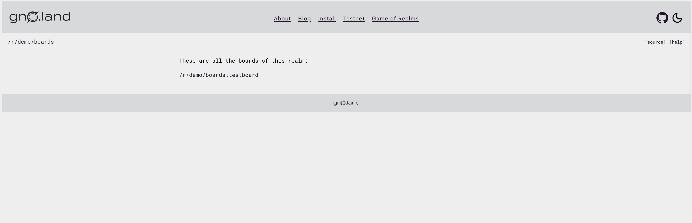
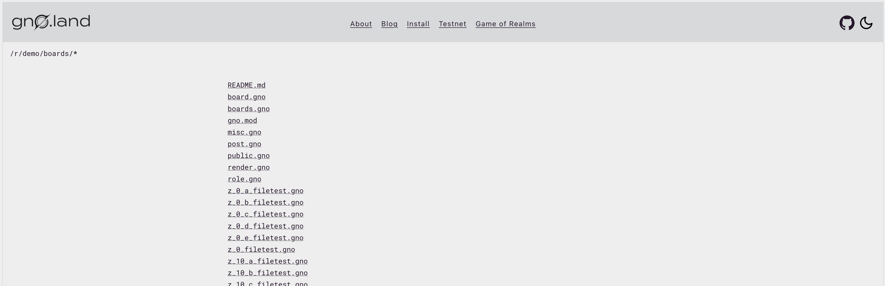

# Browsing Gno Source Code

## Overview

In this tutorial, you will learn how to browse deployed Gno [Realms](../../concepts/realms.md)
and [Packages](../../concepts/packages.md). Additionally, you will understand how the `Render` method is utilized
to achieve Realm state visibility.

## Prerequisites

- **`gnoweb` set up. Reference the [Local Setup](local-setup.md#3-installing-other-gno-tools) guide for steps**

## 1. Start the local chain

In order for `gnoweb` to fetch realm and package source code, it needs to connect a running Gno node. For a better
overview on running a local node, please reference the [Starting a Local Chain](setting-up-a-local-chain.md) guide.

In this guide, we will start a local node with the default configuration. Navigate to the `gno.land` sub-folder and run:

```bash
gnoland start
```

## 2. Start `gnoweb`

Now that the chain is running, we can start the `gnoweb` tool:

```bash
gnoweb
```

:::info Different JSON-RPC URL

In case you are running a node on a different JSON-RPC URL from the default one (`http://127.0.0.1:26657`),
you can specify the remote URL with the `gnoweb` flag named `--remote`

:::

We should be able to access the website locally on http://127.0.0.1:8888/.



## 3. Browse Package source code

Packages in Gno.land usually have names resembling `gno.land/p/<name>`. Since packages do not contain state, we can only
view their source code on-chain. To learn more about Packages, please check out
the [Packages](../../concepts/packages.md) explanation document.

Using `gnoweb`, we can browse the source code in our browser.
For example, the `avl` package is deployed at `gno.land/p/demo/avl`.

To access the source code of the `avl` package, we can append the `/p/demo/avl` to our browser URL (from the homepage).

The final URL for the `avl` package source could be viewable at http://127.0.0.1:8888/p/demo/avl, if we followed
default setup params, as we did in this guide.



From here, we can open any source code file of the deployed on-chain package and inspect its API.

## 4. Browse Realm source code

In contrast to Packages, Realms in Gno.land usually have names resembling `gno.land/r/<name>`.

Realms _do_ contain state, and in addition to being able to view their source code on-chain, users can also view their
internal state representation in the form of the `Render()` output. To learn more about Realms, please
check out the [Realms](../../concepts/realms.md) explanation document.

Using `gnoweb`, we can browse the Realm `Render()` method output and source code in our browser.
For example, the `boards` Realm is deployed at `gno.land/r/demo/boards`.

To view the internal Realm state of the `boards` package, we can append the `/r/demo/boards` to our browser URL (from
the homepage).

The final URL for the `boards` Realm internal state could be viewable at http://127.0.0.1:8888/r/demo/boards, if we
followed
default setup params, as we did in this guide.



:::info Render() is not required

Internal Realm state does not have to be exposed through the `Render()` method of the realm, as it is
not a requirement for deploying a Realm.

:::

Additionally, to view the source code for the realm, we simply need to append the `/` to the full realm path:

http://127.0.0.1:8888/r/demo/boards/


