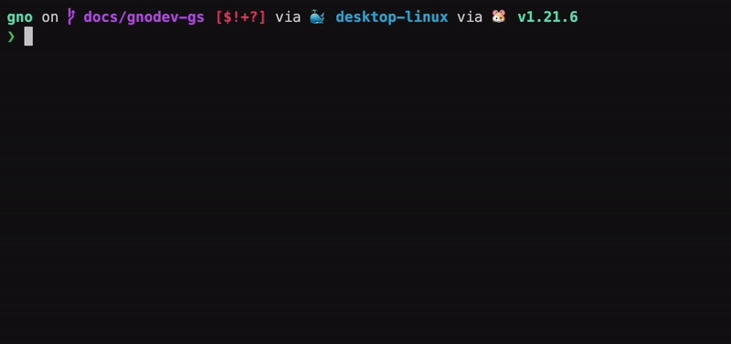
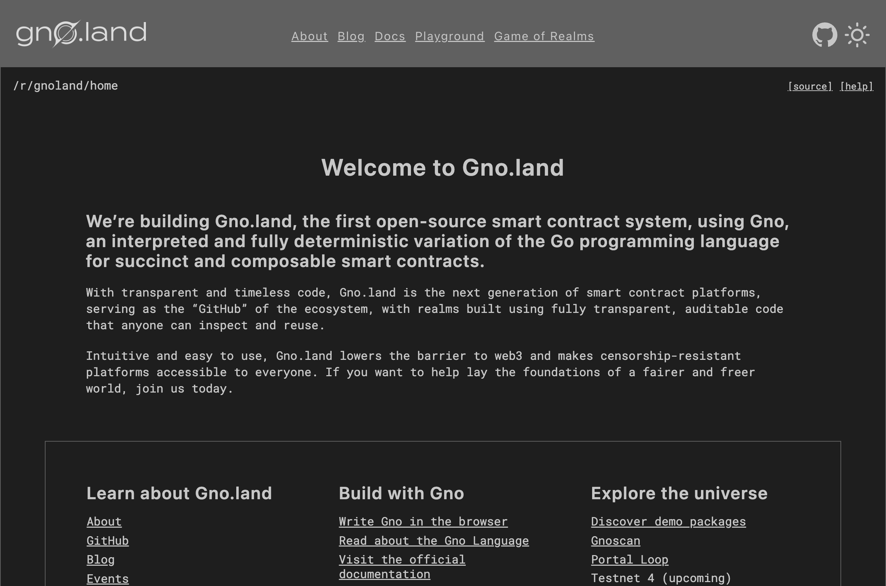
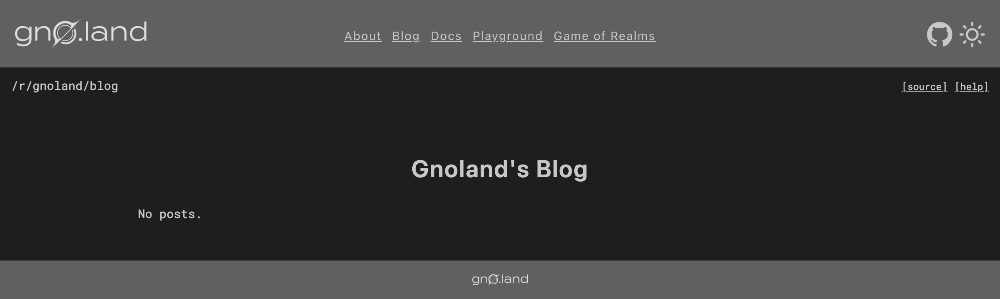
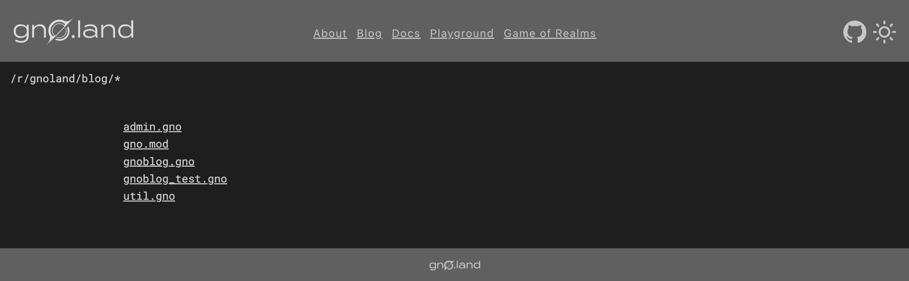
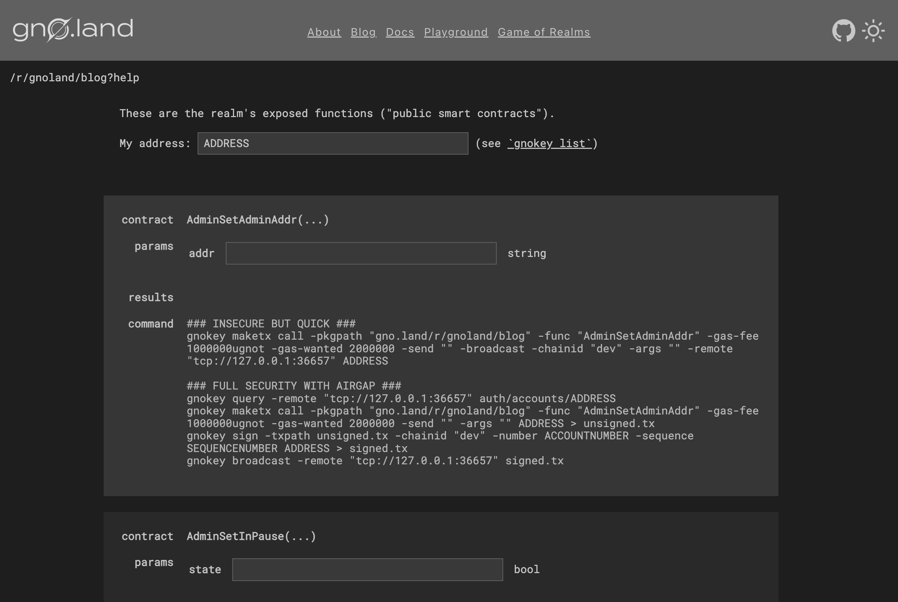

# Browsing Gno.land

## Overview
In this tutorial, you will learn how to browse [realms](../../concepts/realms.md)
and [packages](../../concepts/packages.md) deployed to a Gno.land chain. 
You will understand how the `Render` method is utilized to achieve realm state
visibility, and you will learn how to easily access realm APIs.

## Prerequisites
- **`gnodev` installed.** Reference the 
[Local Setup](installation.md#3-installing-other-gno-tools) guide for steps

## 1. Start `gnodev`
To browse Gno source code, we need two components:
- a running `gno.land` node,
- a gno.land source code viewer, like `gnoweb`

Luckily, `gnodev` comes prepackaged with both. To start, simply run `gnodev` in
your terminal.

`gnodev` will start an in-memory node, as well as a `gnoweb` server:

`gnodev` remembers the folder where it was installed, and loads the
[`examples/`](https://github.com/gnolang/gno/tree/master/examples) subfolder by default. By visiting 
[`http://localhost:8888`](http://localhost:8888), you will be able to see the
gno.land home page:

## 2. Browsing Gno.land

### Package source code
Packages in Gno.land usually have names resembling `gno.land/p/<name>`. Since 
packages do not contain state, only their source code can be viewed on-chain. To
learn more about packages, check out the [Packages](../../concepts/packages.md) 
concept page.

Let's take a specific example: the `avl` package, deployed at `gno.land/p/demo/avl`. 
To access the source code of the `avl` package, we can append the `/p/demo/avl`
to our browser URL (from the homepage).

The final URL for the `avl` package source could be viewable at 
[`http://127.0.0.1:8888/p/demo/avl`](http://127.0.0.1:8888/p/demo/avl),
if we followed default setup params, as we did in this guide.

From here, we can open any source code file of the deployed on-chain package
and inspect its API.

### Realm source code & state
In contrast to Packages, Realms in Gno.land usually have names resembling
`gno.land/r/<name>`.

Realms _do_ contain state, and in addition to being able to view their source 
code on-chain, users can also view their internal state representation in the 
form of the `Render()` output. To learn more about realms, please check out the
[Realms](../../concepts/realms.md) concept page.

We can browse the realm `Render()` method output and source code in our browser.
For example, the `gnoland/blog` realm is deployed at `gno.land/r/gnoland/blog`.

To view the internal realm state of the `blog` realm, we can append the
`/r/gnoland/blog` to our browser URL (from the homepage).

The final URL for the `blog` realm internal state could be viewable at
[`http://127.0.0.1:8888/r/gnoland/blog`](http://127.0.0.1:8888/r/gnoland/blog),
if we followed default setup params, as we did in this guide.

:::info Render() is not required
Internal realm state does not have to be exposed through the `Render()` method
of the realm, as it is not a requirement for deploying a Realm.
:::

Additionally, to view the source code for the realm, we have two options:
- append `/` to the full realm path - [`http://127.0.0.1:8888/r/gnoland/blog/`](http://127.0.0.1:8888/r/gnoland/blog/)
- click on the `[source]` button in the top-right corner

Finally, the `[help]` button takes us to the realm help page, where you will
be able to see the user-facing API of the realm. 

This page will allow you to easily generate `gnokey` commands for interacting 
with the realm in question. 

## Conclusion

That's it 🎉

You have successfully inspected the source code of a package and realm, and seen
the on-chain state of the blog app. You have also learned about the `[help]` page
that `gnoweb` provides.

