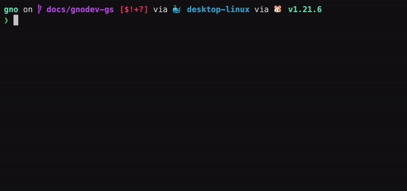

# Installation

## Overview
In this tutorial, you will learn how to set up the Gno development environment
locally, so you can get up and running writing Gno code. You will download and
install all the necessary tooling, and validate that it is correctly configured
to run on your machine.

## Prerequisites
- **Git**
- **`make` (for running Makefiles)**
- **Go 1.22+**
- **Go Environment Setup**:
  - Make sure `$GOPATH` is well-defined, and `$GOPATH/bin` is added to your `$PATH` variable.
  - To do this, you can add the following line to your `.bashrc`, `.zshrc` or other config file:
```
export GOPATH=$HOME/go
export PATH=$GOPATH/bin:$PATH
```

## 1. Cloning the repository
To get started with a local gno.land development environment, you must clone the
GitHub repository somewhere on disk:

```bash
git clone https://github.com/gnolang/gno.git
```

## 2. Installing the required tools

There are three tools that should be used for getting started with Gno development:
- `gno` - the GnoVM binary
- `gnodev` - the Gno [development helper](../../gno-tooling/cli/gnodev.md)
- `gnokey` - the Gno [keypair manager](working-with-key-pairs.md)

To install all three  tools, simply run the following in the root of the repo:
```bash
make install
```

## 3. Verifying installation

### `gno`
`gno` provides ample functionality to the user, among which is running,
transpiling, testing and building `.gno` files. Read more
about `gnokey` [here](../../gno-tooling/cli/gno.md).

To verify the `gno` binary is installed system-wide, you can run:

```bash
gno --help
```

You should get the help output from the command:


Alternatively, if you don't want to have the binary callable system-wide, you
can run the binary directly:

```bash
cd gnovm
go run ./cmd/gno --help
```

### `gnodev`
`gnodev` is the go-to Gno development helper tool - it comes with a built in
Gno.land node, a `gnoweb` server to display the state of your smart contracts
(realms), and a watcher system to actively track changes in your code. Read more
about `gnodev` [here](../../gno-tooling/cli/gnodev.md).

To verify that the `gnodev` binary is installed system-wide, you can run:

```bash
gnodev
```

You should get the following output:



### `gnokey`

`gnokey` is the gno.land keypair management CLI tool. It allows you to create
keypairs, sign transactions, and broadcast them to gno.land chains. Read more
about `gnokey` [here](../../gno-tooling/cli/gnokey.md).

To verify that the `gnokey` binary is installed system-wide, you can run:

```bash
gnokey --help
```

You should get the help output from the command:


## Conclusion

That's it 🎉

You have successfully built out and installed the necessary tools for Gno
development!

In further documents, you will gain a better understanding on how they are used
to make Gno work.
