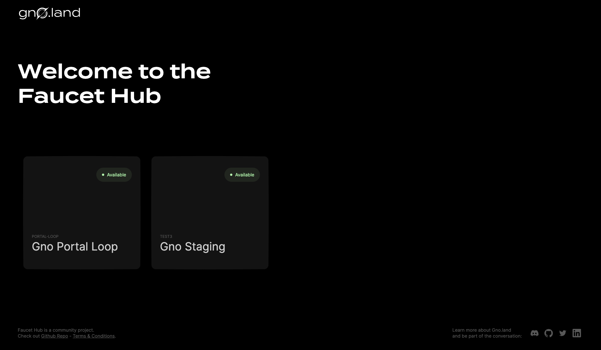
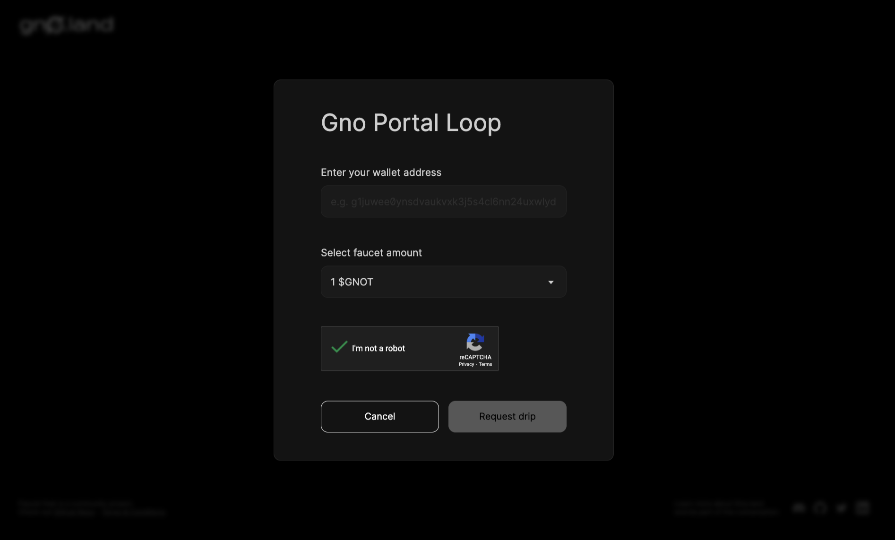
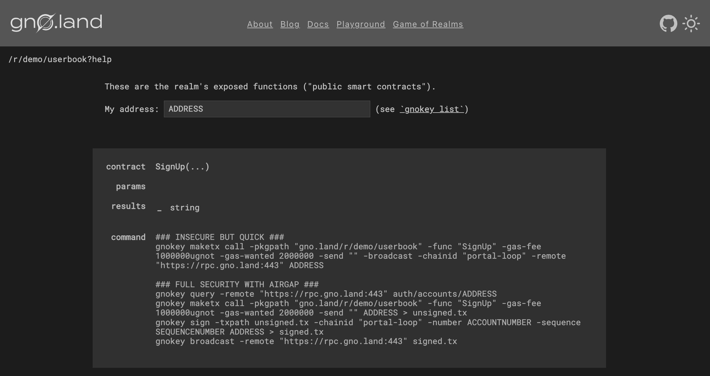

# Interacting with gno.land code

## Overview
In this tutorial, you will learn how to interact with gno.land code.
You will understand how to use your keypair to send transactions to realms
and packages, send native coins, and more.

## Prerequisites

- **`gnokey` installed.** Reference the
[Local Setup](installation.md) guide for steps
- **A keypair in `gnokey`.** Reference the [Creating a key pair](creating-a-keypair.md) guide for steps

## 1. Get testnet GNOTs
For interacting with any gno.land chain, you will need a certain amount of GNOTs
to pay gas fees with. 

For this example, we will use the [Portal Loop](../../concepts/testnets.md#portal-loop) 
testnet. We can access the Portal Loop faucet through the
[Gno Faucet Hub](https://faucet.gno.land).



After choosing "Gno Portal Loop", you will get a prompt to input your address, 
select the amount of testnet GNOT you want to receive, and solve a captcha:



After inputting your address and solving the captcha, you can check if you have received funds with the
following `gnokey` command:

```bash
gnokey query bank/balances/<your_gno_address> --remote "https://rpc.gno.land:443"
```

If the faucet request was successful, you should see something similar to the 
following:

```
❯ gnokey query bank/balances/<your_gno_address> --remote "https://rpc.gno.land:443"
height: 0
data: "10000000ugnot"
```

## 2. Visit a realm

For this example, we will use the [Userbook realm](https://gno.land/r/demo/userbook).
The Userbook realm is a simple app that allows users to sign up, and keeps track
of when they signed up. It also displays the currently signed-up users and the block
height at which they have signed up.


> Note: block heights in this case are unreliable because of the way the Portal Loop
> testnet works.
> Read more [here](../../concepts/portal-loop.md). 

To see what functions are available to call on the Userbook realm, click
the `[help]` button. 



By choosing one of the two `gnokey` commands and inputting your address 
(or keypair name) in the top bar, you will have a ready command to paste into your 
terminal. For example, the following command will call the `SignUp` function with the
keypair `MyKey`: 

```
gnokey maketx call \
-pkgpath "gno.land/r/demo/userbook" \
-func "SignUp" \
-gas-fee 1000000ugnot \
-gas-wanted 2000000 \
-send "" \
-broadcast \
-chainid "portal-loop" \
-remote "https://rpc.gno.land:443" \
MyKey
```

To see what each option and flag in this command does, check out `gnokey` in the 
[tooling section](../../gno-tooling/cli/gnokey/gnokey.md). 

## Conclusion

That's it! Congratulations on executing your first transaction on a Gno network! 🎉

If the previous transaction was successful, you should be able
to see your address on the main page of the Userbook realm. 

This concludes the "Local Setup" section. For next steps, see the 
[How-to guides section](../../how-to-guides/how-to-guides.md), where you will 
learn how to write your first realm, package, and much more.
