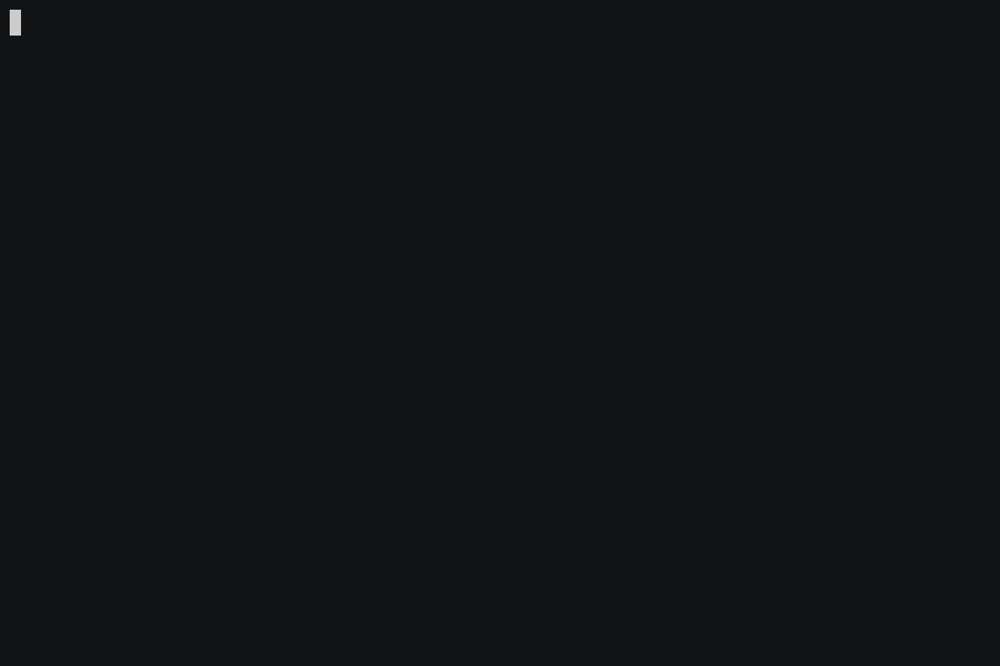
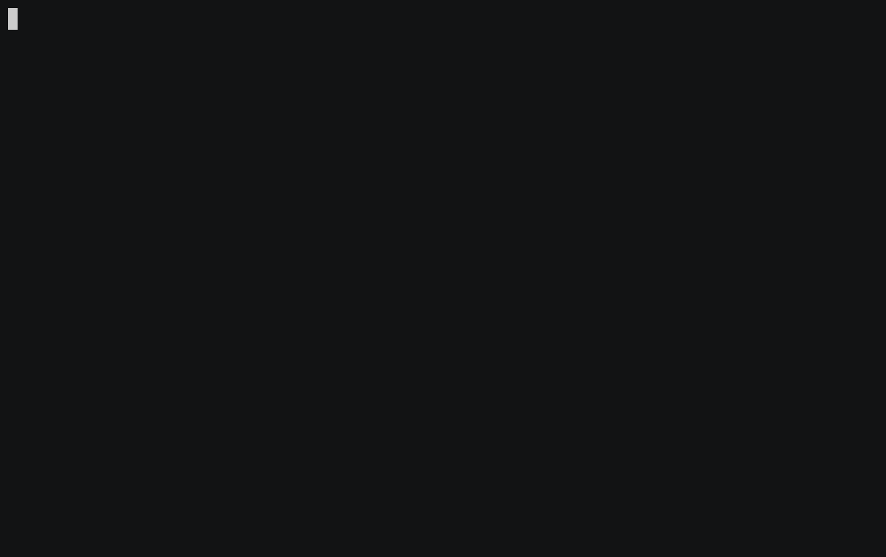

# Local Setup

## Overview

In this tutorial, you will learn how to set up the Gno development environment locally, so you
can get up and running writing Gno code. You will download and install all the necessary tooling,
and validate that they are correctly configured to run on your machine.

## Prerequisites

- **Git**
- **`make` (for running Makefiles)**
- **Go 19+**
- **Go Environment Setup**:
  - Make sure `$GOPATH` is well-defined, and `$GOPATH/bin` is added to your `$PATH` variable.
  - To do this, you can add the following line to your `.bashrc`, `.zshrc` or other config file:
```
export GOPATH=$HOME/go
export PATH=$GOPATH/bin:$PATH
```

## 1. Cloning the repository

To get started with a local Gno.land development environment, you must clone the GitHub repository
somewhere on disk:

```bash
git clone https://github.com/gnolang/gno.git
```

## 2. Installing the `gno` development toolkit

Next, we are going to build and install the `gno` development toolkit.
`gno` provides ample functionality to the user, among which is running, transpiling, testing and building `.gno` files.

To install the toolkit, navigate to the `gnovm` folder from the repository root, and run the `build` make directive:

```bash
cd gnovm
make build
```

This will build out the necessary `gno` binary into the `gnovm/cmd` sub-folder:



Next, to make development easier, we need to make the binary available system-wide.
From the same `gnovm` sub-folder, you can run:

```bash
make install
```

To verify the `gno` binary is installed system-wide, you can run:

```bash
gno --help
```

You should get the help output from the command:


Alternatively, if you don't want to have the binary callable system-wide, you can run the binary directly:

```bash
go run ./cmd/gno --help
```

## 3. Installing other `gno` tools

The next step is to install several other tools that are required for the Gno development environment, like

- `gnoland` - the Gno [blockchain node](setting-up-a-local-chain.md)
- `gnokey` - the Gno [private key manager](working-with-key-pairs.md)
- `gnoweb` - the Gno [source code viewer](browsing-gno-source-code.md)
- `gnofaucet` - the Gno [native currency faucet](../../gno-tooling/cli/faucet/faucet.md)

To build these tools, from the root directory navigate to the `gno.land` sub-folder, and run the `build` make
directive:

```bash
cd gno.land
make build
```

This will build out the necessary binaries into the `gno.land/cmd` sub-folder:



Same as with the `gno` tool, we can make these binaries available system-wide.
From the same `gno.land` sub-folder, you can run:

```bash
make install
```

To verify that, for example, the `gnokey` binary is installed system-wide, you can run:

```bash
gnokey --help
```

You should get the help output from the command:


## Conclusion

That's it 🎉

You have successfully built out and installed the necessary tools for Gno development!

In further documents, you will gain a better understanding on how they are used to make Gno work.
