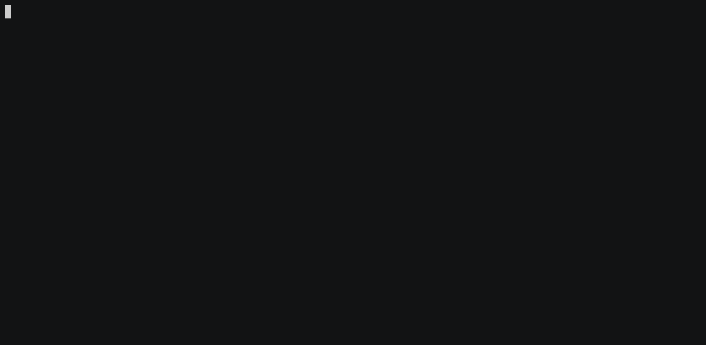

# Premining Balances

## Overview

In this tutorial, you will gain an understanding on how to premine native currency on a local Gno.land chain.
Additionally, you will understand how to query the account balance after you premine it.

Premining balance is the process of making sure some accounts (addresses) have specific funds when the chain initially
launches. In the context of local chain deployments, premine balances are used to ensure the user accounts (developers)
have ample funds to interact with the chain and facilitate contract deployments.

## Prerequisites

- **`gnoland` and `gnokey` set up. Reference the [Installation](local-setup.md#3-installing-other-gno-tools) guide
  for steps**

## 1. Clean chain data

In order for us to premine funds on a fresh chain, we need to make sure we do not have any leftover blockchain data
from previous chain runs.

The blockchain node, when it runs, works with an embedded DB locally on disk to store execution data (such as
configuration files, or the state DB). For Gno blockchain nodes, this working directory is labeled as `testdir` by
default.

To clean out old blockchain data, navigate to the `gno.land` folder and run the appropriate make command:

```bash
cd gno.land
make fclean
```

## 2. Change the `genesis_balances.txt` file

When the Gno node boots up, among other things, it reads a file called `genesis_balances.txt` to generate the initial
balance set for the blockchain.

An example of how this looks like in the initial `genesis.json` file after the chain starts:

```bash
  "app_state": {
    "@type": "/gno.GenesisState",
    "balances": [
      "g1jg8mtutu9khhfwc4nxmuhcpftf0pajdhfvsqf5=10000000000000ugnot",
      "g1us8428u2a5satrlxzagqqa5m6vmuze025anjlj=10000000000000ugnot",
      "g1f4v282mwyhu29afke4vq5r2xzcm6z3ftnugcnv=1000000000000ugnot",
      "g127jydsh6cms3lrtdenydxsckh23a8d6emqcvfa=1000000000000ugnot"
    ],
``` 

The `genesis_balances.txt` file is located at `./gno.land/genesis/genesis_balances.txt`.

To add a new entry to the premine table, simply append a line to the end of the file:

```bash
g1qpymzwx4l4cy6cerdyajp9ksvjsf20rk5y9rtt=10000000000ugnot # My address
```

Replace `g1qpymzwx4l4cy6cerdyajp9ksvjsf20rk5y9rtt` with the address you want balance on, and `10000000000ugnot` with the
desired `ugnot` balance.

## 3. Start the local chain

Now that our address and the desired premine balance are located in the `genesis_balances.txt` file, we can start the
local Gno node.

To run the local Gno node, make sure you are in the `gno.land` sub-folder, and run the appropriate make command:

```bash
cd gno.land
gnoland start
```

This command will initialize the Gno node, generate the `genesis.json` with our newly added premine information, and
start the chain.



## 3. Check the account balance

To check the balance of any account (or the account we just premined), we can use the following ABCI query:

```bash
gnokey query --remote localhost:26657 bank/balances/g1qpymzwx4l4cy6cerdyajp9ksvjsf20rk5y9rtt
```

Let's break down this command:

- **`--remote`** - the JSON-RPC URL of the running Gno node. In the case of a local deployment, the default value
  is `localhost:26657`
- **`bank/balances/g1qpymzwx4l4cy6cerdyajp9ksvjsf20rk5y9rtt`** - the ABCI query targets the `bank` module to find
  the `balances` for address `g1qpymzwx4l4cy6cerdyajp9ksvjsf20rk5y9rtt`. Replace the address with your desired address


## Conclusion

That's it 🎉

You have successfully premined a native currency balance on a locally-running Gno chain!
Additionally, you have also learned how to query the native currency balance for an address, using built-in ABCI queries
and the `gnokey` tool.
