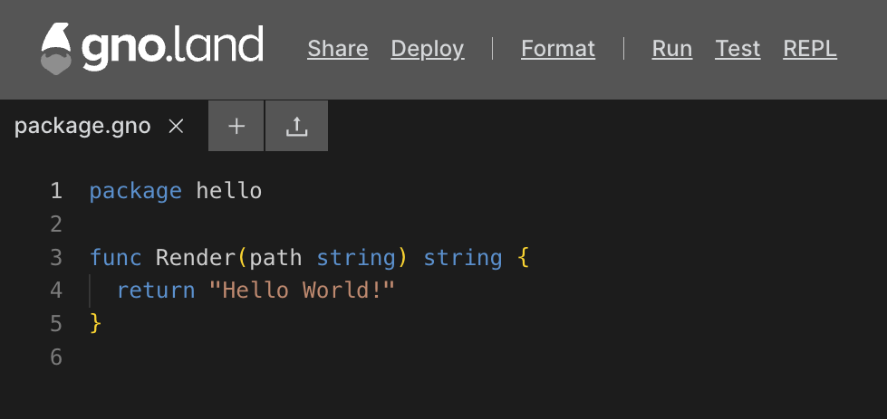
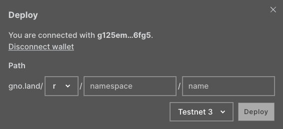
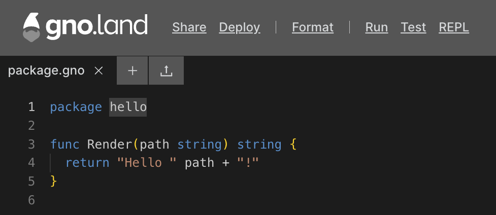

# Gno Playground

## Overview

The Gno Playground is an innovative web-based editor and sandbox that enables developers to 
interactively work with the Gno language. It makes coding, testing,
and deploying simple with its diverse set of tools and features. Users can
share code, run tests, and deploy projects to Gno.land networks, 
making it the perfect tool to get started with Gno development.

## Prerequisites

- **A Gno.land compatible wallet**
  - Currently, [Adena](https://www.adena.app/) is the preferred wallet for
Gno.land, with more wallets being introduced in the future.

## Playground Features

To get started, visit the Playground at [play.gno.land](https://play.gno.land). You will be greeted with a
simple `package.gno` file:



The Playground has the following features:
- `Share` - Generate a unique, short, and shareable identifier for your Gno code.
- `Deploy` - Connect your wallet and publish your code on Gno.land.
- `Format` - Automatically adjust your Gno code's structure and style for optimal readability and consistency.
- `Run` - Execute a particular expression within your code to validate its functionality and output.
- `Test` - Execute predefined tests to verify your code's integrity and ensure it meets expected outcomes.
- `REPL` - Experiment and troubleshoot in real-time using the GnoVM with interactive REPL features.

Let's dive into each of the Playground features.

### Share

The **Share** feature provides users with a permanent shortlink to the current
Gno code in the playground, making it a simple and easy way to do code-sharing.
Links created via the **Share** feature initially set to expire after 5 years,
ensuring the shared code remains accessible over an extended period.

### Deploy

The **Deploy** feature allows users to seamlessly deploy their Gno code to the 
chain. After connecting a Gno.land wallet, users can select their desired 
package path and network for deployment.



After inputting your desired package path, you can select the network you would 
like to deploy to, such as [Portal Loop](../concepts/portal-loop.md) or local,
and click deploy.

:::info
The Playground will automatically provide enough test tokens to cover the gas 
cost at the time of deployment, removing the need for using a faucet.
:::

### Format

The **Format** feature utilizes the Monaco editor and
[`gofmt`](https://pkg.go.dev/cmd/gofmt) to automatically refine and standardize 
your Gno code's syntax.

### Run

The **Run** feature will allow you to run an expression on your Gno code. Take the following code
for an example:

[](https://play.gno.land/p/nBq2W8drjMy)

Running `println(Render("Gnopher"))` will display the following output:

```bash
Hello Gnopher!
```

View the code [here](https://play.gno.land/p/nBq2W8drjMy).

### Test

The **Test** feature will look for `_test.gno` files in your playground and run 
the`gno test -v` command on them. Testing your code will open a terminal that
will show you the output of the test. Read more about how Gno tests work
[here](../concepts/gno-test.md).

### REPL (experimental)

The **REPL** feature allows you to experiment with the GnoVM.
It provides a command-line interface for hands-on learning, iterative testing, and swift prototyping.

## Learning about Gno.land & writing Gno code

If you're new here, don't worry—content is regularly produced to breakdown
Gno.land to explain its features. Dive into the essentials of Gno.land by 
exploring the [Concepts](../concepts/concepts.md) section.

To get started writing Gno code, check out the
[How-to](../how-to-guides/how-to-guides.md) section, the `examples/` folder on
the [Gno monorepo](https://github.com/gnolang/gno), or one of many community projects and tutorials found in the 
[awesome-gno](https://github.com/gnolang/awesome-gno/blob/main/README.md) repo on GitHub.