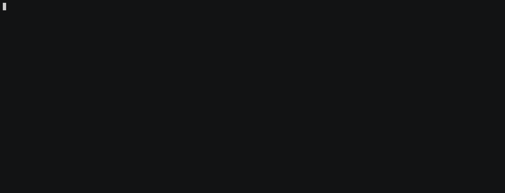

# Setting up a Local Chain

## Overview

In this tutorial, you will learn how to start a local Gno node (and chain!).
Additionally, you will see the different options you can use to make your Gno instance unique.

## Prerequisites

- **Git**
- **`make` (for running Makefiles)**
- **Go 1.21+**
- **Go Environment Setup**: Ensure you have Go set up as outlined in
  the [Go official installation documentation](https://go.dev/doc/install) for your environment

## Installation

To install the `gnoland` binary, clone the Gno monorepo:

```bash
git clone https://github.com/gnolang/gno.git
```

After cloning the repo, go into the `gno.land/` folder, and use the existing
Makefile to install the `gnoland` binary:

```bash
cd gno.land
make install.gnoland
```

To verify that you've installed the binary properly and that you are able to use
it, run the `gnoland` command:

```bash
gnoland --help
```

If you do not wish to install the binary globally, you can build and run it
with the following command from the `gno.land/` folder:

```bash
make build.gnoland
```

And finally, run it with `./build gnoland`.

## Starting a local node (lazy init)

You can start a Gno blockchain node with the default configuration by navigating to the `gno.land` sub-folder and
running the following command:

```bash
gnoland start --lazy
```

The command will trigger a chain initialization process (if you haven't run the node before), and start the Gno node,
which is ready to accept transactions and interact with other Gno nodes.


:::info Lazy init

Starting a Gno blockchain node using just the `gnoland start --lazy` command implies a few things:

- the default configuration will be used, and generated on disk in the `gnoland-data` directory
- random secrets data will be generated (node private keys, networking keys...)
- an entirely new `genesis.json` will be used, and generated on disk in the `../gnoland-data` directory. The genesis
  will have a single validator, whose public key is derived from the previously generated node secrets

:::

To view the command defaults, simply run the `help` command:

```bash
gnoland start --help
```

Let's break down the most important default settings:

- `chainid` - the ID of the Gno chain. This is used for Gno clients, and distinguishing the chain from other Gno
  chains (ex. through IBC)
- `genesis-balances-file` - the initial premine balances file, which contains initial native currency allocations for
  the chain. By default, the genesis balances file is located in `gno.land/genesis/genesis_balances.txt`, this is also
  the
  reason why we need to navigate to the `gno.land` sub-folder to run the command with default settings
- `data-dir` - the working directory for the node configuration and node data (state DB)

:::info Resetting the chain

As mentioned, the working directory for the node is located in `data-dir`. To reset the chain, you need
to delete this directory and start the node up again. If you are using the default node configuration, you can run
`make fclean` from the `gno.land` sub-folder to delete the `gnoland-data` working directory.

:::

## Starting a local node (manual configuration)

Manually configuring and starting the Gno blockchain node is a bit more involved than simply initializing it "lazily",
and involves the following steps:

- generating the node secrets, and configuration
- generating the `genesis.json`, and populating it
- starting the node with the generated data

### 1. Generate the node directory (secrets + config)

You can generate the default node directory secrets using the following command:

```shell
gnoland secrets init
```

And generate the default node config using the following command:

```shell
gnoland config init
```

This will initialize the following directory structure:

```shell
.
└── gnoland-data/
    ├── secrets/
    │   ├── priv_validator_state.json
    │   ├── node_key.json
    │   └── priv_validator_key.json
    └── config/
       └── config.toml
```

A couple of things to note:

- `gnoland config init` initializes a default configuration
- `gnoland secrets init` initializes new node secrets (validator key, node p2p key)

Essentially, `gnoland start --lazy` is simply a combination of `gnoland secrets init` and `gnoland config init`,
with the default options enabled.

#### Changing the node configuration

To change the configuration params, such as for example the node's listen address, you can utilize the following
command:

```shell
gnoland config set rpc.laddr tcp://0.0.0.0:26657
```

This will update the RPC listen address to `0.0.0.0:26657`. You can verify the configuration was updated by running:

```bash
gnoland config get rpc.laddr

# similar behavior for cosmos validator
# gaiad tx staking create-validator `--node string (default:tcp://localhost:26657)`
```

:::tip

A moniker is a human-readable name of your Gno node. You may customize your moniker with the following
command:

```bash
gnoland config set moniker node01
```

:::

:::warning Modify existing secrets

We can modify existing secrets, or utilize our own (if we have them backed up, for example) for the Gno.land node.
Each secret needs to be placed in the appropriate path within `<data-dir>/secrets`, and it can be replaced or
regenerated with `gnoland secrets init <key-name> --force`

:::

### 2. Generate the `genesis.json`

:::info Where's the `genesis.json`?

In this example, we are starting a completely new network. In case you are connecting to an existing network, you don't
need to regenerate the `genesis.json`, but simply fetch it from publicly available resources of the Gno chain you're
trying to connect to.

:::

The `genesis.json` defines the initial genesis state for the chain. It contains information like:

- the current validator set
- any predeployed transactions
- any premined balanced

When the chain starts, the first block will be produced after all the init content inside the `genesis.json` is
executed.

Generating an empty `genesis.json` is relatively straightforward:

```shell
gnoland genesis generate
```

The resulting `genesis.json` is empty:

```json
{
  "genesis_time": "2024-05-08T10:25:09Z",
  "chain_id": "dev",
  "consensus_params": {
    "Block": {
      "MaxTxBytes": "1000000",
      "MaxDataBytes": "2000000",
      "MaxBlockBytes": "0",
      "MaxGas": "10000000",
      "TimeIotaMS": "100"
    },
    "Validator": {
      "PubKeyTypeURLs": [
        "/tm.PubKeyEd25519"
      ]
    }
  },
  "app_hash": null
}
```

This will generate a `genesis.json` in the calling directory, by default. To check all configurable options when
generating the `genesis.json`, you can run the command using the `--help` flag:

```shell
gnoland genesis generate --help

USAGE
  generate [flags]

Generates a node's genesis.json based on specified parameters

FLAGS
  -block-max-data-bytes 2000000  the max size of the block data
  -block-max-gas 10000000        the max gas limit for the block
  -block-max-tx-bytes 1000000    the max size of the block transaction
  -block-time-iota 100           the block time iota (in ms)
  -chain-id dev                  the ID of the chain
  -genesis-time 1715163944       the genesis creation time. Defaults to current time
  -output-path ./genesis.json    the output path for the genesis.json
```

## 3. Add the `examples` packages into the `genesis.json` (optional)

This step is not necessarily required, however, using a Gno.land chain without the `examples` packages predeployed can
present challenges with users who expect them to be present.

The `examples` directory is located in the `$GNOROOT` location, or the local gno repository clone.

```bash
gnoland genesis txs add packages ./examples
```

### 4. Add the initial validator set

A new Gno chain cannot advance without an active validator set.
Since this example follows starting a completely new Gno chain, you need to add at least one validator to the validator
set.

Luckily, we've generated the node secrets in step #1 -- we will utilize the generated node key, so the process we start
locally will be the validator node for the new Gno network.

To display the generated node key data, run the following command:

```shell
gnoland secrets get validator_key
```

This will display the information we need for updating the `genesis.json`, in JSON:

```shell
{
    "address": "g14j4dlsh3jzgmhezzp9v8xp7wxs4mvyskuw5ljl",
    "pub_key": "gpub1pggj7ard9eg82cjtv4u52epjx56nzwgjyg9zqaqle3fdduqul4slg6zllypq9r8gj4wlfucy6qfnzmjcgqv675kxjz8jvk"
}
```

Updating the `genesis.json` is relatively simple, running the following command will add the generated node info to the
validator set:

```shell
gnoland genesis validator add \
--address g14j4dlsh3jzgmhezzp9v8xp7wxs4mvyskuw5ljl \
--pub-key gpub1pggj7ard9eg82cjtv4u52epjx56nzwgjyg9zqaqle3fdduqul4slg6zllypq9r8gj4wlfucy6qfnzmjcgqv675kxjz8jvk \
--name Cuttlas
```

We can verify that the new validator was indeed added to the validator set:

```json
{
  "genesis_time": "2024-05-08T10:25:09Z",
  "chain_id": "dev",
  "consensus_params": {
    "Block": {
      "MaxTxBytes": "1000000",
      "MaxDataBytes": "2000000",
      "MaxBlockBytes": "0",
      "MaxGas": "10000000",
      "TimeIotaMS": "100"
    },
    "Validator": {
      "PubKeyTypeURLs": [
        "/tm.PubKeyEd25519"
      ]
    }
  },
  "validators": [
    {
      "address": "g1lz2ez3ceeds9f6jllwy7u0hvkphuuv0plcc8pp",
      "pub_key": {
        "@type": "/tm.PubKeyEd25519",
        "value": "AvaVf/cH84urHNuS1lo3DYmtEErxkTLRsrcr71QoAr4="
      },
      "power": "1",
      "name": "Cuttlas"
    }
  ],
  "app_hash": null
}
```

### 5. Starting the chain

We have completed the main aspects of setting up a node:

- generated the node directory (secrets and configuration) ✅
- set the adequate configuration params ✅
- generated a `genesis.json` ✅
- added an initial validator set to the `genesis.json` ✅

Now, we can go ahead and start the Gno chain for the first time, by running:

```shell
gnoland start \
--genesis ./genesis.json \
--data-dir ./gnoland-data
```

That's it! 🎉

Your new Gno node (chain) should be up and running:



## Chain runtime options

### Changing the chain ID

:::info Changing the Gno chain ID

Below are some implications to consider when changing the chain ID:

- it affects how the Gno node communicates with other Gno nodes / chains
- Gno clients that communicate through JSON-RPC need to match this value

It's important to configure your node properly before launching it in a distributed network.
Keep in mind that changes may not be applicable once connected.

:::

To change the Gno chain ID, run the following command:

```bash
gnoland start --chainid NewChainID
```

We can verify the chain ID has been changed, by fetching the status of the node and seeing the
associated chain ID. By default, the node exposes the JSON-RPC API on `http://127.0.0.1:26657`:

```bash
curl -H "Content-type: application/json" -d '{
    "jsonrpc": "2.0",
    "method": "status",
    "params": [],
    "id": 1
}' 'http://127.0.0.1:26657'
```

We should get a response similar to this:

```json
{
  "jsonrpc": "2.0",
  "id": 1,
  "result": {
    "node_info": {
      "version_set": [
        // ...
      ],
      "net_address": "g10g9r37g9xa54a6clttzmhk2gmdkzsntzty0cvr@0.0.0.0:26656",
      "network": "NewChainID"
      // ...
    }
  }
}
```

:::danger Chain ID can be set only once

Since the chain ID information is something bound to a chain, you can
only change it once upon chain initialization, and further attempts to change it will
have no effect.

:::

### Changing the node configuration

You can specify a node configuration file using the `--config` flag.

```bash
gnoland start --config config.toml
```

### Changing the premine list

You do not need to use the `gno.land/genesis/genesis_balances.txt` file as the source of truth for initial network
funds.

To specify a custom balance sheet for a fresh local chain, you can use the `-genesis-balances-file`:

```bash
gnoland start -genesis-balances-file custom-balances.txt
```

Make sure the balances file follows the following format:

```text
<address>=<balance>ugnot
```

Following this pattern, potential entries into the genesis balances file would look like:

```text
g1qpymzwx4l4cy6cerdyajp9ksvjsf20rk5y9rtt=10000000000ugnot
g1u7y667z64x2h7vc6fmpcprgey4ck233jaww9zq=10000000000ugnot
```

:::info Genesis generation

Genesis block generation happens only once during the lifetime of a Gno chain.
This means that if you specify a balances file using `gnoland start`, and the chain has already started (advanced from
block 0), the specified balance sheet will not be applied.

:::