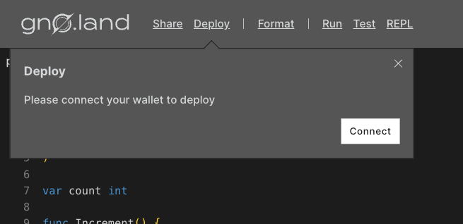
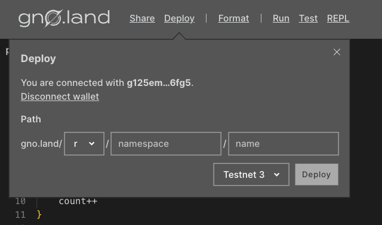
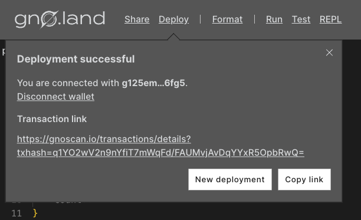

# How to deploy a Realm / Package

## Overview

This guide shows you how to deploy any realm or package to the Gno chain,
including how to:
- deploy Gno code in your browser via the Playground, 
- deploy Gno code from your local machine using `gnokey`'s `maketx addpkg` API.

## Deployment via the Playground

Deployment via the Playground is recommended for smaller realms and packages.
For larger projects, it is recommended to write, test, and deploy your code from
a more appropriate environment, such as a local or online IDE.

For this, check out the [**Deployment from a local environment**](#deployment-from-a-local-environment) section.

### Prerequisites

- **A Gno.land-compatible wallet, such as [Adena](https://adena.app)**

### Using Gno Playground

To demonstrate deployment using the Playground, we'll use the **Counter** realm.
You can access the sample code via
[this Playground link](https://play.gno.land/p/iUWTha99D1J).

Review the code and when you're ready, click on "**Deploy**".
Ensure your wallet is connected to proceed. If it isn't, a prompt will appear for connection:



After connecting your wallet to the Playground, you will be prompted with a 
new toolbox:



Here, you can choose the deployment path of your realm or package, as well as the network
to deploy to. The Playground also allows for deployment to a local node
if you are running one.

:::info
Here are a few things to keep in mind when deploying packages and realms:
- The `name` field in the path should match your package name, in this case `counter`.
- Packages are deployed under `p/`, while realms are deployed under `r/`.

An example path for the Counter realm could be the following: 
```go
gno.land/r/<your_username>/counter
```
:::

After choosing a path and network, click on **Deploy**. A pop-up window
from your connected wallet will prompt you to sign and approve the deployment transaction.



If all went well, you will have successfully deployed your the Counter package.
Congratulations 🎉

## Deployment from a local environment

### Prerequisites

- **Have `gnokey` installed**
- **Have access to a `gnoland` node (local or remote)**
- **Have generated a keypair with `gnokey` & funded it with `gnot`**
- **Have a Realm or Package ready to deploy**

### Deploying

To illustrate deployment, we will use a realm. Consider the following folder
structure on a local file system:

```
counter-app/
├─ r/
│  ├─ counter/
│  │  ├─ counter.gno
```

We would like to deploy the realm found in `counter.gno`. To do this, open a
terminal at `counter-app/` and use the following `gnokey` command:

```bash
gnokey maketx addpkg \
--pkgpath "gno.land/r/demo/counter" \
--pkgdir "./r/counter" \
--gas-fee 10000000ugnot \
--gas-wanted 800000 \
--broadcast \
--chainid dev \
--remote localhost:26657 \
MyKey
```

Let's analyze all of the flags in detail:
- `--pkgpath` - path where the package/realm will be placed on-chain
- `--pkgdir` - local path where the package/realm is located
- `--gas-wanted` - the upper limit for units of gas for the execution of the 
transaction - similar to Solidity's gas limit
- `--gas-fee` - similar to Solidity's gas-price
- `--broadcast` - broadcast the transaction on-chain
- `--chain-id` - id of the chain to connect to - local or remote
- `--remote` - `gnoland` node endpoint - local or remote
- `MyKey` - the keypair to use for the transaction

:::info
As of October 2023, `--gas-fee` is fixed to 1gnot (10000000ugnot), with plans 
to change it down the line.
:::

Next, confirm the transaction with your keypair passphrase. If deployment was 
successful, you will be presented with a message similar to the following:

```
OK!
GAS WANTED: 800000
GAS USED:   775097
```
Depending on the size of the package/realm, you might need to increase amount 
given in the `--gas-wanted` flag to cover the deployment cost.

:::info
Regardless of whether you're deploying a realm or a package, you will be using 
`gnokey`'s `maketx addpkg` - the usage of `maketx addpkg` in both cases is identical.
To read more about the `maketx addpkg`
subcommand, view the `gnokey` [reference](../gno-tooling/cli/gnokey.md#addpkg).
:::


## Conclusion

That's it 🎉

You have now successfully deployed a realm/package to a Gno.land chain. 
