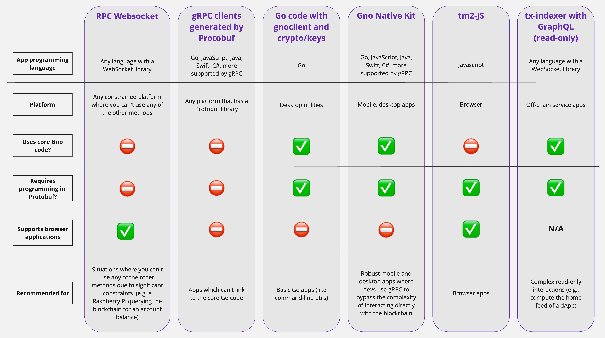

# Interact with Gno.land without gnokey

A [previous tutorial](interact-with-gnoland.md) showed how to interact with the
gno.land blockchain using the command-line tool `gnokey` . This tutorial explains
other methods to interact with gno.land without using `gnokey`, and when you might
want to use them. This is mainly for developers writing an application.

## RPC WebSocket

**What is it?** The RPC interface is the base-level method to interact with the
gno.land blockchain over a WebSocket connection. The actual RPC messages are Protobuf format.

**When to use it?** The RPC WebSocket interface is used under-the-hood by `gnokey` and all
the other methods. Some of the messages are simple and your app could open a WebSocket
connection and interact. But most Protobuf messages are more complex and you would want to
use one of the following methods.

## gRPC clients generated by Protobuf

**What is it?** The core Gno codebase uses the light-weight
[Amino package](https://github.com/gnolang/gno/tree/master/tm2/pkg/amino) to format
the Protobuf messages with interacting with the blockchain. Another method is to
use a Protobuf library to format the messages.

**When to use it?** Amino is a Go package, so you can't use it if your app is written in a
different programming language. Instead, you can import a Protobuf library to format and parse
the messages for interacting with the blockchain.

## Go code with `gnoclient` and `crypto/keys`

**What is it?** The [`gnoclient`](https://github.com/gnolang/gno/tree/master/gno.land/pkg/gnoclient)
and [`crypto/keys`](https://github.com/gnolang/gno/tree/master/tm2/pkg/crypto/keys) packages are part
of the core Gno codebase, written in Go. The `gnoclient` API is for querying the blockchain, calling
realm functions, and other basic interactions. The `crypto/keys` API is for generating crypto keys and
managing the local keys database.

**When to use it?** If your app is written in Go, you can use these packages (as `gnokey` and other
command-line apps do).

## Gno Native Kit

**What is it?** [Gno Native Kit](https://github.com/gnolang/gnonative) is a framework that allows
developers to build and port gno.land dApps written in the dApp's native language such as TypeScript,
Java or C#. It is a wrapper on top of the `gnoclient` and `crypto/keys` which allows your app to
use the functionality in these core Gno packages.

**When to use it?** If your app is not written in Go (for example, React Native on mobile), then
Gno Native Kit can provide access to all the functionality.

## `tx-indexer` with GraphQL

**What is it?** [tx-indexer](https://github.com/gnolang/tx-indexer) is a tool
which makes an indexed database of the transactions on the gno.land blockchain.
It comes with a GraphQL interface which you can use directly in a web page or from your app through WebSocket.

**When to use it?** If your app needs to do CPU-intensive processing of your realm data, then it
is better to have a dedicated service running on a server instead of on-chain processing. `tx-indexer`
provides efficient read-only queries of just the data that needs to be processed. Then your end-user
app can fetch the result from the service.

