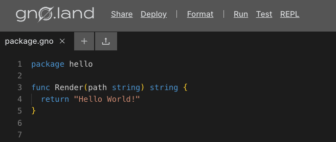

# How to write a simple Gno Smart Contract (Realm)

## Overview

This guide shows you how to write a simple **Counter** Smart Contract, or rather a [realm](../concepts/realms.md),
in [Gno](../concepts/gno-language.md). 

For actually deploying the Realm, please see the [deployment](deploy.md) guide.

Our **Counter** realm will have the following functionality:

- Keeping track of the current count.
- Incrementing / decrementing the count.
- Fetching the current count value.

## 1. Development environment
Currently, Gno apps can be developed locally or via the online editor, Gno 
Playground. Below we detail how to set up and use both. 
  
### Local setup

#### Prerequisites

- **Text editor**

:::info Editor support
The Gno language is based on Go, but it does not have all the bells and whistles in major text editors like Go.
Advanced language features like IntelliSense are still in the works.

Currently, we officially have language support
for [ViM](https://github.com/gnolang/gno/blob/master/CONTRIBUTING.md#vim-support),
[Emacs](https://github.com/gnolang/gno/blob/master/CONTRIBUTING.md#emacs-support)
and [Visual Studio Code](https://marketplace.visualstudio.com/items?itemName=harry-hov.gno).
:::

To get started with a local setup, simply create a new empty folder.

```bash
mkdir counter-app
```

Gno realms can be typically written anywhere, under any structure, just like
regular Go code. However, Gno developers have adopted a standard of organizing
Gno logic under a specific directory hierarchy, which we
will explore in this section.

Since we are building a simple **Counter** realm, inside our created `counter-app`
directory, we can create another directory named `r`, which stands for `realm`:

```bash
cd counter-app
mkdir r
```

Alternatively, if we were writing a [Gno package](../concepts/packages.md), we
would denote this directory name as `p` (for `package`). You can learn more about 
Packages in our [Package development guide](simple-library.md).

Additionally, we will create another sub-folder that will house our realm code, named `counter`:

```bash
cd r
mkdir counter
```

After setting up our work directory structure, we should have something like this:

```text
counter-app/
├─ r/
│  ├─ counter/
│  │  ├─ // source code here
```

Now that the work directory structure is set up, we can go into the `counter`
sub-folder, and actually create the file to store our **Counter** realm:

```bash
cd counter
touch counter.gno
```

:::info Gno file extension
All Gno source code has the file extension `.gno`.

This file extension is required for existing gno tools and processes to work.
:::

You're ready to write Gno code! Skip to ["Start writing code"](#2-start-writing-code)
to see how to start.

### Using the Gno Playground

For smaller apps and Gno code snippets, the Gno Playground can be used. It provides
a simple sandbox environment where developers can write, test, and deploy Gno code.

Visiting the [Playground](https://play.gno.land) will greet you with a template file:



Create a new file named `counter.gno`, and delete the default file. You are now 
ready to write some Gno code!

## 2. Start writing code

After setting up your environment, we can start defining the logic of our counter 
app. Inside `counter.gno`:

[embedmd]:# (../assets/how-to-guides/simple-contract/counter.gno go)
```go
package counter

import (
	"gno.land/p/demo/ufmt"
)

var count int

func Increment() {
	count++
}

func Decrement() {
	count--
}

func Render(_ string) string {
	return ufmt.Sprintf("Count: %d", count)
}
```

There are a few things happening here, so let's dissect them:

- We defined the logic of our Realm into a package called `counter`.
- The package-level `count` variable stores the active count for the Realm (it is stateful).
- `Increment` and `Decrement` are public Realm methods, and as such are callable by users.
- `Increment` and `Decrement` directly modify the `count` value by making it go up or down (change state).
- Calling the `Render` method would return the `count` value as a formatted string. Learn more about the `Render`
  method and how it's used [here](../concepts/realms.md).

You can view the code on [this Playground link](https://play.gno.land/p/ONBa9eUEPKJ).

:::info A note on constructors
Gno Realms support a concept taken from other programming languages - _constructors_.

For example, to initialize the `count` variable with custom logic, we can specify that
logic within an `init` method, that is run **only once**, upon Realm deployment:

[embedmd]:# (../assets/how-to-guides/simple-contract/init.gno go)
```go
package counter

var count int

// ...

func init() {
	count = 2 * 10 // arbitrary value
}

// ...
```

:::

## Conclusion

That's it 🎉

You have successfully built a simple **Counter** Realm that is ready to be deployed on the Gno chain and called by users.
In the upcoming guides, we will see how we can develop more complex Realm logic and have them interact
with outside tools like a wallet application.
