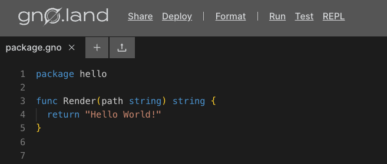

# How to write a simple Gno Library (Package)

## Overview

This guide shows you how to write a simple library (Package) in Gno, which can be used by other Packages and Realms.
Packages are _stateless_, meaning they do not hold state like regular Realms (Smart Contracts). To learn more about the
intricacies of Packages, please see the [Packages concept page](../concepts/packages.md).

The Package we will be writing today will be a simple library for suggesting a random tapas dish.
We will define a set list of tapas, and define a method that randomly selects a dish from the list.

## Development environment
Currently, Gno packages can be developed locally or via the online editor, Gno
Playground. Below we detail how to set up and use both.

### Local setup

#### Prerequisites

- **Text editor**

:::info Editor support
The Gno language is based on Go, but it does not have all the bells and whistles in major text editors like Go.
Advanced language features like IntelliSense are still in the works.

Currently, we officially have language support
for [ViM](https://github.com/gnolang/gno/blob/master/CONTRIBUTING.md#vim-support),
[Emacs](https://github.com/gnolang/gno/blob/master/CONTRIBUTING.md#emacs-support)
and [Visual Studio Code](https://marketplace.visualstudio.com/items?itemName=harry-hov.gno).
:::

We discussed Gno folder structures more in detail in
the [simple Smart Contract guide](simple-contract.md#1-setting-up-the-work-directory).
For now, we will just follow some rules outlined there.

Create the main working directory for our Package:

```bash
mkdir tapas-lib
```

Since we are building a simple tapas Package, inside our created `tapas-lib` directory, we can create another
directory named `p`, which stands for `package`:

```bash
cd tapas-lib
mkdir p
```

Additionally, we will create another subdirectory that will house our Package code, named `tapas`:

```bash
cd p
mkdir tapas
```

After setting up our work directory structure, we should have something like this:

```text
tapas-lib/
├─ p/
│  ├─ tapas/
│  │  ├─ // source code here
```

Now that the work directory structure is set up, we can go into the `tapas` sub-folder, and actually create
our tapas suggestion library logic:

```bash
cd tapas
touch tapas.gno
```

You're ready to write Gno code! Skip to ["Start writing code"](#2-start-writing-code)
to see how to start.

### Using Gno Playground

When using the Gno Playground, writing, testing, deploying, and sharing Gno code
is simple. This makes it perfect for getting started with Gno.

Visiting the [Playground](https://play.gno.land) will greet you with a template file:



Create a new file named `tapas.gno`, and delete the default file. You are now
ready to write some Gno code!


## 2. Start writing code

After setting up your environment, we can start defining our library logic. 
Inside `tapas.gno`:

[embedmd]:# (../assets/how-to-guides/simple-library/tapas.gno go)
```go
package tapas

import "std"

// List of tapas suggestions
var listOfTapas = []string{
	"Patatas Bravas",
	"Gambas al Ajillo",
	"Croquetas",
	"Tortilla Española",
	"Pimientos de Padrón",
	"Jamon Serrano",
	"Boquerones en Vinagre",
	"Calamares a la Romana",
	"Pulpo a la Gallega",
	"Tostada con Tomate",
	"Mejillones en Escabeche",
	"Chorizo a la Sidra",
	"Cazón en Adobo",
	"Banderillas",
	"Espárragos a la Parrilla",
	"Huevos Rellenos",
	"Tuna Empanada",
	"Sardinas a la Plancha",
}

// GetTapaSuggestion randomly selects and returns a tapa suggestion
func GetTapaSuggestion(userInput string) string {

	// Create a pseudorandom number depending on the block height.
	// We get the block height using std.GetHeight(), which is from an imported Gno library, "std"
	// Note: this value is not fully random and is easily guessable
	randomNumber := int(std.GetHeight()) % len(listOfTapas)

	// Return the random suggestion
	return listOfTapas[randomNumber]
}
```

There are a few things happening here, so let's dissect them:

- We defined the logic of our library into a package called `tapas`.
- The package imports `std`, which
is the [Gno standard library](../concepts/standard-library/overview.md)
- We use the imported package inside of `GetTapaSuggestion` to generate a
random index value for a tapa

You can view the code on [this Playground link](https://play.gno.land/p/3uwBqP66ekC).

## Conclusion

That's it 🎉

You have successfully built a simple tapas suggestion Package that is ready to be deployed on the Gno chain and imported
by other Packages and Realms.
