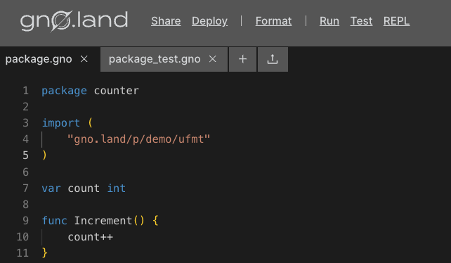

# How to test Gno Code

## Overview

In this guide, we will explore the available tooling in testing out the Gno
Realms and Packages we write. We will go over different CLI tools available to
developers, gno testing libraries as well as testing techniques that involve 
data mocking.

## Prerequisites

- **Internet connection**

## Example Realm

For the purpose of this guide, we will be testing the simple **Counter** Realm created in
the [How to write a simple Gno Smart Contract (Realm)](simple-contract.md) guide.

[embedmd]:# (../assets/how-to-guides/testing-gno/counter-1.gno go)
```go
package counter

import (
	"gno.land/p/demo/ufmt"
)

var count int

func Increment() {
	count++
}

func Decrement() {
	count--
}

func Render(_ string) string {
	return ufmt.Sprintf("Count: %d", count)
}
```

Visit [this Playground link](https://play.gno.land/p/XbkFKAIpLO8) to get started.

## 1. Writing the Gno test

Gno tests are written in the same manner and format as regular Go tests, just in
`_test.gno` files.

We can get started by adding a new file in the Playground, called `package_test.gno`:




What should be tested in this **Counter** Realm example?
Mainly, we want to verify that:

- Increment increments the value.
- Decrement decrements the value.
- Render returns a valid formatted value.

Let's write the required unit tests in `package_test.gno`:

[embedmd]:# (../assets/how-to-guides/testing-gno/counter-2.gno go)
```go
package counter

import "testing"

func TestCounter_Increment(t *testing.T) {
	// Reset the value
	count = 0

	// Verify the initial value is 0
	if count != 0 {
		t.Fatalf("initial value != 0")
	}

	// Increment the value
	Increment()

	// Verify the initial value is 1
	if count != 1 {
		t.Fatalf("initial value != 1")
	}
}

func TestCounter_Decrement(t *testing.T) {
	// Reset the value
	count = 0

	// Verify the initial value is 0
	if count != 0 {
		t.Fatalf("initial value != 0")
	}

	// Decrement the value
	Decrement()

	// Verify the initial value is 1
	if count != -1 {
		t.Fatalf("initial value != -1")
	}
}

func TestCounter_Render(t *testing.T) {
	// Reset the value
	count = 0

	// Verify the Render output
	if Render("") != "Count: 0" {
		t.Fatalf("invalid Render value")
	}
}
```

:::warning Testing package-level variables

In practice, it is not advisable to test and validate package level variables 
like this, as their value is mutated between test runs. For the sake of keeping 
this guide simple, we went ahead and reset the variable value for each test,
however, you should employ more robust test strategies.

:::

You can view the code on [this Playground link](https://play.gno.land/p/A74fKPLQgQi).

## 2. Running the test

To run the prepared Gno tests, you can use the built-in testing functionality in
the Playground. 

By simply click "Test" in the top bar, the Playground will look for `_test.gno`
files and execute them. If all went well, you will receive the following output
in a terminal:

```bash
=== RUN   TestCounter_Increment
--- PASS: TestCounter_Increment (0.00s)
=== RUN   TestCounter_Decrement
--- PASS: TestCounter_Decrement (0.00s)
=== RUN   TestCounter_Render
--- PASS: TestCounter_Render (0.00s)
ok      /src    3.60s
```

## Additional test support

As we grow more familiar with Gno development, our Realm / Package logic can
become more complex. As such, we need more robust testing support in the form of
mocking values ahead of time that would normally be only available on a
live (deployed) Realm / Package.

Luckily, the Gno standard library provides ample support for functionality such
as setting predefined values ahead of time, such as the caller address, block 
height, etc. 

You can learn more about these methods, which are importable using the `std`
import declaration, in the [standard library](../reference/standard-library/std/testing.md) 
testing reference section.

## Conclusion

That's it 🎉

You have successfully written and tested Gno code. Additionally, you have 
utilized the built-in Gno Playground testing functionality.
