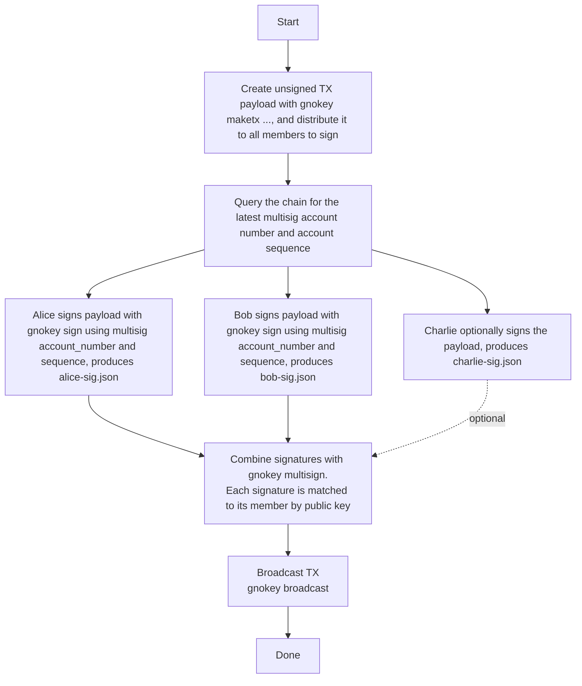

# `gnokey` command reference

`gnokey` is the official command-line client for Gno.land. This reference covers
every `gnokey` command: key management, deploying packages, calling and
scripting realms, signing transactions, multisig, and reading chain state.

`gnokey` is a production tool and stays deliberately minimal: signing keys and
talking to a live network, nothing more. Developer conveniences, for example a
transaction template system or realm scaffolding, would belong in a development
tool that could come in the future, the same way
[`gnodev`](./gnodev-reference.md) exists so you can develop locally without
driving a full node through the `gnoland` toolchain.

For everyday wallet use, see
[Using the `gnokey` wallet](../users/using-gnokey.md). For a guided first deploy,
follow [Getting started](../builders/getting-started.md). If you don't have
`gnokey` yet, see [Installation](../builders/install.md).

## Commands

| Command | What it does |
|---------|-------------|
| [`add`](../users/using-gnokey.md#managing-key-pairs) | create or import a key pair |
| [`add bech32`](#multisig-k-of-n) | add a watch-only key from a bech32 public key |
| [`add multisig`](#multisig-k-of-n) | create a multisig key from member keys |
| [`add ledger`](../users/using-gnokey.md#managing-key-pairs) | add a key from a Ledger device |
| [`list`](../users/using-gnokey.md#managing-key-pairs) | list keys in a keybase |
| [`delete`](../users/using-gnokey.md#managing-key-pairs) | delete a key |
| [`export`](#exporting-and-importing-keys) | export a private key as encrypted armor |
| [`import`](#exporting-and-importing-keys) | import an encrypted private key |
| [`generate`](../users/using-gnokey.md#managing-key-pairs) | generate a BIP39 mnemonic |
| [`rotate`](../users/using-gnokey.md#managing-key-pairs) | change a key's keybase password |
| [`maketx`](#making-transactions) | build, sign, and broadcast transactions |
| [`maketx session`](#session) | create, revoke, or revokeall session accounts |
| [`query`](#querying-a-gnoland-network) | read chain state without spending gas |
| [`sign`](#airgapped-signing) | sign an unsigned transaction |
| [`broadcast`](#airgapped-signing) | broadcast a signed transaction |
| [`verify`](#verifying-a-signature) | verify a transaction signature |
| [`multisign`](#multisig-k-of-n) | combine multisig signatures |
| `version` | print the `gnokey` binary version |

## Making transactions

Four message types change on-chain state:

| Message      | What it does                            |
|--------------|-----------------------------------------|
| `AddPackage` | upload new code to the chain            |
| `Call`       | call an exported realm function         |
| `Send`       | transfer coins between addresses        |
| `Run`        | execute a Gno script against the chain  |


Each `maketx` command sends one message, signed with a key from your keybase (see
[Using the `gnokey` wallet](../users/using-gnokey.md#managing-key-pairs)). Every
command takes the same base-configuration flags:

- `-gas-wanted` - the maximum gas units the transaction may consume (required)
- `-gas-fee` - the fee paid for the transaction, as `<amount>ugnot`
  (e.g. `1000000ugnot`; required)
- `-chainid` and `-remote` - the network to target; the two must match
- `-broadcast` - send the transaction to the chain (default `true`; set
  `-broadcast=false` to build the unsigned transaction without sending it, as
  in [Airgapped signing](#airgapped-signing))
- `-memo` - arbitrary text attached to the transaction (optional)
- `-simulate` - simulation mode: `test` (default, simulate first, broadcast
  only on success), `skip` (broadcast without simulating), `only` (dry run,
  report gas used and exit without broadcasting)
- `-gas-fee-margin` - percentage added to the estimated gas fee (default `5`;
  only used with `-simulate only`)
- `-master` - the master account's key name or address, when signing with a
  session key (optional; see [Session](#session))

`-gas-wanted` and `-gas-fee` together cap what you pay; `gnokey` never fills
them in for you. Run the transaction with `-simulate only` to get good values,
as shown in [Gas estimation](./gas-fees.md#gas-estimation). The default
`-simulate test` then guards them: a transaction that fails simulation is never
broadcast, and no fee is spent. Find `-chainid` and `-remote`
values per network in [Network configuration](./gnoland-networks.md).
State-changing calls cost gas paid in GNOT, so on testnets grab some from the
[Faucet Hub](https://faucet.gno.land) first.

Every successful transaction prints the same summary:

```console
OK!
GAS WANTED: 200000
GAS USED:   117564
HEIGHT:     3990
EVENTS:     []
INFO:
TX HASH:    Ni8Oq5dP0leoT/IRkKUKT18iTv8KLL3bH8OFZiV79kM=
```

- `GAS WANTED` - the gas units you requested
- `GAS USED` - the gas actually consumed
- `HEIGHT` - the block the transaction landed in
- `EVENTS` - any [Gno events](./gno-stdlibs.md#events) the call emitted
- `INFO` - extra information from the message handler (usually empty)
- `TX HASH` - the transaction's hash

Transactions that change [storage deposits](./storage-deposit.md) add
`STORAGE DELTA`, `STORAGE FEE` (or `STORAGE REFUND`), and `TOTAL TX COST`
lines, and `addpkg` appends a `PKGPATH` line.

For an end-to-end deploy-and-call walkthrough, see
[Getting started](../builders/getting-started.md).

### `Send`

`Send` transfers coins between two addresses with `gnokey maketx send`. Its own
flags are:

- `-to` - the recipient's bech32 address
- `-send` - the amount to transfer, as `<amount><denom>` (e.g. `100ugnot`)

```bash
gnokey maketx send \
  -to g1jg8mtutu9khhfwc4nxmuhcpftf0pajdhfvsqf5 \
  -send 100000ugnot \
  -gas-fee 1000000ugnot -gas-wanted 2000000 \
  -chainid staging \
  -remote "https://rpc.staging.gno.land:443" \
  mykey
```

### `AddPackage`

`AddPackage` uploads new code to the chain with `gnokey maketx addpkg`. On top of
the base configuration, it takes flags of its own:

- `-pkgpath` - the on-chain path the code is published to
- `-pkgdir` - the local directory holding the code
- `-send` - coins to send to the realm with the deploy (optional)
- `-max-deposit` - cap on GNOT locked for [storage deposit](./storage-deposit.md) (optional)

Run it from the package directory, publishing to a path under a
[namespace](./users-and-teams.md) you own:

```bash
gnokey maketx addpkg \
  -pkgpath "gno.land/p/examplenamespace/hello_world" \
  -pkgdir "." \
  -gas-fee 10000000ugnot \
  -gas-wanted 200000 \
  -chainid staging \
  -remote "https://rpc.staging.gno.land:443" \
  mykey
```

`-pkgpath` decides where the code lives on chain; on deploy it overwrites the
`module` declared in the package's `gnomod.toml`, so keep the two in sync. For
writing the package and declaring that path, see
[Getting started](../builders/getting-started.md) and
[Configuring Gno projects](./configuring-gno-projects.md#gnomodtoml).

### `Call`

`Call` invokes an exported realm function with `gnokey maketx call`. Its own flags
are:

- `-pkgpath` - the realm's on-chain path
- `-func` - the function to call
- `-args` - one argument (repeat the flag for more; see below)
- `-send` - coins to send with the call (optional)
- `-max-deposit` - cap on GNOT locked for [storage deposit](./storage-deposit.md) (optional)

`-func` must name an exported crossing function, one declared with a leading
`cur realm` parameter. Non-crossing functions are rejected; read them with
[`vm/qeval`](#vmqeval), or call them from [`Run`](#run).

For example, calling `Deposit()` on the `gno.land/r/gnoland/wugnot` realm to wrap
`1000ugnot` into the GRC20 token `wugnot`:

```bash
gnokey maketx call \
  -pkgpath "gno.land/r/gnoland/wugnot" \
  -func "Deposit" \
  -send "1000ugnot" \
  -gas-fee 10000000ugnot \
  -gas-wanted 2000000 \
  -chainid staging \
  -remote "https://rpc.staging.gno.land:443" \
  mykey
```

Any return value prints above the standard summary, and `EVENTS` carries whatever
the function [emitted](./gno-stdlibs.md#events).

:::info `Call` always uses gas

`maketx call` spends gas even when the function only reads state. To read without
paying, use the [`vm/qeval`](#vmqeval) query instead.

:::

#### Variadic functions

Pass one `-args` flag per variadic element. Given:

```go
func Add(cur realm, nums ...int) int
```

call it with any number of arguments:

```bash
# Two variadic args
gnokey maketx call -pkgpath gno.land/r/tests/vm/variadic -func Add -args 10 -args 20 ...

# Zero variadic args (omit -args entirely)
gnokey maketx call -pkgpath gno.land/r/tests/vm/variadic -func Add ...
```

Slice expansion (`...`) is not supported; pass each element as its own `-args`.

### `Run`

`Run` executes a Gno script against on-chain code with `gnokey maketx run`. Write a
`main` package; its `main()` function is detected and run, and any state changes
are applied. Its own flags are:

- `-send` - coins to send with the run (optional)
- `-max-deposit` - cap on GNOT locked for [storage deposit](./storage-deposit.md) (optional)

For example, calling `Increment()` on the
[Counter realm](https://staging.gno.land/r/demo/counter):

```go
package main

import "gno.land/r/demo/counter"

func main() {
	println(counter.Increment(cross))
}
```

```bash
gnokey maketx run \
  -gas-fee 1000000ugnot \
  -gas-wanted 20000000 \
  -chainid staging \
  -remote "https://rpc.staging.gno.land:443" \
  mykey ./script.gno
```

`println` lets you see the return value: its output is surfaced only in `Run`
and in tests, and discarded in a `Call`.

#### When to use `Run` over `Call`

That example could just as easily have been a `maketx call`. `Run` earns its place
when a plain call can't express what you need:

1. Constructing composite arguments such as structs, maps, or slices, which
   `Call` cannot pass
2. Calling realm functions repeatedly in a loop
3. Calling methods on exported variables

**1. Composite arguments.** Each `-args` value is a string, converted on chain
to the parameter's declared type: booleans, integers, floats, strings, and
`[]byte` (base64-encoded). Composite types such as structs, maps, and other
slices cannot be passed. `Run` is full Gno code, so it can build those values
directly:

```go
package main

import "gno.land/r/myrealm"

func main() {
	post := myrealm.Post{
		Title: "Hello",
		Tags:  []string{"gno", "blockchain"},
	}
	myrealm.CreatePost(cross, post)
}
```

**2. Looping over a realm function.** `Call` sends one transaction per call.
`Run` batches multiple calls into a single transaction, saving gas and keeping
the changes atomic. Using the [counter realm](https://staging.gno.land/r/demo/counter)
from the example above:

```go
package main

import "gno.land/r/demo/counter"

func main() {
	for i := 0; i < 5; i++ {
		println(counter.Increment(cross))
	}
}
```

This increments the counter five times in one transaction, printing each new
value. With `Call`, the same would require five separate transactions.

**3. Methods on exported variables.** `Call` can only invoke exported
functions. `Run` can also call methods on exported variables, which `Call`
cannot reach. For example, if a realm exposes `var Pool *Token` with a
`Balance()` method:

```go
package main

import "gno.land/r/myrealm"

func main() {
	println(myrealm.Pool.Balance())
}
```

This calls a method on an exported variable directly, which is impossible with
`Call`.

## Session

`gnokey maketx session` manages session accounts, a type of subaccount that a
master key authorizes to sign specific message types on its behalf. Session
accounts are useful for agents and device-login flows where the master key
should not sign every transaction.

### `session create`

Creates a session account authorized by a master key. Its flags are:

- `-pubkey` - the session subaccount's public key in bech32 format (`gpub1...`,
  not a `g1...` address)
- `-expires-at` - session expiry: a duration (`24h`, `7d`, `4w`; max ~4y), a
  unix timestamp, or `none` for no expiry (required)
- `-allow-paths` - per-message restrictions (required, repeatable). Use `*` for
  unrestricted, or list specific entries like `vm/exec:gno.land/r/foo`,
  `vm/run`, `bank/send`
- `-spend-limit` - max spend per period (optional; omitted = no spending)
- `-spend-period` - seconds; `0` = lifetime cap

```bash
gnokey maketx session create \
  -pubkey gpub1... \
  -expires-at 24h \
  -allow-paths "vm/exec:gno.land/r/myrealm" \
  -gas-fee 1000000ugnot -gas-wanted 2000000 \
  -chainid staging \
  -remote "https://rpc.staging.gno.land:443" \
  masterkey
```

The master key signs the creation message. `-master` cannot be used with
`session create`; the master key must sign directly.

### `session revoke`

Revokes a single session account by its public key:

```bash
gnokey maketx session revoke \
  -pubkey gpub1... \
  -gas-fee 1000000ugnot -gas-wanted 2000000 \
  -chainid staging \
  -remote "https://rpc.staging.gno.land:443" \
  masterkey
```

### `session revokeall`

Revokes all session accounts for the master key:

```bash
gnokey maketx session revokeall \
  -gas-fee 1000000ugnot -gas-wanted 2000000 \
  -chainid staging \
  -remote "https://rpc.staging.gno.land:443" \
  masterkey
```

## Airgapped signing

`gnokey` can split a transaction's creation, signing, and broadcasting across two
machines. Doing the signing on an
[airgapped](https://en.wikipedia.org/wiki/Air_gap_(networking)) machine with no
network keeps your private key away from internet-borne attacks; it never touches
the online machine. The flow uses one online machine (`A`) and one offline (`B`):

1. `A` (online): fetch account information from the chain
2. `B` (offline): build the unsigned transaction
3. `B` (offline): sign it
4. `A` (online): broadcast it

**1. Fetch account information.** Query [`auth/accounts`](#authaccounts) for the
signing address and note its `account_number` and `sequence`. Both are folded into
the signature to prevent replay, so signing needs them:

```bash
gnokey query auth/accounts/<your_address> -remote "https://rpc.staging.gno.land:443"
```

**2. Build the unsigned transaction.** Any `maketx` with `-broadcast=false` prints
the transaction, with a null `signature` field, to standard output instead of
sending it; redirect the output to a file:

```bash
gnokey maketx call \
  -pkgpath "gno.land/r/demo/counter" -func "Increment" \
  -gas-fee 1000000ugnot -gas-wanted 2000000 \
  -broadcast=false \
  mykey > counter.tx
```

**3. Sign it.** `gnokey sign` fills in the signature, using the account number and
sequence from step 1. It also takes `-output-document <file>` to write the
signature to a separate file (used in [multisig](#multisig-k-of-n)), and
`-session` to mark the signature as coming from a [session](#session) account,
where the named key is the session key:

```bash
gnokey sign \
  -tx-path counter.tx -chainid "staging" \
  -account-number 468 -account-sequence 0 \
  mykey
```

**4. Broadcast it.** Back on the online machine, send the signed file. No key is
needed here, since the transaction is already signed:

```bash
gnokey broadcast -remote "https://rpc.staging.gno.land:443" counter.tx
```

`broadcast` also takes `-dry-run` to simulate the broadcast without committing.

### Verifying a signature

`gnokey verify` checks a signed transaction file before it goes out, letting the
online machine confirm what came back from the offline one. It verifies against
a key in the local keybase, passed by name or address; only the public key is
used, so a watch-only entry added with [`add bech32`](#multisig-k-of-n) is
enough. It takes:

- `-tx-path` - the transaction file to verify
- `-sig-path` - a separate signature file, as written by `sign -output-document`
  (optional; without it, verifies the first signature embedded in the
  transaction)
- `-chainid`, `-account-number`, `-account-sequence` - must match the values
  used at signing. Any left unset are queried from `-remote`; offline, pass all
  three explicitly.

**Online** (unset flags queried from `-remote`):

```bash
gnokey verify -tx-path counter.tx -remote https://rpc.staging.gno.land:443 mykey
```

Relying on the query only works while the transaction is still pending:
broadcasting bumps the account's sequence past the one that was signed, so an
already-executed transaction verifies only with the original values passed
explicitly.

**Offline, or after broadcast** (all values explicit):

```bash
gnokey verify -tx-path counter.tx \
  -chainid "staging" -account-number 468 -account-sequence 0 \
  mykey
```

With `-sig-path` instead of the embedded signature:

```bash
gnokey verify -tx-path counter.tx -sig-path counter-sig.json \
  -remote https://rpc.staging.gno.land:443 mykey
```

A valid signature prints `Valid signature!` with the signing address, public
key, and signature; anything else exits with an error.

## Multisig (k-of-n)

A k-of-n multisig spends only when k of its n member keys sign. The example below
is a 2-of-3 between Alice, Bob, and Charlie.

:::info Same members, same address

A multisig is defined by its **member keys and threshold**. `add multisig` sorts
the members by address before deriving the multisig key, so every participant
gets the same address as long as they use the same member set and threshold,
regardless of the order they pass `--multisig` flags in. Passing `-nosort` keeps
the supplied order instead; then every participant must use the identical order,
or they derive different addresses.

Each signature is matched to its member by public key, so every signature must
come from a defined member, but you may pass them to `multisign` in any order.

:::

### 1. Each participant builds the multisig key

In their own keybase, every signer needs their own private key, the other members'
public keys (added as bech32 keys), and agreement on the member set and
threshold. Alice's keybase looks like this:

```sh
# Recover Alice's private key
echo "\n\n$ALICE_MNEMONIC" | gnokey add --recover alice --home ./alice-kb -insecure-password-stdin -quiet

# Add the other members' pubkeys
gnokey add bech32 --home ./alice-kb -pubkey "$BOB_PUBKEY" multisig-bob
gnokey add bech32 --home ./alice-kb -pubkey "$CHARLIE_PUBKEY" multisig-charlie

# Create the 2-of-3 multisig
gnokey add multisig --home ./alice-kb \
  --multisig alice --multisig multisig-bob --multisig multisig-charlie \
  -threshold 2 \
  multisig-abc
```

Bob and Charlie do the same in their own keybases, each holding their own private
key where Alice holds a pubkey. All three then derive the same `multisig-abc`
address.

### 2. Create the transaction and sign it

Any participant builds the unsigned transaction once, from the multisig account,
and shares the JSON with the signers:

```sh
gnokey maketx send --home ./alice-kb \
  -chainid staging -send "100000ugnot" \
  -gas-fee 100000ugnot -gas-wanted 100000 \
  -to g1pm60rkcvkt4j6s24vgygyfuu3c2f5gt76lqtss \
  -broadcast=false \
  multisig-abc > multisig-abc-send.json
```

Each signer signs with the **multisig** account's `account_number` and `sequence`,
fetched with [`auth/accounts`](#authaccounts) on the multisig address, not their
own, and writes a separate signature document:

```sh
echo "\n\n" | gnokey sign --tx-path multisig-abc-send.json --home ./alice-kb alice \
  --account-number "$MULTISIG_ACC_NUM" --account-sequence "$MULTISIG_ACC_SEQ" \
  -insecure-password-stdin -quiet --output-document alice-sig.json
```

Bob does the same against his keybase for `bob-sig.json`. Two signatures satisfy
the 2-of-3, so Charlie's is optional.

### 3. Combine signatures and broadcast

`gnokey multisign` merges the signatures, run from any keybase that holds
`multisig-abc`:

```sh
gnokey multisign --tx-path multisig-abc-send.json --home ./alice-kb \
  --signature alice-sig.json --signature bob-sig.json \
  multisig-abc

gnokey broadcast --home ./alice-kb multisig-abc-send.json
```



## Exporting and importing keys

`gnokey export` writes a private key as encrypted armor, and `gnokey import`
reads it back into a keybase. These are the key-transfer commands for airgapped
workflows and keybase migration.

### `export`

```bash
gnokey export -key mykey -output-path mykey-armor.txt
```

Flags:

- `-key` - the key name or bech32 address to export
- `-output-path` - where to write the encrypted armor file

### `import`

```bash
gnokey import -name mykey -armor-path mykey-armor.txt
```

Flags:

- `-name` - the name to store the imported key under
- `-armor-path` - path to the encrypted armor file

## Building gnokey for an airgapped machine

To run `gnokey` on an airgapped machine, build it on a trusted online machine,
verify the binary, and carry it across offline.

**Match the target's OS and arch.** Build for the same platform as the airgapped
machine. Read the target with `uname -s` and `uname -m` (`x86_64` →
`GOARCH=amd64`, `aarch64`/`arm64` → `GOARCH=arm64`), and set `GOOS`/`GOARCH` if
your build machine differs.

**Ledger needs CGO.** Ledger support requires `CGO_ENABLED=1`, which is off by
default in this repo (see [#2737](https://github.com/gnolang/gno/issues/2737)).
Cross-compiling with CGO is painful, so the simplest reliable path is to build on a
machine matching the target's OS, arch, and glibc baseline.

Build from a known commit. `make build.gnokey` stamps the version string
automatically:

```bash
git clone https://github.com/gnolang/gno.git && cd gno/gno.land
git checkout <commit>
make build.gnokey
./build/gnokey version   # sanity-check
```

Record what you built, checksum it, and bundle it for transfer:

```bash
git rev-parse HEAD > build/gnokey.gitrev
sha256sum build/gnokey > build/gnokey.sha256

tar -czf gnokey-airgap.tgz -C build gnokey gnokey.sha256 gnokey.gitrev
sha256sum gnokey-airgap.tgz > gnokey-airgap.tgz.sha256
```

Copy the `.tgz` and its checksum to offline media. On the airgapped machine, verify
before use:

```bash
sha256sum -c gnokey-airgap.tgz.sha256
tar -xzf gnokey-airgap.tgz
sha256sum -c gnokey.sha256
./gnokey version
```

:::warning CGO builds carry dynamic dependencies

A `CGO_ENABLED=1` binary may depend on system libraries (glibc and friends). If it
won't start on the airgapped box with missing shared libraries, the build
environment doesn't match the target closely enough: rebuild on the same
distro/glibc baseline, or install the runtime libraries there through your offline
package process.

:::

## Querying a Gno.land network

`gnokey query` sends ABCI queries, which read network state without spending gas.
Every query needs a `-remote` to read from; `-data` carries the query argument,
and `-height` reads the state at a specific block instead of the latest one. The
available queries:

- `auth/accounts/{ADDRESS}` - account information
- `auth/accounts/{ADDRESS}/sessions` - the [session](#session) accounts of an address
- `auth/gasprice` - the current minimum gas price for transactions
- `bank/balances/{ADDRESS}` - account balances
- `params/{MODULE}:{SUBMODULE}:{NAME}` - a module parameter, e.g.
  `params/vm:gno.land/r/myrealm:foo`
- `vm/qfuncs` - the exported functions of a realm
- `vm/qfile` - the file list or file contents of a package path
- `vm/qdoc` - the documentation of a package path, as JSON
- `vm/qeval` - evaluate an expression in read-only mode
- `vm/qrender` - call a realm's `Render` function and return its output
- `vm/qpaths` - list existing package paths
- `vm/qstorage` - a realm's storage usage and locked deposit

For the machine-readable variants (`vm/qeval_json`, `vm/qobject_json`, and
friends), see [Query state API](../builders/query-state-api.md).

### `auth/accounts`

Returns information about an address:

```bash
gnokey query auth/accounts/g1jg8mtutu9khhfwc4nxmuhcpftf0pajdhfvsqf5 -remote https://rpc.staging.gno.land:443
```

```bash
height: 0
data: {
  "BaseAccount": {
    "address": "g1jg8mtutu9khhfwc4nxmuhcpftf0pajdhfvsqf5",
    "coins": "227984898927ugnot",
    "public_key": {
      "@type": "/tm.PubKeySecp256k1",
      "value": "A+FhNtsXHjLfSJk1lB8FbiL4mGPjc50Kt81J7EKDnJ2y"
    },
    "account_number": "0",
    "sequence": "12"
  },
  "attributes": "0"
}
```

`height` is a response field the module queries leave unset, so it is currently
always `0`; the state itself is read at the latest block, or at `-height` if
given. `data` holds a `BaseAccount`, the TM2 struct for account data:

- `address` - the account's address
- `coins` - the coins the account owns
- `public_key` - the TM2 public key the address derives from
- `account_number` - a unique identifier for the account on chain
- `sequence` - a nonce, used to protect against replay attacks
- `attributes` - gno.land account flags as a bitset; `"0"` when none are set

### `bank/balances`

Returns the [coin](./gno-stdlibs.md#coin) balances of an address:

```bash
gnokey query bank/balances/g1jg8mtutu9khhfwc4nxmuhcpftf0pajdhfvsqf5 -remote https://rpc.gno.land:443
```

```bash
height: 0
data: "227984898927ugnot"
```

### `auth/gasprice`

Returns the minimum gas price currently required for transactions, handy for
setting `-gas-fee`:

```bash
gnokey query auth/gasprice -remote https://rpc.gno.land:443
```

```bash
height: 0
data: {
  "gas": "1000",
  "price": "100ugnot"
}
```

`data` holds a `GasPrice`: `gas` is the gas units and `price` is their cost as a
[coin](./gno-stdlibs.md#coin). The network adjusts the price after each block based
on demand; this query returns the value from the most recently completed block, the
minimum for new transactions. For a deeper explanation, see
[Gas Price](./gas-fees.md#gas-price).

### `vm/qfuncs`

Returns the exported functions of a realm path, given with `-data`; package
(`/p/`) paths are rejected. Crossing functions list their leading `cur realm`
parameter:

```bash
gnokey query vm/qfuncs --data "gno.land/r/gnoland/wugnot" -remote https://rpc.gno.land:443
```

```
height: 0
data: [
        {
          "FuncName": "Deposit",
          "Params": null,
          "Results": null
        },
        {
          "FuncName": "Withdraw",
          "Params": [
            {
            "Name": "amount",
            "Type": "int64",
            "Value": ""
            }
          ],
          "Results": null
        },
        // other functions
]
```

### `vm/qfile`

Returns the contents of a package path, given with `-data`. With only the package
path, it lists the files:

```bash
gnokey query vm/qfile -data "gno.land/r/gnoland/wugnot" -remote https://rpc.gno.land:443
```

```bash
height: 0
data: gnomod.toml
wugnot.gno
z0_filetest.gno
```

With a file name appended to the path, it returns that file's source:

```bash
gnokey query vm/qfile -data "gno.land/r/gnoland/wugnot/wugnot.gno" -remote https://rpc.gno.land:443
```

```bash
height: 0
data: package wugnot

import (
        "chain"
        "chain/banker"
        "chain/runtime"
        "strings"

        "gno.land/p/demo/tokens/grc20"
        "gno.land/p/nt/ufmt/v0"
        "gno.land/r/demo/defi/grc20reg"
)
...
```

### `vm/qdoc`

Returns the documentation of a package path, given with `-data`, as JSON. It covers
the package itself and its functions, types, and values:

```bash
gnokey query vm/qdoc --data "gno.land/r/gnoland/valopers/v2" -remote https://rpc.gno.land:443
```

```
height: 0
data: {
  "package_path": "gno.land/r/gnoland/valopers/v2",
  "package_doc": "Package valopers is designed around the permissionless lifecycle of valoper profiles...\n",
  "funcs": [
    {
      "name": "GetByAddr",
      "signature": "func GetByAddr(address address) Valoper",
      "doc": "GetByAddr fetches the valoper using the address, if present\n",
      "params": [{ "name": "address", "type": "address", "doc": "" }],
      "results": [{ "name": "", "type": "Valoper", "doc": "" }]
    }
    // other funcs
  ],
  "types": [
    {
      "name": "Valoper",
      "type": "struct { ... }",
      "doc": "Valoper represents a validator operator profile\n"
    }
  ]
  // values omitted
}
```

### `vm/qeval`

Evaluates a Gno expression, typically a call to an exported function, in
read-only mode without paying gas:

```bash
gnokey query vm/qeval -remote https://rpc.gno.land:443 -data "gno.land/r/gnoland/wugnot.BalanceOf(\"g1jg8mtutu9khhfwc4nxmuhcpftf0pajdhfvsqf5\")"
```

This returns the `wugnot` balance of the address without a transaction.
Quotation marks around string arguments must be escaped, and arguments must be
literal expressions. Queries still run under an internal gas cap, so unbounded
evaluations can fail.

### `vm/qrender`

Evaluates `Render(<renderpath>)` on a package path, given as
`<pkgpath>:<renderpath>`. The colon is required; with nothing after it, the
realm renders its root path:

```bash
gnokey query vm/qrender --data "gno.land/r/gnoland/wugnot:" -remote https://rpc.staging.gno.land:443
```

```bash
height: 0
data: # wrapped GNOT ($wugnot)

* **Decimals**: 0
* **Total supply**: 5012404
* **Known accounts**: 2
```

:::info Specifying a path to `Render()`

To render a specific path, use the `<pkgpath>:<renderpath>` syntax. For example,
the `wugnot` realm renders the balance of an address at:

```bash
gnokey query vm/qrender --data "gno.land/r/gnoland/wugnot:balance/g125em6arxsnj49vx35f0n0z34putv5ty3376fg5" -remote https://rpc.gno.land:443
```

The realm decides what paths it accepts; look at its `Render()` function to see
which ones it handles.

:::

### `vm/qpaths`

Lists existing package paths that start with the prefix given via `-data`. With
no prefix, it lists every known path, including those from `stdlibs`:

```bash
gnokey query vm/qpaths --data "gno.land/r/gnoland" -remote https://rpc.gno.land:443
```

```bash
height: 0
data: gno.land/r/gnoland/blog
gno.land/r/gnoland/coins
gno.land/r/gnoland/events
gno.land/r/gnoland/home
gno.land/r/gnoland/pages
```

A prefix can also be a `@username`, which lists that user's `/p` and `/r`
sub-packages:

```bash
gnokey query vm/qpaths --data "@foo" -remote https://rpc.gno.land:443
```

Append `?limit=<x>` to cap the number of results (default `1_000`; values above
`10_000` are capped to `10_000`). Quote the whole query string so the shell keeps
it in one piece:

```bash
gnokey query "vm/qpaths?limit=3" --data "gno.land/r/gnoland" -remote https://rpc.gno.land:443
```

### `vm/qstorage`

Returns the current storage usage and deposit of a realm:

```bash
gnokey query vm/qstorage --data "gno.land/r/foo" -remote https://rpc.gno.land:443
```

```
height: 0
data: storage: 5025, deposit: 502500
```

`storage` is the total bytes used; `deposit` is the total GNOT locked by the realm.
Dividing the two gives the storage price (`502500/5025 = 100ugnot` per byte),
without querying the params realm.
