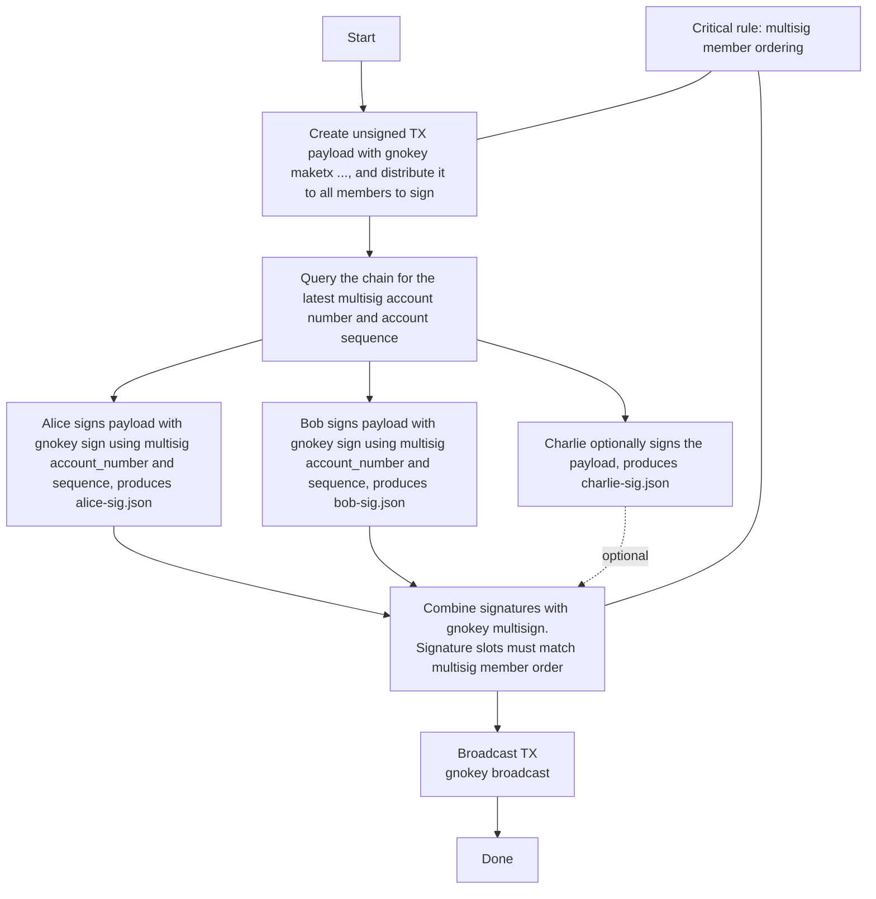

# `gnokey` command reference

`gnokey` is the official command-line client for Gno.land. This page is the full
command and query reference: deploying packages, calling and scripting realms,
signing transactions, multisig, and reading chain state.

For everyday wallet use, creating keys, checking balances, and sending coins, see
[Using the `gnokey` wallet](../users/using-gnokey.md). For a guided first deploy, follow
[Getting started](../builders/getting-started.md). If you don't have `gnokey` yet,
see [Installation](../builders/install.md).

## Making transactions

Four message types change on-chain state:

| Message      | What it does                            |
|--------------|-----------------------------------------|
| `AddPackage` | upload new code to the chain            |
| `Call`       | call an exported realm function         |
| `Send`       | transfer coins between addresses        |
| `Run`        | execute a Gno script against the chain  |

`Send` is the everyday wallet action, covered in
[Using the `gnokey` wallet](../users/using-gnokey.md#sending-coins). The other three are
developer messages, documented below.

Every transaction pairs a base configuration with one or more messages. `gnokey`
builds single-message transactions; for multi-message ones, use the
[gnoclient](https://github.com/gnolang/gno/tree/master/gno.land/pkg/gnoclient)
package from Go. Signing uses a key from your keybase, so create or import one
first (see [Managing key pairs](../users/using-gnokey.md#managing-key-pairs)).

The base configuration is the same across every `maketx` command:

- `-gas-wanted` - the maximum gas units the transaction may consume
- `-gas-fee` - the price per unit, in `ugnot`
- `-chainid` and `-remote` - the network to target; the two must match
- `-broadcast` - send the transaction to the chain (default `true`; set
  `-broadcast=false` to build and sign it without sending, as in
  [Airgapped signing](#airgapped-signing))

`-gas-wanted` and `-gas-fee` together cap what you pay; see
[Gas fees](./gas-fees.md) for estimating them. Find `-chainid` and `-remote`
values per network in [Network configuration](./gnoland-networks.md).
State-changing calls cost gas paid in GNOT, so on testnets grab some from the
[Faucet Hub](https://faucet.gno.land) first.

Every successful transaction prints the same summary:

```console
OK!
GAS WANTED: 200000
GAS USED:   117564
HEIGHT:     3990
EVENTS:     []
TX HASH:    Ni8Oq5dP0leoT/IRkKUKT18iTv8KLL3bH8OFZiV79kM=
```

- `GAS WANTED` - the gas units you requested
- `GAS USED` - the gas actually consumed
- `HEIGHT` - the block the transaction landed in
- `EVENTS` - any [Gno events](./gno-stdlibs.md#events) the call emitted
- `TX HASH` - the transaction's hash

For an end-to-end deploy-and-call walkthrough, see
[Getting started](../builders/getting-started.md).

### `AddPackage`

`AddPackage` uploads new code to the chain with `gnokey maketx addpkg`. On top of
the base configuration, it takes flags of its own:

- `-pkgpath` - the on-chain path the code is published to
- `-pkgdir` - the local directory holding the code
- `-send` - coins to send to the realm with the deploy (optional)
- `-max-deposit` - cap on GNOT locked for [storage deposit](./storage-deposit.md) (optional)

Run it from the package directory, publishing to a path under a
[namespace](./users-and-teams.md) you own:

```bash
gnokey maketx addpkg \
  -pkgpath "gno.land/p/examplenamespace/hello_world" \
  -pkgdir "." \
  -gas-fee 10000000ugnot \
  -gas-wanted 200000 \
  -chainid staging \
  -remote "https://rpc.staging.gno.land:443" \
  mykey
```

`-pkgpath` must match the `module` declared in the package's `gnomod.toml`. For
writing the package and declaring that path, see
[Getting started](../builders/getting-started.md) and
[Configuring Gno projects](./configuring-gno-projects.md#gnomodtoml).

### `Call`

`Call` invokes an exported realm function with `gnokey maketx call`. Its own flags
are:

- `-pkgpath` - the realm's on-chain path
- `-func` - the function to call
- `-args` - one argument (repeat the flag for more; see below)
- `-send` - coins to send with the call (optional)

For example, calling `Deposit()` on the `gno.land/r/gnoland/wugnot` realm to wrap
`1000ugnot` into the GRC20 token `wugnot`:

```bash
gnokey maketx call \
  -pkgpath "gno.land/r/gnoland/wugnot" \
  -func "Deposit" \
  -send "1000ugnot" \
  -gas-fee 10000000ugnot \
  -gas-wanted 2000000 \
  -chainid staging \
  -remote "https://rpc.staging.gno.land:443" \
  mykey
```

Any return value prints above the standard summary, and `EVENTS` carries whatever
the function [emitted](./gno-stdlibs.md#events).

:::info `Call` always uses gas

`maketx call` spends gas even when the function only reads state. To read without
paying, use the [`vm/qeval`](#vmqeval) query instead.

:::

#### Variadic functions

Pass one `-args` flag per variadic element. Given:

```go
func Add(cur realm, nums ...int) int
```

call it with any number of arguments:

```bash
# Two variadic args
gnokey maketx call -pkgpath gno.land/r/demo/math -func Add -args 10 -args 20 ...

# Zero variadic args (omit -args entirely)
gnokey maketx call -pkgpath gno.land/r/demo/math -func Add ...
```

Slice expansion (`...`) is not supported; pass each element as its own `-args`.

### `Run`

`Run` executes a Gno script against on-chain code with `gnokey maketx run`. Write a
`main` package; its `main()` function is detected and run, and any state changes
are applied. For example, calling `Increment()` on the
[Counter realm](https://staging.gno.land/r/demo/counter):

```go
package main

import "gno.land/r/demo/counter"

func main() {
	println(counter.Increment(cross))
}
```

```bash
gnokey maketx run \
  -gas-fee 1000000ugnot \
  -gas-wanted 20000000 \
  -chainid staging \
  -remote "https://rpc.staging.gno.land:443" \
  mykey ./script.gno
```

`println`, available only in the `Run` and testing context, lets you see the
return value.

#### When to use `Run` over `Call`

That example could just as easily have been a `maketx call`. `Run` earns its place
when a plain call can't express what you need:

1. Calling realm functions repeatedly in a loop
2. Passing non-primitive arguments such as structs or slices, which `Call` cannot
3. Calling methods on exported variables

The cases below run against this realm:

```go
package foo

import "gno.land/p/nt/ufmt/v0"

var (
	MainFoo *Foo
	foos    []*Foo
)

type Foo struct {
	bar string
	baz int
}

func init() {
	MainFoo = &Foo{bar: "mainBar", baz: 0}
}

func (f *Foo) String() string {
	return ufmt.Sprintf("Foo - (bar: %s) - (baz: %d)\n\n", f.bar, f.baz)
}

func NewFoo(bar string, baz int) *Foo {
	return &Foo{bar: bar, baz: baz}
}

func AddFoos(multipleFoos []*Foo) {
	foos = append(foos, multipleFoos...)
}

func Render(_ string) string {
	var output string
	for _, f := range foos {
		output += f.String()
	}
	return output
}
```

**1. Looping over a realm function:**

```go
package main

import "gno.land/r/docs/examples/foo"

func main() {
	for i := 0; i < 5; i++ {
		println(foo.Render(""))
	}
}
```

**2. Non-primitive arguments.** `Call` only accepts primitives, so `AddFoos`,
which takes a `[]*Foo`, is reachable only through `Run`:

```go
package main

import (
	"strconv"

	"gno.land/r/docs/examples/foo"
)

func main() {
	var multipleFoos []*foo.Foo
	for i := 0; i < 5; i++ {
		multipleFoos = append(multipleFoos, foo.NewFoo("bar"+strconv.Itoa(i), i))
	}
	foo.AddFoos(multipleFoos)
}
```

**3. Methods on exported variables**, which `Call` cannot reach at all:

```go
package main

import "gno.land/r/docs/examples/foo"

func main() {
	println(foo.MainFoo.String())
}
```

## Airgapped signing

`gnokey` can split a transaction's creation, signing, and broadcasting across two
machines. Doing the signing on an
[airgapped](https://en.wikipedia.org/wiki/Air_gap_(networking)) machine with no
network keeps your private key away from internet-borne attacks; it never touches
the online machine. The flow uses one online machine (`A`) and one offline (`B`):

1. `A` (online): fetch account information from the chain
2. `B` (offline): build the unsigned transaction
3. `B` (offline): sign it
4. `A` (online): broadcast it

**1. Fetch account information.** Query [`auth/accounts`](#authaccounts) for the
signing address and note its `account_number` and `sequence`. Both are folded into
the signature to prevent replay, so signing needs them:

```bash
gnokey query auth/accounts/<your_address> -remote "https://rpc.staging.gno.land:443"
```

**2. Build the unsigned transaction.** Any `maketx` with `-broadcast=false` writes
the transaction, with a null `signature` field, to a file instead of sending it:

```bash
gnokey maketx call \
  -pkgpath "gno.land/r/demo/counter" -func "Increment" \
  -gas-fee 1000000ugnot -gas-wanted 2000000 \
  -broadcast=false \
  mykey > counter.tx
```

**3. Sign it.** `gnokey sign` fills in the signature, using the account number and
sequence from step 1:

```bash
gnokey sign \
  -tx-path counter.tx -chainid "staging" \
  -account-number 468 -account-sequence 0 \
  mykey
```

**4. Broadcast it.** Back on the online machine, send the signed file. No key is
needed here, since the transaction is already signed:

```bash
gnokey broadcast -remote "https://rpc.staging.gno.land:443" counter.tx
```

### Verifying a signature

`gnokey verify` checks a transaction's signature. Pass the document with
`-tx-path`; without `-sig-path`, it verifies the signature embedded in the
transaction:

```bash
gnokey verify -tx-path counter.tx mykey
```

Add `-sig-path` to verify against a separate signature file instead:

```bash
gnokey verify -tx-path counter.tx -sig-path counter-sig.json mykey
```

## Multisig (k-of-n)

A k-of-n multisig spends only when k of its n member keys sign. The example below
is a 2-of-3 between Alice, Bob, and Charlie.

:::warning Ordering is everything

A multisig is defined by its **ordered list of member keys**. Every participant
must create it with the members in the **same order**, or they end up with
different multisig addresses. The same ordering governs signing: each signature is
matched to its member, so every signature must come from a defined member (though
you may pass them to `multisign` in any order).

:::

### 1. Each participant builds the multisig key

In their own keybase, every signer needs their own private key, the other members'
public keys (added as bech32 keys), and agreement on the threshold and member
order. Using the order `alice, bob, charlie`, Alice's keybase looks like this:

```sh
# Recover Alice's private key
echo "\n\n$ALICE_MNEMONIC" | gnokey add --recover alice --home ./alice-kb -insecure-password-stdin -quiet

# Add the other members' pubkeys
gnokey add bech32 --home ./alice-kb -pubkey "$BOB_PUBKEY" multisig-bob
gnokey add bech32 --home ./alice-kb -pubkey "$CHARLIE_PUBKEY" multisig-charlie

# Create the multisig (order: alice, bob, charlie)
gnokey add multisig --home ./alice-kb \
  --multisig alice --multisig multisig-bob --multisig multisig-charlie \
  -threshold 2 \
  multisig-abc
```

Bob and Charlie do the same in their own keybases, each holding their own private
key where Alice holds a pubkey, but keeping the identical `alice, bob, charlie`
order. All three then derive the same `multisig-abc` address.

### 2. Create the transaction and sign it

Any participant builds the unsigned transaction once, from the multisig account,
and shares the JSON with the signers:

```sh
gnokey maketx send --home ./alice-kb \
  -chainid staging -send "100000ugnot" \
  -gas-fee 100000ugnot -gas-wanted 100000 \
  -to g1pm60rkcvkt4j6s24vgygyfuu3c2f5gt76lqtss \
  multisig-abc > multisig-abc-send.json
```

Each signer signs with the **multisig** account's `account_number` and `sequence`,
fetched with [`auth/accounts`](#authaccounts) on the multisig address, not their
own, and writes a separate signature document:

```sh
echo "\n\n" | gnokey sign --tx-path multisig-abc-send.json --home ./alice-kb alice \
  --account-number "$MULTISIG_ACC_NUM" --account-sequence "$MULTISIG_ACC_SEQ" \
  -insecure-password-stdin -quiet --output-document alice-sig.json
```

Bob does the same against his keybase for `bob-sig.json`. Two signatures satisfy
the 2-of-3, so Charlie's is optional.

### 3. Combine signatures and broadcast

`gnokey multisign` merges the signatures, run from any keybase that holds
`multisig-abc`:

```sh
gnokey multisign --tx-path multisig-abc-send.json --home ./alice-kb \
  --signature alice-sig.json --signature bob-sig.json \
  multisig-abc

gnokey broadcast --home ./alice-kb multisig-abc-send.json
```



## Building gnokey for an airgapped machine

To run `gnokey` on an airgapped machine, build it on a trusted online machine,
verify the binary, and carry it across offline.

**Match the target's OS and arch.** Build for the same platform as the airgapped
machine. Read the target with `uname -s` and `uname -m` (`x86_64` →
`GOARCH=amd64`, `aarch64`/`arm64` → `GOARCH=arm64`), and set `GOOS`/`GOARCH` if
your build machine differs.

**Ledger needs CGO.** Ledger support requires `CGO_ENABLED=1`, which is off by
default in this repo (see [#2737](https://github.com/gnolang/gno/issues/2737)).
Cross-compiling with CGO is painful, so the simplest reliable path is to build on a
machine matching the target's OS, arch, and glibc baseline.

Build from a known commit, stamping the same version string the repo uses so the
binary is reproducible:

```bash
git clone https://github.com/gnolang/gno.git && cd gno
VERSION="$(git describe --tags --exact-match 2>/dev/null || \
  echo "$(git rev-parse --abbrev-ref HEAD).$(git rev-list --count HEAD)+$(git rev-parse --short HEAD)")"

go build \
  -ldflags "-X github.com/gnolang/gno/tm2/pkg/version.Version=${VERSION}" \
  -o build/gnokey \
  ./gno.land/cmd/gnokey

./build/gnokey version   # sanity-check the binary you just built
```

Record what you built, checksum it, and bundle it for transfer:

```bash
git rev-parse HEAD > build/gnokey.gitrev
printf '%s\n' "$VERSION" > build/gnokey.version
sha256sum build/gnokey > build/gnokey.sha256

tar -czf gnokey-airgap.tgz -C build gnokey gnokey.sha256 gnokey.gitrev gnokey.version
sha256sum gnokey-airgap.tgz > gnokey-airgap.tgz.sha256
```

Copy the `.tgz` and its checksum to offline media. On the airgapped machine, verify
before use:

```bash
sha256sum -c gnokey-airgap.tgz.sha256
tar -xzf gnokey-airgap.tgz
sha256sum -c gnokey.sha256
./gnokey version
```

:::warning CGO builds carry dynamic dependencies

A `CGO_ENABLED=1` binary may depend on system libraries (glibc and friends). If it
won't start on the airgapped box with missing shared libraries, the build
environment doesn't match the target closely enough: rebuild on the same
distro/glibc baseline, or install the runtime libraries there through your offline
package process.

:::

## Querying a Gno.land network

`gnokey query` sends ABCI queries, which read network state without spending gas.
Every query needs a `-remote` to read from. The available queries:

- `auth/accounts/{ADDRESS}` - account information
- `auth/gasprice` - the current minimum gas price for transactions
- `bank/balances/{ADDRESS}` - account balances
- `vm/qfuncs` - the exported functions of a package path
- `vm/qfile` - the file list or file contents of a package path
- `vm/qdoc` - the documentation of a package path, as JSON
- `vm/qeval` - evaluate an expression in read-only mode
- `vm/qrender` - shorthand for `vm/qeval Render("")` on a package path
- `vm/qpaths` - list existing package paths
- `vm/qstorage` - a realm's storage usage and locked deposit

### `auth/accounts`

Returns information about an address:

```bash
gnokey query auth/accounts/g1jg8mtutu9khhfwc4nxmuhcpftf0pajdhfvsqf5 -remote https://rpc.staging.gno.land:443
```

```bash
height: 0
data: {
  "BaseAccount": {
    "address": "g1jg8mtutu9khhfwc4nxmuhcpftf0pajdhfvsqf5",
    "coins": "227984898927ugnot",
    "public_key": {
      "@type": "/tm.PubKeySecp256k1",
      "value": "A+FhNtsXHjLfSJk1lB8FbiL4mGPjc50Kt81J7EKDnJ2y"
    },
    "account_number": "0",
    "sequence": "12"
  }
}
```

`height` is the block the query ran at (currently always `0`). `data` holds a
`BaseAccount`, the TM2 struct for account data:

- `address` - the account's address
- `coins` - the coins the account owns
- `public_key` - the TM2 public key the address derives from
- `account_number` - a unique identifier for the account on chain
- `sequence` - a nonce, used to protect against replay attacks

### `bank/balances`

Returns the [coin](./gno-stdlibs.md#coin) balances of an address:

```bash
gnokey query bank/balances/g1jg8mtutu9khhfwc4nxmuhcpftf0pajdhfvsqf5 -remote https://rpc.gno.land:443
```

```bash
height: 0
data: "227984898927ugnot"
```

### `auth/gasprice`

Returns the minimum gas price currently required for transactions, handy for
setting `-gas-fee`:

```bash
gnokey query auth/gasprice -remote https://rpc.gno.land:443
```

```bash
height: 0
data: {
  "gas": 1000,
  "price": "100ugnot"
}
```

`data` holds a `GasPrice`: `gas` is the gas units and `price` is their cost as a
[coin](./gno-stdlibs.md#coin). The network adjusts the price after each block based
on demand; this query returns the value from the most recently completed block, the
minimum for new transactions. For a deeper explanation, see
[Gas Price](./gas-fees.md#gas-price).

### `vm/qfuncs`

Returns the exported functions of a package path, given with `-data`:

```bash
gnokey query vm/qfuncs --data "gno.land/r/gnoland/wugnot" -remote https://rpc.gno.land:443
```

```json
height: 0
data: [
        {
          "FuncName": "Deposit",
          "Params": null,
          "Results": null
        },
        {
          "FuncName": "Withdraw",
          "Params": [
            {
            "Name": "amount",
            "Type": "int64",
            "Value": ""
            }
          ],
          "Results": null
        },
        // other functions
]
```

### `vm/qfile`

Returns the contents of a package path, given with `-data`. With only the package
path, it lists the files:

```bash
gnokey query vm/qfile -data "gno.land/r/gnoland/wugnot" -remote https://rpc.gno.land:443
```

```bash
height: 0
data: gnomod.toml
wugnot.gno
z0_filetest.gno
```

With a file name appended to the path, it returns that file's source:

```bash
gnokey query vm/qfile -data "gno.land/r/gnoland/wugnot/wugnot.gno" -remote https://rpc.gno.land:443
```

```bash
height: 0
data: package wugnot

import (
        "chain"
        "chain/banker"
        "chain/runtime"
        "strings"

        "gno.land/p/demo/tokens/grc20"
        "gno.land/p/nt/ufmt/v0"
        "gno.land/r/demo/defi/grc20reg"
)
...
```

### `vm/qdoc`

Returns the documentation of a package path, given with `-data`, as JSON. It covers
the package itself and its functions, types, and values:

```bash
gnokey query vm/qdoc --data "gno.land/r/gnoland/valopers/v2" -remote https://rpc.gno.land:443
```

```json
height: 0
data: {
  "package_path": "gno.land/r/gnoland/valopers/v2",
  "package_doc": "Package valopers is designed around the permissionless lifecycle of valoper profiles...\n",
  "funcs": [
    {
      "name": "GetByAddr",
      "signature": "func GetByAddr(address address) Valoper",
      "doc": "GetByAddr fetches the valoper using the address, if present\n",
      "params": [{ "Name": "address", "Type": "address" }],
      "results": [{ "Name": "", "Type": "Valoper" }]
    }
    // other funcs
  ],
  "types": [
    {
      "name": "Valoper",
      "signature": "type Valoper struct { ... }",
      "doc": "Valoper represents a validator operator profile\n"
    }
  ]
  // values omitted
}
```

### `vm/qeval`

Evaluates a call to an exported function in read-only mode, without using gas:

```bash
gnokey query vm/qeval -remote https://rpc.gno.land:443 -data "gno.land/r/gnoland/wugnot.BalanceOf(\"g1jg8mtutu9khhfwc4nxmuhcpftf0pajdhfvsqf5\")"
```

This returns the `wugnot` balance of the address without spending gas. Quotation
marks around string arguments must be escaped, and only primitive types are
supported in expressions.

### `vm/qrender`

An alias for evaluating `Render("")` on a package path:

```bash
gnokey query vm/qrender --data "gno.land/r/gnoland/wugnot:" -remote https://rpc.staging.gno.land:443
```

```bash
height: 0
data: # wrapped GNOT ($wugnot)

* **Decimals**: 0
* **Total supply**: 5012404
* **Known accounts**: 2
```

:::info Specifying a path to `Render()`

To render a specific path, use the `<pkgpath>:<renderpath>` syntax. For example,
the `wugnot` realm renders the balance of an address at:

```bash
gnokey query vm/qrender --data "gno.land/r/gnoland/wugnot:balance/g125em6arxsnj49vx35f0n0z34putv5ty3376fg5" -remote https://rpc.gno.land:443
```

The realm decides what paths it accepts; look at its `Render()` function to see
which ones it handles.

:::

### `vm/qpaths`

Lists existing package paths that start with `--data=<prefix>`. With no prefix, it
lists every known path, including those from `stdlibs`:

```bash
gnokey query vm/qpaths --data "gno.land/r/gnoland"
```

```bash
height: 0
data: gno.land/r/gnoland/blog
gno.land/r/gnoland/coins
gno.land/r/gnoland/events
gno.land/r/gnoland/home
gno.land/r/gnoland/pages
```

A prefix can also be a `@username`, which lists that user's `/p` and `/r`
sub-packages:

```bash
gnokey query vm/qpaths --data "@foo"
```

Append `?limit=<x>` to cap the number of results (`0` lifts the cap, up to a hard
limit of `10_000`; the default is `1_000`). Quote the whole query string so the
shell keeps it in one piece:

```bash
gnokey query "vm/qpaths?limit=3" --data "gno.land/r/gnoland"
```

### `vm/qstorage`

Returns the current storage usage and deposit of a realm:

```bash
gnokey query vm/qstorage --data "gno.land/r/foo"
```

```
storage: 5025, deposit: 502500
```

`storage` is the total bytes used; `deposit` is the total GNOT locked by the realm.
Dividing the two gives the storage price (`502500/5025 = 100ugnot` per byte),
without querying the params realm.
