# The Gno Virtual Machine

The GnoVM is a stack-based virtual machine. It interprets a subset of the Go programming language, with care for executing code deterministically for execution on a blockchain, also by providing a restricted subset of the standard library. As such, to distinguish it from Go, we call the programming language "Gno".

This document is meant to serve as an initial introduction to the technical concepts underpinning the functioning of the Virtual Machine, to aid inspection into its code and development of smart contracts using it.

*Disclaimer: As an evolving project, the information here presented is not guaranteed to be 100% up-to-date, but the authors have made their best effort to present the most up-to-date state as of **January 15, 2026**.*

## Purpose

The GnoVM is meant to interpret Go programs for their execution on the blockchain. Prominent blockchain languages require using a domain-specific programming language, or executing on the blockchain "bytecode" - in the case of Ethereum, it's both. The GnoVM is meant to allow storing Go programs directly as the source of truth; with comments and formatting included by default, aiding the smart contract's inspectability with no added steps. Furthermore, it aims to reduce the friction and cost to adopting and starting to develop on the blockchain by using an existing, popular language for software development like Go.

To achieve this, Gno requires some modifications to the programming language, at least in the way it's conventionally used, to allow for state persistance and safe isolation and permissioning of different programs on the blockchain. Aside from that, Gno supports most of Go features available up to 1.17. A notable exception are the concurrency features (the `go` keyword, channels, and the `select` statement), and the complex number literals, types and functions. The only added feature is the "state persistence" in realms, together with the specification of how different state variables can be written by which realm.

## Architecture

The following diagram provides an overview of the journey of code in the GnoVM.

```mermaid
graph TD
    subgraph "1#46; Go AST Parsing"
        A[Source Code] --> B["Go AST
            <code>go/parser</code>"]

        A1["`package main
&nbsp;
func add(a, b int) int {
#32;#32;return a + b
}`"]

        B1["`(*ast.File)(0xc00011c460)({
#32;#32;Package: (token.Pos) 1,
#32;#32;Name: (*ast.Ident)(0xc000126160)(main),
#32;#32;Decls: ([]ast.Decl) (len=1 cap=1) {
#32;#32;#32;#32;(*ast.FuncDecl)(0xc00011e540)({
#32;#32;#32;#32;#32;#32;Name: (*ast.Ident)(0xc000126180)(add),`"]
        A1 --> B1

    end

    subgraph "2#46; AST Conversion"
        B --> C["`Gno AST
        <code>gnolang.Go2Gno</code>`"]
        C1["`(*gnolang.FileNode)(0xc0002e3508)({
#32;#32;Name: (gnolang.Name) (len=7) #quot;hey.gno#quot;,
#32;#32;PkgName: (gnolang.Name) (len=4) #quot;main#quot;,
#32;#32;Decls: (gnolang.Decls) (len=1 cap=1) {
#32;#32;#32;#32;(*gnolang.FuncDecl)(0xc000364c08)({
#32;#32;#32;#32;#32;#32;NameExpr: (gnolang.NameExpr) {
#32;#32;#32;#32;#32;#32;#32;#32;Name: (gnolang.Name) (len=3) #quot;add#quot;,
#32;#32;#32;#32;#32;#32;#32;#32;Type: (gnolang.NameExprType) 0`"]
        B1--> C1
    end

    subgraph "3#46; Preprocessing"
        C --> D[Preprocessed AST<br/>with Type Info]
        D1["`(*gnolang.FuncDecl)(0xc00035cc08)({
#32;#32;NameExpr: (gnolang.NameExpr) {
#32;#32;#32;#32;Name: (gnolang.Name) (len=3) &quot;add&quot;,
#32;#32;#32;#32;Type: (gnolang.NameExprType) 0
#32;#32;},
#32;#32;IsMethod: (bool) false,
#32;#32;Type: (gnolang.FuncTypeExpr) {
#32;#32;#32;#32;Attributes: (gnolang.Attributes) {
#32;#32;#32;#32;#32;#32;data: (map[gnolang.GnoAttribute]interface {}) (len=2) {
#32;#32;#32;#32;#32;#32;#32;#32;&quot;ATTR_PREPROCESSED&quot;: (bool) true,
#32;#32;#32;#32;#32;#32;#32;#32;&quot;ATTR_TYPE_VALUE&quot;: (*gnolang.FuncType)(0xc00034cd70)({
#32;#32;#32;#32;#32;#32;#32;#32;#32;#32;Params: ([]gnolang.FieldType) (len=2 cap=2) {
#32;#32;#32;#32;#32;#32;#32;#32;#32;#32;#32;#32;(gnolang.FieldType) {
#32;#32;#32;#32;#32;#32;#32;#32;#32;#32;#32;#32;#32;#32;Name: (gnolang.Name) (len=1) &quot;a&quot;,
#32;#32;#32;#32;#32;#32;#32;#32;#32;#32;#32;#32;#32;#32;Type: (gnolang.PrimitiveType) 32,
#32;#32;#32;#32;#32;#32;#32;#32;#32;#32;#32;#32;#32;#32;Embedded: (bool) false,
#32;#32;#32;#32;#32;#32;#32;#32;#32;#32;#32;#32;#32;#32;Tag: (gnolang.Tag) &quot;&quot;
#32;#32;#32;#32;#32;#32;#32;#32;#32;#32;#32;#32;},
#32;#32;#32;#32;#32;#32;#32;#32;#32;#32;#32;#32;(gnolang.FieldType) {
#32;#32;#32;#32;#32;#32;#32;#32;#32;#32;#32;#32;#32;#32;Name: (gnolang.Name) (len=1) &quot;b&quot;,
#32;#32;#32;#32;#32;#32;#32;#32;#32;#32;#32;#32;#32;#32;Type: (gnolang.PrimitiveType) 32,
#32;#32;#32;#32;#32;#32;#32;#32;#32;#32;#32;#32;#32;#32;Embedded: (bool) false,
#32;#32;#32;#32;#32;#32;#32;#32;#32;#32;#32;#32;#32;#32;Tag: (gnolang.Tag) &quot;&quot;
#32;#32;#32;#32;#32;#32;#32;#32;#32;#32;#32;#32;}
#32;#32;#32;#32;#32;#32;#32;#32;#32;#32;},`"]
        C1 --> D1
    end

    subgraph "4#46; Package Initialization"
        D --> E["PackageValue<br/>Run declarations & <code>init()</code> functions"]
        E1["`(*gnolang.PackageValue)(0xc0003e24b0)({
#32;#32;PkgName: (gnolang.Name) (len=4) #quot;main#quot;,
#32;#32;PkgPath: (string) (len=15) #quot;gno.land/p/main#quot;,
#32;#32;FNames: ([]gnolang.Name) (len=1 cap=1) {
#32;#32;#32;#32;(gnolang.Name) (len=7) #quot;hey.gno#quot;
#32;#32;},
#32;#32;FBlocks: ([]gnolang.Value) (len=1 cap=1) {
#32;#32;#32;#32;(*gnolang.Block)(0xc0004921e0)({
#32;#32;#32;#32;#32;#32;#32;#32;isNewEscaped: (bool) false,
#32;#32;#32;#32;#32;#32;#32;#32;isNewDeleted: (bool) false,
#32;#32;#32;#32;#32;#32;#32;#32;owner: (*gnolang.PackageValue)(0xc0003fe4b0)(<already shown>)
#32;#32;#32;#32;#32;#32;},
#32;#32;#32;#32;#32;#32;Source: (*gnolang.FileNode)(0xc0002e3508)({
#32;#32;#32;#32;#32;#32;#32;#32;Name: (gnolang.Name) (len=7) #quot;hey.gno#quot;,
#32;#32;#32;#32;#32;#32;#32;#32;PkgName: (gnolang.Name) (len=4) #quot;main#quot;,
#32;#32;#32;#32;#32;#32;#32;#32;Decls: (gnolang.Decls) (len=1 cap=1) {
#32;#32;#32;#32;#32;#32;#32;#32;#32;#32;(*gnolang.FuncDecl)(0xc0003e6c08)({`"]
        D1 --> E1
    end

    subgraph "5#46; Execution"
        E --> F["<code>Machine.Run()</code>"]
        F --> G[Statement]
        G --> H1[Expressions]
        G --> H2[Op-Codes]
        H1 --> I1[Values]
        H1 --> I2
        H2 --> I2[Op-Codes]
        I1 --> J["Values (Results)"]
        I2 --> J
        GCode["OpExec 'return a + b'
#plus; OpReturn
#plus; OpEval 'a + b'"]
        HCode["OpEval 'a + b'
#plus; OpAdd
#plus; OpEval 'b'
#plus; OpEval 'a'
OpEval 'a'
#plus;v 1
OpEval 'b'
#plus;v 2"]
        ICode["OpAdd 1 2
#plus;v 3"]
        JCode["OpReturn 3"]
        G --> GCode
        H2 --> HCode
        I2 --> ICode
        E1 --> GCode --> HCode --> ICode --> JCode
    end

    classDef codeSpace stroke:#666,font-family:monospace,white-space:pre,text-align:left,overflow:visible
    class A1,B1,C1,D1,E1,GCode,HCode,ICode,JCode codeSpace
```

1. **Go AST Parsing:** The GnoVM parses Go code using `go/parser`, the same parser used by Go.[^1]
2. **AST Conversion:** The generated AST is converted into Gno's own AST, which simplifies some parts and includes data structure to hold type information for each AST node.
3. **Preprocessing:** this stage enrichens the Gno AST from the previous step, to statically check its code and add type information, and to prepare the AST for execution.
4. **Package Initialization:** before a function in any package can be executed, the package itself must be initialized. This means evaluating its constants, global variables and `init()` functions, to make sure to have an initial state as any Go developer would expect.
5. **Execution:** when calling a function from a package, each statement of its body is executed. The VM, while it uses Op-codes under the hood, performs compilation "on-the-fly" (and is closer in this regard to an interpreter model), whereby each statement of the source code is first broken down into its operations, then the expressions contained are each evaluated to a concrete value.

In the following sections, we'll first uncover how the VM generally executes code. Then, we'll take a closer look to how the general VM connects with the blockchain, and how the data storage of the blockchain is used to persist the state of packages.

# Program execution

## Preprocessing

As we've seen in the [[#Architecture|Architecture diagram]], the first steps toward executing Gno code are relatively straightforward, with the source code being parsed into an Abstract Syntax Tree.

Before we can execute the code from the AST, however, we need to enrich it with additional type information. This allows us to infer the type of variables, perform "compile-time" optimizations and generally leave the tree in a state where it's ready to be interpreted in the next step.

Here's a non-exhaustive summary of the most important features that are undertaken by the preprocessing step:

- **Initializing static blocks:** to aid runtime and eagerly compute as much information as possible, during preprocessing we create "static" blocks: a list of the identifiers declared in the block and the corresponding type of each; together with other supporting information (like whether the name is of another file, or whether it should be initialized as a separate value to be stored stand-alone, when [[#Persistence of global variables|persisting data]]).
	- [[#Frames and blocks|In another section]], we'll delve into how values at runtime are structured into the "blocks" where they are defined, which in turn determines the scope of each variable.
- **Converting identifiers to "Value Paths":** with the identifiers stored in the static block, we can convert all of the identifiers to a "pointer" to the block which will contain the name.
	- In practical terms, this means that during interpretation names are already resolved to the parent block that contains that value, and the index of the value in that block.
- **Evaluating constant expressions:** constant expressions (both `const` and expressions like `1 + 3` which can be evaluated to a static value) are computed and saved during preprocessing.
- **Assigning result types to all expressions:** all expression types are statically evaluated and their types checked for correctness; and this allows type inference to work and assign types to all identifiers.
- **Checking the correctness of cross-realm function calls:** Gno has specific syntax for [[#Cross-realm interactions|cross-realm interactions]]; during preprocessing we ensure all functions that cross realm have a first `cur realm` parameter, and that they call other cross-realm functions using the `cross` built-in identifier.
- **Processing imports:** all imports to other packages are processed and linked during preprocessing.
- **Blocking use of reserved identifiers:** Gno doesn't allow to shadow built-in identifiers, like `int`, `append` or `string`, contrary to Go.
## Runtime interpretation

The GnoVM is tasked from external components to execute individual functions inside of a package. In a kind of way, it is a REPL that works on a package, and evaluates individual expressions (like function calls), say, to call `Render("")`, a common type of function present in gno.land realms.

The VM itself is a data structure that contains multiple stacks which control its behaviour:

- The **opcode stack** determines the list of enqueued operations the VM should execute. These include:
	- Control operations (`OpHalt`, `OpCall`, `OpReturn`, `OpIfCond`...), to change the control flow of the program.
	- Binary and unary operators (`OpAdd` for `+`, `OpMul` for `*`, `OpNeq` for `!=`, `UpUnot` for `!`...), that work on two or one values on the value stack, respectively.
	- Executing expressions (`OpIndex1` for array, slice and map indexing, `OpRef` for `&a`, that is getting a pointer to a value, or determining the value of literals for array, slice, struct and map types)
	- Performing definition and assignment to variables (`OpDefine` for `:=`, `OpAddAssign` for `+=`)
	- Compiling statements into their underlying expressions and operations (`OpExec`, and others); and evaluating expression into the values they represent (`OpEval`).
- The **statement stack.**
- The **expression stack.**
- The **value stack.**
- The **block and frame stacks.**
- Other non-stack information ([[#The execution context]], the `PackageValue` currently being processed, the [[#Gas metering|gas meter]] and the [[#The allocation tracker and the garbage collector|the allocation tracker]]).

The opcode values are one of the main contributing factors in [[#Gas metering]].

## Package initialization

## Function calls

## Frames and blocks

## `panic` and `defer`

## Calling foreign functions

# Designed for blockchain

## Persistence of global variables

## Cross-realm interactions

## Storing the VM's data

## The allocation tracker and the garbage collector
## Gas metering

## The execution context

## Unsupported features

# Extras

## Debugging the VM

## Go Type checking

# TODO:

- Review: ask Giuseppe to read through this, and point out questions / concepts which are not explained or terms that he didn't know.

[^1]: It actually uses a version of the parser with some slight patches, to make sure we count gas for computationally-intensive AST trees.
