# The Gno Virtual Machine

The GnoVM is a stack-based virtual machine. It interprets a subset of the Go programming language, with care for executing code deterministically for execution on a blockchain, also by providing a restricted subset of the standard library. As such, to distinguish it from Go, we call the programming language "Gno".

This document is meant to serve as an initial introduction to the technical concepts underpinning the functioning of the Virtual Machine, to aid inspection into its code and development of smart contracts using it.

*Disclaimer: As an evolving project, the information here presented is not guaranteed to be 100% up-to-date, but the authors have made their best effort to present the most up-to-date state as of **January 19, 2026**.*

*Any modifications done to this document must only consider the **present** state of the project and the language, in order to be most useful to those who intend to work with it, and thus refrain from lengthy considerations on its past or any consideration on its future.*

## Purpose

The GnoVM is meant to interpret Go programs for their execution on the blockchain. Prominent blockchain languages require using a domain-specific programming language, or publishing on the blockchain only a version of the program compiled into bytecode; and in some cases, both. The GnoVM is designed to allow storing Go programs directly on the blockchain as the single source of truth; with comments and formatting included by default, making opaque code the exception rather than the rule. Furthermore, it aims to reduce the friction and cost to adopting and starting to develop on the blockchain by using an existing, popular language for software development like Go.

To achieve this, Gno requires some modifications to the programming language first and foremost to remove or substitute all features that could cause non-determinism (such as the use of network and filesystem syscalls, getting the current time or generating a cryptographically-secure random number). Additionally, the language is modified to allow state persistance and safe isolation and permissioning of different programs on the blockchain. Gno supports most of Go features available up to 1.17. A notable exception are the concurrency features, like the `go` and `select` statements, but these changes are explored in the section dedicated to [[#Language changes]].

## Architecture

The following diagram provides an overview of the journey of code in the GnoVM.

```mermaid
graph TD
    subgraph "1#46; Go AST Parsing"
        A[Source Code] --> B["Go AST
            <code>go/parser</code>"]

        A1["`package main
&nbsp;
func add(a, b int) int {
#32;#32;return a + b
}`"]

        B1["`(*ast.File)(0xc00011c460)({
#32;#32;Package: (token.Pos) 1,
#32;#32;Name: (*ast.Ident)(0xc000126160)(main),
#32;#32;Decls: ([]ast.Decl) (len=1 cap=1) {
#32;#32;#32;#32;(*ast.FuncDecl)(0xc00011e540)({
#32;#32;#32;#32;#32;#32;Name: (*ast.Ident)(0xc000126180)(add),`"]
        A1 --> B1

    end

    subgraph "2#46; AST Conversion"
        B --> C["`Gno AST
        <code>gnolang.Go2Gno</code>`"]
        C1["`(*gnolang.FileNode)(0xc0002e3508)({
#32;#32;Name: (gnolang.Name) (len=7) #quot;hey.gno#quot;,
#32;#32;PkgName: (gnolang.Name) (len=4) #quot;main#quot;,
#32;#32;Decls: (gnolang.Decls) (len=1 cap=1) {
#32;#32;#32;#32;(*gnolang.FuncDecl)(0xc000364c08)({
#32;#32;#32;#32;#32;#32;NameExpr: (gnolang.NameExpr) {
#32;#32;#32;#32;#32;#32;#32;#32;Name: (gnolang.Name) (len=3) #quot;add#quot;,
#32;#32;#32;#32;#32;#32;#32;#32;Type: (gnolang.NameExprType) 0`"]
        B1--> C1
    end

    subgraph "3#46; Preprocessing"
        C --> D[Preprocessed AST<br/>with Type Info]
        D1["`(*gnolang.FuncDecl)(0xc00035cc08)({
#32;#32;NameExpr: (gnolang.NameExpr) {
#32;#32;#32;#32;Name: (gnolang.Name) (len=3) &quot;add&quot;,
#32;#32;#32;#32;Type: (gnolang.NameExprType) 0
#32;#32;},
#32;#32;IsMethod: (bool) false,
#32;#32;Type: (gnolang.FuncTypeExpr) {
#32;#32;#32;#32;Attributes: (gnolang.Attributes) {
#32;#32;#32;#32;#32;#32;data: (map[gnolang.GnoAttribute]interface {}) (len=2) {
#32;#32;#32;#32;#32;#32;#32;#32;&quot;ATTR_PREPROCESSED&quot;: (bool) true,
#32;#32;#32;#32;#32;#32;#32;#32;&quot;ATTR_TYPE_VALUE&quot;: (*gnolang.FuncType)(0xc00034cd70)({
#32;#32;#32;#32;#32;#32;#32;#32;#32;#32;Params: ([]gnolang.FieldType) (len=2 cap=2) {
#32;#32;#32;#32;#32;#32;#32;#32;#32;#32;#32;#32;(gnolang.FieldType) {
#32;#32;#32;#32;#32;#32;#32;#32;#32;#32;#32;#32;#32;#32;Name: (gnolang.Name) (len=1) &quot;a&quot;,
#32;#32;#32;#32;#32;#32;#32;#32;#32;#32;#32;#32;#32;#32;Type: (gnolang.PrimitiveType) 32,
#32;#32;#32;#32;#32;#32;#32;#32;#32;#32;#32;#32;#32;#32;Embedded: (bool) false,
#32;#32;#32;#32;#32;#32;#32;#32;#32;#32;#32;#32;#32;#32;Tag: (gnolang.Tag) &quot;&quot;
#32;#32;#32;#32;#32;#32;#32;#32;#32;#32;#32;#32;},
#32;#32;#32;#32;#32;#32;#32;#32;#32;#32;#32;#32;(gnolang.FieldType) {
#32;#32;#32;#32;#32;#32;#32;#32;#32;#32;#32;#32;#32;#32;Name: (gnolang.Name) (len=1) &quot;b&quot;,
#32;#32;#32;#32;#32;#32;#32;#32;#32;#32;#32;#32;#32;#32;Type: (gnolang.PrimitiveType) 32,
#32;#32;#32;#32;#32;#32;#32;#32;#32;#32;#32;#32;#32;#32;Embedded: (bool) false,
#32;#32;#32;#32;#32;#32;#32;#32;#32;#32;#32;#32;#32;#32;Tag: (gnolang.Tag) &quot;&quot;
#32;#32;#32;#32;#32;#32;#32;#32;#32;#32;#32;#32;}
#32;#32;#32;#32;#32;#32;#32;#32;#32;#32;},`"]
        C1 --> D1
    end

    subgraph "4#46; Package Initialization"
        D --> E["PackageValue<br/>Run declarations & <code>init()</code> functions"]
        E1["`(*gnolang.PackageValue)(0xc0003e24b0)({
#32;#32;PkgName: (gnolang.Name) (len=4) #quot;main#quot;,
#32;#32;PkgPath: (string) (len=15) #quot;gno.land/p/main#quot;,
#32;#32;FNames: ([]gnolang.Name) (len=1 cap=1) {
#32;#32;#32;#32;(gnolang.Name) (len=7) #quot;hey.gno#quot;
#32;#32;},
#32;#32;FBlocks: ([]gnolang.Value) (len=1 cap=1) {
#32;#32;#32;#32;(*gnolang.Block)(0xc0004921e0)({
#32;#32;#32;#32;#32;#32;#32;#32;isNewEscaped: (bool) false,
#32;#32;#32;#32;#32;#32;#32;#32;isNewDeleted: (bool) false,
#32;#32;#32;#32;#32;#32;#32;#32;owner: (*gnolang.PackageValue)(0xc0003fe4b0)(<already shown>)
#32;#32;#32;#32;#32;#32;},
#32;#32;#32;#32;#32;#32;Source: (*gnolang.FileNode)(0xc0002e3508)({
#32;#32;#32;#32;#32;#32;#32;#32;Name: (gnolang.Name) (len=7) #quot;hey.gno#quot;,
#32;#32;#32;#32;#32;#32;#32;#32;PkgName: (gnolang.Name) (len=4) #quot;main#quot;,
#32;#32;#32;#32;#32;#32;#32;#32;Decls: (gnolang.Decls) (len=1 cap=1) {
#32;#32;#32;#32;#32;#32;#32;#32;#32;#32;(*gnolang.FuncDecl)(0xc0003e6c08)({`"]
        D1 --> E1
    end

    subgraph "5#46; Execution"
        E --> F["<code>Machine.Run()</code>"]
        F --> G[Statement]
        G --> H1[Expressions]
        G --> H2[Op-Codes]
        H1 --> I1[Values]
        H1 --> I2
        H2 --> I2[Op-Codes]
        I1 --> J["Values (Results)"]
        I2 --> J
        GCode["OpExec 'return a + b'
#plus; OpReturn
#plus; OpEval 'a + b'"]
        HCode["OpEval 'a + b'
#plus; OpAdd
#plus; OpEval 'b'
#plus; OpEval 'a'
OpEval 'a'
#plus;v 1
OpEval 'b'
#plus;v 2"]
        ICode["OpAdd 1 2
#plus;v 3"]
        JCode["OpReturn 3"]
        G --> GCode
        H2 --> HCode
        I2 --> ICode
        E1 --> GCode --> HCode --> ICode --> JCode
    end

    classDef codeSpace stroke:#666,font-family:monospace,white-space:pre,text-align:left,overflow:visible
    class A1,B1,C1,D1,E1,GCode,HCode,ICode,JCode codeSpace
```



1. **Go AST Parsing:** The GnoVM parses Go code using `go/parser`, the same parser used by Go.[^1]
2. **AST Conversion:** The generated AST is converted into Gno's own AST, which simplifies some parts and includes data structure to hold type information for each AST node.
3. **Preprocessing:** this stage enrichens the Gno AST from the previous step, to statically check its code and add type information, and to prepare the AST for execution.
4. **Package Initialization:** before a function in any package can be executed, the package itself must be initialized. This means evaluating its constants, global variables and `init()` functions, to make sure to have an initial state as any Go developer would expect.
5. **Execution:** when calling a function from a package, each statement of its body is executed. The VM, while it uses Op-codes under the hood, performs compilation "on-the-fly" (and is closer in this regard to an interpreter), whereby each statement of the source code is first broken down into its operations, then the expressions contained are each evaluated to a concrete value.

In the following sections, we'll first uncover how the VM generally executes code. Then, we'll take a closer look to how the general VM connects with the blockchain, and how the data storage of the blockchain is used to persist the state of packages. 

# Program execution

As the compilation unit for Go is the package, a typical flow to run a function (like `main`) in a package is as follows:

- Organize the package's file in a common data structure, the `MemPackage`.
	- The `MemPackage` contains the package's name, and its individual file and filenames. It is either transmitted over the wire, as part of a blockchain message, or it is constructed by reading files in a filesystem.
- Create a `Machine` to run the code, with an adequate [[#The execution context|execution context]].
- Parse the AST, [[#Preprocessing|preprocess]] it, and [[#Package initialization|initialize the package]] as explained in the [[#Architecture|architecture diagram]].
- Optionally, [[#Storing the VM's data|store the global variables and data of the package]].
- Parse and execute an expression, like a `main()` [[#Function calls|function call]], to actually execute the code.

On the blockchain, all steps before last are only done once, when the package is added. In this section, we will deal with the important features and moving parts of the virtual machine, whether or not running locally or on the blockchain.

The GnoVM and the gno.land chain support two different kinds of packages: pure packages and realms. The distinction is that pure packages have global variables which are entirely _immutable_ after [[#Package initialization|package initialization]], while realms can modify global variables after their initialization, and have the changes [[#Persistence of global variables|automatically persisted]]. On the gno.land blockchain, this distinction is made from the prefix of the package path: `gno.land/p/` marks a pure package, while `gno.land/r/` marks a realm.

## Preprocessing

Before we can execute the code from the AST, however, we need to enrich it with additional type information. This allows us to infer the type of variables, perform "compile-time" optimizations and generally leave the tree in a state where it's ready to be interpreted in the next step.

Here's a non-exhaustive summary of the most important features that are undertaken by the preprocessing step:

- **Initializing static blocks:** to aid runtime and eagerly compute as much information as possible, during preprocessing we create "static" blocks: a list of the identifiers declared in the block and the corresponding type of each; together with other supporting information (like whether the name is of another file, or whether it should be initialized as a separate value to be stored stand-alone, when [[#Persistence of global variables|persisting data]]).
	- [[#Frames and blocks|In another section]], we'll delve into how values at runtime are structured into the "blocks" where they are defined, which in turn determines the scope of each variable.
- **Converting identifiers to "Value Paths":** with the identifiers stored in the static block, we can convert all of the identifiers to a "pointer" to the block which will contain the name.
	- In practical terms, this means that during interpretation names are already resolved to the parent block that contains that value, and the index of the value in that block.
- **Evaluating constant expressions:** constant expressions (both `const` and expressions like `1 + 3` which can be evaluated to a static value) are computed and saved during preprocessing. 
- **Assigning result types to all expressions:** all expression types are statically evaluated and their types checked for correctness; and this allows type inference to work and assign types to all identifiers.
- **Checking the correctness of cross-realm function calls:** Gno has specific syntax for [[#Cross-realm interactions|cross-realm interactions]]; during preprocessing we ensure all functions that cross realm have a first `cur realm` parameter, and that they call other cross-realm functions using the `cross` built-in identifier.
- **Processing imports:** all imports to other packages are processed and linked during preprocessing.
- **Blocking use of reserved identifiers:** Gno doesn't allow to shadow built-in identifiers, like `int`, `append` or `string`, contrary to Go.
## Runtime interpretation

The GnoVM is tasked from external components to execute individual functions inside of a package. In a kind of way, it is a REPL that works on a package, and evaluates individual expressions (like function calls), say, to call `Render("")`, a common type of function present in gno.land realms.

The VM itself is a data structure that contains multiple stacks which control its behaviour:

- The **opcode stack** determines the list of enqueued operations the VM should execute. These include:
	- Control operations (`OpHalt`, `OpCall`, `OpReturn`, `OpIfCond`...), to change the control flow of the program.
	- Binary and unary operators (`OpAdd` for `+`, `OpMul` for `*`, `OpNeq` for `!=`, `UpUnot` for `!`...), that work on two or one values on the value stack, respectively.
	- Executing expressions (`OpIndex1` for array, slice and map indexing, `OpRef` for `&a`, that is getting a pointer to a value, or determining the value of literals for array, slice, struct and map types)
	- Performing definition and assignment to variables (`OpDefine` for `:=`, `OpAddAssign` for `+=`)
	- Compiling statements into their underlying expressions and operations (`OpExec`, and others); and evaluating expression into the values they represent (`OpEval`).
	- The opcode values are one of the main contributing factors in [[#Gas metering]].
- The **statement stack** contains the statements that are next to be processed. These are processed by `OpExec`, though often other different opcodes are used to handle execution in the context of function bodies and for loops.
	- In many situations, instead of directly pushing all statements to the stack, the `Block` contains the proper AST body of the function, and that is used to progress through the code instead.
	- Most often, each statement is used to generate opcodes and expressions, and then the latter are evaluated into values.
- The **expression stack** contains the individual expressions that are to be evaluated.
- The **value stack** contains the raw values being operated on, which are then generally combined or transformed into other values using opcodes.
- The **block and frame stacks** keep track of the block (each individual block, made out of a pair of curly brackets) and the frame (the context of each function call, though the same structure is also used for `for` blocks and `switch` blocks).
- Other non-stack information ([[#The execution context]], the [`PackageValue`](#Package%20initialization) currently being processed, the [[#Gas metering|gas meter]] and the [[#The allocation tracker and the garbage collector|the allocation tracker]]).
## Package initialization

Package initialization is the process through which the global variables of a package are first given a value, and as such a `PackageValue` is formed. There's two important parts about Go/Gno package initialization: the first are the global variables, the second are the `init` functions.

Similarly to Go, a package can define variables initialized with a value. Initialization happens recursively, so if a variable depends on other variables, those will be initialized first. However, similarly to Go, there can be no cyclical dependencies between variables (like `A` depending on `B`, but `B` also depending on `A`).

Following that, the `init` functions are called, following the lexical order of the files and they order they appear in the files, similarly as Go. Gno additionally allows init functions of the form `func init(cur realm)`. For more information, see [[#Cross-realm interactions]].

While all packages perform package initialization, in pure packages the global variables can no longer be modified after it, while realms allow variables to be modified. For more information, see [[#Persistence of global variables]].

## Functions, frames and blocks

Function calls in Gno are never inlined, so function calls to small function always incur the same cost of creating a new frame and stack as calling any other function.

If a function in a realm is declared as having `realm` as the first type (e.g. `func Register(cur realm, username string)`), it is considered a *crossing* function. This function is made available to be called directly by end-users on the blockchain. External realms calling this function have to pass the special identifier [`cross`](#var%20cross), which is said to [[#Cross-realm interactions|cross a realm boundary]].

`panic` are more idiomatic as an erroring mechanism in Gno than in Go. Whenever a panic exits a [[#Cross-realm interactions|realm boundary]], it can no longer be recovered.

To still allow for testing of such packages, the `revive` built-in is introduced, only available in the [[#Test context|test context]]. Contrary to `recover`, it accepts a single function parameter, and will return any panic value it has caught that was meant to abort a transaction.

```go
panicValue := revive(func() {
	otherRealm.Panic(cross)
})
// panicValue will contain the value which otherRealm.Panic has passed to `panic`.
```

## Cross-realm interactions

While cross-realm interactions are a feature designed primarily for the multi-user ecosystem of the gno.land blockchain, their semantics and rules are implemented directly into the VM and also its local testing features (such as `gno test`), and as such it is important to be aware of them.

There is a [lengthier specification](https://github.com/gnolang/gno/blob/master/docs/resources/gno-interrealm.md) which goes into more details; in this document, we'll explain the highest level rules and feature of cross-realm interactions for the developer of Gno smart contracts.

- The Virtual Machine is said to contain an **active realm**.
	- As explained at the [[#Program execution|beginning of the section]], a **realm** is considered to be any package which has a package path beginning with `gno.land/r/`. This is always known for a package deployed on a blockchain; during local development, it is generally controlled using the [[#gnomod.toml]] file.
- The active realm may always **cross** into another realm, or even into itself, through the use of a cross-realm function call. Crossing **changes the active realm**, and by doing so **crosses a realm boundary**, which is a pivotal element of cross-realm interaction.
- An **object** is a value which is individually and indivisibly stored in the [[#Storing the VM's data|store]].
	- An object can be **owned** by a realm, in which case it is called a **real object**, or be not (yet) owned, in which case it is called an **unreal object**.
	- An object is the value of an array, struct, map or function (considering also the captured closure values), as well as the [`PackageValue`](#Package%20initialization) containing all of the global variables of the package. <!-- TODO: should we mention HeapItemValues? How? -->
	- Unreal objects are generally considered writable by any realm, while real objects only if the active realm is the same as the object's owner.
	- An object can be the **base** of a pointer (ie. to a specific index of the array or a field of a struct) or a slice (arrays most often represent the backing array of a slice rather than a proper array value). A value may be directly a base of itself.
- When **returning from a realm boundary**, all **unreal objects** that are reachable through a descendant of the realm's main `PackageValue` become owned by the realm being crossed.
	- This happens when returning from a function which was called through a cross-realm function call.
- A **cross-realm function call** is either of:
	- **Explicit crossing:** a call to a **crossing function**, which is a function whose first parameter is of the [`realm`](#type%20realm) type and where the special identifier [`cross`](#var%20cross) is passed for that parameter.
		- For instance, the function call `users.Register(cross, "example")` to `gno.land/r/users`'s function `func Register(cur realm, name string)`.
		- The active realm is switched to the realm where the function is declared.
		- Explicit crossing takes precedence over implicit crossing.
		- A crossing function calling another crossing function in the same realm may explicitly cross (with the `cross` identifier) OR remain in the same realm by using the `realm` value received as the first parameter.
	- **Implicit crossing:** a call to a method whose receiver's base is real and different from the current active realm.
		- The receiver's type may be defined in a pure package or a realm.
		- The active realm is switched to the realm which owns the receiver's base.
- By using functions provided in the [[#Standard library|standard library]], any function can get information about the **explicit current realm**, as well as the **explicit previous realm**.
	- This means that the two values, returned by `chain/runtime.CurrentRealm()` and `chain/runtime.PreviousRealm()`, are **only changed when performing an explicit crossing**; consequently, the explicit current realm may be different from the active realm and the explicit previous realm may be different from the realm being returned to when returning from a realm boundary.

### Principles for cross-realm development

While it is important to know the rules outlined above, day-to-day development is likely to be more effective when thinking of principles: corollaries, consequences of the above rules to keep in mind to develop safe multi-user realms.

- All functions callable by end-users should be crossing functions.
- A method can always modify its receiver, unless its signature is a crossing function.
- An unknown function (like a closure) must have a crossing signature.

### TODO

- Use of `realm` type and `cross`
- Summary of cross-realm specification, implicit crossing, explicit crossing
- Notions of objects
- Function may store values (closures, bounded method values), and this can have implication for cross-realm interactions

## Calling foreign functions

Some functions in the virtual machine execute native Go code. These are defined in Gno as functions without a body (similarly to how Go defines functions written in assembly). No user-land functions are allowed to define native Go code, and to all intents and purposes the implementation of the functions is a core part of the language, similar to the built-ins like `copy` and `append`.

<!-- TODO make this list exhaustive -->
Examples include:

- functions to interact with the [native banker](TODO: link)
- functions accessing runtime information, like calling realms, or the [[#The execution context|execution context]]
- setting system parameters, and cryptographic functions like `crypto/sha256.Sum256` or `crypto/ed25519.verify`, which would be expensive and slow to run in Gno
- data manipulations like `math.Float64frombits` which are not possible in native Gno code, as it doesn't provide an `unsafe` package.

## gnomod.toml

## Standard library

## Language changes

Here's a list of Go features which are currently not supported in Gno:

- Complex numbers (types `complex64` and `complex128`) are not supported, as well as their manipulation functions `real` and `imag`.
- The `uintptr` type also does not exist.
- Channel types are not supported, as such the send and receive syntax are not supported (`ch <- x`, `<- ch`) and the `select` statement.
- Built-in variables may not be shadowed; no user-defined identifier may be given names such as `int`, `error`, `append`, but also `realm` and `cross` defined in the [[#Additional built-ins|additional built-ins]].
- Dot imports (`import . "my/package"`) are not supported.
- The `unsafe` package is not present, and as such its features are not supported and Gno programs may generally not manipulate memory directly.
- Generics are not supported.

There are a set of new identifiers added into the built-ins of the language. Those are described in the [[#Appendix Additional built-ins]].

# Designed for blockchain

## Deterministic numbers

The architecture-dependent values `int` and `uint` always have a width of 64 bits on Gno. The other type that is architecture-dependent, `uintptr`, is [[#Language changes|unsupported]].

Floating point arithmetic is always software-emulated on Gno, as it is considered [non-deterministic across architectures](http://gafferongames.com/networking-for-game-programmers/floating-point-determinism/). The software emulation is based on an [internal set of functions](https://go.dev/src/runtime/softfloat64.go) used by the Go compiler itself for architectures which don't support floating point arithmetic.

## Persistence of global variables

## Storing the VM's data

## The allocation tracker and the garbage collector
## Gas metering

## The execution context

# Extras

<!-- TODO: what to call this section? it's about tooling for developers that would still be likely relevant to those reading -->

## Debugging the VM

## Go Type checking

In order to ship a working Virtual Machine as fast as possible while acknowledging that the development of a robust type checker and compiler like Go is a tough endeavour, we have a built-in system to perform type checking on packages using [go/types](https://pkg.go.dev/go/types). This allows us to not only leverage a more robust system, but also one that generally gives better error messages than what our preprocessor is currently capable of. During local development, this can be activated when using `gno test` and `gno lint`; on-chain, the type checker is always used as a first validation pass whenever submitting code through both of `addpkg` or `run` messages.

To validate go source code, the type checker contains uses some shims which are injected in all of the validated package's source, for the [[#Additional built-ins|additional built-ins]]. These import a special internal package, `gnobuiltins/gno0p9`, not available normally, which contains shim definitions to support type checking. 
## Test context

# Appendixes

## Appendix: Additional built-ins

These are the additional identifiers that are added to the [built-ins](https://pkg.go.dev/builtin) of the programming language.

### type address

```go
type address string
```

A bech32 blockchain address. Can be converted to a `string`.

####  func (address) String

```go
func (a address) String() string
```

Simply converts `a` to a string.

#### func (address) IsValid 

```go
func (a address) IsValid() bool
```

IsValid ensures that the address is a valid bech32 address.

### type gnocoin

```go
type gnocoin struct {
	Denom string
	Amount int64
}
```

gnocoin contains an amount and denomination for a coin.

### type gnocoins

```go
type gnocoins []gnocoin
```

gnocoins is a collection of gnocoin.

### type realm

```go
type realm interface {
    Address() address
    PkgPath() string
    Coins() gnocoins
    Send(coins gnocoins, to address) error
    Previous() realm
    Origin() realm
    String() string
}
```

`realm` is used as the first argument for functions which support being called [[#Cross-realm interactions|cross-realm]]. <!-- TODO: where can it be used in pure packages? -->

It currently only has one implementation, which panics on a function call of any of its methods with `"not yet implemented"`.

### var cross

```go
var cross realm
```

cross is a special identifier used to [[#Cross-realm interactions|cross a realm boundary]]. The function receiving a `cross` realm will receive a newly created `realm` value.

### func attach

```go
func attach(xs ...any)
```

attach panics with `"attach() is not yet supported"`.

### func crossing

```go
func crossing()
```

Reserved, deprecated identifier used in a previous version of [[#Cross-realm interactions]]. Now simply panics.

### func istypednil

```go
func istypednil(x any) bool
```

istypednil returns `true` if `x` is a nil pointer, slice, func, map or interface.[^2]

### func revive

```go
func revive(fn func()) any
```

revive executes `fn` and recovers any panic occurring within it that crosses a [[#`panic`, `recover` and `revive`|realm boundary]]. This function is only available in the [[#Test context|test context]].

# TODO:

- Review: ask Giuseppe to read through this, and point out questions / concepts which are not explained or terms that he didn't know.
- https://github.com/ozntel/obsidian-link-converter
- Toole:
	- Ensure that the appendix of builtins is up to date

[^1]: It actually uses a version of the parser with some slight patches, to make sure we count gas for computationally-intensive AST trees.

[^2]: This addresses a [common pain-point in Go](https://github.com/golang/go/issues/24635) as identified by the lead author of the Gno project.
