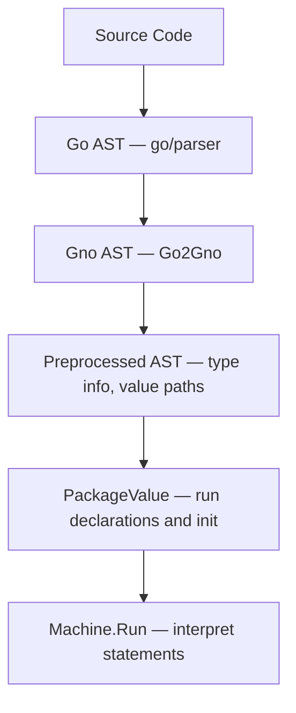

<!--
NOTE FOR ALL EDITORS

Any modifications done to this document must only consider the **present**
state of the project and the language, in order to be most useful to those who
intend to work with it, and thus refrain from lengthy considerations on its past
or any consideration on its future.

THIS IS IMPORTANT AS TOO OFTEN THE DOCUMENTS IN THIS REPOSITORY SAY "IN THE
FUTURE...". Nobody who wants to really build on top of Gno.land really needs to
know what was used in the past, or how some hypothetic future plans might change
some behaviours eventually.
-->
# The Gno Virtual Machine

The GnoVM is a stack-based virtual machine. It interprets a dialect of the Go
programming language called "Gno". Gno is designed to run deterministically, a
requirement for executing code on a blockchain (more often referred to as "smart
contracts"). Furthermore, Gno allows writing packages which directly expose
their exported symbols to usage by end-users and other smart contracts alike; in
this sense, Gno can be considered a "multi-user" language.
<!-- TODO: maybe multi-user can be explained better? -->

Unlike other blockchain platforms which store only compiled bytecode, the GnoVM
uses the original source code as its unit of deployment and source of truth,
with comments and formatting included. By building on an existing, popular
language, Gno also reduces the friction of starting to develop on the
blockchain. The changes Gno makes to Go are described in [Language
changes](#language-changes).

This document is meant as a thorough user guide to work with the Gno Virtual
Machine and fully understand its features and behavior. It covers the inner
workings of the virtual machine in detail, with the objective of being useful
and helpful to application developers. With this audience in mind, we will
simplify where necessary.

*Disclaimer: as an evolving project, the information here presented is not
guaranteed to be 100% up-to-date. Contributions to amend mistakes are
encouraged.*

## Architecture

The following diagram provides an overview of the journey of code in the GnoVM.
Below the diagram, each step is illustrated using the following example program:

```go
package main

func add(a, b int) int {
	  return a + b
}
```



1. **Go AST Parsing:** The GnoVM parses Go code using `go/parser`, the same
   parser used by Go.[^1]

```go
&ast.File{
    Name:  &ast.Ident{Name: "main"},
    Decls: []ast.Decl{
        &ast.FuncDecl{Name: &ast.Ident{Name: "add"}, ...},
    },
}
```

2. **AST Conversion:** The generated AST is converted into Gno's own AST, which
   simplifies some parts and includes data structures to hold type information
   for each AST node. Note how the structure is similar to the above, but uses
   gnolang's types instead.

```go
&gno.FileNode{
    FileName: "main.gno",
    PkgName:  "main",
    Decls:    gno.Decls{
        &gno.FuncDecl{NameExpr: gno.NameExpr{Name: "add"}, ...},
    },
}
```

3. **Preprocessing:** this stage enriches the Gno AST from the previous step, to
   statically check its code and add type information, and to prepare the AST
   for execution. The single `FuncDecl` from the above slice of `Decls` now
   contains information about its type.

```go
&gno.FuncDecl{
    NameExpr: gno.NameExpr{Name: "add"},
    Type: gno.FuncTypeExpr{
        // Attributes now set by preprocessing:
        //   ATTR_PREPROCESSED = true
        //   ATTR_TYPE_VALUE   = &FuncType{func(int, int) int}
        Params:  gno.FieldTypeExprs{{Name: "a", ...}, {Name: "b", ...}},
        Results: gno.FieldTypeExprs{{...}},
    },
}
```

4. **Package Initialization:** before a function in any package can be executed,
   the package itself must be initialized. This means evaluating its constants,
   global variables and `init()` functions, as done in Go.


```go
&gno.PackageValue{
    PkgName: "main",
    PkgPath: "gno.land/p/main",
    FNames:  []string{"main.gno"},
    FBlocks: []gno.Value{
        &gno.Block{
            Source: &gno.FileNode{
		            Decls: gno.Decls{&gno.FuncDecl{...}},
            },
        },
    },
}
```

5. **Execution:** when calling a function from a package, each statement of its
   body is executed. The VM interprets a statement by compiling it on-the-fly 
   into its individual operations (opcodes), then the expressions contained
   within are each evaluated to a concrete value.
   For the statement `return a + b` with `a=1, b=2`:

```
OpExec  'return a + b'   →  push OpReturn, then OpEval 'a + b'
OpEval  'a + b'          →  push OpAdd, then OpEval 'b', then OpEval 'a' (top of the stack evaluated first)
OpEval  'a'              →  push value 1
OpEval  'b'              →  push value 2
OpAdd                    →  pop 1 and 2, push 3
OpReturn                 →  return 3
```

The following sections explore each of these steps in detail, and how they
connect with the blockchain.

## The Gno language

The GnoVM and the gno.land chain support three different kinds of packages, which are distinguished on the base of their **package path**, often known in Go as just the import path.

- Pure packages are prefixed with `gno.land/p/`. They can be deployed to the chain, and after [package initialization](#package-initialization) they contain only global variables that are completely immutable. Furthermore, they may not contain [crossing functions](#functions-frames-and-blocks). They can only import other pure packages. All [standard library packages](#standard-library) are pure packages.
- Realms are prefixed with `gno.land/r/`. Their global variables are [persisted](#persistence-of-global-variables) and modifiable after package initialization, and may [interact with other realms](#cross-realm-interactions) and declare crossing functions. They may import realms and pure packages.
- Ephemeral packages are prefixed with `gno.land/e/`. They are "temporary execution environments"; their values are entirely discarded after execution and their values may as such not be persisted in a realm. They can import realms and pure packages. They cannot be imported.

The package path is controlled in local development through the [gnomod.toml](#gnomodtoml) file.

### Language changes

Here's a list of Go features which are currently not supported in Gno:

- Complex numbers (types `complex64` and `complex128`) are not supported, as
  well as their manipulation functions `real` and `imag`.
- The `uintptr` type also does not exist.
- Channel types are not supported, as such the send and receive syntax are not
  supported (`ch <- x`, `<- ch`) and the `select` statement.
- Built-in variables may not be shadowed; no user-defined identifier may be
  given names such as `int`, `error`, `append`, but also `realm` and `cross`
  defined in the [additional built-ins](#additional-built-ins).
- Dot imports (`import . "my/package"`) are not supported.
- The `unsafe` package is not present, and as such its features are not
  supported and Gno programs may generally not manipulate memory directly.
- Generics are not supported.

There are a set of new identifiers added into the built-ins of the language.
Those are described in the following section.

### Additional built-ins

These are the additional identifiers that are added to the [built-ins](https://pkg.go.dev/builtin) of the programming language.

#### type address

```go
type address string
```

A bech32 blockchain address. Can be converted to a `string`.

##### func (address) String

```go
func (a address) String() string
```

Simply converts `a` to a string.

##### func (address) IsValid

```go
func (a address) IsValid() bool
```

IsValid ensures that the address is a valid bech32 address.

#### type gnocoin

```go
type gnocoin struct {
	Denom string
	Amount int64
}
```

gnocoin contains an amount and denomination for a coin.

#### type gnocoins

```go
type gnocoins []gnocoin
```

gnocoins is a collection of gnocoin.

#### type realm

```go
type realm interface {
    Address() address
    PkgPath() string
    Coins() gnocoins
    Send(coins gnocoins, to address) error
    Previous() realm
    Origin() realm
    String() string
}
```

`realm` is used as the first argument for functions which support being called [cross-realm](#cross-realm-interactions). <!-- TODO: where can it be used in pure packages? -->

It currently only has one implementation, which panics on a function call of any of its methods with `"not yet implemented"`.

#### var cross

```go
var cross realm
```

cross is a special identifier used to [cross a realm boundary](#cross-realm-interactions). The function receiving a `cross` realm will receive a newly created `realm` value.

#### func attach

```go
func attach(xs ...any)
```

attach panics with `"attach() is not yet supported"`.

#### func crossing

```go
func crossing()
```

Reserved, deprecated identifier used in a previous version of [Cross-realm interactions](#cross-realm-interactions). Now simply panics.

#### func istypednil

```go
func istypednil(x any) bool
```

istypednil returns `true` if `x` is a nil pointer, slice, func, map or interface.[^2]

#### func revive

```go
func revive(fn func()) any
```

revive executes `fn` and recovers any panic occurring within it that crosses a [realm boundary](#cross-realm-interactions). This function is only available in the [test context](#test-context).

### Cross-realm interactions

While cross-realm interactions are a feature designed primarily for the multi-user ecosystem of the gno.land blockchain, their semantics and rules are implemented directly into the VM and also its local testing features (such as `gno test`), and as such it is important to be aware of them.

There is a [lengthier specification](https://github.com/gnolang/gno/blob/master/docs/resources/gno-interrealm.md) which goes into more details; in this document, we'll explain the highest level rules and feature of cross-realm interactions for the developer of Gno smart contracts.

- The Virtual Machine is said to contain an **active realm**.
	- A **realm** is considered to be any package which has a package path beginning with `gno.land/r/`. This is always known for a package deployed on a blockchain; during local development, it is generally controlled using the [gnomod.toml](#gnomodtoml) file.
- The active realm may always **cross** into another realm, or even into itself, through the use of a cross-realm function call. Crossing **changes the active realm**, and by doing so **crosses a realm boundary**, which is a pivotal element of cross-realm interaction.
- An **object** is a value which is individually and indivisibly stored in the [store](#storing-the-vms-data).
	- An object can be **owned** by a realm, in which case it is called a **real object**, or be not (yet) owned, in which case it is called an **unreal object**.
	- An object is the value of an array, struct, map or function (considering also the captured closure values), as well as the [`PackageValue`](#package-initialization) containing all of the global variables of the package.
	- Unreal objects are generally considered writable by any realm, while real objects only if the active realm is the same as the object's owner.
	- An object can be the **base** of a pointer (ie. to a specific index of the array or a field of a struct) or a slice (arrays most often represent the backing array of a slice rather than a proper array value). A value may be directly a base of itself.
	- When considering a function value for a **closure**, the values referenced within the closure will be considered as part of the function's value.
		- For instance, a closure value like `clos := func() string { return externalVariable }` will consider the `externalVariable` to be reachable by the FuncValue.
		- To help imagine this, it may be useful to think of closures as methods on a struct type, which contains references to all the external names used within the closure.
- When **returning from a realm boundary**, all **unreal objects** that are reachable through a descendant of the realm's main `PackageValue` become owned by the realm being crossed.
	- This happens when returning from a function which was called through a cross-realm function call.
	- This process is called **realm finalization**.
- A **cross-realm function call** is either of:
	- **Explicit crossing:** a call to a **crossing function**, which is a function whose first parameter is of the [`realm`](#type-realm) type and where the special identifier [`cross`](#var-cross) is passed for that parameter.
		- For instance, the function call `users.Register(cross, "example")` to `gno.land/r/users`'s function `func Register(cur realm, name string)`.
		- The active realm is switched to the realm where the function is declared.
		- Explicit crossing takes precedence over implicit crossing.
		- A crossing function calling another crossing function in the same realm may explicitly cross (with the `cross` identifier) OR remain in the same realm by using the `realm` value received as the first parameter.
	- **Implicit crossing:** a call to a method whose receiver's base is real and different from the current active realm.
		- The receiver's type may be defined in a pure package or a realm.
		- The active realm is switched to the realm which owns the receiver's base.
- By using functions provided in the [standard library](#standard-library), any function can get information about the **explicit current realm**, as well as the **explicit previous realm**.
	- This means that the two values, returned by `chain/runtime.CurrentRealm()` and `chain/runtime.PreviousRealm()`, are **only changed when performing an explicit crossing**; consequently, the explicit current realm may be different from the active realm and the explicit previous realm may be different from the realm being returned to when returning from a realm boundary.
- Any reference to a [qualified identifier](https://go.dev/ref/spec#Qualified_identifiers) (`package.Variable`) referring to a package which is of a different realm than the active realm will be marked using the **readonly taint**.
	- The readonly taint makes it impossible to overwrite the given value.
	- The readonly taint is set on the resulting value, but also on any other values derived from it (for instance, by accessing a field of a struct).
	- The readonly taint persists even if passing a reference to another realm to that same realm. For instance, calling `externalrealm.Call(cross, &externalrealm.Value)` still marks the second parameter as read-only, as it was obtained by the current active realm which cannot write to `externalrealm.Value`.
	- Methods can be used to allow modifications on their receivers, by using the implicit crossing mentioned above.
	- A realm can return a reference to something contained within it, which will **not** be tainted.
	- References include using a qualified identifier on the left-hand side of the assignment; for instance, writing `externalrealm.Value = 123` is illegal.

#### Principles for cross-realm development

While it is important to know the rules outlined above, day-to-day development is likely to be more effective when thinking of principles: corollaries, consequences of the above rules to keep in mind to develop safe multi-user realms.

- All functions which should be available as transactions by end-users should be crossing functions.
- A method can always modify its receiver, unless its signature is a crossing function.
- An unknown function (like a closure) must have a crossing signature, otherwise you are yielding control of your realm to it.
- Copying code from a pure package to a realm is generally safe.
- A realm may be a user of itself, by using the `cross` identifier, otherwise it should pass around the `cur` identifier received.
- Enforcing a value to be attached is possible by wrapping the assignment in a crossing call, like `func(cur realm) { global = value }(cross)`.

### gnomod.toml

### Standard library

## Program execution

As the compilation unit for Go is the package, a typical flow to run a function (like `main`) in a package is as follows:

- Organize the package's file in a common data structure, the `MemPackage`.
	- The `MemPackage` contains the package's name, and its individual file and filenames. It is either transmitted over the wire, as part of a blockchain message, or it is constructed by reading files in a filesystem.
- Create a `Machine` to run the code, with an adequate [execution context](#the-execution-context).
- Parse the AST, [preprocess](#preprocessing) it, and [initialize the package](#package-initialization) as explained in the [architecture diagram](#architecture).
- Optionally, [store the global variables and data of the package](#storing-the-vms-data).
- Parse and execute an expression, like a `main()` [function call](#functions-frames-and-blocks), to actually execute the code.

On the blockchain, all steps before the last are only done once, when the package is deployed. In this section, we will deal with the important features and moving parts of the virtual machine, whether or not running locally or on the blockchain.

### Preprocessing

Before we can execute the code from the AST, however, we need to enrich it with additional type information. This allows us to infer the type of variables, perform "compile-time" optimizations and generally leave the tree in a state where it's ready to be interpreted in the next step.

Here's a non-exhaustive summary of the most important features that are undertaken by the preprocessing step:

- **Initializing static blocks:** to aid runtime and eagerly compute as much information as possible, during preprocessing we create "static" blocks: a list of the identifiers declared in the block and the corresponding type of each; together with other supporting information (like whether the name is of another file, or whether it should be initialized as a separate value to be stored stand-alone, when [persisting data](#persistence-of-global-variables)).
	- [In another section](#functions-frames-and-blocks), we'll delve into how values at runtime are structured into the "blocks" where they are defined, which in turn determines the scope of each variable.
- **Converting identifiers to "Value Paths":** with the identifiers stored in the static block, we can convert all of the identifiers to a "pointer" to the block which will contain the name.
	- In practical terms, this means that during interpretation names are already resolved to the parent block that contains that value, and the index of the value in that block.
- **Evaluating constant expressions:** constant expressions (both `const` and expressions like `1 + 3` which can be evaluated to a static value) are computed and saved during preprocessing.
- **Assigning result types to all expressions:** all expression types are statically evaluated and their types checked for correctness; and this allows type inference to work and assign types to all identifiers.
- **Checking the correctness of cross-realm function calls:** Gno has specific syntax for [cross-realm interactions](#cross-realm-interactions); during preprocessing we ensure all functions that cross realm have a first `cur realm` parameter, and that they call other cross-realm functions using the `cross` built-in identifier.
- **Processing imports:** all imports to other packages are processed and linked during preprocessing.
- **Blocking use of reserved identifiers:** Gno doesn't allow to shadow built-in identifiers, like `int`, `append` or `string`, contrary to Go.

### Package initialization

Package initialization is the process through which the global variables of a package are first given a value, and as such a `PackageValue` is formed. There's two important parts about Go/Gno package initialization: the first are the global variables, the second are the `init` functions.

Similarly to Go, a package can define variables initialized with a value. Initialization happens recursively, so if a variable depends on other variables, those will be initialized first. However, similarly to Go, there can be no cyclical dependencies between variables (like `A` depending on `B`, but `B` also depending on `A`).

Following that, the `init` functions are called, following the lexical order of the files and they order they appear in the files, similarly as Go. Gno additionally allows init functions of the form `func init(cur realm)`. For more information, see [Cross-realm interactions](#cross-realm-interactions).

While all packages perform package initialization, in pure packages the global variables can no longer be modified after it, while realms allow variables to be modified. For more information, see [Persistence of global variables](#persistence-of-global-variables).

### Runtime interpretation

The GnoVM is tasked from external components to execute individual functions inside of a package. In a kind of way, it is a REPL that works on a package, and evaluates individual expressions like function calls in that context. This may be a simple `main()` function, like Go, but it can also be a call like `Render("")`, which is a common function present in realms.

The VM itself is a data structure that contains multiple stacks which control its behaviour:

- The **opcode stack** determines the list of enqueued operations the VM should execute. The executed opcodes are one of the main contributing factors in [gas metering](#gas-metering). The opcodes can be roughly divided into the following:
	- Control operations (`OpHalt`, `OpCall`, `OpReturn`, `OpIfCond`...), to change the control flow of the program.
	- Binary and unary operators (`OpAdd` for `+`, `OpMul` for `*`, `OpNeq` for `!=`, `UpUnot` for `!`...), that work on two or one values on the value stack, respectively.
	- Operations to execute expressions (`OpIndex1` for array, slice and map indexing, `OpRef` for `&a`, that is getting a pointer to a value, or determining the value of literals for array, slice, struct and map types, and many more)
	- Operations that perform definition and assignment to variables (`OpDefine` for `:=`, `OpAddAssign` for `+=`)
	- Operations to compile statements into their underlying expressions and operations (`OpExec`, and others); and evaluating expression into the values they represent (`OpEval`).
- The **statement stack** contains the statements that are next to be processed. These are processed by `OpExec`, though often other different opcodes are used to handle execution in the context of function bodies and for loops.
	- In many situations, instead of directly pushing all statements to the stack, the `Block` contains the proper AST body of the function, and that is used to progress through the code instead.
	- Most often, each statement is used to generate opcodes and expressions, and then the latter are evaluated into values.
- The **expression stack** contains the individual expressions that are to be evaluated.
- The **value stack** contains the raw values being operated on, which are then generally combined or transformed into other values using opcodes.
- The **block and frame stacks** keep track of the block (each individual block, made out of a pair of curly brackets) and the frame (the context of each function call, though the same structure is also used for `for` blocks and `switch` blocks).
- Other non-stack information ([the execution context](#the-execution-context), the [`PackageValue`](#package-initialization) currently being processed, the [gas meter](#gas-metering) and [the allocation tracker](#the-allocation-tracker-and-the-garbage-collector)).

### Functions, frames and blocks

Function calls in Gno are never inlined, so function calls to small function always incur the same cost of creating a new frame and stack as calling any other function.

If a function in a realm is declared as having `realm` as the first type (e.g. `func Register(cur realm, username string)`), it is considered a **crossing function**. This function is made available to be called directly by end-users on the blockchain. External realms calling this function have to pass the special identifier [`cross`](#var-cross), which is said to [cross a realm boundary](#cross-realm-interactions).

`panic` are more idiomatic as an erroring mechanism in Gno than in Go. Whenever a panic exits a [realm boundary](#cross-realm-interactions), it can no longer be recovered.

To still allow for testing of such packages, the `revive` built-in is introduced, only available in the [test context](#test-context). Contrary to `recover`, it accepts a single function parameter, and will return any panic value it has caught that was meant to abort a transaction.

```go
panicValue := revive(func() {
	otherRealm.Panic(cross)
})
// panicValue will contain the value which otherRealm.Panic has passed to `panic`.
```

### Calling foreign functions

Some functions in the virtual machine execute native Go code. These are defined in Gno as functions without a body (similarly to how Go defines functions written in assembly). No user-land functions are allowed to define native Go code, and to all intents and purposes the implementation of the functions is a core part of the language[^3], similar to the built-ins like `copy` and `append`.

Examples include:

- functions to interact with the [native banker](TODO: link)
- functions accessing runtime information, like calling realms, or the [execution context](#the-execution-context)
- setting system parameters, and cryptographic functions like `crypto/sha256.Sum256` or `crypto/ed25519.verify`, which would be expensive and slow to run in Gno
- data manipulations like `math.Float64frombits` which are not possible in native Gno code, as it doesn't provide an `unsafe` package.

A full list is available in this document at the [Appendix: Implemented native functions](#appendix-implemented-native-functions).

## Designed for blockchain

### Deterministic numbers

The architecture-dependent values `int` and `uint` always have a width of 64 bits on Gno. The other type that is architecture-dependent, `uintptr`, is [unsupported](#language-changes).

Floating point arithmetic is always software-emulated on Gno, as it is considered [non-deterministic across architectures](http://gafferongames.com/networking-for-game-programmers/floating-point-determinism/). The software emulation is based on an [internal set of functions](https://go.dev/src/runtime/softfloat64.go) used by the Go compiler itself for architectures which don't support floating point arithmetic.

### Persistence of global variables

### Storing the VM's data

### The allocation tracker and the garbage collector

### Gas metering

### The execution context

When executing a program, the GnoVM is given an "execution context"; a set of data available to the [native functions](#calling-foreign-functions) of the standard library, that allows to know more about the blockchain transaction.

The following fields are available (and as such expected by the [native functions referenced by the standard library](#appendix-implemented-native-functions)):

| Field             | Description                                                                                                         |
| ----------------- | ------------------------------------------------------------------------------------------------------------------- |
| `ChainID`         | A common identifier used among tendermint chains to distinguish between transactions meant for different chains.    |
| `ChainDomain`     | A gno.land-specific feature to allow for different chain domains other than "gno.land", relevant for package paths. |
| `Height`          | The block height of the chain.                                                                                      |
| `Timestamp`       | The block time, used as a return value for `time.Now()`.                                                            |
| `OriginCaller`    | Blockchain address of the caller of the transaction (explicitly set in the transaction message).                    |
| `OriginSend`      | Coins sent by the `OriginCaller` using specific fields in the transaction message (valid for a `MsgCall` message).  |
| `OriginSendSpent` | Amounts of coins spent from `OriginSend`.                                                                           |
| `Banker`          | Interface to access the chain's native banker module.                                                               |
| `Params`          | Interface to access the chain's native params module.                                                               |
| `EventLogger`     | Interface to emit transaction events.                                                                               |

## Tools

### Debugging the VM

### Go Type checking

In order to ship a working Virtual Machine as fast as possible while acknowledging that the development of a robust type checker and compiler like Go is a tough endeavour, we have a built-in system to perform type checking on packages using [go/types](https://pkg.go.dev/go/types). This allows us to not only leverage a more robust system, but also one that generally gives better error messages than what our preprocessor is currently capable of. During local development, this can be activated when using `gno test` and `gno lint`; on-chain, the type checker is always used as a first validation pass whenever submitting code through both of `addpkg` or `run` messages.

To validate go source code, the type checker contains uses some shims which are injected in all of the validated package's source, for the [additional built-ins](#additional-built-ins). These import a special internal package, `gnobuiltins/gno0p9`, not available normally, which contains shim definitions to support type checking.

### Test context

## Appendix: Implemented native functions

These are the functions which are declared without a corresponding body in the source code of the standard libraries, and whose behavior is implemented using native code:

### func chain.deriveStorageDepositAddr

```go
package chain // import "chain"

func deriveStorageDepositAddr(pkgPath string) string
```

deriveStorageDepositAddr returns the blockchain address where tokens are locked up for storing data on the realm with the given pkgPath. If pkgPath is the path of a MsgRun ephemeral package, the deployer's address is returned instead. It will panic if pkgPath is empty.

The logic to determine if a package path comes from MsgRun is thoroughly described in \[packageAddress].

In all other cases, the address is obtained with the following process:

  - A SHA-256 hash sum is calculated of the string "pkgPath:", concatenated with the given pkgPath, then additionally concatenated with the string ".storageDeposit".
  - The resulting hash is trimmed to its first 20 bytes (160 bits).
  - The resulting 20 bytes are encoded using bech32 encoding.

### func chain.packageAddress

```go
package chain // import "chain"

func packageAddress(pkgPath string) string
```

packageAddress returns the blockchain address associated with the given realm's pkgPath. If pkgPath is the path of a MsgRun ephemeral package, the deployer's address is returned instead. It will panic if pkgPath is empty.

The given package path is considered to be a MsgRun path only if:

  - It matches the following regular expression:

    ^(?P\<PKGPATH>(?:(?P\<DOMAIN>(?:(?P\<SLD>(?:(?:(?:\[a-z0-9-])+\\.)+))(?P\<TLD>(?:(?:\[a-z]){2,63}))))(?P\<URLPATH>(?:/(?P\<LETTER>(?:\[a-z]))/(?P\<USER>(?:(?:(?:\_)?\[a-z](?:\[a-z0-9\_])\*)))(?:/(?P\<REPO>(?:(?:(?:\_)?\[a-z](?:\[a-z0-9\_])\*)(?:/(?:(?:\_)?\[a-z](?:\[a-z0-9\_])\*))\*)))?))))$

  - The value of the LETTER capturing group from the above regular expression is "e".

  - The value of the REPO capturing group from the above regular expression is "run".

  - The value of the USER capturing group from the above regular expression matches the following regular expression:

    ^(?P\<ADDRESS>(?:g1(?:\[a-z0-9])+))$

If these rules are matched, the ADDRESS from the USER capturing group is returned.

In all other cases, the address is obtained with the following process:

  - A SHA-256 hash sum is calculated of the string "pkgPath:" concatenated with the given pkgPath.
  - The resulting hash is trimmed to its first 20 bytes (160 bits).
  - The resulting 20 bytes are encoded using bech32 encoding.

### func chain/banker.assertCallerIsRealm

```go
package banker // import "chain/banker"

func assertCallerIsRealm()
```

assertCallerIsRealm ensures that the caller of the function calling it has a realm pkgPath.

In order to be a realm, the caller's package path must match the following regular expression:

	^(?P<PKGPATH>(?:(?P<DOMAIN>(?:(?P<SLD>(?:(?:(?:[a-z0-9-])+\.)+))(?P<TLD>(?:(?:[a-z]){2,63}))))(?P<URLPATH>(?:/(?P<LETTER>(?:[a-z]))/(?P<USER>(?:(?:(?:_)?[a-z](?:[a-z0-9_])*)))(?:/(?P<REPO>(?:(?:(?:_)?[a-z](?:[a-z0-9_])*)(?:/(?:(?:_)?[a-z](?:[a-z0-9_])*))*)))?))))$

Additionally, the value of the LETTER capture group must be "r", and the REPO subgroup must not terminate in "\_test".

### func chain/banker.bankerGetCoins

```go
package banker // import "chain/banker"

func bankerGetCoins(addr string) (denoms []string, amounts []int64)
```

bankerGetCoins queries the banker module for the coins owned by the given addr. It returns the amounts and the denominations in two matching slices of the same size (ie., any amounts\[i] is specified in the corresponding denoms\[i]).

### func chain/banker.bankerIssueCoin

```go
package banker // import "chain/banker"

func bankerIssueCoin(addr string, denom string, amount int64)
```

bankerIssueCoin uses the banker module to issue (mint) the given amount of the coin with the given denom to the address specified in addr.

### func chain/banker.bankerRemoveCoin

```go
package banker // import "chain/banker"

func bankerRemoveCoin(addr string, denom string, amount int64)
```

bankerRemoveCoin uses the banker module to remove (burn) the given amount of the coin with the given denom from the address specified in addr.

### func chain/banker.bankerSendCoins

```go
package banker // import "chain/banker"

func bankerSendCoins(bt uint8, from, to string, denoms []string, amounts []int64)
```

bankerSendCoins uses the banker module to send the coins from the address "from" to the address "to". The coins are specified using two slices, denoms and amounts, which must be of the same size and specify for each amounts\[i], its matching denoms\[i].

The bt (banker type) parameter will be either of 1 (BankerTypeOriginSend), 2 (BankerTypeRealmSend), 3 (BankerTypeRealmIssue).

If the bt is 1, the implementation will only to be allowed to spend coins up to the maximum specified in the execution context value OriginSend. Furthermore, the already spent amounts should be kept track in OriginSendSpent.

All other validation is already performed by the banker Gno package.

### func chain/banker.bankerTotalCoin

```go
package banker // import "chain/banker"

func bankerTotalCoin(denom string) int64
```

bankerTotalCoin queries the banker module to determine the total supply of the coin with the given denom.

### func chain/banker.originSend

```go
package banker // import "chain/banker"

func originSend() (denoms []string, amounts []int64)
```

originSend returns the coins specified in the execution context variable OriginSend, which specifies the coins sent within the same transaction from the caller to the called realm. It returns the amounts and the denominations in two matching slices of the same size (ie., any amounts\[i] is specified in the corresponding denoms\[i]).

### func chain.emit

```go
package chain // import "chain"

func emit(typ string, attrs []string)
```


### func chain/params.SetBool

```go
package params // import "chain/params"

func SetBool(key string, val bool)
```


### func chain/params.SetBytes

```go
package params // import "chain/params"

func SetBytes(key string, val []byte)
```


### func chain/params.SetInt64

```go
package params // import "chain/params"

func SetInt64(key string, val int64)
```


### func chain/params.SetString

```go
package params // import "chain/params"

func SetString(key string, val string)
```


### func chain/params.SetStrings

```go
package params // import "chain/params"

func SetStrings(key string, val []string)
```


### func chain/params.SetUint64

```go
package params // import "chain/params"

func SetUint64(key string, val uint64)
```


### func chain/params.UpdateParamStrings

```go
package params // import "chain/params"

func UpdateParamStrings(key string, val []string, add bool)
```


### func chain/runtime.AssertOriginCall

```go
package runtime // import "chain/runtime"

func AssertOriginCall()
```

AssertOriginCall panics if the calling method is not invoked via a direct MsgCall. It panics for other cases, like if the calling method is invoked by another method (even from the same realm or package). It also panic every time when the transaction is broadcasted via MsgRun.

### func chain/runtime.ChainDomain

```go
package runtime // import "chain/runtime"

func ChainDomain() string
```


### func chain/runtime.ChainHeight

```go
package runtime // import "chain/runtime"

func ChainHeight() int64
```


### func chain/runtime.ChainID

```go
package runtime // import "chain/runtime"

func ChainID() string
```


### func chain/runtime.getRealm

```go
package runtime // import "chain/runtime"

func getRealm(height int) (address string, pkgPath string)
```


### func chain/runtime.originCaller

```go
package runtime // import "chain/runtime"

func originCaller() string
```

Variations which don't use named types.

### func crypto/ed25519.verify

```go
package ed25519 // import "crypto/ed25519"

func verify(publicKey []byte, message []byte, signature []byte) bool
```


### func crypto/sha256.sum256

```go
package sha256 // import "crypto/sha256"

func sum256(data []byte) [32]byte
```


### func math.Float32bits

```go
package math // import "math"

func Float32bits(f float32) uint32
```

Float32bits returns the IEEE 754 binary representation of f, with the sign bit of f and the result in the same bit position. Float32bits(Float32frombits(x)) == x.

### func math.Float32frombits

```go
package math // import "math"

func Float32frombits(b uint32) float32
```

Float32frombits returns the floating-point number corresponding to the IEEE 754 binary representation b, with the sign bit of b and the result in the same bit position. Float32frombits(Float32bits(x)) == x.

### func math.Float64bits

```go
package math // import "math"

func Float64bits(f float64) uint64
```

Float64bits returns the IEEE 754 binary representation of f, with the sign bit of f and the result in the same bit position. Float64bits(Float64frombits(x)) == x.

### func math.Float64frombits

```go
package math // import "math"

func Float64frombits(b uint64) float64
```

Float64frombits returns the floating-point number corresponding to the IEEE 754 binary representation b, with the sign bit of b and the result in the same bit position. Float64frombits(Float64bits(x)) == x.

### func runtime.GC

```go
package runtime // import "runtime"

func GC()
```


### func runtime.MemStats

```go
package runtime // import "runtime"

func MemStats() string
```


### func sys/params.setSysParamBool

```go
package params // import "sys/params"

func setSysParamBool(module, submodule, name string, val bool)
```


### func sys/params.setSysParamBytes

```go
package params // import "sys/params"

func setSysParamBytes(module, submodule, name string, val []byte)
```


### func sys/params.setSysParamInt64

```go
package params // import "sys/params"

func setSysParamInt64(module, submodule, name string, val int64)
```


### func sys/params.setSysParamString

```go
package params // import "sys/params"

func setSysParamString(module, submodule, name string, val string)
```


### func sys/params.setSysParamStrings

```go
package params // import "sys/params"

func setSysParamStrings(module, submodule, name string, val []string)
```


### func sys/params.setSysParamUint64

```go
package params // import "sys/params"

func setSysParamUint64(module, submodule, name string, val uint64)
```


### func sys/params.updateSysParamStrings

```go
package params // import "sys/params"

func updateSysParamStrings(module, submodule, name string, val []string, add bool)
```


### func time.now

```go
package time // import "time"

func now() (sec int64, nsec int32, mono int64)
```


### func time.loadFromEmbeddedTZData

```go
package time // import "time"

func loadFromEmbeddedTZData(name string) ([]byte, bool)
```


[^1]: It actually uses a version of the parser with some slight patches, to make sure we count gas for computationally-intensive AST trees.

[^2]: This addresses a [common pain-point in Go](https://github.com/golang/go/issues/24635) as identified by the lead author of the Gno project.

[^3]: Meaning that any alternative implementation that wishes to execute Gno code must implement and execute these functions exactly as in the GnoVM's implementation.
