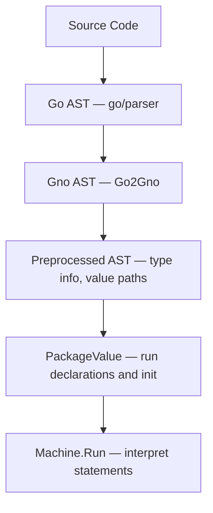

<!--
NOTE FOR ALL EDITORS

Any modifications done to this document must only consider the **present**
state of the project and the language, in order to be most useful to those who
intend to work with it, and thus refrain from lengthy considerations on its past
or any consideration on its future.

THIS IS IMPORTANT AS TOO OFTEN THE DOCUMENTS IN THIS REPOSITORY SAY "IN THE
FUTURE...". Nobody who wants to really build on top of Gno.land really needs to
know what was used in the past, or how some hypothetic future plans might change
some behaviours eventually.
-->
# The Gno Virtual Machine

The GnoVM is a stack-based virtual machine. It interprets a dialect of the Go
programming language called "Gno". Gno is designed to run deterministically, a
requirement for executing code on a blockchain (more often referred to as "smart
contracts"). Furthermore, Gno allows writing packages which directly expose
their exported symbols to usage by end-users and other smart contracts alike; in
this sense, Gno can be considered a "multi-user" language.
<!-- TODO: maybe multi-user can be explained better? -->

Unlike other blockchain platforms which store only compiled bytecode, the GnoVM
uses the original source code as its unit of deployment and source of truth,
with comments and formatting included. By building on an existing, popular
language, Gno also reduces the friction of starting to develop on the
blockchain. The changes Gno makes to Go are described in [Language
changes](#language-changes).

This document is meant as a thorough user guide to work with the Gno Virtual
Machine and fully understand its features and behavior. It covers the inner
workings of the virtual machine in detail, with the objective of being useful
and helpful to application developers. With this audience in mind, we will
simplify where necessary.

*Disclaimer: as an evolving project, the information here presented is not
guaranteed to be 100% up-to-date. Contributions to amend mistakes are
encouraged.*

## Architecture

The following diagram provides an overview of the journey of code in the GnoVM.
Below the diagram, each step is illustrated using the following example program:

```go
package main

func add(a, b int) int {
	  return a + b
}
```



1. **Go AST Parsing:** The GnoVM parses Go code using `go/parser`, the same
   parser used by Go.[^1]

```go
&ast.File{
    Name:  &ast.Ident{Name: "main"},
    Decls: []ast.Decl{
        &ast.FuncDecl{Name: &ast.Ident{Name: "add"}, ...},
    },
}
```

2. **AST Conversion:** The generated AST is converted into Gno's own AST, which
   simplifies some parts and includes data structures to hold type information
   for each AST node. Note how the structure is similar to the above, but uses
   gnolang's types instead.

```go
&gno.FileNode{
    FileName: "main.gno",
    PkgName:  "main",
    Decls:    gno.Decls{
        &gno.FuncDecl{NameExpr: gno.NameExpr{Name: "add"}, ...},
    },
}
```

3. **Preprocessing:** this stage enriches the Gno AST from the previous step, to
   statically check its code and add type information, and to prepare the AST
   for execution. The single `FuncDecl` from the above slice of `Decls` now
   contains information about its type.

```go
&gno.FuncDecl{
    NameExpr: gno.NameExpr{Name: "add"},
    Type: gno.FuncTypeExpr{
        // Attributes now set by preprocessing:
        //   ATTR_PREPROCESSED = true
        //   ATTR_TYPE_VALUE   = &FuncType{func(int, int) int}
        Params:  gno.FieldTypeExprs{{Name: "a", ...}, {Name: "b", ...}},
        Results: gno.FieldTypeExprs{{...}},
    },
}
```

4. **Package Initialization:** before a function in any package can be executed,
   the package itself must be initialized. This means evaluating its constants,
   global variables and `init()` functions, as done in Go.


```go
&gno.PackageValue{
    PkgName: "main",
    PkgPath: "gno.land/p/main",
    FNames:  []string{"main.gno"},
    FBlocks: []gno.Value{
        &gno.Block{
            Source: &gno.FileNode{
                Decls: gno.Decls{&gno.FuncDecl{...}},
            },
        },
    },
}
```

5. **Execution:** when calling a function from a package, each statement of its
   body is executed. The VM interprets a statement by compiling it on-the-fly 
   into its individual operations (opcodes), then the expressions contained
   within are each evaluated to a concrete value.
   For the statement `return a + b` with `a=1, b=2`:

```
OpExec  'return a + b'   →  push OpReturn, then OpEval 'a + b'
OpEval  'a + b'          →  push OpAdd, then OpEval 'b', then OpEval 'a' (top of the stack evaluated first)
OpEval  'a'              →  push value 1
OpEval  'b'              →  push value 2
OpAdd                    →  pop 1 and 2, push 3
OpReturn                 →  return 3
```

The following sections explore each of these steps in detail, and how they
connect with the blockchain.

## The Gno language

Gno builds on Go with targeted changes for determinism and multi-user
interaction. In this section, we deal with the fundamental changes to the
language, which are important to keep in mind when working with Gno. They're
also useful grounding concepts to know to better grasp the following sections,
which delve deeper into how the virtual machine is implemented.

### Language changes

The following are the key differences between Gno and Go:

- Complex numbers (`complex64`, `complex128`) and the related built-ins `real`
  and `imag` are not supported.
- The `uintptr` type does not exist.
- Channel types are not supported. Consequently, the send and receive operators
  (`ch <- x`, `<-ch`) and the `select` statement are also absent.
- Built-in identifiers may not be shadowed; no user-defined identifier may be
  given names such as `int`, `error`, `append`, but also `realm` and `cross`
  defined in the [additional built-ins](#additional-built-ins).
- Dot imports (`import . "my/package"`) are not supported.
- The `unsafe` package is not present; Gno programs cannot manipulate memory
  directly.
- Generics are not supported.

Gno adds a set of new built-in identifiers, described in
[Additional built-ins](#additional-built-ins).

### Package types

The GnoVM supports three different kinds of packages, which are distinguished by
their **package path**, often known in Go as just the import path. The second
element of their path, composed of just one character, is simply referred to as
the _letter_. For instance, in "gno.land/r/john/doe", the letter is "r".

- **Pure packages** use the letter `p`. After [package
  initialization](#package-initialization), their global variables become
  immutable. They may not contain [crossing
  functions](#cross-realm-interactions). They can only import other pure
  packages. All [standard library packages](#standard-library) are pure
  packages.
- **Realms** use the letter `r`. Their global variables are
  [persisted](#persistence-of-global-variables) and remain modifiable after
  package initialization. They may [interact with other
  realms](#cross-realm-interactions) and declare crossing functions. They can
  import realms and pure packages.
- **Ephemeral packages** use the letter `e`. All values are discarded after
  execution and cannot be persisted in a realm. They can import realms and pure
  packages, but cannot themselves be imported.

The package path is controlled in local development through the
[gnomod.toml](#gnomodtoml) file.

### Additional built-ins

These are the identifiers Gno adds to Go's
[built-ins](https://pkg.go.dev/builtin).

#### type address

```go
type address string
```

A bech32 blockchain address. Can be converted to a `string`.

##### func (address) String

```go
func (a address) String() string
```

Simply converts `a` to a string.

##### func (address) IsValid

```go
func (a address) IsValid() bool
```

IsValid returns whether `a` is a valid bech32 address with a 20-byte payload.

#### type gnocoin

```go
type gnocoin struct {
	Denom string
	Amount int64
}
```

gnocoin contains an amount and denomination for a coin.

#### type gnocoins

```go
type gnocoins []gnocoin
```

gnocoins is a collection of gnocoin.

#### type realm

```go
type realm interface {
    Address() address
    PkgPath() string
    Coins() gnocoins
    Send(coins gnocoins, to address) error
    Previous() realm
    Origin() realm
    String() string
}
```

`realm` is used as the first argument for functions which support being called
[cross-realm](#cross-realm-interactions). The type can also be used in pure
packages as a variable, struct field, or non-first parameter; the only
restriction is that pure packages may not declare crossing functions.

The implementation provided by the GnoVM when `cross` is passed to a crossing
function currently panics on all methods with `"not yet implemented"`.

#### var cross

```go
var cross realm
```

cross is a special identifier used to [cross a realm
boundary](#cross-realm-interactions). The function receiving a `cross` realm
will receive a newly created `realm` value.

#### func attach

```go
func attach(xs ...any)
```

attach panics with `"attach() is not yet supported"`.

#### func crossing

```go
func crossing()
```

Reserved, deprecated identifier used in a previous version of [Cross-realm
interactions](#cross-realm-interactions). Panics with `"crossing() is reserved
but deprecated"`.

#### func istypednil

```go
func istypednil(x any) bool
```

istypednil returns `true` if `x` is a typed nil -- that is, an interface value
holding a nil pointer, slice, func, or map. It returns `false` for an untyped
nil (`interface{}(nil)`).[^2]

#### func revive

```go
func revive(fn func()) any
```

revive executes `fn` and recovers any panic occurring within it that crosses a
[realm boundary](#cross-realm-interactions). This function is only available in
the [test context](#test-context). Note that currently, `revive` does not roll
back state mutations performed by `fn` before the panic; any side effects on
global variables will persist.

### Cross-realm interactions

Cross-realm interactions allow realms to call into each other while enforcing
ownership and write-access rules. Their semantics are implemented directly in
the VM and are also available in local testing (via `gno test`).

A [lengthier specification](./gno-interrealm.md) goes into more detail; here we
explain the high-level rules and features for the developer of Gno smart
contracts.

- The Virtual Machine contains an **active realm**.
	- A **realm** is any package whose [letter](#package-types) in the package
	  path is `r`. This is always known for a package deployed on a blockchain;
	  during local development, it is generally controlled using the
	  [gnomod.toml](#gnomodtoml) file.
- The active realm may **cross** into another realm, or even into itself,
  through the use of a cross-realm function call. Crossing **changes the active
  realm**, and by doing so **crosses a realm boundary**, which is a pivotal
  element of cross-realm interaction.
- An **object** is a value which is individually and indivisibly stored in the
  [store](#storing-the-vms-data).
	- An object can be **owned** by a realm, in which case it is called a **real
	  object**, or not yet owned, in which case it is called an **unreal object**.
	- Arrays, structs, maps, and functions (including captured closure values) are
	  objects. The [`PackageValue`](#package-initialization) containing all of the
	  global variables of the package is also an object.
	- Unreal objects are generally considered writable by any realm, while real
	  objects are writable only if the active realm is the same as the object's
	  owner.
	- An object can be the **base** of a pointer or a slice. A value may be
	  directly a base of itself.
		- A pointer's base is the object containing the pointed-to element (e.g. a
		  specific index of an array or a field of a struct).
		- A slice's base is the backing array. Arrays most often represent the
		  backing array of a slice rather than a proper array value.
	- When considering a function value for a **closure**, the values referenced
	  within the closure will be considered as part of the function's value.
		- For instance, a closure value like `clos := func() string { return
		  externalVariable }` will consider the `externalVariable` to be reachable
		  by the FuncValue.
		- To help imagine this, it may be useful to think of closures as methods on
		  a struct type that contains references to all the external names used
		  within the closure.
- When **returning from a realm boundary**, all **unreal objects** that are
  reachable through a descendant of the realm's main `PackageValue` become owned
  by the realm that was crossed into.
	- This happens when returning from a function which was called through a
	  cross-realm function call.
	- This process is called **realm finalization**.
- A **cross-realm function call** can be:
	- **Explicit crossing:** a call to a **crossing function**, which is a
	  function whose first parameter is of the [`realm`](#type-realm) type and
	  where the special identifier [`cross`](#var-cross) is passed for that
	  parameter.
		- For instance, the function call `users.Register(cross, "example")` to
		  `gno.land/r/users`'s function `func Register(cur realm, name string)`.
		- The active realm is switched to the realm where the function is declared.
		- Explicit crossing takes precedence over implicit crossing.
		- A crossing function calling another crossing function in the same realm
		  may explicitly cross (with the `cross` identifier) OR remain in the same
		  realm by using the `realm` value received as the first parameter.
	- **Implicit crossing:** a call to a method whose receiver's base is real and
	  different from the current active realm.
		- The receiver's type may be defined in a pure package or a realm.
		- The active realm is switched to the realm which owns the receiver's base.
- The [standard library](#standard-library) exposes the **explicit current
  realm** and the **explicit previous realm**.
	- The two values, returned by `chain/runtime.CurrentRealm()` and
	  `chain/runtime.PreviousRealm()`, are **only changed when performing an
	  explicit crossing**. Consequently, the explicit current realm may be
	  different from the active realm, and the explicit previous realm may be
	  different from the realm being returned to when returning from a realm
	  boundary.
- Any reference to a [qualified
  identifier](https://go.dev/ref/spec#Qualified_identifiers)
  (`package.Variable`) referring to a package which is of a different realm than
  the active realm will be marked using the **readonly taint**.
	- The readonly taint makes it impossible to overwrite the given value.
	- The readonly taint is set on the resulting value, but also on any other
	  values derived from it (for instance, by accessing a field of a struct).
	- The readonly taint persists even when passing a tainted reference back to
	  the realm that owns it. For instance, calling `externalrealm.Call(cross,
	  &externalrealm.Value)` still marks the second parameter as read-only, as it
	  was obtained by the current active realm which cannot write to
	  `externalrealm.Value`.
	- Methods can be used to allow modifications on their receivers, by using the
	  implicit crossing mentioned above.
	- A realm can return a reference to something contained within it, which will
	  **not** be tainted.
	- Assignment targets are also tainted; for instance, writing
	  `externalrealm.Value = 123` is illegal.

#### Principles for cross-realm development

While it is important to know the rules outlined above, day-to-day development
is likely to be more effective when thinking of principles: corollaries of the
above rules for developing safe multi-user realms.

- All functions which should be available as transactions by end-users should be
  crossing functions.
- A method can always modify its receiver, unless its signature is a crossing
  function.
- An unknown function (like a closure) must have a crossing signature, otherwise
  you are yielding control of your realm to it.
- Copying code from a pure package to a realm is generally safe.
- A realm may be a user of itself, by using the `cross` identifier, otherwise it
  should pass around the `cur` identifier received.
- Forcing a value to become owned by the realm is possible by wrapping the
  assignment in a crossing call, like `func(cur realm) { global = value
  }(cross)`. This triggers [realm finalization](#cross-realm-interactions) and
  makes the value a real object.

### gnomod.toml

Every Gno package has a `gnomod.toml` file that defines its module path and
metadata. It is typically generated with `gno mod init <pkgpath>`.

The following fields are available:

- **`module`** (string, required): the package path, e.g.
  `"gno.land/r/demo/counter"`. Determines whether the package is a [pure
  package, realm, or ephemeral package](#package-types).
- **`gno`** (string): the Gno language version. Currently `"0.9"`.
- **`draft`** (bool): marks the package as a draft. Draft packages can only be
  added at genesis and cannot be imported by newly deployed packages.
- **`private`** (bool): marks the package as private. Private packages cannot be
  imported by other realms, and objects they own cannot be retained in external
  realms.
- **`ignore`** (bool): the package is ignored by the Gno toolchain but remains
  usable in development environments.
- **`replace`** (array of `{old, new}`): intended to redirect an import
  path to another module or a local directory for local development.
  Not yet functional in the toolchain. **A package with `replace`
  directives cannot be deployed on-chain.**
- **`[addpkg]`** (table): populated automatically by the chain when the package
  is deployed. Contains `creator` (deployer address) and `height` (block height
  at deployment). This field should not be set manually.

A minimal example:

```toml
module = "gno.land/p/demo/avl"
gno = "0.9"
```

A realm with the draft flag:

```toml
module = "gno.land/r/demo/draftrealm"
gno = "0.9"
draft = true
```

For the full specification of each field and advanced usage (including `replace`
syntax and deployment workflows), see [Configuring Gno
Projects](configuring-gno-projects.md).

### Standard library

## Program execution

As the compilation unit for Go is the package, a typical flow to run a function (like `main`) in a package is as follows:

- Organize the package's file in a common data structure, the `MemPackage`.
	- The `MemPackage` contains the package's name, and its individual file and filenames. It is either transmitted over the wire, as part of a blockchain message, or it is constructed by reading files in a filesystem.
- Create a `Machine` to run the code, with an adequate [execution context](#the-execution-context).
- Parse the AST, [preprocess](#preprocessing) it, and [initialize the package](#package-initialization) as explained in the [architecture diagram](#architecture).
- Optionally, [store the global variables and data of the package](#storing-the-vms-data).
- Parse and execute an expression, like a `main()` [function call](#functions-frames-and-blocks), to actually execute the code.

On the blockchain, all steps before the last are only done once, when the package is deployed. In this section, we will deal with the important features and moving parts of the virtual machine, whether or not running locally or on the blockchain.

### Preprocessing

Before we can execute the code from the AST, however, we need to enrich it with additional type information. This allows us to infer the type of variables, perform "compile-time" optimizations and generally leave the tree in a state where it's ready to be interpreted in the next step.

Here's a non-exhaustive summary of the most important features that are undertaken by the preprocessing step:

- **Initializing static blocks:** to aid runtime and eagerly compute as much information as possible, during preprocessing we create "static" blocks: a list of the identifiers declared in the block and the corresponding type of each; together with other supporting information (like whether the name is of another file, or whether it should be initialized as a separate value to be stored stand-alone, when [persisting data](#persistence-of-global-variables)).
	- [In another section](#functions-frames-and-blocks), we'll delve into how values at runtime are structured into the "blocks" where they are defined, which in turn determines the scope of each variable.
- **Converting identifiers to "Value Paths":** with the identifiers stored in the static block, we can convert all of the identifiers to a "pointer" to the block which will contain the name.
	- In practical terms, this means that during interpretation names are already resolved to the parent block that contains that value, and the index of the value in that block.
- **Evaluating constant expressions:** constant expressions (both `const` and expressions like `1 + 3` which can be evaluated to a static value) are computed and saved during preprocessing.
- **Assigning result types to all expressions:** all expression types are statically evaluated and their types checked for correctness; and this allows type inference to work and assign types to all identifiers.
- **Checking the correctness of cross-realm function calls:** Gno has specific syntax for [cross-realm interactions](#cross-realm-interactions); during preprocessing we ensure all functions that cross realm have a first `cur realm` parameter, and that they call other cross-realm functions using the `cross` built-in identifier.
- **Processing imports:** all imports to other packages are processed and linked during preprocessing.
- **Blocking use of reserved identifiers:** Gno doesn't allow to shadow built-in identifiers, like `int`, `append` or `string`, contrary to Go.

### Package initialization

Package initialization is the process through which the global variables of a package are first given a value, and as such a `PackageValue` is formed. There's two important parts about Go/Gno package initialization: the first are the global variables, the second are the `init` functions.

Similarly to Go, a package can define variables initialized with a value. Initialization happens recursively, so if a variable depends on other variables, those will be initialized first. However, similarly to Go, there can be no cyclical dependencies between variables (like `A` depending on `B`, but `B` also depending on `A`).

Following that, the `init` functions are called, following the lexical order of the files and they order they appear in the files, similarly as Go. Gno additionally allows init functions of the form `func init(cur realm)`. For more information, see [Cross-realm interactions](#cross-realm-interactions).

While all packages perform package initialization, in pure packages the global variables can no longer be modified after it, while realms allow variables to be modified. For more information, see [Persistence of global variables](#persistence-of-global-variables).

### Runtime interpretation

The GnoVM is tasked from external components to execute individual functions inside of a package. In a kind of way, it is a REPL that works on a package, and evaluates individual expressions like function calls in that context. This may be a simple `main()` function, like Go, but it can also be a call like `Render("")`, which is a common function present in realms.

The VM itself is a data structure that contains multiple stacks which control its behaviour:

- The **opcode stack** determines the list of enqueued operations the VM should execute. The executed opcodes are one of the main contributing factors in [gas metering](#gas-metering). The opcodes can be roughly divided into the following:
	- Control operations (`OpHalt`, `OpCall`, `OpReturn`, `OpIfCond`...), to change the control flow of the program.
	- Binary and unary operators (`OpAdd` for `+`, `OpMul` for `*`, `OpNeq` for `!=`, `UpUnot` for `!`...), that work on two or one values on the value stack, respectively.
	- Operations to execute expressions (`OpIndex1` for array, slice and map indexing, `OpRef` for `&a`, that is getting a pointer to a value, or determining the value of literals for array, slice, struct and map types, and many more)
	- Operations that perform definition and assignment to variables (`OpDefine` for `:=`, `OpAddAssign` for `+=`)
	- Operations to compile statements into their underlying expressions and operations (`OpExec`, and others); and evaluating expression into the values they represent (`OpEval`).
- The **statement stack** contains the statements that are next to be processed. These are processed by `OpExec`, though often other different opcodes are used to handle execution in the context of function bodies and for loops.
	- In many situations, instead of directly pushing all statements to the stack, the `Block` contains the proper AST body of the function, and that is used to progress through the code instead.
	- Most often, each statement is used to generate opcodes and expressions, and then the latter are evaluated into values.
- The **expression stack** contains the individual expressions that are to be evaluated.
- The **value stack** contains the raw values being operated on, which are then generally combined or transformed into other values using opcodes.
- The **block and frame stacks** keep track of the block (each individual block, made out of a pair of curly brackets) and the frame (the context of each function call, though the same structure is also used for `for` blocks and `switch` blocks).
- Other non-stack information ([the execution context](#the-execution-context), the [`PackageValue`](#package-initialization) currently being processed, the [gas meter](#gas-metering) and [the allocation tracker](#the-allocation-tracker-and-the-garbage-collector)).

### Functions, frames and blocks

Function calls in Gno are never inlined, so function calls to small function always incur the same cost of creating a new frame and stack as calling any other function.

If a function in a realm is declared as having `realm` as the first type (e.g. `func Register(cur realm, username string)`), it is considered a **crossing function**. This function is made available to be called directly by end-users on the blockchain. External realms calling this function have to pass the special identifier [`cross`](#var-cross), which is said to [cross a realm boundary](#cross-realm-interactions).

`panic` are more idiomatic as an erroring mechanism in Gno than in Go. Whenever a panic exits a [realm boundary](#cross-realm-interactions), it can no longer be recovered.

To still allow for testing of such packages, the `revive` built-in is introduced, only available in the [test context](#test-context). Contrary to `recover`, it accepts a single function parameter, and will return any panic value it has caught that was meant to abort a transaction.

```go
panicValue := revive(func() {
	otherRealm.Panic(cross)
})
// panicValue will contain the value which otherRealm.Panic has passed to `panic`.
```

### Calling foreign functions

Some functions in the virtual machine execute native Go code. These are defined in Gno as functions without a body (similarly to how Go defines functions written in assembly). No user-land functions are allowed to define native Go code, and to all intents and purposes the implementation of the functions is a core part of the language[^3], similar to the built-ins like `copy` and `append`.

Examples include:

- functions to interact with the [native banker](TODO: link)
- functions accessing runtime information, like calling realms, or the [execution context](#the-execution-context)
- setting system parameters, and cryptographic functions like `crypto/sha256.Sum256` or `crypto/ed25519.verify`, which would be expensive and slow to run in Gno
- data manipulations like `math.Float64frombits` which are not possible in native Gno code, as it doesn't provide an `unsafe` package.

A full list is available in this document at the [Appendix: Implemented native functions](#appendix-implemented-native-functions).

## Designed for blockchain

### Deterministic numbers

The architecture-dependent values `int` and `uint` always have a width of 64 bits on Gno. The other type that is architecture-dependent, `uintptr`, is [unsupported](#language-changes).

Floating point arithmetic is always software-emulated on Gno, as it is considered [non-deterministic across architectures](http://gafferongames.com/networking-for-game-programmers/floating-point-determinism/). The software emulation is based on an [internal set of functions](https://go.dev/src/runtime/softfloat64.go) used by the Go compiler itself for architectures which don't support floating point arithmetic.

### Persistence of global variables

The GnoVM distinguishes between pure packages and realms when it
comes to global variable persistence:

- **Pure packages** (`gno.land/p/`): after
  [package initialization](#package-initialization), all global
  variables are frozen. Any attempt to modify them results in a
  panic.
- **Realms** (`gno.land/r/`): global variables are automatically
  persisted to the store at the end of every realm transaction and
  restored on subsequent calls. This is what makes realms
  "stateful".

#### Realm finalization

When a function returns across a
[realm boundary](#cross-realm-interactions), the VM performs
**realm finalization**
(`Realm.FinalizeRealmTransaction`). This is the process that
decides which objects to create, update, or delete in the
[store](#storing-the-vms-data).

During normal execution, the `Realm.DidUpdate` hook fires whenever
a real object's child reference changes. `DidUpdate` receives
three arguments: the parent object `po`, the old child `xo`, and
the new child `co`. It performs the following bookkeeping:

- The parent is marked **dirty**.
- If the new child `co` is unreal (not yet persisted), it is
  assigned an owner and marked **new-real** (appended to the
  realm's `newCreated` list).
- If the new child `co` already exists and gains a second
  reference (`RefCount > 1`), it is marked **new-escaped**.
- If the old child `xo` loses its last reference
  (`RefCount == 0`), it is marked **new-deleted**.

At finalization time, these marks are processed in order:

1. **Process new-created marks:** crawl all newly created objects
   and their descendants, assign each an `ObjectID`, and increment
   reference counts recursively.
2. **Process new-deleted marks:** crawl deleted objects and their
   descendants, decrementing reference counts recursively.
3. **Process new-escaped marks:** for objects whose reference
   count settled back to 1 after the above steps, demote them
   from escaped status.
4. **Mark dirty ancestors:** walk the ownership chain from every
   created or updated object up to the root `PackageValue`,
   marking each ancestor dirty.
5. **Save unsaved objects:** persist all created and updated
   (dirty) objects to the store.
6. **Save new-escaped objects:** write escaped-object hashes to
   the IAVL store for merkle proofs.
7. **Remove deleted objects:** delete objects from the store.
8. **Clear marks:** reset all transient marks for the next
   transaction.

#### What is persisted

The following value types are individually stored as objects:
`PackageValue`, `Block`, `ArrayValue`, `StructValue`, `MapValue`,
`FuncValue` (including captured closure values),
`BoundMethodValue`, and `HeapItemValue`. Each object carries an
`ObjectInfo` that tracks its `ObjectID`, owner, reference count,
and dirty/escaped/deleted flags.

For details on how these objects are serialized and keyed in the
backing store, see [Storing the VM's data](#storing-the-vms-data).

### Storing the VM's data

The `Store` interface is the bridge between the GnoVM and the
underlying key-value storage (typically backed by the blockchain's
state tree).

#### What is stored

The store manages four categories of data:

- **Objects:** the persistent values described in
  [Persistence of global variables](#persistence-of-global-variables)
  (`PackageValue`, `Block`, `ArrayValue`, `StructValue`,
  `MapValue`, `FuncValue`, `BoundMethodValue`, `HeapItemValue`).
- **Types:** runtime type descriptors, keyed by `TypeID` (a
  deterministic string representation of the type).
- **Block nodes:** the AST node associated with each `Block`,
  keyed by source `Location`.
- **MemPackages:** the original source code of deployed packages,
  including all `.gno` files.

#### Object identity

Every persisted object is identified by an `ObjectID`:

```go
type ObjectID struct {
    PkgID   PkgID  // SHA256 hash of the package path
    NewTime uint64  // monotonic counter per realm
}
```

`PkgID` is derived from the package path by computing
`SHA256(path)`. `NewTime` is a counter maintained by the realm
and incremented each time a new object is created. The
`PackageValue` itself always has `NewTime = 1`.

#### Serialization

Objects are serialized using the **Amino** binary codec (the same
codec used throughout Tendermint2). Before encoding, all child
object references within a value are replaced by `RefValue`
placeholders:

```go
type RefValue struct {
    ObjectID ObjectID  // identity of the referenced object
    PkgPath  string    // set for package references
    Hash     ValueHash // SHA256 of the referenced object
}
```

After marshaling, a SHA256 hash of the serialized bytes is
prepended, so the stored byte sequence is `hash || amino_bytes`.
This hash is used for integrity checks and merkle proofs.

#### Backing stores and key layout

The `defaultStore` uses two backing stores:

- **baseStore:** holds all objects, types, block nodes, and
  packages. Keys use the following prefixes:
  - `oid:<pkgid_hex>:<newtime>` for objects
  - `tid:<typeid_string>` for types
  - `node:<location_string>` for block nodes
  - `pkgidx:` for package index entries
- **iavlStore:** holds hashes of escaped objects (those with
  `RefCount > 1`), enabling merkle proof generation for
  cross-referenced values.

#### Caching

The store maintains several caches to minimize disk reads:

- **Object cache** (`cacheObjects`): a `map[ObjectID]Object`
  that is cleared at the start of every transaction.
- **Type cache** (`cacheTypes`): persists across the transaction
  boundary via a transaction log, so types loaded once remain
  available.
- **Node cache** (`cacheNodes`): similar to the type cache, also
  transaction-logged.

When an object is requested, the store checks the cache first. On
a miss, it reads from `baseStore`, deserializes the Amino bytes,
allocates the object in the [allocator](#the-allocation-tracker-and-the-garbage-collector),
fills in type information, and caches the result.

#### Gas costs for store operations

Every read, write, and delete operation on the store consumes gas
proportional to the size of the serialized data. The per-byte
cost factors are defined in the `GasConfig` struct in `store.go`.
Object deletion has a flat cost rather than a per-byte cost. See
[Gas metering](#gas-metering) for more details.

### The allocation tracker and the garbage collector

The `Allocator` tracks how much memory the VM has allocated during
a transaction. It enforces a configurable limit (`maxBytes`) and
integrates with the [gas meter](#gas-metering) to charge for
memory usage.

#### Allocator structure

```go
type Allocator struct {
    maxBytes  int64
    bytes     int64                        // current usage
    peakBytes int64                        // high-water mark
    collect   func() (left int64, ok bool) // GC callback
    gasMeter  store.GasMeter
}
```

- `bytes` increases with every allocation and decreases after GC.
- `peakBytes` only ever increases. Gas is charged only for the
  delta when `bytes` exceeds `peakBytes`, at a rate of
  `GasCostPerByte` (1 gas per byte).
- When `bytes + size` would exceed `maxBytes`, the allocator
  invokes its `collect` callback (the garbage collector). If the
  limit is still exceeded after GC, the allocator panics.

#### Allocation sizes

Each value type has a defined shallow allocation cost (in bytes).
These constants are defined in `alloc.go`. A selection:

| Value type     | Constant         | Bytes |
| -------------- | ---------------- | ----- |
| String (base)  | `allocString`    | 24    |
| String (char)  | `allocStringByte`| 1     |
| Pointer        | `allocPointer`   | 24    |
| Array (base)   | `allocArray`     | 208   |
| Array (item)   | `allocArrayItem` | 40    |
| Slice          | `allocSlice`     | 72    |
| Struct (base)  | `allocStruct`    | 184   |
| Struct (field) | `allocStructField`| 40   |
| Func           | `allocFunc`      | 344   |
| Map (base)     | `allocMap`       | 176   |
| Map (item)     | `allocMapItem`   | 120   |
| Block (base)   | `allocBlock`     | 504   |
| Block (item)   | `allocBlockItem` | 40    |
| Package        | `allocPackage`   | 272   |
| HeapItem       | `allocHeapItem`  | 72    |

Composite values are charged the base cost plus per-element
costs. For example, allocating a struct with 5 fields costs
`allocStruct + 5 * allocStructField` = 384 bytes.

#### Garbage collection

When the allocator hits its limit, it invokes
`Machine.GarbageCollect()`. The GC does not free host memory;
instead it **recalculates** the allocator's `bytes` by walking all
reachable values from the machine's roots.

The algorithm proceeds as follows:

1. Reset the allocator's `bytes` to zero.
2. Increment the machine's `GCCycle` counter.
3. Construct a visitor function (`GCVisitorFn`) that, for each
   value:
   - Checks `lastGCCycle` on Objects to skip already-visited
     nodes (cycle detection).
   - Increments a `visitCount`.
   - Calls `Allocate(shallowSize)` to re-account for the value.
   - Sets `lastGCCycle` to the current cycle.
   - Recurses into associated values via `VisitAssociated`.
4. Visit all roots: `Machine.Blocks`, `Machine.Frames`,
   `Machine.Package`, the staging package, and
   `Machine.Exception`.
5. Purge stale entries from the object cache: any cached object
   whose `lastGCCycle` is older than the current cycle is
   removed.
6. Charge gas for the GC work:
   `visitCount * VisitCpuFactor * GasFactorCPU` (where
   `VisitCpuFactor = 8`).

The allocator is forked and reset at the start of each
transaction (`Fork().Reset()`), so memory accounting does not
carry over between transactions.

### Gas metering

Gas metering limits the computational resources a transaction can
consume. Gas is tracked by a `GasMeter` (defined in
`tm2/pkg/store/types/gas.go`), which exposes:

- `ConsumeGas(amount, descriptor)`: adds `amount` to the running
  total; panics with `OutOfGasError` if the limit is exceeded.
- `GasConsumed() Gas`: returns total gas consumed so far.
- `Remaining() Gas`: returns `limit - consumed`.
- `IsOutOfGas() bool`: true when consumed >= limit.

#### Categories of gas consumption

Gas is consumed from three main sources:

1. **CPU cycles.** Every opcode executed by the VM has a defined
   cycle cost. The `incrCPU(cycles)` function multiplies the
   cycle count by `GasFactorCPU` and calls `ConsumeGas`. Costs
   range widely: simple arithmetic like subtraction costs a few
   cycles, while function calls, composite literals, and equality
   comparisons cost significantly more. All per-opcode costs are
   defined as `OpCPU*` constants in `machine.go`.

2. **Storage I/O.** Reading and writing objects, types, packages,
   and realms to the [store](#storing-the-vms-data) incurs
   per-byte gas costs defined in the `GasConfig` struct in
   `store.go`. Object deletion incurs a flat cost rather than a
   per-byte cost. The cost factors for reads and writes differ by
   data category (objects, types, packages/realms, mem-packages).

3. **Memory allocation.** The
   [allocator](#the-allocation-tracker-and-the-garbage-collector)
   charges `GasCostPerByte` (1 gas per byte) for every byte that
   exceeds the previous peak allocation. Garbage collection
   visits also cost gas: `visitCount * VisitCpuFactor *
   GasFactorCPU`.

#### When gas runs out

When `ConsumeGas` detects that consumed gas exceeds the limit,
it panics with an `OutOfGasError`. This panic propagates up and
aborts the transaction. The descriptor string in the error
indicates which operation exhausted the gas (e.g., "CPUCycles",
"memory allocation", "GetObjectPerByte").

#### Optional metering

A nil `GasMeter` disables all gas tracking. Every gas consumption
site in the VM checks for nil before calling `ConsumeGas`. This
is used during testing and local development where resource limits
are not needed. An `InfiniteGasMeter` is also available: it tracks
consumption but never enforces a limit.

#### Where to find current costs

The exact cost values are defined in source and may change between
releases. The authoritative locations are:

- **CPU opcode costs:** `gnovm/pkg/gnolang/machine.go`
  (`OpCPU*` constants, `GasFactorCPU`)
- **Store I/O costs:** `gnovm/pkg/gnolang/store.go`
  (`GasConfig`, `DefaultGasConfig()`)
- **Memory costs:** `gnovm/pkg/gnolang/alloc.go`
  (`GasCostPerByte`)
- **GC visit costs:** `gnovm/pkg/gnolang/garbage_collector.go`
  (`VisitCpuFactor`)

### The execution context

When executing a program, the GnoVM is given an "execution context"; a set of data available to the [native functions](#calling-foreign-functions) of the standard library, that allows to know more about the blockchain transaction.

The following fields are available (and as such expected by the [native functions referenced by the standard library](#appendix-implemented-native-functions)):

| Field             | Description                                                                                                         |
| ----------------- | ------------------------------------------------------------------------------------------------------------------- |
| `ChainID`         | A common identifier used among tendermint chains to distinguish between transactions meant for different chains.    |
| `ChainDomain`     | A gno.land-specific feature to allow for different chain domains other than "gno.land", relevant for package paths. |
| `Height`          | The block height of the chain.                                                                                      |
| `Timestamp`       | The block time, used as a return value for `time.Now()`.                                                            |
| `OriginCaller`    | Blockchain address of the caller of the transaction (explicitly set in the transaction message).                    |
| `OriginSend`      | Coins sent by the `OriginCaller` using specific fields in the transaction message (valid for a `MsgCall` message).  |
| `OriginSendSpent` | Amounts of coins spent from `OriginSend`.                                                                           |
| `Banker`          | Interface to access the chain's native banker module.                                                               |
| `Params`          | Interface to access the chain's native params module.                                                               |
| `EventLogger`     | Interface to emit transaction events.                                                                               |

## Tools

### Debugging the VM

### Go Type checking

In order to ship a working Virtual Machine as fast as possible while acknowledging that the development of a robust type checker and compiler like Go is a tough endeavour, we have a built-in system to perform type checking on packages using [go/types](https://pkg.go.dev/go/types). This allows us to not only leverage a more robust system, but also one that generally gives better error messages than what our preprocessor is currently capable of. During local development, this can be activated when using `gno test` and `gno lint`; on-chain, the type checker is always used as a first validation pass whenever submitting code through both of `addpkg` or `run` messages.

To validate go source code, the type checker contains uses some shims which are injected in all of the validated package's source, for the [additional built-ins](#additional-built-ins). These import a special internal package, `gnobuiltins/gno0p9`, not available normally, which contains shim definitions to support type checking.

### Test context

## Appendix: Implemented native functions

These are the functions which are declared without a corresponding body in the source code of the standard libraries, and whose behavior is implemented using native code:

### func chain.deriveStorageDepositAddr

```go
package chain // import "chain"

func deriveStorageDepositAddr(pkgPath string) string
```

deriveStorageDepositAddr returns the blockchain address where tokens are locked up for storing data on the realm with the given pkgPath. If pkgPath is the path of a MsgRun ephemeral package, the deployer's address is returned instead. It will panic if pkgPath is empty.

The logic to determine if a package path comes from MsgRun is thoroughly described in \[packageAddress].

In all other cases, the address is obtained with the following process:

  - A SHA-256 hash sum is calculated of the string "pkgPath:", concatenated with the given pkgPath, then additionally concatenated with the string ".storageDeposit".
  - The resulting hash is trimmed to its first 20 bytes (160 bits).
  - The resulting 20 bytes are encoded using bech32 encoding.

### func chain.packageAddress

```go
package chain // import "chain"

func packageAddress(pkgPath string) string
```

packageAddress returns the blockchain address associated with the given realm's pkgPath. If pkgPath is the path of a MsgRun ephemeral package, the deployer's address is returned instead. It will panic if pkgPath is empty.

The given package path is considered to be a MsgRun path only if:

  - It matches the following regular expression:

    ^(?P\<PKGPATH>(?:(?P\<DOMAIN>(?:(?P\<SLD>(?:(?:(?:\[a-z0-9-])+\\.)+))(?P\<TLD>(?:(?:\[a-z]){2,63}))))(?P\<URLPATH>(?:/(?P\<LETTER>(?:\[a-z]))/(?P\<USER>(?:(?:(?:\_)?\[a-z](?:\[a-z0-9\_])\*)))(?:/(?P\<REPO>(?:(?:(?:\_)?\[a-z](?:\[a-z0-9\_])\*)(?:/(?:(?:\_)?\[a-z](?:\[a-z0-9\_])\*))\*)))?))))$

  - The value of the LETTER capturing group from the above regular expression is "e".

  - The value of the REPO capturing group from the above regular expression is "run".

  - The value of the USER capturing group from the above regular expression matches the following regular expression:

    ^(?P\<ADDRESS>(?:g1(?:\[a-z0-9])+))$

If these rules are matched, the ADDRESS from the USER capturing group is returned.

In all other cases, the address is obtained with the following process:

  - A SHA-256 hash sum is calculated of the string "pkgPath:" concatenated with the given pkgPath.
  - The resulting hash is trimmed to its first 20 bytes (160 bits).
  - The resulting 20 bytes are encoded using bech32 encoding.

### func chain/banker.assertCallerIsRealm

```go
package banker // import "chain/banker"

func assertCallerIsRealm()
```

assertCallerIsRealm ensures that the caller of the function calling it has a realm pkgPath.

In order to be a realm, the caller's package path must match the following regular expression:

	^(?P<PKGPATH>(?:(?P<DOMAIN>(?:(?P<SLD>(?:(?:(?:[a-z0-9-])+\.)+))(?P<TLD>(?:(?:[a-z]){2,63}))))(?P<URLPATH>(?:/(?P<LETTER>(?:[a-z]))/(?P<USER>(?:(?:(?:_)?[a-z](?:[a-z0-9_])*)))(?:/(?P<REPO>(?:(?:(?:_)?[a-z](?:[a-z0-9_])*)(?:/(?:(?:_)?[a-z](?:[a-z0-9_])*))*)))?))))$

Additionally, the value of the LETTER capture group must be "r", and the REPO subgroup must not terminate in "\_test".

### func chain/banker.bankerGetCoins

```go
package banker // import "chain/banker"

func bankerGetCoins(addr string) (denoms []string, amounts []int64)
```

bankerGetCoins queries the banker module for the coins owned by the given addr. It returns the amounts and the denominations in two matching slices of the same size (i.e., any amounts\[i] is specified in the corresponding denoms\[i]).

### func chain/banker.bankerIssueCoin

```go
package banker // import "chain/banker"

func bankerIssueCoin(addr string, denom string, amount int64)
```

bankerIssueCoin uses the banker module to issue (mint) the given amount of the coin with the given denom to the address specified in addr.

### func chain/banker.bankerRemoveCoin

```go
package banker // import "chain/banker"

func bankerRemoveCoin(addr string, denom string, amount int64)
```

bankerRemoveCoin uses the banker module to remove (burn) the given amount of the coin with the given denom from the address specified in addr.

### func chain/banker.bankerSendCoins

```go
package banker // import "chain/banker"

func bankerSendCoins(bt uint8, from, to string, denoms []string, amounts []int64)
```

bankerSendCoins uses the banker module to send the coins from the address "from" to the address "to". The coins are specified using two slices, denoms and amounts, which must be of the same size and specify for each amounts\[i], its matching denoms\[i].

The bt (banker type) parameter will be either of 1 (BankerTypeOriginSend), 2 (BankerTypeRealmSend), 3 (BankerTypeRealmIssue).

If the bt is 1, the implementation will only to be allowed to spend coins up to the maximum specified in the execution context value OriginSend. Furthermore, the already spent amounts should be kept track in OriginSendSpent.

All other validation is already performed by the banker Gno package.

### func chain/banker.bankerTotalCoin

```go
package banker // import "chain/banker"

func bankerTotalCoin(denom string) int64
```

bankerTotalCoin queries the banker module to determine the total supply of the coin with the given denom.

### func chain/banker.originSend

```go
package banker // import "chain/banker"

func originSend() (denoms []string, amounts []int64)
```

originSend returns the coins specified in the execution context variable OriginSend, which specifies the coins sent within the same transaction from the caller to the called realm. It returns the amounts and the denominations in two matching slices of the same size (i.e., any amounts\[i] is specified in the corresponding denoms\[i]).

### func chain.emit

```go
package chain // import "chain"

func emit(typ string, attrs []string)
```


### func chain/params.SetBool

```go
package params // import "chain/params"

func SetBool(key string, val bool)
```


### func chain/params.SetBytes

```go
package params // import "chain/params"

func SetBytes(key string, val []byte)
```


### func chain/params.SetInt64

```go
package params // import "chain/params"

func SetInt64(key string, val int64)
```


### func chain/params.SetString

```go
package params // import "chain/params"

func SetString(key string, val string)
```


### func chain/params.SetStrings

```go
package params // import "chain/params"

func SetStrings(key string, val []string)
```


### func chain/params.SetUint64

```go
package params // import "chain/params"

func SetUint64(key string, val uint64)
```


### func chain/params.UpdateParamStrings

```go
package params // import "chain/params"

func UpdateParamStrings(key string, val []string, add bool)
```


### func chain/runtime.AssertOriginCall

```go
package runtime // import "chain/runtime"

func AssertOriginCall()
```

AssertOriginCall panics if the calling method is not invoked via a direct MsgCall. It panics for other cases, like if the calling method is invoked by another method (even from the same realm or package). It also panic every time when the transaction is broadcasted via MsgRun.

### func chain/runtime.ChainDomain

```go
package runtime // import "chain/runtime"

func ChainDomain() string
```


### func chain/runtime.ChainHeight

```go
package runtime // import "chain/runtime"

func ChainHeight() int64
```


### func chain/runtime.ChainID

```go
package runtime // import "chain/runtime"

func ChainID() string
```


### func chain/runtime.getRealm

```go
package runtime // import "chain/runtime"

func getRealm(height int) (address string, pkgPath string)
```


### func chain/runtime.originCaller

```go
package runtime // import "chain/runtime"

func originCaller() string
```

Variations which don't use named types.

### func crypto/ed25519.verify

```go
package ed25519 // import "crypto/ed25519"

func verify(publicKey []byte, message []byte, signature []byte) bool
```


### func crypto/sha256.sum256

```go
package sha256 // import "crypto/sha256"

func sum256(data []byte) [32]byte
```


### func math.Float32bits

```go
package math // import "math"

func Float32bits(f float32) uint32
```

Float32bits returns the IEEE 754 binary representation of f, with the sign bit of f and the result in the same bit position. Float32bits(Float32frombits(x)) == x.

### func math.Float32frombits

```go
package math // import "math"

func Float32frombits(b uint32) float32
```

Float32frombits returns the floating-point number corresponding to the IEEE 754 binary representation b, with the sign bit of b and the result in the same bit position. Float32frombits(Float32bits(x)) == x.

### func math.Float64bits

```go
package math // import "math"

func Float64bits(f float64) uint64
```

Float64bits returns the IEEE 754 binary representation of f, with the sign bit of f and the result in the same bit position. Float64bits(Float64frombits(x)) == x.

### func math.Float64frombits

```go
package math // import "math"

func Float64frombits(b uint64) float64
```

Float64frombits returns the floating-point number corresponding to the IEEE 754 binary representation b, with the sign bit of b and the result in the same bit position. Float64frombits(Float64bits(x)) == x.

### func runtime.GC

```go
package runtime // import "runtime"

func GC()
```


### func runtime.MemStats

```go
package runtime // import "runtime"

func MemStats() string
```


### func sys/params.setSysParamBool

```go
package params // import "sys/params"

func setSysParamBool(module, submodule, name string, val bool)
```


### func sys/params.setSysParamBytes

```go
package params // import "sys/params"

func setSysParamBytes(module, submodule, name string, val []byte)
```


### func sys/params.setSysParamInt64

```go
package params // import "sys/params"

func setSysParamInt64(module, submodule, name string, val int64)
```


### func sys/params.setSysParamString

```go
package params // import "sys/params"

func setSysParamString(module, submodule, name string, val string)
```


### func sys/params.setSysParamStrings

```go
package params // import "sys/params"

func setSysParamStrings(module, submodule, name string, val []string)
```


### func sys/params.setSysParamUint64

```go
package params // import "sys/params"

func setSysParamUint64(module, submodule, name string, val uint64)
```


### func sys/params.updateSysParamStrings

```go
package params // import "sys/params"

func updateSysParamStrings(module, submodule, name string, val []string, add bool)
```


### func time.now

```go
package time // import "time"

func now() (sec int64, nsec int32, mono int64)
```


### func time.loadFromEmbeddedTZData

```go
package time // import "time"

func loadFromEmbeddedTZData(name string) ([]byte, bool)
```


[^1]: It actually uses a version of the parser with some slight patches, to make sure we count gas for computationally-intensive AST trees.

[^2]: This addresses a [common pain-point in Go](https://github.com/golang/go/issues/24635) as identified by the lead author of the Gno project.

[^3]: Meaning that any alternative implementation that wishes to execute Gno code must implement and execute these functions exactly as in the GnoVM's implementation.
