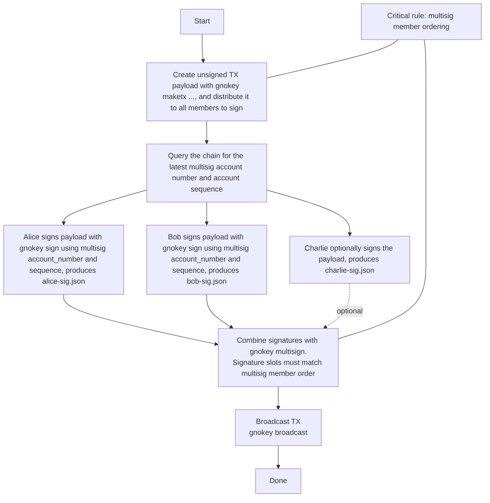

# Interacting with Gno.land using gnokey

`gnokey` is the official command-line wallet and utility for interacting with
Gno.land networks. It allows you to manage keys, query the blockchain, send
transactions, and deploy smart contracts. This guide will help you get started
with the essential operations.

## Installing gnokey

To build and install from source, you'll need:

- Git
- Go 1.22+
- Make

```bash
# Clone the repository
git clone https://github.com/gnolang/gno.git
cd gno

# Install gnokey
make install
```

## Managing key pairs

In this tutorial, you will learn how to create your Gno key pair using
[gnokey](./interact-with-gnokey.md). A key pair is required to send
transactions to the blockchain, including deploying code, interacting with
existing applications, and more.

## A word about key pairs

Key pairs are the foundation of how users interact with blockchains; and Gno is
no exception. By using a 12-word or 24-word [mnemonic phrase](https://www.zimperium.com/glossary/mnemonic-seed/)
as a source of randomness, users can derive a private and a public key.
These two keys can then be used further; a public key derives an address which is
a unique identifier of a user on the blockchain, while a private key is used for
signing messages and transactions for the aforementioned address, proving a user
has ownership over it.

Let's see how we can use `gnokey` to generate a Gno key pair locally.

## Generating a key pair

The `gnokey add` command allows you to generate a new key pair locally. Simply
run the command, while adding a name for your key pair:

```bash
gnokey add MyKey
```

After running the command, `gnokey` will ask you to enter a password that will be
used to encrypt your key pair to the disk. Then, it will show you the following
information:

- Your public key, as well as the Gno address derived from it, starting with `g1`,
- Your randomly generated 12-word mnemonic phrase which was used to derive the key pair.

:::warning Safeguard your mnemonic phrase!

A **mnemonic phrase** is like your master password; you can use it over and over
to derive the same key pairs. This is why it is crucial to store it in a safe,
offline place - writing the phrase on a piece of paper and hiding it is highly
recommended. **If it gets lost, it is unrecoverable.**

:::

`gnokey` will generate a keybase in which it will store information about your
key pairs. The keybase directory path is stored under the `-home` flag in `gnokey`.

### Gno addresses

Your **Gno address** is like your unique identifier on the network; an address
is visible in the caller stack of an application, it is included in each
transaction you create with your key pair, and anyone who knows your address can
send you [coins](../resources/gno-stdlibs.md#coin), etc.

## Making transactions

In Gno, there are four types of messages that can change on-chain state:

- `AddPackage` - adds new code to the chain
- `Call` - calls a specific path and function on the chain
- `Send` - sends coins from one address to another
- `Run` - executes a Gno script against on-chain code

A Gno.land transaction contains two main things:

- A base configuration where variables such as `gas-fee`, `gas-wanted`, and others
  are defined
- A list of messages to execute on the chain

Currently, `gnokey` supports single-message transactions, while multiple-message
transactions can be created in Go programs, supported by the
[gnoclient](https://github.com/gnolang/gno/tree/master/gno.land/pkg/gnoclient) package.

We will need some testnet coins (GNOTs) for each state-changing call. Visit the [Faucet
Hub](https://faucet.gno.land) to get GNOTs for the Gno testnets that are currently live.

Let's delve deeper into each of these message types.

## `AddPackage`

In case you want to upload new code to the chain, you can use the `AddPackage`
message type. You can send an `AddPackage` transaction with `gnokey` using the
following command:

```bash
gnokey maketx addpkg
```

To understand how to use this subcommand better, let's write a simple "Hello world"
[pure package](../resources/gno-packages.md). First, let's create a folder which will
store our example code.

```bash
└── example/
```

Then, let's create a `hello_world.gno` file under the `p/` folder:

```bash
cd example
mkdir p/ && cd p
touch hello_world.gno
```

Now, we should have the following folder structure:

```bash
└── example/
│   └── p/
│       └── hello_world.gno
```

In the `hello_world.gno` file, add the following code:

```go
package hello_world

func Hello() string {
	return "Hello, world!"
}
```

We are now ready to upload this package to the chain. To do this, we must set the
correct flags for the `addpkg` subcommand.

The `addpkg` subcommand uses the following flags and arguments:
- `-pkgpath` - on-chain path where your code will be uploaded to
- `-pkgdir` - local path where your code is located
- `-broadcast` - enables broadcasting the transaction to the chain
- `-send` - Amount of GNOT to send to the realm with the transaction (optional)
- `-max-deposit` - Maximum GNOT to lock for storage deposit (optional)
- `-gas-wanted` - the upper limit for units of gas for the execution of the
  transaction
- `-gas-fee` - amount of GNOTs to pay per gas unit
- `-chain-id` - id of the chain that we are sending the transaction to
- `-remote` - specifies the remote node RPC listener address

The `-pkgpath`, `-pkgdir`, flags are unique to the `addpkg`
subcommand, while `-broadcast`, `-gas-wanted`, `-gas-fee`, `-chain-id`, and
`-remote` are used for setting the base transaction configuration. These flags
will be repeated throughout the tutorial.

Next, let's configure the `addpkg` subcommand to publish this package to the
[Staging](../resources/gnoland-networks.md) chain. Assuming we are in
the `example/p/` folder, the command will look like this:

```bash
gnokey maketx addpkg \
-pkgpath "gno.land/p/<your_namespace>/hello_world" \
-pkgdir "." \
-gas-fee 10000000ugnot \
-gas-wanted 8000000 \
-broadcast \
-chainid staging \
-remote "https://rpc.gno.land:443"
```

Once we have added a desired [namespace](../resources/users-and-teams.md) to upload the package to, we can specify a key
pair name to use to execute the transaction:

```bash
gnokey maketx addpkg \
-pkgpath "gno.land/p/examplenamespace/hello_world" \
-pkgdir "." \
-gas-fee 10000000ugnot \
-gas-wanted 200000 \
-broadcast \
-chainid staging \
-remote "https://rpc.gno.land:443"
mykey
```

If the transaction was successful, you will get an output from `gnokey` that is
similar to the following:

```console
OK!
GAS WANTED: 200000
GAS USED:   117564
HEIGHT:     3990
EVENTS:     []
TX HASH:    Ni8Oq5dP0leoT/IRkKUKT18iTv8KLL3bH8OFZiV79kM=
```

Let's analyze the output, which is standard for any `gnokey` transaction:

- `GAS WANTED: 200000` - the original amount of gas specified for the transaction
- `GAS USED:   117564` - the gas used to execute the transaction
- `HEIGHT:     3990` - the block number at which the transaction was executed at
- `EVENTS:     []` - [Gno events](../resources/gno-stdlibs.md#events) emitted by the transaction, in this case, none
- `TX HASH:    Ni8Oq5dP0leoT/IRkKUKT18iTv8KLL3bH8OFZiV79kM=` - the hash of the transaction

Congratulations! You have just uploaded a pure package to the Staging network.
If you wish to deploy to a different network, find the list of all network
configurations in the [Network Configuration](../resources/gnoland-networks.md) section.

## `Call`

The `Call` message type is used to call any exported realm function.
You can send a `Call` transaction with `gnokey` using the following command:

```bash
gnokey maketx call
```

:::info `Call` uses gas

Using `Call` to call an exported function will use up gas, even if the function
does not modify on-chain state. If you are calling such a function, you can use
the `query` functionality for a read-only call which
does not use gas.

:::

For this example, we will call the `wugnot` realm, which wraps GNOTs to a
GRC20-compatible token called `wugnot`. We can find this realm deployed on the
[Staging](../resources/gnoland-networks.md) chain, under the `gno.land/r/gnoland/wugnot` path.

We will wrap `1000ugnot` into the equivalent in `wugnot`. To do this, we can call
the `Deposit()` function found in the `wugnot` realm. As previously, we will
configure the `maketx call` subcommand:

```bash
gnokey maketx call \
-pkgpath "gno.land/r/gnoland/wugnot" \
-func "Deposit" \
-send "1000ugnot" \
-gas-fee 10000000ugnot \
-gas-wanted 2000000 \
-broadcast \
-chainid staging \
-remote "https://rpc.gno.land:443" \
mykey
```

In this command, we have specified three main things:

- The path where the realm lives on-chain with the `-pkgpath` flag
- The function that we want to call on the realm with the `-func` flag
- The amount of `ugnot` we want to send to be wrapped, using the `-send` flag

Apart from this, we have also specified the Staging chain ID, `staging`,
as well as the Staging remote address, `https://rpc.gno.land:443`.

After running the command, we can expect an output similar to the following:

```bash
OK!
GAS WANTED: 2000000
GAS USED:   489528
HEIGHT:     24142
EVENTS:     [{"type":"Transfer","attrs":[{"key":"from","value":""},{"key":"to","value":"g125em6arxsnj49vx35f0n0z34putv5ty3376fg5"},{"key":"value","value":"1000"}],"pkg_path":"gno.land/r/gnoland/wugnot","func":"Mint"}]
TX HASH:    Ni8Oq5dP0leoT/IRkKUKT18iTv8KLL3bH8OFZiV79kM=
```

In this case, we can see that the `Deposit()` function emitted an
[event](../resources/gno-stdlibs.md#events) that tells us more about what
happened during the transaction.

After broadcasting the transaction, we can verify that we have the amount of `wugnot` we expect. We
can call the `BalanceOf()` function in the same realm:

```bash
gnokey maketx call \
-pkgpath "gno.land/r/gnoland/wugnot" \
-func "BalanceOf" \
-args "<your_address>" \
-gas-fee 10000000ugnot \
-gas-wanted 2000000 \
-broadcast \
-chainid staging \
-remote "https://rpc.gno.land:443" \
mykey
```

If everything was successful, we should get something similar to the following
output:

```
(1000 uint64)

OK!
GAS WANTED: 2000000
GAS USED:   396457
HEIGHT:     64839
EVENTS:     []
TX HASH:    gQP9fJYrZMTK3GgRiio3/V35smzg/jJ62q7t4TLpdV4=
```

At the top, you will see the output of the transaction, specifying the value and
type of the return argument.

In this case, we used `maketx call` to call a read-only function, which simply
checks the `wugnot` balance of a specific address. This is discouraged, as
`maketx call` actually uses gas. To call a read-only function without spending gas,
check out the `vm/qeval` query section.

## `Send`

We can use the `Send` message type to access the TM2 [Banker](../resources/gno-stdlibs.md#banker)
directly and transfer coins from one Gno address to another.

Coins, such as GNOTs, are always formatted in the following way:

```
<amount><denom>
100ugnot
```

For this example, let's transfer some GNOTs. Just like before, we can configure
our `maketx send` subcommand:

```bash
gnokey maketx send \
-to g1jg8mtutu9khhfwc4nxmuhcpftf0pajdhfvsqf5 \
-send 100ugnot \
-gas-fee 10000000ugnot \
-gas-wanted 2000000 \
-broadcast \
-chainid staging \
-remote "https://rpc.gno.land:443" \
mykey
```

Here, we have set the `-to` & `-send` flags to match the recipient, in this case
the publicly-known `test1` address, and `100ugnot` for the coins we want to send,
respectively.

To check the balance of a specific address, check out the `bank/balances` query
in the [Querying a network](#querying-a-gnoland-network) section.

## `Run`

With the `Run` message, you can write a snippet of Gno code and run it against
code on the chain. For this example, we will use the [Userbook realm](https://gno.land/r/demo/userbook),
which simply allows you to register the fact that you have interacted with it.
It contains a simple `SignUp()` function, which we will call with `Run`.

To understand how to use the `Run` message better, let's write a simple `script.gno`
file. First, create a folder which will store our script.

```bash
└── example/
```

Then, let's create a `script.gno` file:

```bash
cd example
touch script.gno
```

Now, we should have the following folder structure:

```bash
└── example/
│   └── script.gno
```

In the `script.gno` file, first define the package to be `main`. Then we can import
the Userbook realm and define a `main()` function with no return values that will
be automatically detected and run. In it, we can call the `SignUp()` function.

```go
package main

import "gno.land/r/demo/userbook"

func main() {
	println(userbook.SignUp())
}
```

Now we will be able to provide this to the `maketx run` subcommand:

```bash
gnokey maketx run \
-gas-fee 1000000ugnot \
-gas-wanted 20000000 \
-broadcast \
-chainid staging \
-remote "https://rpc.gno.land:443" \
mykey ./script.gno
```

After running this command, the chain will execute the script and apply any state
changes. Additionally, by using `println`, which is only available in the `Run`
& testing context, we will be able to see the return value of the function called.

### The power of `Run`

Specifically, the above example could have been replaced with a simple `maketx call`
call. The full potential of run comes out in three specific cases:

1. Calling realm functions multiple times in a loop
2. Calling functions with non-primitive input arguments
3. Calling methods on exported variables

Let's look at each of these cases in detail. To demonstrate, we'll make a call
to the following example realm:

```go
package foo

import "gno.land/p/nt/ufmt"

var (
	MainFoo *Foo
	foos    []*Foo
)

type Foo struct {
	bar string
	baz int
}

func init() {
	MainFoo = &Foo{bar: "mainBar", baz: 0}
}

func (f *Foo) String() string {
	return ufmt.Sprintf("Foo - (bar: %s) - (baz: %d)\n\n", f.bar, f.baz)
}

func NewFoo(bar string, baz int) *Foo {
	return &Foo{bar: bar, baz: baz}
}

func AddFoos(multipleFoos []*Foo) {
	foos = append(foos, multipleFoos...)
}

func Render(_ string) string {
	var output string

	for _, f := range foos {
		output += f.String()
	}

	return output
}
```

1. Calling realm functions multiple times in a loop:

```go
package main

import (
	"gno.land/r/docs/examples/foo"
)

func main() {
	for i := 0; i < 5; i++ {
		println(foo.Render(""))
	}
}
```

2. Calling functions with non-primitive input arguments:

Currently, `Call` only supports primitives for arguments. With `Run`, these
limitations are removed; we can execute a function that takes in a struct, array,
or even an array of structs.

We are unable to call `AddFoos()` with the `Call` message type, while with `Run`,
we can:

```go
package main

import (
	"strconv"

	"gno.land/r/docs/examples/foo"
)

func main() {
	var multipleFoos []*foo.Foo

	for i := 0; i < 5; i++ {
		newFoo := foo.NewFoo(
			"bar"+strconv.Itoa(i),
			i,
		)

		multipleFoos = append(multipleFoos, newFoo)
	}

	foo.AddFoos(multipleFoos)
}

```

3. Calling methods on exported variables:

```go
package main

import "gno.land/r/docs/examples/foo"

func main() {
	println(foo.MainFoo.String())
}
```

Finally, we can call methods that are on top-level objects in case they exist,
which is not currently possible with the `Call` message.

## Making an airgapped transaction

`gnokey` provides a way to create a transaction, sign it, and later
broadcast it to a chain in the most secure fashion. This approach, while more
complicated than the standard approach shown [in another section](#making-transactions),
grants full control and provides [airgap](https://en.wikipedia.org/wiki/Air_gap_(networking))
support.

By separating the signing and the broadcasting steps of submitting a transaction,
users can make sure that the signing happens in a secure, offline environment,
keeping private keys away from possible exposure to attacks coming from the
internet.

The intended purpose of this functionality is to provide maximum security when
signing and broadcasting a transaction. In practice, this procedure should take
place on two separate machines controlled by the holder of the keys, one with
access to the internet (`Machine A`), and the other one without (`Machine B`),
with the separation of steps as follows:

1. `Machine A`: Fetch account information from the chain
2. `Machine B`: Create an unsigned transaction locally
3. `Machine B`: Sign the transaction
4. `Machine A`: Broadcast the transaction

### 1. Fetching account information from the chain

First, we need to fetch data for the account we are using to sign the transaction,
using the [auth/accounts](#authaccounts) query:

```bash
gnokey query auth/accounts/<your_address> -remote "https://rpc.gno.land:443"
```

We need to extract the account number and sequence from the output:

```bash
height: 0
data: {
  "BaseAccount": {
    "address": "g1zzqd6phlfx0a809vhmykg5c6m44ap9756s7cjj",
    "coins": "10000000ugnot",
    "public_key": null,
    "account_number": "468",
    "sequence": "0"
  }
}
```

In this case, the account number is `468`, and the sequence (nonce) is `0`. We
will need these values to sign the transaction later. These pieces of information
are crucial during the signing process, as they are included in the signature
of the transaction, preventing replay attacks.

### 2. Creating an unsigned transaction locally

To create the transaction you want, you can use the [`call` API](#call),
without the `-broadcast` flag, while redirecting the output to a local file:

```bash
gnokey maketx call \
-pkgpath "gno.land/r/demo/userbook" \
-func "SignUp" \
-gas-fee 1000000ugnot \
-gas-wanted 2000000 \
mykey > userbook.tx
```

This will create a `userbook.tx` file with a null `signature` field.
Now we are ready to sign the transaction.

### 3. Signing the transaction

To add a signature to the transaction, we can use the `gnokey sign` subcommand.
To sign, we must set the correct flags for the subcommand:

- `-tx-path` - path to the transaction file to sign, in our case, `userbook.tx`
- `-chainid` - id of the chain to sign for
- `-account-number` - number of the account fetched previously
- `-account-sequence` - sequence of the account fetched previously

```bash
gnokey sign \
-tx-path userbook.tx \
-chainid "staging" \
-account-number 468 \
-account-sequence 0 \
mykey
```

After inputting the correct values, `gnokey` will ask for the password to decrypt
the key pair. Once we input the password, we should receive the message that the
signing was completed. If we open the `userbook.tx` file, we will be able to see
that the signature field has been populated.

We are now ready to broadcast this transaction to the chain.

### 4. Broadcasting the transaction

To broadcast the signed transaction to the chain, we can use the `gnokey broadcast`
subcommand, giving it the path to the signed transaction:

```bash
gnokey broadcast -remote "https://rpc.gno.land:443" userbook.tx
```

In this case, we do not need to specify a key pair, as the transaction has already
been signed in a previous step and `gnokey` is only sending it to the RPC endpoint.

## Verifying a transaction's signature

To verify a transaction's signature is correct, you can use the `gnokey verify`
subcommand. We can provide the path to the transaction document using the `-docpath`
flag, provide the key we signed the transaction with, and the signature itself.
Make sure the signature is in the `hex` format.

```bash
gnokey verify -docpath userbook.tx mykey <signature>
```

## Using a k-of-n multisig

The multisig being created for this section is a 2-of-3 multisig, with Alice / Bob / Charlie.
This section shows the simplest multisig flow:

1) creating a **local multisig key** in each participant's keybase
2) creating a tx **unsigned** (shared payload)
3) each signer produces an **individual signature document**
4) combining signatures with `multisign` (ordering matters)
5) broadcasting

### 1. Create the local multisig representation

**What each signer needs:**

- `gnokey`
- their own private key (from mnemonic or existing)
- the other signers' **pubkeys** (added as bech32 keys) present in the keybase
- agreement on **threshold** and **key ordering**

**The single most important rule: key ordering**

The multisig is defined by the **ordered list of member keys**.

All participants must use the **exact same order** when running:

- `gnokey add multisig ...`
- later, `gnokey multisign ...` expects signatures that correspond to that same ordering

If the order differs between participants, you will *not* end up with the same multisig public key/address, and signing
will fail.

#### Example ordering used here

We'll use this canonical order everywhere:

1. `alice`
2. `multisig-bob`
3. `multisig-charlie`

That means:

- Alice's keybase contains:
    - `alice` (local private key)
    - `multisig-bob` (Bob pubkey, present in Alice's keybase)
    - `multisig-charlie` (Charlie pubkey, present in Alice's keybase)
    - multisig key `multisig-abc` created in that order

Bob and Charlie must create `multisig-abc` using the *same ordered members*, even though their local private key name
differs.

#### Alice keybase

```sh
# Alice keybase dir
rm -rf ./alice-kb && mkdir ./alice-kb

# Recover alice
echo "\n\n$ALICE_MNEMONIC" | gnokey add --recover "alice" --home "./alice-kb" -insecure-password-stdin -quiet

# Add other pubkeys
gnokey add bech32 --home "./alice-kb" -pubkey "$BOB_PUBKEY" multisig-bob
gnokey add bech32 --home "./alice-kb" -pubkey "$CHARLIE_PUBKEY" multisig-charlie

# Create multisig (ORDER MATTERS)
gnokey add multisig --home "./alice-kb" \
  --multisig alice \
  --multisig multisig-bob \
  --multisig multisig-charlie \
  -threshold 2 \
  multisig-abc
```

#### Bob keybase

Bob must reproduce the *same multisig members in the same order*.

```sh
rm -rf ./bob-kb && mkdir ./bob-kb

echo "\n\n$BOB_MNEMONIC" | gnokey add --recover "bob" --home "./bob-kb" -insecure-password-stdin -quiet

gnokey add bech32 --home "./bob-kb" -pubkey "$ALICE_PUBKEY" multisig-alice
gnokey add bech32 --home "./bob-kb" -pubkey "$CHARLIE_PUBKEY" multisig-charlie

# Same ORDER as Alice's multisig definition:
# 1) alice 2) bob 3) charlie
gnokey add multisig --home "./bob-kb" \
  --multisig multisig-alice \
  --multisig bob \
  --multisig multisig-charlie \
  -threshold 2 \
  multisig-abc
```

#### Charlie keybase

Same rule.

```sh
rm -rf ./charlie-kb && mkdir ./charlie-kb

echo "\n\n$CHARLIE_MNEMONIC" | gnokey add --recover "charlie" --home "./charlie-kb" -insecure-password-stdin -quiet

gnokey add bech32 --home "./charlie-kb" -pubkey "$ALICE_PUBKEY" multisig-alice
gnokey add bech32 --home "./charlie-kb" -pubkey "$BOB_PUBKEY" multisig-bob

# Same ORDER as Alice's multisig definition:
# 1) alice 2) bob 3) charlie
gnokey add multisig --home "./charlie-kb" \
  --multisig multisig-alice \
  --multisig multisig-bob \
  --multisig charlie \
  -threshold 2 \
  multisig-abc
```

### 2. Create a transaction and produce individual signatures

#### Create the shared tx payload (unsigned)

Create the tx once (any participant can do it), then distribute the JSON to signers.

**NOTE: Notice how the origin of the transaction is the multisig account (address)**

```sh
TX_PAYLOAD="./multisig-abc-send.json"
rm -f "$TX_PAYLOAD"

gnokey maketx send --home "./alice-kb" -chainid staging -send "100000ugnot" -gas-fee 100000ugnot -gas-wanted 100000 -to g1pm60rkcvkt4j6s24vgygyfuu3c2f5gt76lqtss multisig-abc > "$TX_PAYLOAD"
```

**Important: sign using the multisig account number + sequence**

Every signer must sign using the **multisig address** `account_number` and `sequence`, not their personal address.

The `account_number` and `account_sequence` can be fetched with `gnokey`:

```sh
gnokey query auth/accounts/"$addr"
```

which should produce a result such as:

```sh
height: 0
data: {
  "BaseAccount": {
    "address": "g1jg8mtutu9khhfwc4nxmuhcpftf0pajdhfvsqf5",
    "coins": "1999226325108ugnot",
    "public_key": null,
    "account_number": "32",
    "sequence": "0"
  },
  "attributes": "0"
}
```

#### Alice signs (produces a signature document)

`$MULTISIG_ACC_NUM` and `$MULTISIG_ACC_SEQ` in the command below correspond to the most up-to-date account information
fetched as shown before.

```sh
ALICE_SIG="./alice-sig.json"
rm -f "$ALICE_SIG"

echo "\n\n" | gnokey sign --tx-path "$TX_PAYLOAD" --home "./alice-kb" alice --account-number "$MULTISIG_ACC_NUM" --account-sequence "$MULTISIG_ACC_SEQ" -insecure-password-stdin -quiet --output-document "$ALICE_SIG"
```

#### Bob signs

```sh
BOB_SIG="./bob-sig.json"
rm -f "$BOB_SIG"

echo "\n\n" | gnokey sign --tx-path "$TX_PAYLOAD" --home "./bob-kb" bob --account-number "$MULTISIG_ACC_NUM" --account-sequence "$MULTISIG_ACC_SEQ" -insecure-password-stdin -quiet --output-document "$BOB_SIG"
```

(Charlie would do the same, producing `charlie-sig.json`, but you only need 2 signatures for a 2-of-3.)

### 3. Combine signatures with the multisig

**The second most important rule: signature order must match multisig member order**

When you call `gnokey multisign`, the signatures must correspond to the multisig's **ordered members**.

If your multisig was defined as: `alice, bob, charlie`, then:

- Alice's signature corresponds to slot 1
- Bob's signature corresponds to slot 2
- Charlie's signature corresponds to slot 3

You can provide signatures in any CLI order, but they must be valid for members of that multisig.

#### Multisign (Alice + Bob example)

Use a keybase that contains the multisig key `multisig-abc` (Alice's is fine).

```sh
gnokey multisign --tx-path "$TX_PAYLOAD" --home "./alice-kb" --signature "$ALICE_SIG" --signature "$BOB_SIG" multisig-abc
```

### 4. Broadcast the signed tx

Now that the multisig account has officially signed the transaction, it's valid and can be broadcast to the network.

```sh
gnokey broadcast "$TX_PAYLOAD" --home "./alice-kb"
```

### Diagram of this process



## Build `gnokey` for an airgapped Linux machine

This section shows how to build `gnokey` locally, verify the built binary, and then move it to a secure machine.

### Prerequisite: Know your target architecture

You must build for the **same OS/arch** as the airgapped machine.

On the airgapped box, determine the target:

```bash
uname -s
uname -m
```

Typical mappings:

- `x86_64` -> `GOARCH=amd64`
- `aarch64` / `arm64` -> `GOARCH=arm64`

You are building for Linux, so `GOOS=linux`.
If you build on Linux for the same arch, you can usually omit `GOOS/GOARCH` and just verify with `go env`.

Check what your build machine would produce by default:

```bash
go env GOOS GOARCH
```

If those don't match the airgapped target, **set `GOOS=linux` and `GOARCH=<...>` explicitly**.

> Important: because Ledger support requires **CGO**, cross-compiling with `CGO_ENABLED=1` is often painful and may not
> work without a proper cross C toolchain. The simplest safe approach is:
> **build on a machine that matches the airgapped machine's OS/arch/distro baseline**.

### CGO + Ledger support

Ledger support requires **CGO**.
CGO is **off by default** in this repo's build setup, so you must explicitly enable it when building `gnokey`.

See [#2737](https://github.com/gnolang/gno/issues/2737).

To enable CGO, simply add this before the `go build` command: `CGO_ENABLED=1`

### 1. Build on a trusted online machine

Build from a specific tag/commit so you can reproduce the exact binary later.

```bash
git clone https://github.com/gnolang/gno.git
cd gno
git checkout master
```

Compute the same `VERSION` string the repo uses (see `build.gnokey`) and build with equivalent `-ldflags`:

```bash
VERSION="$(git describe --tags --exact-match 2>/dev/null || \
  echo "$(git rev-parse --abbrev-ref HEAD).$(git rev-list --count HEAD)+$(git rev-parse --short HEAD)")"

mkdir -p build

# Set GOOS/GOARCH to match the airgapped machine:
# export GOOS=linux
# export GOARCH=amd64   # for x86_64
# export GOARCH=arm64   # for aarch64/arm64

go build \
  -ldflags "-X github.com/gnolang/gno/tm2/pkg/version.Version=${VERSION}" \
  -o build/gnokey \
  ./gno.land/cmd/gnokey
```

Verify you built what you think you built:

```bash
file build/gnokey
go env GOOS GOARCH

# If you're building on a Linux machine (same arch, otherwise they'll fail), run these below to sanity check:
./build/gnokey --help >/dev/null
./build/gnokey version || true
```

### 2. Record build metadata (for future ref)

```bash
sha256sum build/gnokey | tee build/gnokey.sha256
git rev-parse HEAD | tee build/gnokey.gitrev
printf '%s\n' "$VERSION" | tee build/gnokey.version
```

### 3. Create a minimal transfer bundle

```bash
mkdir -p gnokey-airgap-bundle
cp -v build/gnokey gnokey-airgap-bundle/gnokey
cp -v build/gnokey.gitrev build/gnokey.version gnokey-airgap-bundle/

( cd gnokey-airgap-bundle && sha256sum gnokey > gnokey.sha256 )

tar -czf gnokey-airgap-bundle.tgz gnokey-airgap-bundle
sha256sum gnokey-airgap-bundle.tgz | tee gnokey-airgap-bundle.tgz.sha256
```

**Copy `gnokey-airgap-bundle.tgz` and `gnokey-airgap-bundle.tgz.sha256` to secure offline media.**

### 4. Verify & install the build on the airgapped machine

```bash
sha256sum -c gnokey-airgap-bundle.tgz.sha256
tar -xzf gnokey-airgap-bundle.tgz

cd gnokey-airgap-bundle
sha256sum -c gnokey.sha256

# You can run the command locally now
./gnokey --h
```

### Practical warning: CGO usually implies dynamic deps

If you built the `gnokey` binary with `CGO_ENABLED=1`, the binary may depend on system libraries (glibc, etc.).
If it fails to start on the airgapped box with missing shared libraries, your build environment doesn't match the
target closely enough. Fix it by either:

- building on the *same distro/glibc baseline* as the airgapped target, or
- installing the required runtime libs on the airgapped machine via your offline package process.

## Querying a Gno.land network

Gno.land and `gnokey` support ABCI queries. Using ABCI queries, you can query the state of
a Gno.land network without spending any gas. All queries need to be pointed towards
a specific remote address from which the state will be retrieved.

To send ABCI queries, you can use the `gnokey query` subcommand, and provide it
with the appropriate query. The `query` subcommand allows us to send different
types of queries to a Gno.land network.

Below is a list of queries a user can make with `gnokey`:

- `auth/accounts/{ADDRESS}` - returns information about an account
- `bank/balances/{ADDRESS}` - returns balances of an account
- `vm/qfuncs` - returns the exported functions for a given pkgpath
- `vm/qfile` - returns package contents for a given pkgpath
- `vm/qdoc` - Returns the JSON of the doc for a given pkgpath, suitable for printing
- `vm/qeval` - evaluates an expression in read-only mode on and returns the results
- `vm/qrender` - shorthand for evaluating `vm/qeval Render("")` for a given pkgpath
- `vm/qstorage` - returns storage usage and deposit locked in a realm

Let's see how we can use them.

### `auth/accounts`

We can obtain information about a specific address using this subquery. To call it,
we can run the following command:

```bash
gnokey query auth/accounts/g1jg8mtutu9khhfwc4nxmuhcpftf0pajdhfvsqf5 -remote https://rpc.gno.land:443
```

With this, we are asking the Staging network to deliver information about the
specified address. If everything went correctly, we should get output similar to the following:

```bash
height: 0
data: {
  "BaseAccount": {
    "address": "g1jg8mtutu9khhfwc4nxmuhcpftf0pajdhfvsqf5",
    "coins": "227984898927ugnot",
    "public_key": {
      "@type": "/tm.PubKeySecp256k1",
      "value": "A+FhNtsXHjLfSJk1lB8FbiL4mGPjc50Kt81J7EKDnJ2y"
    },
    "account_number": "0",
    "sequence": "12"
  }
}
```

The return data will contain the following fields:

- `height` - the height at which the query was executed. This is currently not
  supported and is `0` by default.
- `data` - contains the result of the query.

The `data` field returns a `BaseAccount`, which is the main struct used in Tendermint2
to hold account data. It contains the following information:

- `address` - the address of the account
- `coins` - the list of coins the account owns
- `public_key` - the TM2 public key of the account, from which the address is derived
- `account_number` - a unique identifier for the account on the Gno.land chain
- `sequence` - a nonce, used for protection against replay attacks

### `bank/balances`

With this query, we can fetch [coin](../resources/gno-stdlibs.md#coin) balances
of a specific account. To call it, we can run the following command:

```bash
gnokey query bank/balances/g1jg8mtutu9khhfwc4nxmuhcpftf0pajdhfvsqf5 -remote https://rpc.gno.land:443
```

If everything went correctly, we should get an output similar to the following:

```bash
height: 0
data: "227984898927ugnot"
```

The data field will contain the coins the address owns.

### `vm/qfuncs`

Using the `vm/qfuncs` query, we can fetch exported functions from a specific package
path. To specify the path we want to query, we can use the `-data` flag:

```bash
gnokey query vm/qfuncs --data "gno.land/r/gnoland/wugnot" -remote https://rpc.gno.land:443
```

The output is a string containing all exported functions for the `wugnot` realm:

```json
height: 0
data: [
        {
          "FuncName": "Deposit",
          "Params": null,
          "Results": null
        },
        {
          "FuncName": "Withdraw",
          "Params": [
            {
            "Name": "amount",
            "Type": "uint64",
            "Value": ""
            }
          ],
          "Results": null
        },
        // other functions
]
```

### `vm/qfile`

With the `vm/qfile` query, we can fetch files and their content found on a
specific package path. To specify the path we want to query, we can use the
`-data` flag:

```bash
gnokey query vm/qfile -data "gno.land/r/gnoland/wugnot" -remote https://rpc.gno.land:443
```

If the `-data` field contains only the package path, the output is a list of all
files found within the `wugnot` realm:

```bash
height: 0
data: gnomod.toml
wugnot.gno
z0_filetest.gno
```

If the `-data` field also specifies a file name after the path, the source code
of the file will be retrieved:

```bash
gnokey query vm/qfile -data "gno.land/r/gnoland/wugnot/wugnot.gno" -remote https://rpc.gno.land:443
```

Output:

```bash
height: 0
data: package wugnot

import (
        "std"
        "strings"

        "gno.land/p/nt/grc/grc20"
        "gno.land/p/nt/ufmt"
        pusers "gno.land/p/demo/users"
        "gno.land/r/demo/users"
)

var (
        banker *grc20.Banker = grc20.NewBanker("wrapped GNOT", "wugnot", 0)
        Token                = banker.Token()
)

const (
        ugnotMinDeposit  uint64 = 1000
        wugnotMinDeposit uint64 = 1
)
...
```

### `vm/qdoc`

Using the `vm/qdoc` query, we can fetch the docs, for functions, types and variables from a specific
package path. To specify the path we want to query, we can use the `-data` flag:

```bash
gnokey query vm/qdoc --data "gno.land/r/gnoland/valopers/v2" -remote https://rpc.gno.land:443
```

The output is a JSON string containing doc strings of the package, functions, etc., including comments for `valopers`
realm:

```json
height: 0
data: {
  "package_path": "gno.land/r/gnoland/valopers/v2",
  "package_line": "package valopers // import \"valopers\"",
  "package_doc": "Package valopers is designed around the permissionless lifecycle of valoper profiles. It also includes parts designed for govdao to propose valset changes based on registered valopers.\n",
  "values": [
    {
      "name": "valopers",
      "doc": "// Address -> Valoper\n",
      "type": "*avl.Tree"
    }
    // other values
  ],
  "funcs": [
    {
      "type": "",
      "name": "GetByAddr",
      "signature": "func GetByAddr(address std.Address) Valoper",
      "doc": "GetByAddr fetches the valoper using the address, if present\n",
      "params": [
        {
          "Name": "address",
          "Type": "std.Address"
        }
      ],
      "results": [
        {
          "Name": "",
          "Type": "Valoper"
        }
      ]
    }
    // other funcs
    {
      "type": "Valoper",
      "name": "Render",
      "signature": "func (v Valoper) Render() string",
      "doc": "Render renders a single valoper with their information\n",
      "params": [],
      "results": [
        {
          "Name": "",
          "Type": "string"
        }
      ]
    }
    // other methods (in this case of the Valoper type)
  ],
  "types": [
    {
      "name": "Valoper",
      "signature": "type Valoper struct {\n\tName        string // the display name of the valoper\n\tMoniker     string // the moniker of the valoper\n\tDescription string // the description of the valoper\n\n\tAddress      std.Address // The bech32 gno address of the validator\n\tPubKey       string      // the bech32 public key of the validator\n\tP2PAddresses []string    // the publicly reachable P2P addresses of the validator\n\tActive       bool        // flag indicating if the valoper is active\n}",
      "doc": "Valoper represents a validator operator profile\n"
    }
  ]
}
```

### `vm/qeval`

`vm/qeval` allows us to evaluate a call to an exported function without using gas,
in read-only mode. For example:

```bash
gnokey query vm/qeval -remote https://rpc.gno.land:443 -data "gno.land/r/gnoland/wugnot.BalanceOf(\"g1jg8mtutu9khhfwc4nxmuhcpftf0pajdhfvsqf5\")"
```

This command will return the `wugnot` balance of the above address without using gas.
Properly escaping quotation marks for string arguments is currently required.

Currently, `vm/qeval` only supports primitive types in expressions.

### `vm/qrender`

`vm/qrender` is an alias for executing `vm/qeval` on the `Render("")` function.
We can use it like this:

```bash
gnokey query vm/qrender --data "gno.land/r/gnoland/wugnot:" -remote https://rpc.gno.land:443
```

Running this command will display the current `Render()` output of the WUGNOT
realm, which is also displayed by default on the [realm's page](https://gno.land/r/gnoland/wugnot):

```bash
height: 0
data: # wrapped GNOT ($wugnot)

* **Decimals**: 0
* **Total supply**: 5012404
* **Known accounts**: 2
```

:::info Specifying a path to `Render()`

To call the `vm/qrender` query with a specific path, use the `<pkgpath>:<renderpath>` syntax.
For example, the `wugnot` realm provides a way to display the balance of a specific
address in its `Render()` function. We can fetch the balance of an account by
providing the following custom pattern to the `wugnot` realm:

```bash
gnokey query vm/qrender --data "gno.land/r/gnoland/wugnot:balance/g125em6arxsnj49vx35f0n0z34putv5ty3376fg5" -remote https://rpc.gno.land:443
```

To see how this was achieved, check out `wugnot`'s `Render()` function.
:::

### `vm/qpaths`

`vm/qpaths` lists all existing package paths prefixed with the specified string
using `--data=<prefix>`. If no paths are provided, all known paths will be
listed, including those from `stdlibs`. You can specify an additional *limit*
parameter at the end of the path using `<path>?limit=<x>` to restrict the number
of results to `x` elements. If `0` is specified as *limit*, then, no limit will
be applied, with a hard limit of `10_000`. The default *limit* is `1_000`.

A simple example:

```bash
gnokey query vm/qpaths --data "gno.land/r/gnoland"
```

Would output:

```bash
height: 0
data: gno.land/r/gnoland/blog
gno.land/r/gnoland/coins
gno.land/r/gnoland/events
gno.land/r/gnoland/home
gno.land/r/gnoland/pages
gno.land/r/gnoland/users
gno.land/r/gnoland/users/v1
```

The result limit can also be specified in the following manner (mind the added
quotes):

```bash
gnokey query "vm/qpaths?limit=3" --data "gno.land/r/gnoland"
```

You can also specify a string prefixed with `@` to list username's sub-packages
including `/p` and `/r`.

For example:

```bash
gnokey query vm/qpaths --data "@foo"
```

```bash
height: 0
data: gno.land/r/foo
gno.land/r/foo/art/gnoface
gno.land/r/foo/art/millipede
gno.land/p/foo/ui
gno.land/p/foo/svg
```

In practice, this is shorthand for listing packages under `gno.land/p/foo` &
`gno.land/r/foo`.

### `vm/qstorage`

This ABCI query endpoint can be used to inspect current storage usage and deposit in a realm:

```bash
gnokey query vm/qstorage --data "gno.land/r/foo"
```

Sample Output:

```
storage: 5025, deposit: 502500
```

`storage` represents total bytes used, while `deposit` is the total GNOT locked by that realm.

The storage price can be also calculated directly using this output
(e.g., deposit / storage, `502500/5025 = 100ugnot`) instead of querying the price
per byte from the params realm.

## Gas parameters

When using `gnokey` to send transactions, you'll need to specify gas parameters:

```bash
gnokey maketx call \
  --pkgpath "gno.land/r/demo/boards" \
  --func "CreateBoard" \
  --args "MyBoard" "Board description" \
  --gas-fee 1000000ugnot \
  --gas-wanted 2000000 \
  --remote https://rpc.gno.land:443 \
  --chainid staging \
  YOUR_KEY_NAME
```

For detailed information about gas fees, including recommended values and
optimization strategies, see the [Gas Fees documentation](../resources/gas-fees.md).
