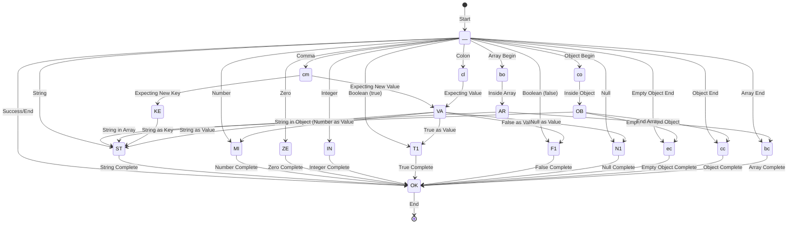

# JSON Parser

The JSON parser is a package that provides functionality for parsing and processing JSON strings. This package accepts JSON strings as byte slices.

Currently, gno does not [support the `reflect` package](https://docs.gno.land/concepts/effective-gno#reflection-is-never-clear), so it cannot retrieve type information at runtime. Therefore, it is designed to infer and handle type information when parsing JSON strings using a state machine approach.

After passing through the state machine, JSON strings are represented as the `Node` type. The `Node` type represents nodes for JSON data, including various types such as `ObjectNode`, `ArrayNode`, `StringNode`, `NumberNode`, `BoolNode`, and `NullNode`.

This package provides methods for manipulating, searching, and extracting the Node type.

## State Machine

To parse JSON strings, a [finite state machine](https://en.wikipedia.org/wiki/Finite-state_machine) approach is used. The state machine transitions to the next state based on the current state and the input character while parsing the JSON string. Through this method, type information can be inferred and processed without reflect, and the amount of parser code can be significantly reduced.

The image below shows the state transitions of the state machine according to the states and input characters.



## Examples

This package provides parsing functionality along with encoding and decoding functionality. The following examples demonstrate how to use this package.

### Decoding

Decoding (or Unmarshaling) is the functionality that converts an input byte slice JSON string into a `Node` type.

The converted `Node` type allows you to modify the JSON data or search and extract data that meets specific conditions.

Below is an example of converting a `Node` type into a JSON string, and retrieving all the keys in the JSON data with `json.UniqueKeyLists()`.

```go
package main

import (
    "gno.land/p/demo/json"
    "gno.land/p/demo/ufmt"
)

func main() {
    data := []byte(`{"foo": "var", "bar": 123, "baz": [1, 2, 3]}`)
    node, err := json.Unmarshal(data)
    if err != nil {
        ufmt.Errorf("error: %v", err)
    }

    ufmt.Println(node.UniqueKeyLists())
}

// Output:
// slice[("foo" string),("bar" string),("baz" string)]
```

### Encoding

Encoding (or Marshaling) is the functionality that converts JSON data represented as a Node type into a byte slice JSON string.

> ⚠️ Caution: Converting a large `Node` type into a JSON string may _impact performance_. or might be cause _unexpected behavior_.

You can use the `json.Marshal()` method to convert a `Node` type into a JSON string. Below is an example of converting a `Node` type into a JSON string.

```go
package main

import (
    "gno.land/p/demo/json"
    "gno.land/p/demo/ufmt"
)

func main() {
    node := json.ObjectNode("", map[string]*json.Node{
        "foo": json.StringNode("foo", "bar"),
        "baz": json.NumberNode("baz", 100500),
        "qux": json.NullNode("qux"),
    })

    b, err := json.Marshal(node)
    if err != nil {
        ufmt.Errorf("error: %v", err)
    }

    ufmt.Println(string(b))
}

// Output:
// {"foo":"bar","baz":100500,"qux":null}
```

### Searching

Once the JSON data converted into a `Node` type, you can **search** and **extract** data that satisfy specific conditions. For example, you can find data with a specific type or data with a specific key.

To use this functionality, you can use methods in the `GetXXX` prefixed methods. The `MustXXX` methods also provide the same functionality as the former methods, but they will **panic** if data doesn't satisfies the condition.

Here is an example of finding data with a specific key. For more examples, please refer to the [node.gno](node.gno) file.

```go
package main

import (
    "gno.land/p/demo/json"
    "gno.land/p/demo/ufmt"
)

func main() {
    root, err := json.Unmarshal([]byte(`{"foo": true, "bar": null}`))
    if err != nil {
        ufmt.Errorf("error: %v", err)
    }

    value, err := root.GetKey("foo")
    if err != nil {
        ufmt.Errorf("error occurred while getting key, %s", err)
    }

    ufmt.Println(value)

    if value.MustBool() != true {
        ufmt.Errorf("value is not true")
    }

    value, err = root.GetKey("bar")
    if err != nil {
        ufmt.Errorf("error occurred while getting key, %s", err)
    }

    ufmt.Println(value)
}

// Output:
// true
// null
```

### Modifying

It is not possible to directly modify a JSON string with this package. However, you can modify the data in the desired form using the Node type and then convert it back into a JSON string.

Currently, this package provides basic functionality for creating and deleting specific types of nodes. For example, to change the value of a specific key or to add a new key, you can use the Update method.

```go
package main

import (
    "gno.land/p/demo/json"
    "gno.land/p/demo/ufmt"
)

func main() {
    root, err := json.Unmarshal([]byte(`{"foo": true, "bar": null}`))

    ufmt.Println("previous: ", root.String())

    err = root.Update("bar", json.StringNode("bar", "hello"))
    if err != nil {
        ufmt.Errorf("error occurred while updating, %s", err)
    }

    ufmt.Println("updated: ", root.String())

    err = root.Update("baz", json.StringNode("baz", "hello"))
    if err != nil {
        ufmt.Errorf("error occurred while updating, %s", err)
    }

    ufmt.Println("add new field: ", root.String())
}

// Output:
// previous:  {"foo": true, "bar": null}
// updated:  {"foo":true,"bar":"hello"}
// add new field:  {"foo":true,"bar":"hello","baz":"hello"}
```

## Contributing

Please submit any issues or pull requests for this package through the GitHub repository at [gnolang/gno](<https://github.com/gnolang/gno>).
