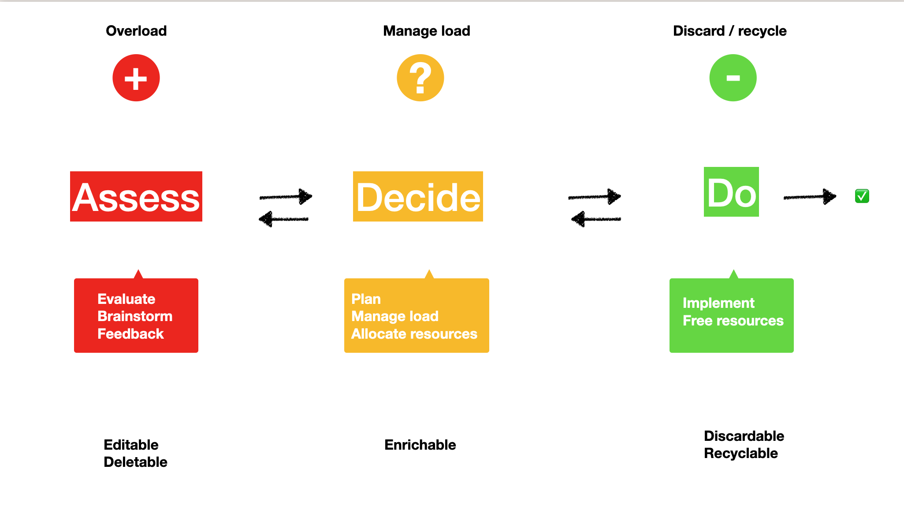

# ZenTasktic Core

A basic, minimalisitc Asess-Decide-Do implementations as `p/zentasktic`. The diagram below shows a simplified ADD workflow.



This implementation will expose all the basic features of the framework: tasks & projects with complete workflows. Ideally, this should offer all the necessary building blocks for any other custom implementation.

## Object Definitions and Default Values

As an unopinionated ADD workflow, `zentastic_core` defines the following objects:

- Realm

Realms act like containers for tasks & projects during their journey from Assess to Do, via Decide. Each realm has a certain restrictions, e.g. a task's Body can only be edited in Assess, a Context, Due date and Alert can only be added in Decide, etc.

If someone observes different realms, there is support for adding and removing arbitrary Realms.

_note: the Ids between 1 and 4 are reserved for: 1-Assess, 2-Decide, 3-Do, 4-Collection. Trying to add or remove such a Realm will raise an error._


Realm data definition:

```
type Realm struct {
	Id 			string `json:"realmId"`
	Name 		string `json:"realmName"`
}
```

- Task

A task is the minimal data structure in ZenTasktic, with the following definition:

```
type Task struct {
	Id 			string `json:"taskId"`
	ProjectId 	string `json:"taskProjectId"`
	ContextId	string `json:"taskContextId"`
	RealmId 	string `json:"taskRealmId"`
	Body 		string `json:"taskBody"`
	Due			string `json:"taskDue"`
	Alert		string `json:"taskAlert"`
}
```

- Project

Projects are unopinionated collections of Tasks. A Task in a Project can be in any Realm, but the restrictions are propagated upwards to the Project: e.g. if a Task is marked as 'done' in the Do realm (namely changing its RealmId property to "1", Assess, or "4" Collection), and the rest of the tasks are not, the Project cannot be moved back to Decide or Asses, all Tasks must have consisted RealmId properties.

A Task can be arbitrarily added to, removed from and moved to another Project.

Project data definition:


```
type Project struct {
	Id 			string `json:"projectId"`
	ContextId	string `json:"projectContextId"`
	RealmId 	string `json:"projectRealmId"`
	Tasks		[]Task `json:"projectTasks"`
	Body 		string `json:"projectBody"`
	Due			string `json:"ProjectDue"`
}
```


- Context

Contexts act as tags, grouping together Tasks and Project, e.g. "Backend", "Frontend", "Marketing". Contexts have no defaults and can be added or removed arbitrarily.

Context data definition:

```
type Context struct {
	Id 			string `json:"contextId"`
	Name 		string `json:"contextName"`
}
```

- Collection

Collections are intended as an agnostic storage for Tasks & Projects which are either not ready to be Assessed, or they have been already marked as done, and, for whatever reason, they need to be kept in the system. There is a special Realm Id for Collections, "4", although technically they are not part of the Assess-Decide-Do workflow.

Collection data definition:

```
type Collection struct {
	Id 			string `json:"collectionId"`
	RealmId 	string `json:"collectionRealmId"`
	Name 		string `json:"collectionName"`
	Tasks		[]Task `json:"collectionTasks"`
	Projects	[]Project `json:"collectionProjects"`
}
```

- ObjectPath

ObjectPaths are minimalistic representations of the journey taken by a Task or a Project in the Assess-Decide-Do workflow. By recording their movement between various Realms, one can extract their `ZenStatus`, e.g., if a Task has been moved many times between Assess and Decide, never making it to Do, we can infer the following:
-- either the Assess part was incomplete
-- the resources needed for that Task are not yet ready

ObjectPath data definition:

```
type ObjectPath struct {
	ObjectType	string `json:"objectType"` // Task, Project
	Id 			string `json:"id"` // this is the Id of the object moved, Task, Project
	RealmId 	string `json:"realmId"`
}
```

_note: the core implementation offers the basic adding and retrieving functionality, but it's up to the client realm using the `zentasktic` package to call them when an object is moved from one Realm to another._

## Example Workflow

```
package example_zentasktic

import "gno.land/p/demo/zentasktic"

var ztm *zentasktic.ZTaskManager
var zpm *zentasktic.ZProjectManager
var zrm *zentasktic.ZRealmManager
var zcm *zentasktic.ZContextManager
var zcl *zentasktic.ZCollectionManager
var zom *zentasktic.ZObjectPathManager

func init() {
    ztm = zentasktic.NewZTaskManager()
    zpm = zentasktic.NewZProjectManager()
	zrm = zentasktic.NewZRealmManager()
	zcm = zentasktic.NewZContextManager()
	zcl = zentasktic.NewZCollectionManager()
	zom = zentasktic.NewZObjectPathManager()
}

// initializing a task, assuming we get the value POSTed by some call to the current realm

newTask := zentasktic.Task{Id: "20", Body: "Buy milk"}
ztm.AddTask(newTask)

// if we want to keep track of the object zen status, we update the object path
taskPath := zentasktic.ObjectPath{ObjectType: "task", Id: "20", RealmId: "1"}
zom.AddPath(taskPath)
...

editedTask := zentasktic.Task{Id: "20", Body: "Buy fresh milk"}
ztm.EditTask(editedTask)

...

// moving it to Decide

ztm.MoveTaskToRealm("20", "2")

// adding context, due date and alert, assuming they're received from other calls

shoppingContext := zcm.GetContextById("2")

cerr := zcm.AddContextToTask(ztm, shoppingContext, editedTask)

derr := ztm.SetTaskDueDate(editedTask.Id, "2024-04-10")
now := time.Now() // replace with the actual time of the alert
alertTime := now.Format("2006-01-02 15:04:05")
aerr := ztm.SetTaskAlert(editedTask.Id, alertTime)

...

// move the Task to Do

ztm.MoveTaskToRealm(editedTask.Id, "2")

// if we want to keep track of the object zen status, we update the object path
taskPath := zentasktic.ObjectPath{ObjectType: "task", Id: "20", RealmId: "2"}
zom.AddPath(taskPath)

// after the task is done, we sent it back to Assess

ztm.MoveTaskToRealm(editedTask.Id,"1")

// if we want to keep track of the object zen status, we update the object path
taskPath := zentasktic.ObjectPath{ObjectType: "task", Id: "20", RealmId: "1"}
zom.AddPath(taskPath)

// from here, we can add it to a collection

myCollection := zcm.GetCollectionById("1")

zcm.AddTaskToCollection(ztm, myCollection, editedTask)

// if we want to keep track of the object zen status, we update the object path
taskPath := zentasktic.ObjectPath{ObjectType: "task", Id: "20", RealmId: "4"}
zom.AddPath(taskPath)

```

All tests are in the `*_test.gno` files, e.g. `tasks_test.gno`, `projects_test.gno`, etc.