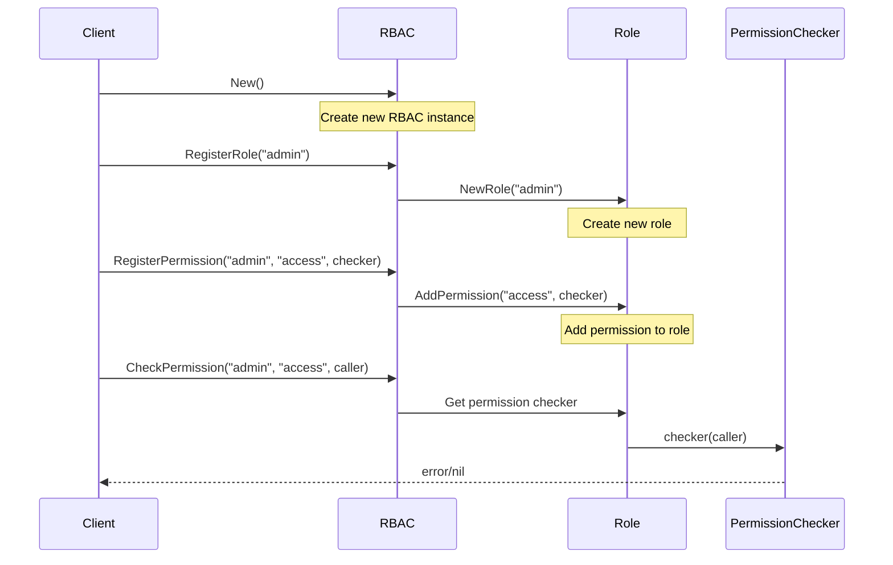

# RBAC (Role-Based Access Control)

The RBAC is a flexible and upgradeable role-based access control system for Gno smart contracts. This package decouples authorization logic from fixed addresses, enabling dynamic registration, update, and removal of roles and permissions.

## Key Features

- **Dynamic Role Management**: Roles can be registered and permissions can be assigned at runtime without contract redeployment
- **Multiple Permissions per Role**: A single role can have multiple permissions
- **Declarative Role Definition**: Supports declarative role and permission definition through Functional Option pattern
- **Flexible Validation**: Permission checkers can implement custom logic, supporting various access control policies

## API Overview

### Key Types and Methods

```go
// Create new RBAC manager
func New() *RBAC

// Register role
func (rb *RBAC) RegisterRole(roleName string) error

// Register permission
func (rb *RBAC) RegisterPermission(roleName, permissionName string, checker PermissionChecker) error

// Check permission
func (rb *RBAC) CheckPermission(roleName, permissionName string, caller Address) error

// Update permission
func (rb *RBAC) UpdatePermission(roleName, permissionName string, newChecker PermissionChecker) error

// Remove permission
func (rb *RBAC) RemovePermission(roleName, permissionName string) error

// Declarative role registration
func (rb *RBAC) DeclareRole(roleName string, opts ...RoleOption) error

// Permission checker function type
type PermissionChecker func(caller std.Address) error
```

## Sequence of RBAC Flow



## Usage Example

```go
// Create RBAC manager
manager := rbac.New()

// Register admin role
err := manager.RegisterRole("admin")
if err != nil {
    panic(err)
}

// Register admin permission
adminChecker := func(caller std.Address) error {
    if caller != adminAddr {
        return ufmt.Errorf("caller is not admin")
    }
    return nil
}
err = manager.RegisterPermission("admin", "access", adminChecker)
if err != nil {
    panic(err)
}

// Register editor role declaratively
editorChecker := func(caller std.Address) error {
    if caller != editorAddr {
        return ufmt.Errorf("caller is not editor")
    }
    return nil
}
err = manager.DeclareRole("editor", 
    rbac.WithPermission("edit", editorChecker))
if err != nil {
    panic(err)
}

// Check permission
err = manager.CheckPermission("admin", "access", adminAddr)
if err != nil {
    println("Access denied:", err)
} else {
    println("Access granted")
}
```

## Limitations

- RBAC does not directly map addresses to roles; instead, it validates the caller through permission checking functions registered to roles
- Address validation relies on the logic within each `PermissionChecker`
- Integration with other modules may require additional mapping between addresses and roles

The sequence diagram above illustrates the typical flow of the RBAC system.
