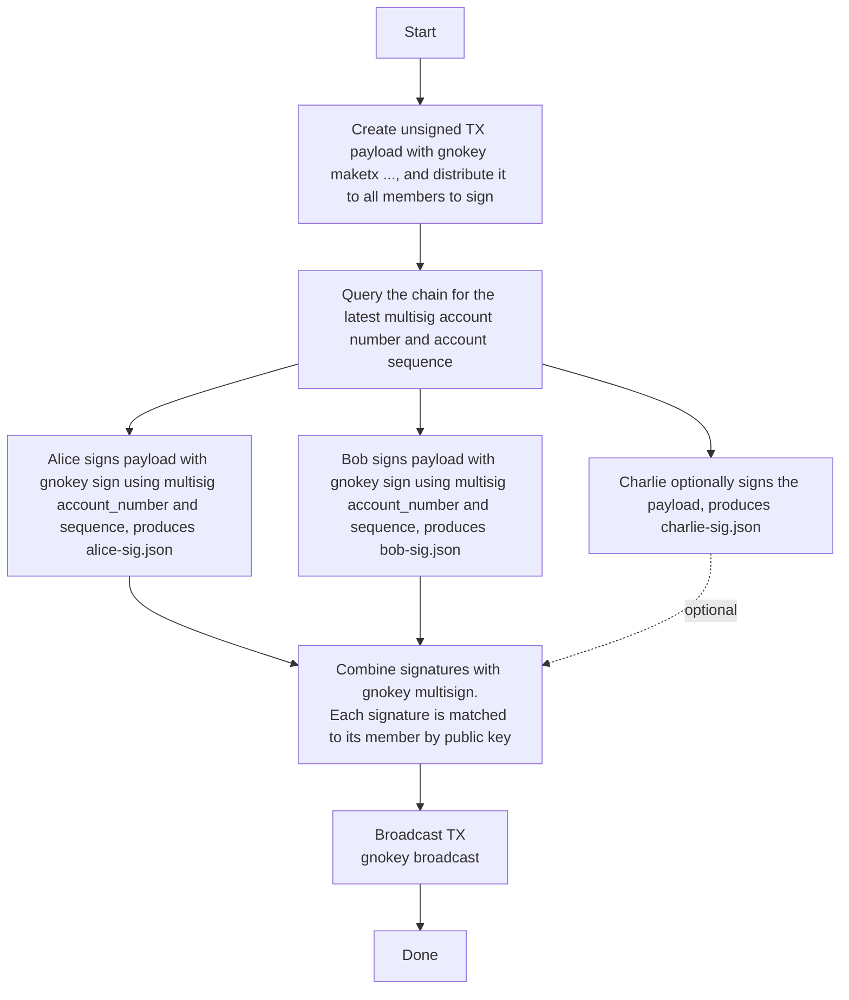

# gnokey

`gnokey` is a tool for managing https://gno.land accounts and interact with instances.

## Install `gnokey`

    $> git clone git@github.com:gnolang/gno.git
    $> cd ./gno
    $> make install.gnokey

Also, see the [quickstart guide](../../../docs/users/using-gnokey.md).
For every command, transaction type, and query, see the
[command reference](../../../docs/resources/gnokey-reference.md).

## Manual Entropy Generation

For maximum security, you can provide your own entropy instead of relying on
computer-generated randomness. Manual entropy generation creates a solemn ritual
that emphasizes the importance of randomness in key generation. This method
ensures your private key's randomness comes from physical sources rather than
computer algorithms. Your input is SHA-256 hashed into the entropy the mnemonic
is built from, so the same input always produces the same mnemonic.

```bash
# Interactive entropy input
gnokey add mykey --entropy

# Masked input (hides characters as you type)
gnokey add mykey --entropy --masked
```

### Instructions

Generate true random entropy using ONE of these methods:

• **Dice**: Roll a D20 (20-sided die) exactly 42 times
  Example: `18 7 3 12 5 19 8 2 14 11 20 1 9 15 4 13 6 17 10 16 3 8 12 19 2 7 14 5 11 18 1 20 9 4 15 13 17 6 10 16 3 11`

• **Cards**: Shuffle a standard 52-card deck 20 times, then record the full deck order
  Example: `AS 2H 7C KD 3S 9H QC 4D JH 10S 5C 8H AC 2D 7S KH 3C 9D QS 4H JS 10C 5D 8S AH 2C 7D KC 3H 9S QD 4C JC 10H 5S 8D AD 2S 7H KS 3D 9C QH 4S JD 10D 5H 8C 6S 6H 6D 6C`

## Session

`gnokey maketx session` manages session accounts, a type of subaccount that a
master key authorizes to sign specific message types on its behalf. Session
accounts are useful for agents and device-login flows where the master key
should not sign every transaction.

### `session create`

Creates a session account authorized by a master key. Its flags are:

- `-pubkey` - the session subaccount's public key in bech32 format (`gpub1...`,
  not a `g1...` address)
- `-expires-at` - session expiry: a duration (`24h`, `7d`, `4w`; max ~4y), a
  unix timestamp, or `none` for no expiry (required)
- `-allow-paths` - per-message restrictions (required, repeatable). Use `*` for
  unrestricted, or list specific entries like `vm/exec:gno.land/r/foo`,
  `vm/run`, `bank/send`
- `-spend-limit` - max spend per period, gas fees included, as coins such as
  `1000000ugnot`. Omitted, the session can spend nothing, not even gas, so it
  signs only where another signer pays the fees; a limit without `ugnot` is the
  same for gas
- `-spend-period` - seconds; `0` = lifetime cap

```bash
gnokey maketx session create \
  -pubkey gpub1... \
  -expires-at 24h \
  -allow-paths "vm/exec:gno.land/r/myrealm" \
  -spend-limit 10000000ugnot \
  -gas-fee 1000000ugnot -gas-wanted 2000000 \
  -chainid staging \
  -remote "https://rpc.staging.gno.land:443" \
  masterkey
```

`-master` cannot be used with `session create`: the master key signs it
directly. Once the session exists, any `maketx` command signed with the session
key takes `-master <master key name or address>`, and
`gnokey query auth/accounts/<master address>/sessions` lists the master's
sessions.

### `session revoke`

Revokes a single session account by its public key:

```bash
gnokey maketx session revoke \
  -pubkey gpub1... \
  -gas-fee 1000000ugnot -gas-wanted 2000000 \
  -chainid staging \
  -remote "https://rpc.staging.gno.land:443" \
  masterkey
```

### `session revokeall`

Revokes all session accounts for the master key:

```bash
gnokey maketx session revokeall \
  -gas-fee 1000000ugnot -gas-wanted 2000000 \
  -chainid staging \
  -remote "https://rpc.staging.gno.land:443" \
  masterkey
```

## Airgapped signing

`gnokey` can split a transaction's creation, signing, and broadcasting across two
machines. Signing on an
[airgapped](https://en.wikipedia.org/wiki/Air_gap_(networking)) machine keeps
your private key away from internet-borne attacks; it never touches the online
machine. The flow uses one online machine (`A`) and one offline (`B`):

1. `A` (online): fetch account information from the chain
2. `B` (offline): build the unsigned transaction
3. `B` (offline): sign it
4. `A` (online): broadcast it

**1. Fetch account information.** Query [`auth/accounts`](../../../docs/resources/gnokey-reference.md#authaccounts) for the
signing address and note its `account_number` and `sequence`. Both are folded into
the signature to prevent replay, so signing needs them:

```bash
gnokey query auth/accounts/<your_address> -remote "https://rpc.staging.gno.land:443"
```

**2. Build the unsigned transaction.** Any `maketx` with `-broadcast=false` prints
the transaction, with `"signatures":null`, to standard output instead of
sending it; redirect the output to a file:

```bash
gnokey maketx call \
  -pkgpath "gno.land/r/demo/counter" -func "Increment" \
  -gas-fee 1000000ugnot -gas-wanted 2000000 \
  -broadcast=false \
  mykey > counter.tx
```

**3. Sign it.** `gnokey sign` fills in the signature, using the account number
and sequence from step 1. Optional flags:

- `-output-document <file>` - write the signature to a separate file, used for
  [multisig](#multisig-k-of-n) signing
- `-session` - mark the named key as a [session](#session) key

```bash
gnokey sign \
  -tx-path counter.tx -chainid "staging" \
  -account-number 468 -account-sequence 0 \
  mykey
```

**4. Broadcast it.** Back on the online machine, send the signed file. No key is
needed here, since the transaction is already signed:

```bash
gnokey broadcast -remote "https://rpc.staging.gno.land:443" counter.tx
```

`broadcast` also takes `-dry-run` to simulate the broadcast without committing.

### Verifying a signature

`gnokey verify` checks a transaction's signature without broadcasting it. The
node runs the same check on broadcast, so `verify` is for the standalone cases:

- confirming a signature file received from a [multisig](#multisig-k-of-n)
  member before combining
- proving a transaction file was signed by a given address

Flags:

- `-tx-path` - the transaction file to verify
- `-sig-path` - a separate signature file, as written by `sign -output-document`
  (optional; without it, verifies the first signature embedded in the
  transaction)
- `-chainid`, `-account-number`, `-account-sequence` - must match the values
  used at signing. Any left unset are queried from `-remote`; offline, pass all
  three explicitly.

The key argument is a name or address in the local keybase; a watch-only
`add bech32` entry is enough.

**Online**:

```bash
gnokey verify -tx-path counter.tx -remote https://rpc.staging.gno.land:443 mykey
```

**Offline, or after broadcast**, pass all three, since broadcasting bumps the
sequence the online form queries:

```bash
gnokey verify -tx-path counter.tx \
  -chainid "staging" -account-number 468 -account-sequence 0 \
  mykey
```

A multisig member's signature file was signed with the multisig account's
number and sequence, while the online form looks up the key argument's own
account, so pass the multisig's values explicitly:

```bash
gnokey verify -tx-path multisig-abc-send.json -sig-path alice-sig.json \
  -chainid staging \
  -account-number "$MULTISIG_ACC_NUM" -account-sequence "$MULTISIG_ACC_SEQ" \
  --home ./alice-kb alice
```

A valid signature prints `Valid signature!` with the signing address, public
key, and signature; anything else exits with an error.

## Multisig (k-of-n)

A k-of-n multisig spends only when k of its n member keys sign. The example below
is a 2-of-3 between Alice, Bob, and Charlie.

> [!NOTE]
> **Same members, same address**
>
> A multisig is defined by its **member keys and threshold**. `add multisig` sorts
> members by address before deriving the key, so the same member set and threshold
> give every participant the same address, whatever the `--multisig` flag order.
> With `-nosort`, the supplied order defines the key, and every participant must
> use the same one.
>
> Signatures are matched to members by public key: each must come from a defined
> member, and `multisign` accepts them in any order.

### 1. Each participant builds the multisig key

In their own keybase, every signer needs their own private key, the other members'
public keys (added as bech32 keys), and agreement on the member set and
threshold. Alice's keybase looks like this:

```sh
# Recover Alice's private key
printf '%s\n\n\n' "$ALICE_MNEMONIC" | gnokey add --recover alice --home ./alice-kb -insecure-password-stdin -quiet

# Add the other members' pubkeys
gnokey add bech32 --home ./alice-kb -pubkey "$BOB_PUBKEY" multisig-bob
gnokey add bech32 --home ./alice-kb -pubkey "$CHARLIE_PUBKEY" multisig-charlie

# Create the 2-of-3 multisig
gnokey add multisig --home ./alice-kb \
  --multisig alice --multisig multisig-bob --multisig multisig-charlie \
  -threshold 2 \
  multisig-abc
```

Bob and Charlie do the same in their own keybases, each holding their own private
key where Alice holds a pubkey.

### 2. Create the transaction and sign it

Any participant builds the unsigned transaction once, from the multisig account,
and shares the JSON with the signers:

```sh
gnokey maketx send --home ./alice-kb \
  -chainid staging -send "100000ugnot" \
  -gas-fee 100000ugnot -gas-wanted 100000 \
  -to g1pm60rkcvkt4j6s24vgygyfuu3c2f5gt76lqtss \
  -broadcast=false \
  multisig-abc > multisig-abc-send.json
```

Each signer signs with the **multisig** account's `account_number` and `sequence`,
fetched as in [airgapped signing](#airgapped-signing) step 1 on the multisig
address, not their own, and writes a separate signature document:

```sh
printf '\n\n' | gnokey sign --tx-path multisig-abc-send.json --home ./alice-kb alice \
  -chainid staging \
  --account-number "$MULTISIG_ACC_NUM" --account-sequence "$MULTISIG_ACC_SEQ" \
  -insecure-password-stdin -quiet --output-document alice-sig.json
```

Bob does the same against his keybase for `bob-sig.json`. Two signatures satisfy
the 2-of-3, so Charlie's is optional.

### 3. Combine signatures and broadcast

`gnokey multisign` merges the signatures, run from any keybase that holds
`multisig-abc`:

```sh
gnokey multisign --tx-path multisig-abc-send.json --home ./alice-kb \
  --signature alice-sig.json --signature bob-sig.json \
  multisig-abc

gnokey broadcast -remote "https://rpc.staging.gno.land:443" multisig-abc-send.json
```



## Exporting and importing keys

`gnokey export` writes a private key as encrypted armor, and `gnokey import`
reads it back into a keybase. These are the key-transfer commands for airgapped
workflows and keybase migration.

### `export`

```bash
gnokey export -key mykey -output-path mykey-armor.txt
```

Flags:

- `-key` - the key name or bech32 address to export
- `-output-path` - where to write the encrypted armor file

### `import`

```bash
gnokey import -name mykey -armor-path mykey-armor.txt
```

Flags:

- `-name` - the name to store the imported key under
- `-armor-path` - path to the encrypted armor file

## Building gnokey for an airgapped machine

To run `gnokey` on an airgapped machine, build it on a trusted online machine,
verify the binary, and carry it across offline.

**Match the target's OS and arch.** Read the target with `uname -s` and
`uname -m` (`x86_64` → `GOARCH=amd64`, `aarch64`/`arm64` → `GOARCH=arm64`), and
set `GOOS`/`GOARCH` if your build machine differs.

**Ledger needs CGO.** Ledger support requires `CGO_ENABLED=1`, which is off by
default in this repo (see [#2737](https://github.com/gnolang/gno/issues/2737)).
Cross-compiling with CGO is painful, so the simplest reliable path is to build on a
machine matching the target's OS, arch, and glibc baseline.

Build from a known commit. `make build.gnokey` stamps the version string
automatically:

```bash
git clone https://github.com/gnolang/gno.git && cd gno/gno.land
git checkout <commit>
make build.gnokey
./build/gnokey version   # sanity-check
```

Record what you built, checksum it, and bundle it for transfer:

```bash
git rev-parse HEAD > build/gnokey.gitrev
sha256sum build/gnokey > build/gnokey.sha256

tar -czf gnokey-airgap.tgz -C build gnokey gnokey.sha256 gnokey.gitrev
sha256sum gnokey-airgap.tgz > gnokey-airgap.tgz.sha256
```

Copy the `.tgz` and its checksum to offline media. On the airgapped machine, verify
before use:

```bash
sha256sum -c gnokey-airgap.tgz.sha256
tar -xzf gnokey-airgap.tgz
sha256sum -c gnokey.sha256
./gnokey version
```

> [!WARNING]
> **CGO builds carry dynamic dependencies**
>
> A `CGO_ENABLED=1` binary may depend on system libraries (glibc and friends). If it
> won't start on the airgapped box with missing shared libraries, the build
> environment doesn't match the target closely enough: rebuild on the same
> distro/glibc baseline, or install the runtime libraries there through your offline
> package process.
