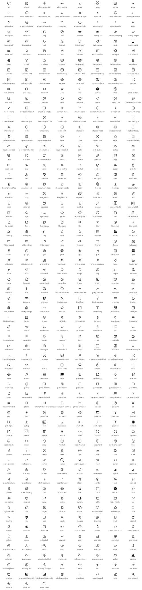

# gnoweb icons

<!-- Generated by `make icons` from the icon registry. DO NOT EDIT. -->

Write `<gno-icon name="star" />` anywhere inline markdown goes: a heading,
a paragraph, a list item, a table cell, a link label. Add
`label="…"` when the icon carries meaning on its own, so screen readers
announce it; leave it out for a decorative icon.

```markdown
## <gno-icon name="rocket" /> Launch

Status: <gno-icon name="check-circle" label="Verified" />

[<gno-icon name="book" /> Read the docs](/r/docs)
```

Rules:

- One line, self-closing: `<gno-icon name="star" />`. A tag that is not
  self-closing, or whose name is missing or unknown, renders nothing but an
  HTML comment saying why.
- Names are lowercase, exactly as listed below.
- Keep the tag under 512 bytes. In a table cell, write a `|` in a label as
  `\|`.
- A link or heading holding only an icon needs `label`: it is its only name.
  Such a heading has no text, so it gets no table-of-contents entry.

To add an icon, list it in `icons/icons.txt` and run `make icons`.



491 icons:

| Icon | Name |
|---|---|
| <gno-icon name="ai" /> | `ai` |
| <gno-icon name="alarm" /> | `alarm` |
| <gno-icon name="align-horizontal" /> | `align-horizontal` |
| <gno-icon name="align-vertical" /> | `align-vertical` |
| <gno-icon name="angle" /> | `angle` |
| <gno-icon name="apps" /> | `apps` |
| <gno-icon name="archive" /> | `archive` |
| <gno-icon name="arrow" /> | `arrow` |
| <gno-icon name="arrow-down" /> | `arrow-down` |
| <gno-icon name="arrow-down-circle" /> | `arrow-down-circle` |
| <gno-icon name="arrow-down-left" /> | `arrow-down-left` |
| <gno-icon name="arrow-down-outline" /> | `arrow-down-outline` |
| <gno-icon name="arrow-down-right" /> | `arrow-down-right` |
| <gno-icon name="arrow-left" /> | `arrow-left` |
| <gno-icon name="arrow-left-circle" /> | `arrow-left-circle` |
| <gno-icon name="arrow-left-outline" /> | `arrow-left-outline` |
| <gno-icon name="arrow-right" /> | `arrow-right` |
| <gno-icon name="arrow-right-circle" /> | `arrow-right-circle` |
| <gno-icon name="arrow-right-outline" /> | `arrow-right-outline` |
| <gno-icon name="arrow-up" /> | `arrow-up` |
| <gno-icon name="arrow-up-circle" /> | `arrow-up-circle` |
| <gno-icon name="arrow-up-left" /> | `arrow-up-left` |
| <gno-icon name="arrow-up-right" /> | `arrow-up-right` |
| <gno-icon name="audio" /> | `audio` |
| <gno-icon name="backspace" /> | `backspace` |
| <gno-icon name="backward" /> | `backward` |
| <gno-icon name="bag" /> | `bag` |
| <gno-icon name="ban" /> | `ban` |
| <gno-icon name="battery" /> | `battery` |
| <gno-icon name="battery-75" /> | `battery-75` |
| <gno-icon name="battery-charging" /> | `battery-charging` |
| <gno-icon name="battery-empty" /> | `battery-empty` |
| <gno-icon name="battery-half" /> | `battery-half` |
| <gno-icon name="battery-low" /> | `battery-low` |
| <gno-icon name="bell" /> | `bell` |
| <gno-icon name="bell-off" /> | `bell-off` |
| <gno-icon name="bell-ringing" /> | `bell-ringing` |
| <gno-icon name="bell-snooze" /> | `bell-snooze` |
| <gno-icon name="book" /> | `book` |
| <gno-icon name="book-closed" /> | `book-closed` |
| <gno-icon name="book-text" /> | `book-text` |
| <gno-icon name="bookmark" /> | `bookmark` |
| <gno-icon name="bookmark-book" /> | `bookmark-book` |
| <gno-icon name="box" /> | `box` |
| <gno-icon name="box-add" /> | `box-add` |
| <gno-icon name="box-download" /> | `box-download` |
| <gno-icon name="box-open" /> | `box-open` |
| <gno-icon name="box-remove" /> | `box-remove` |
| <gno-icon name="boxes" /> | `boxes` |
| <gno-icon name="branch" /> | `branch` |
| <gno-icon name="briefcase" /> | `briefcase` |
| <gno-icon name="browser" /> | `browser` |
| <gno-icon name="browser-alt" /> | `browser-alt` |
| <gno-icon name="button-add" /> | `button-add` |
| <gno-icon name="button-minus" /> | `button-minus` |
| <gno-icon name="calculator" /> | `calculator` |
| <gno-icon name="calendar" /> | `calendar` |
| <gno-icon name="calendar-add" /> | `calendar-add` |
| <gno-icon name="calendar-date" /> | `calendar-date` |
| <gno-icon name="calendar-day" /> | `calendar-day` |
| <gno-icon name="calendar-days" /> | `calendar-days` |
| <gno-icon name="calendar-last-day" /> | `calendar-last-day` |
| <gno-icon name="calendar-month" /> | `calendar-month` |
| <gno-icon name="calendar-move" /> | `calendar-move` |
| <gno-icon name="calendar-remove" /> | `calendar-remove` |
| <gno-icon name="calendar-split" /> | `calendar-split` |
| <gno-icon name="calendar-week" /> | `calendar-week` |
| <gno-icon name="camera" /> | `camera` |
| <gno-icon name="camera-alt" /> | `camera-alt` |
| <gno-icon name="camera-noflash" /> | `camera-noflash` |
| <gno-icon name="camera-noflash-alt" /> | `camera-noflash-alt` |
| <gno-icon name="capture" /> | `capture` |
| <gno-icon name="card-timeline" /> | `card-timeline` |
| <gno-icon name="card-view" /> | `card-view` |
| <gno-icon name="carousel" /> | `carousel` |
| <gno-icon name="cart" /> | `cart` |
| <gno-icon name="cast" /> | `cast` |
| <gno-icon name="caution" /> | `caution` |
| <gno-icon name="chain" /> | `chain` |
| <gno-icon name="chain-outline" /> | `chain-outline` |
| <gno-icon name="chart-bar" /> | `chart-bar` |
| <gno-icon name="chart-line" /> | `chart-line` |
| <gno-icon name="chart-pie" /> | `chart-pie` |
| <gno-icon name="chat" /> | `chat` |
| <gno-icon name="chat-add" /> | `chat-add` |
| <gno-icon name="check" /> | `check` |
| <gno-icon name="check-circle" /> | `check-circle` |
| <gno-icon name="check-circle-outside" /> | `check-circle-outside` |
| <gno-icon name="check-outline" /> | `check-outline` |
| <gno-icon name="checkbox-checked" /> | `checkbox-checked` |
| <gno-icon name="checkbox-empty" /> | `checkbox-empty` |
| <gno-icon name="chevron-close" /> | `chevron-close` |
| <gno-icon name="chevron-down" /> | `chevron-down` |
| <gno-icon name="chevron-down-circle" /> | `chevron-down-circle` |
| <gno-icon name="chevron-left" /> | `chevron-left` |
| <gno-icon name="chevron-left-circle" /> | `chevron-left-circle` |
| <gno-icon name="chevron-open" /> | `chevron-open` |
| <gno-icon name="chevron-right" /> | `chevron-right` |
| <gno-icon name="chevron-right-circle" /> | `chevron-right-circle` |
| <gno-icon name="chevron-up" /> | `chevron-up` |
| <gno-icon name="chevron-up-circle" /> | `chevron-up-circle` |
| <gno-icon name="chevrons-down" /> | `chevrons-down` |
| <gno-icon name="chevrons-left" /> | `chevrons-left` |
| <gno-icon name="chevrons-right" /> | `chevrons-right` |
| <gno-icon name="chevrons-up" /> | `chevrons-up` |
| <gno-icon name="circle" /> | `circle` |
| <gno-icon name="circle-menu" /> | `circle-menu` |
| <gno-icon name="circle-split" /> | `circle-split` |
| <gno-icon name="clipboard" /> | `clipboard` |
| <gno-icon name="clipboard-add" /> | `clipboard-add` |
| <gno-icon name="clipboard-check" /> | `clipboard-check` |
| <gno-icon name="clipboard-copy" /> | `clipboard-copy` |
| <gno-icon name="clipboard-cross" /> | `clipboard-cross` |
| <gno-icon name="clipboard-notes" /> | `clipboard-notes` |
| <gno-icon name="clipboard-remove" /> | `clipboard-remove` |
| <gno-icon name="clock" /> | `clock` |
| <gno-icon name="close" /> | `close` |
| <gno-icon name="close-circle" /> | `close-circle` |
| <gno-icon name="cloud" /> | `cloud` |
| <gno-icon name="cloud-disconnect" /> | `cloud-disconnect` |
| <gno-icon name="cloud-download" /> | `cloud-download` |
| <gno-icon name="cloud-download-alt" /> | `cloud-download-alt` |
| <gno-icon name="cloud-upload" /> | `cloud-upload` |
| <gno-icon name="cloud-upload-alt" /> | `cloud-upload-alt` |
| <gno-icon name="code" /> | `code` |
| <gno-icon name="code-outline" /> | `code-outline` |
| <gno-icon name="coffee" /> | `coffee` |
| <gno-icon name="coin" /> | `coin` |
| <gno-icon name="coins" /> | `coins` |
| <gno-icon name="compass" /> | `compass` |
| <gno-icon name="component-add" /> | `component-add` |
| <gno-icon name="contacts" /> | `contacts` |
| <gno-icon name="content" /> | `content` |
| <gno-icon name="contract" /> | `contract` |
| <gno-icon name="copy" /> | `copy` |
| <gno-icon name="create" /> | `create` |
| <gno-icon name="credit-card" /> | `credit-card` |
| <gno-icon name="crop" /> | `crop` |
| <gno-icon name="cross" /> | `cross` |
| <gno-icon name="cross-outline" /> | `cross-outline` |
| <gno-icon name="crosshair" /> | `crosshair` |
| <gno-icon name="cube" /> | `cube` |
| <gno-icon name="cubes" /> | `cubes` |
| <gno-icon name="cylinder" /> | `cylinder` |
| <gno-icon name="database" /> | `database` |
| <gno-icon name="ddl" /> | `ddl` |
| <gno-icon name="diamond" /> | `diamond` |
| <gno-icon name="directions" /> | `directions` |
| <gno-icon name="disc" /> | `disc` |
| <gno-icon name="display-alt" /> | `display-alt` |
| <gno-icon name="docs" /> | `docs` |
| <gno-icon name="document" /> | `document` |
| <gno-icon name="document-justified" /> | `document-justified` |
| <gno-icon name="document-list" /> | `document-list` |
| <gno-icon name="document-stack" /> | `document-stack` |
| <gno-icon name="document-words" /> | `document-words` |
| <gno-icon name="door" /> | `door` |
| <gno-icon name="door-alt" /> | `door-alt` |
| <gno-icon name="download" /> | `download` |
| <gno-icon name="download-alt" /> | `download-alt` |
| <gno-icon name="downward" /> | `downward` |
| <gno-icon name="drag" /> | `drag` |
| <gno-icon name="drag-circle" /> | `drag-circle` |
| <gno-icon name="drag-vertical" /> | `drag-vertical` |
| <gno-icon name="duplicate" /> | `duplicate` |
| <gno-icon name="duplicate-alt" /> | `duplicate-alt` |
| <gno-icon name="earth" /> | `earth` |
| <gno-icon name="edit" /> | `edit` |
| <gno-icon name="enter" /> | `enter` |
| <gno-icon name="enter-alt" /> | `enter-alt` |
| <gno-icon name="episodes" /> | `episodes` |
| <gno-icon name="exit" /> | `exit` |
| <gno-icon name="exit-left" /> | `exit-left` |
| <gno-icon name="expand" /> | `expand` |
| <gno-icon name="expand-height" /> | `expand-height` |
| <gno-icon name="expand-width" /> | `expand-width` |
| <gno-icon name="external" /> | `external` |
| <gno-icon name="eye" /> | `eye` |
| <gno-icon name="eye-closed" /> | `eye-closed` |
| <gno-icon name="eye-no" /> | `eye-no` |
| <gno-icon name="face-delighted" /> | `face-delighted` |
| <gno-icon name="face-neutral" /> | `face-neutral` |
| <gno-icon name="file" /> | `file` |
| <gno-icon name="file-download" /> | `file-download` |
| <gno-icon name="file-upload" /> | `file-upload` |
| <gno-icon name="files" /> | `files` |
| <gno-icon name="files-history" /> | `files-history` |
| <gno-icon name="files-stack" /> | `files-stack` |
| <gno-icon name="film" /> | `film` |
| <gno-icon name="filter" /> | `filter` |
| <gno-icon name="filter-circle" /> | `filter-circle` |
| <gno-icon name="filter-single" /> | `filter-single` |
| <gno-icon name="filtering" /> | `filtering` |
| <gno-icon name="fingerprint" /> | `fingerprint` |
| <gno-icon name="flag" /> | `flag` |
| <gno-icon name="flame" /> | `flame` |
| <gno-icon name="flame-alt" /> | `flame-alt` |
| <gno-icon name="flip-view" /> | `flip-view` |
| <gno-icon name="folder" /> | `folder` |
| <gno-icon name="folder-add" /> | `folder-add` |
| <gno-icon name="folder-closed" /> | `folder-closed` |
| <gno-icon name="folder-minus" /> | `folder-minus` |
| <gno-icon name="folder-open" /> | `folder-open` |
| <gno-icon name="fork" /> | `fork` |
| <gno-icon name="forward" /> | `forward` |
| <gno-icon name="frame" /> | `frame` |
| <gno-icon name="frown" /> | `frown` |
| <gno-icon name="fullscreen" /> | `fullscreen` |
| <gno-icon name="funnel" /> | `funnel` |
| <gno-icon name="gauge" /> | `gauge` |
| <gno-icon name="gift" /> | `gift` |
| <gno-icon name="globe" /> | `globe` |
| <gno-icon name="gps" /> | `gps` |
| <gno-icon name="grab" /> | `grab` |
| <gno-icon name="graph-box" /> | `graph-box` |
| <gno-icon name="grid" /> | `grid` |
| <gno-icon name="grid-circles" /> | `grid-circles` |
| <gno-icon name="grid-circles-add" /> | `grid-circles-add` |
| <gno-icon name="grid-outline" /> | `grid-outline` |
| <gno-icon name="grid-small" /> | `grid-small` |
| <gno-icon name="grid-squares" /> | `grid-squares` |
| <gno-icon name="grid-squares-add" /> | `grid-squares-add` |
| <gno-icon name="hand" /> | `hand` |
| <gno-icon name="harddrive" /> | `harddrive` |
| <gno-icon name="hash" /> | `hash` |
| <gno-icon name="heart" /> | `heart` |
| <gno-icon name="heart-rate" /> | `heart-rate` |
| <gno-icon name="heart-remove" /> | `heart-remove` |
| <gno-icon name="height" /> | `height` |
| <gno-icon name="help" /> | `help` |
| <gno-icon name="helper" /> | `helper` |
| <gno-icon name="hierarchy" /> | `hierarchy` |
| <gno-icon name="home" /> | `home` |
| <gno-icon name="home-alt" /> | `home-alt` |
| <gno-icon name="home-check" /> | `home-check` |
| <gno-icon name="home-door" /> | `home-door` |
| <gno-icon name="image" /> | `image` |
| <gno-icon name="import" /> | `import` |
| <gno-icon name="important" /> | `important` |
| <gno-icon name="inbox" /> | `inbox` |
| <gno-icon name="inbox-alt" /> | `inbox-alt` |
| <gno-icon name="info" /> | `info` |
| <gno-icon name="info-circle" /> | `info-circle` |
| <gno-icon name="info-circle-outline" /> | `info-circle-outline` |
| <gno-icon name="iphone-landscape" /> | `iphone-landscape` |
| <gno-icon name="iphone-portrait" /> | `iphone-portrait` |
| <gno-icon name="jump-backward" /> | `jump-backward` |
| <gno-icon name="jump-forward" /> | `jump-forward` |
| <gno-icon name="jump-left" /> | `jump-left` |
| <gno-icon name="jump-right" /> | `jump-right` |
| <gno-icon name="key" /> | `key` |
| <gno-icon name="keyboard" /> | `keyboard` |
| <gno-icon name="kind-bool" /> | `kind-bool` |
| <gno-icon name="kind-closure" /> | `kind-closure` |
| <gno-icon name="kind-func" /> | `kind-func` |
| <gno-icon name="kind-interface" /> | `kind-interface` |
| <gno-icon name="kind-map" /> | `kind-map` |
| <gno-icon name="kind-nil" /> | `kind-nil` |
| <gno-icon name="kind-number" /> | `kind-number` |
| <gno-icon name="kind-package" /> | `kind-package` |
| <gno-icon name="kind-pointer" /> | `kind-pointer` |
| <gno-icon name="kind-ref" /> | `kind-ref` |
| <gno-icon name="kind-slice" /> | `kind-slice` |
| <gno-icon name="kind-string" /> | `kind-string` |
| <gno-icon name="kind-struct" /> | `kind-struct` |
| <gno-icon name="kind-type" /> | `kind-type` |
| <gno-icon name="kind-unknown" /> | `kind-unknown` |
| <gno-icon name="laptop" /> | `laptop` |
| <gno-icon name="layers" /> | `layers` |
| <gno-icon name="lightbulb" /> | `lightbulb` |
| <gno-icon name="lightbulb-on" /> | `lightbulb-on` |
| <gno-icon name="lightning" /> | `lightning` |
| <gno-icon name="lightning-alt" /> | `lightning-alt` |
| <gno-icon name="lineweight" /> | `lineweight` |
| <gno-icon name="link" /> | `link` |
| <gno-icon name="link-alt" /> | `link-alt` |
| <gno-icon name="link-broken" /> | `link-broken` |
| <gno-icon name="link-horizontal" /> | `link-horizontal` |
| <gno-icon name="link-outline" /> | `link-outline` |
| <gno-icon name="link-vertical" /> | `link-vertical` |
| <gno-icon name="list" /> | `list` |
| <gno-icon name="list-add" /> | `list-add` |
| <gno-icon name="list-numbered" /> | `list-numbered` |
| <gno-icon name="list-outline" /> | `list-outline` |
| <gno-icon name="loader" /> | `loader` |
| <gno-icon name="location" /> | `location` |
| <gno-icon name="lock" /> | `lock` |
| <gno-icon name="mail" /> | `mail` |
| <gno-icon name="mail-add" /> | `mail-add` |
| <gno-icon name="mail-delete" /> | `mail-delete` |
| <gno-icon name="mail-minus" /> | `mail-minus` |
| <gno-icon name="mail-new" /> | `mail-new` |
| <gno-icon name="mail-open" /> | `mail-open` |
| <gno-icon name="mail-remove" /> | `mail-remove` |
| <gno-icon name="map" /> | `map` |
| <gno-icon name="marquee" /> | `marquee` |
| <gno-icon name="maximize" /> | `maximize` |
| <gno-icon name="menu-hamburger" /> | `menu-hamburger` |
| <gno-icon name="menu-horizontal" /> | `menu-horizontal` |
| <gno-icon name="menu-vertical" /> | `menu-vertical` |
| <gno-icon name="message" /> | `message` |
| <gno-icon name="message-writing" /> | `message-writing` |
| <gno-icon name="microphone" /> | `microphone` |
| <gno-icon name="microphone-disabled" /> | `microphone-disabled` |
| <gno-icon name="microphone-muted" /> | `microphone-muted` |
| <gno-icon name="midpoint" /> | `midpoint` |
| <gno-icon name="mini-player" /> | `mini-player` |
| <gno-icon name="minimize" /> | `minimize` |
| <gno-icon name="minus" /> | `minus` |
| <gno-icon name="minus-circle" /> | `minus-circle` |
| <gno-icon name="monitor" /> | `monitor` |
| <gno-icon name="moon" /> | `moon` |
| <gno-icon name="moon-outline" /> | `moon-outline` |
| <gno-icon name="more" /> | `more` |
| <gno-icon name="move" /> | `move` |
| <gno-icon name="music" /> | `music` |
| <gno-icon name="newspaper" /> | `newspaper` |
| <gno-icon name="note" /> | `note` |
| <gno-icon name="notebook" /> | `notebook` |
| <gno-icon name="notification" /> | `notification` |
| <gno-icon name="nut" /> | `nut` |
| <gno-icon name="order-asc" /> | `order-asc` |
| <gno-icon name="order-desc" /> | `order-desc` |
| <gno-icon name="pages" /> | `pages` |
| <gno-icon name="panel-bottom" /> | `panel-bottom` |
| <gno-icon name="panel-center" /> | `panel-center` |
| <gno-icon name="panel-left" /> | `panel-left` |
| <gno-icon name="panel-right" /> | `panel-right` |
| <gno-icon name="panel-sectioned" /> | `panel-sectioned` |
| <gno-icon name="panel-top" /> | `panel-top` |
| <gno-icon name="paper" /> | `paper` |
| <gno-icon name="paper-folded" /> | `paper-folded` |
| <gno-icon name="paper-plane-alt" /> | `paper-plane-alt` |
| <gno-icon name="paperclip" /> | `paperclip` |
| <gno-icon name="paragraph" /> | `paragraph` |
| <gno-icon name="paragraph-center" /> | `paragraph-center` |
| <gno-icon name="paragraph-end" /> | `paragraph-end` |
| <gno-icon name="paragraph-right" /> | `paragraph-right` |
| <gno-icon name="paragraph-start" /> | `paragraph-start` |
| <gno-icon name="phone" /> | `phone` |
| <gno-icon name="phone-landscape" /> | `phone-landscape` |
| <gno-icon name="pie-half" /> | `pie-half` |
| <gno-icon name="pie-third" /> | `pie-third` |
| <gno-icon name="pill" /> | `pill` |
| <gno-icon name="play" /> | `play` |
| <gno-icon name="plus" /> | `plus` |
| <gno-icon name="plus-circle" /> | `plus-circle` |
| <gno-icon name="postcard" /> | `postcard` |
| <gno-icon name="printer" /> | `printer` |
| <gno-icon name="projector" /> | `projector` |
| <gno-icon name="pull-down" /> | `pull-down` |
| <gno-icon name="pull-left" /> | `pull-left` |
| <gno-icon name="pull-right" /> | `pull-right` |
| <gno-icon name="pull-up" /> | `pull-up` |
| <gno-icon name="pure" /> | `pure` |
| <gno-icon name="push-down" /> | `push-down` |
| <gno-icon name="push-left" /> | `push-left` |
| <gno-icon name="push-right" /> | `push-right` |
| <gno-icon name="push-up" /> | `push-up` |
| <gno-icon name="radio-on" /> | `radio-on` |
| <gno-icon name="readme" /> | `readme` |
| <gno-icon name="realm" /> | `realm` |
| <gno-icon name="receipt" /> | `receipt` |
| <gno-icon name="record" /> | `record` |
| <gno-icon name="redo" /> | `redo` |
| <gno-icon name="refresh" /> | `refresh` |
| <gno-icon name="refresh-alt" /> | `refresh-alt` |
| <gno-icon name="replicate" /> | `replicate` |
| <gno-icon name="replicate-alt" /> | `replicate-alt` |
| <gno-icon name="reset" /> | `reset` |
| <gno-icon name="reset-alt" /> | `reset-alt` |
| <gno-icon name="reset-forward" /> | `reset-forward` |
| <gno-icon name="reset-hard" /> | `reset-hard` |
| <gno-icon name="reset-temporary" /> | `reset-temporary` |
| <gno-icon name="retweet" /> | `retweet` |
| <gno-icon name="reuse" /> | `reuse` |
| <gno-icon name="reverse" /> | `reverse` |
| <gno-icon name="reverse-alt" /> | `reverse-alt` |
| <gno-icon name="revert" /> | `revert` |
| <gno-icon name="rocket" /> | `rocket` |
| <gno-icon name="rpc" /> | `rpc` |
| <gno-icon name="ruler" /> | `ruler` |
| <gno-icon name="save" /> | `save` |
| <gno-icon name="scale" /> | `scale` |
| <gno-icon name="scale-contract" /> | `scale-contract` |
| <gno-icon name="scale-extend" /> | `scale-extend` |
| <gno-icon name="scalpel" /> | `scalpel` |
| <gno-icon name="search" /> | `search` |
| <gno-icon name="search-outline" /> | `search-outline` |
| <gno-icon name="send" /> | `send` |
| <gno-icon name="server" /> | `server` |
| <gno-icon name="settings" /> | `settings` |
| <gno-icon name="share" /> | `share` |
| <gno-icon name="share-alt" /> | `share-alt` |
| <gno-icon name="shield" /> | `shield` |
| <gno-icon name="shield-check" /> | `shield-check` |
| <gno-icon name="shuffle" /> | `shuffle` |
| <gno-icon name="side-menu" /> | `side-menu` |
| <gno-icon name="signal" /> | `signal` |
| <gno-icon name="signal-low" /> | `signal-low` |
| <gno-icon name="signal-medium" /> | `signal-medium` |
| <gno-icon name="signal-none" /> | `signal-none` |
| <gno-icon name="slash-backward" /> | `slash-backward` |
| <gno-icon name="slash-forward" /> | `slash-forward` |
| <gno-icon name="sliders" /> | `sliders` |
| <gno-icon name="smile" /> | `smile` |
| <gno-icon name="sort" /> | `sort` |
| <gno-icon name="sort-alt" /> | `sort-alt` |
| <gno-icon name="speaker" /> | `speaker` |
| <gno-icon name="speech-typing" /> | `speech-typing` |
| <gno-icon name="split" /> | `split` |
| <gno-icon name="split-three" /> | `split-three` |
| <gno-icon name="star" /> | `star` |
| <gno-icon name="state" /> | `state` |
| <gno-icon name="success" /> | `success` |
| <gno-icon name="sun" /> | `sun` |
| <gno-icon name="sun-outline" /> | `sun-outline` |
| <gno-icon name="support" /> | `support` |
| <gno-icon name="swap" /> | `swap` |
| <gno-icon name="switch" /> | `switch` |
| <gno-icon name="system" /> | `system` |
| <gno-icon name="table" /> | `table` |
| <gno-icon name="table-header" /> | `table-header` |
| <gno-icon name="tag" /> | `tag` |
| <gno-icon name="tag-milestone" /> | `tag-milestone` |
| <gno-icon name="tags" /> | `tags` |
| <gno-icon name="target" /> | `target` |
| <gno-icon name="terminal" /> | `terminal` |
| <gno-icon name="thread" /> | `thread` |
| <gno-icon name="thumbs-down" /> | `thumbs-down` |
| <gno-icon name="thumbs-up" /> | `thumbs-up` |
| <gno-icon name="ticket" /> | `ticket` |
| <gno-icon name="timeline" /> | `timeline` |
| <gno-icon name="tip" /> | `tip` |
| <gno-icon name="todo" /> | `todo` |
| <gno-icon name="toggle" /> | `toggle` |
| <gno-icon name="toggles" /> | `toggles` |
| <gno-icon name="translate" /> | `translate` |
| <gno-icon name="trash" /> | `trash` |
| <gno-icon name="trash-alt" /> | `trash-alt` |
| <gno-icon name="trophy" /> | `trophy` |
| <gno-icon name="tv-mode" /> | `tv-mode` |
| <gno-icon name="unarchive" /> | `unarchive` |
| <gno-icon name="undo" /> | `undo` |
| <gno-icon name="undo-history" /> | `undo-history` |
| <gno-icon name="unfold" /> | `unfold` |
| <gno-icon name="unlink-horizontal" /> | `unlink-horizontal` |
| <gno-icon name="unlink-vertical" /> | `unlink-vertical` |
| <gno-icon name="unlock" /> | `unlock` |
| <gno-icon name="upload" /> | `upload` |
| <gno-icon name="upload-alt" /> | `upload-alt` |
| <gno-icon name="upward" /> | `upward` |
| <gno-icon name="user" /> | `user` |
| <gno-icon name="user-add" /> | `user-add` |
| <gno-icon name="user-circle" /> | `user-circle` |
| <gno-icon name="user-male" /> | `user-male` |
| <gno-icon name="user-male-circle" /> | `user-male-circle` |
| <gno-icon name="user-remove" /> | `user-remove` |
| <gno-icon name="users" /> | `users` |
| <gno-icon name="venn" /> | `venn` |
| <gno-icon name="version" /> | `version` |
| <gno-icon name="versions" /> | `versions` |
| <gno-icon name="video" /> | `video` |
| <gno-icon name="volume" /> | `volume` |
| <gno-icon name="volume-0" /> | `volume-0` |
| <gno-icon name="volume-add" /> | `volume-add` |
| <gno-icon name="volume-disabled" /> | `volume-disabled` |
| <gno-icon name="volume-low" /> | `volume-low` |
| <gno-icon name="volume-minus" /> | `volume-minus` |
| <gno-icon name="volume-muted" /> | `volume-muted` |
| <gno-icon name="wallet" /> | `wallet` |
| <gno-icon name="warning" /> | `warning` |
| <gno-icon name="warning-circle" /> | `warning-circle` |
| <gno-icon name="warning-hex" /> | `warning-hex` |
| <gno-icon name="warning-triangle" /> | `warning-triangle` |
| <gno-icon name="waves" /> | `waves` |
| <gno-icon name="width" /> | `width` |
| <gno-icon name="wifi" /> | `wifi` |
| <gno-icon name="wifi-error" /> | `wifi-error` |
| <gno-icon name="wifi-none" /> | `wifi-none` |
| <gno-icon name="window" /> | `window` |
| <gno-icon name="window-collapse-left" /> | `window-collapse-left` |
| <gno-icon name="window-collapse-right" /> | `window-collapse-right` |
| <gno-icon name="window-content" /> | `window-content` |
| <gno-icon name="wrap-back" /> | `wrap-back` |
| <gno-icon name="wrap-forward" /> | `wrap-forward` |
| <gno-icon name="write" /> | `write` |
| <gno-icon name="zoom-cancel" /> | `zoom-cancel` |
| <gno-icon name="zoom-in" /> | `zoom-in` |
| <gno-icon name="zoom-out" /> | `zoom-out` |
| <gno-icon name="zoom-reset" /> | `zoom-reset` |
