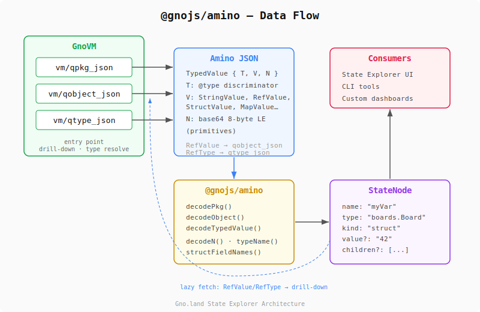

# @gnojs/amino

JavaScript library for decoding Gno's Amino JSON wire format into clean, UI-friendly data structures.

Decodes responses from GnoVM's query endpoints (`vm/qpkg_json`, `vm/qobject_json`, `vm/qtype_json`) into typed `StateNode` trees that any frontend can render — tree views, tables, inspectors, CLI tools.



## What it does

GnoVM persists all realm state as `TypedValue` objects, serialized with Amino JSON. The wire format is rich but complex:

- **Primitives** are stored in a base64-encoded 8-byte `N` field (little-endian), not as plain numbers
- **Strings** are in `V` as `{"@type": "/gno.StringValue", "value": "hello"}`
- **Structs, arrays, maps** are nested `TypedValue` trees with `@type` discriminators
- **Persisted objects** appear as `RefValue{ObjectID}` — must be fetched separately via `qobject_json`
- **Declared types** appear as `RefType{ID}` — field names must be fetched via `qtype_json`
- **Cycles** are broken with `ExportRefValue{":N"}` synthetic references
- **Heap items** wrap values transparently and must be unwrapped

This library handles all of that and produces flat `StateNode` objects:

```typescript
interface StateNode {
  name: string;        // "myVar", "Name", "0", '"key"'
  type: string;        // "int", "boards.Board", "*string"
  kind: string;        // "primitive", "struct", "map", "pointer", ...
  value?: string;      // "42", '"hello"', "true", "func Render()"
  expandable: boolean; // true if children can be loaded
  children?: StateNode[];
  objectId?: string;   // for lazy-loading via qobject_json
  typeId?: string;     // for resolving field names via qtype_json
  length?: number;     // for collections
}
```

## Usage

```typescript
import { decodePkg, decodeObject, decodeTypedValue } from "@gnojs/amino";

// Decode a qpkg_json response (package entry point)
const pkgResponse = await fetch("/vm/qpkg_json?data=gno.land/r/demo/boards");
const pkgData = await pkgResponse.json();
const nodes = decodePkg(pkgData);
// → [{name: "boardTree", type: "avl.Tree", kind: "struct", ...}, ...]

// Decode a qobject_json response (drill into a persisted object)
const objResponse = await fetch("/vm/qobject_json?data=abc123:5");
const objData = await objResponse.json();
const children = decodeObject(objData);
// → [{name: "0", type: "string", kind: "primitive", value: '"hello"'}, ...]

// Decode a single TypedValue (from any Amino JSON source)
const node = decodeTypedValue("myField", typedValue);
```

## Modules

### `primitives.ts`

PrimitiveType enum values matching GnoVM's `1 << iota` constants, and the `decodeN()` function for base64 N-field decoding.

```typescript
import { PrimitiveTypes, decodeN, primitiveTypeName } from "@gnojs/amino";

decodeN("KgAAAAAAAAA=", PrimitiveTypes.Int);  // → "42"
decodeN("AQAAAAAAAAA=", PrimitiveTypes.Bool); // → "true"
primitiveTypeName(32);                         // → "int"
```

### `type-utils.ts`

Utilities for working with Amino type descriptors.

```typescript
import { typeName, typeKind, baseType, structFieldNames } from "@gnojs/amino";

typeName({ "@type": "/gno.RefType", ID: "gno.land/r/demo/boards.Board" });
// → "boards.Board"

typeKind({ "@type": "/gno.MapType", Key: ..., Value: ... });
// → "map"

structFieldNames({ "@type": "/gno.StructType", Fields: [...] });
// → ["Name", "Creator", "Posts"]
```

### `decode.ts`

Core decoder: `decodePkg()`, `decodeObject()`, `decodeTypedValue()`.

### `types.ts`

Full TypeScript type definitions for all Amino JSON wire types — `AminoTypedValue`, `AminoType` (all variants), `AminoValue` (all variants), endpoint response types.

## The three endpoints

| Endpoint | Input | Output | Purpose |
|---|---|---|---|
| `vm/qpkg_json` | package path | `{names, values}` | Entry point: all named variables in a package |
| `vm/qobject_json` | ObjectID | `{objectid, value}` | Drill-down: expand a persisted object |
| `vm/qtype_json` | TypeID | `{typeid, type}` | Type resolution: get struct field names |

### Data flow

1. **Start** with `qpkg_json` → get all package variables as `TypedValue[]` with names
2. **Structs** with `RefType` in `T` → use `qtype_json` to get field names
3. **Persisted objects** with `RefValue` in `V` → use `qobject_json` to expand children
4. **Repeat** step 2–3 for each level of the tree (lazy loading)

## Amino JSON format reference

A `TypedValue` has three fields:

```json
{
  "T": { "@type": "/gno.PrimitiveType", "value": "32" },
  "V": { "@type": "/gno.StringValue", "value": "hello" },
  "N": "KgAAAAAAAAA="
}
```

- **T** — Type descriptor with `@type` discriminator. Key types:
  - `/gno.PrimitiveType` — `value` is numeric (4=bool, 16=string, 32=int, 1024=int64, ...)
  - `/gno.RefType` — `ID` is a TypeID like `"gno.land/r/demo/boards.Board"`
  - `/gno.StructType` — `Fields` array with `Name`, `Type`, `Embedded`, `Tag`
  - `/gno.PointerType`, `/gno.SliceType`, `/gno.MapType`, `/gno.ArrayType`, ...

- **V** — Value with `@type` discriminator. Key values:
  - `/gno.StringValue` — `value` is the string content
  - `/gno.RefValue` — `ObjectID` points to a persisted object (fetch via `qobject_json`)
  - `/gno.StructValue` — `Fields` array of nested TypedValues
  - `/gno.PointerValue` — `Base` (often RefValue) + `Index`
  - `/gno.HeapItemValue` — wrapper, unwrap to get inner `Value`

- **N** — base64-encoded 8-byte little-endian value for numeric primitives and bools

## Running tests

```bash
npx tsx src/decode.test.ts
```
