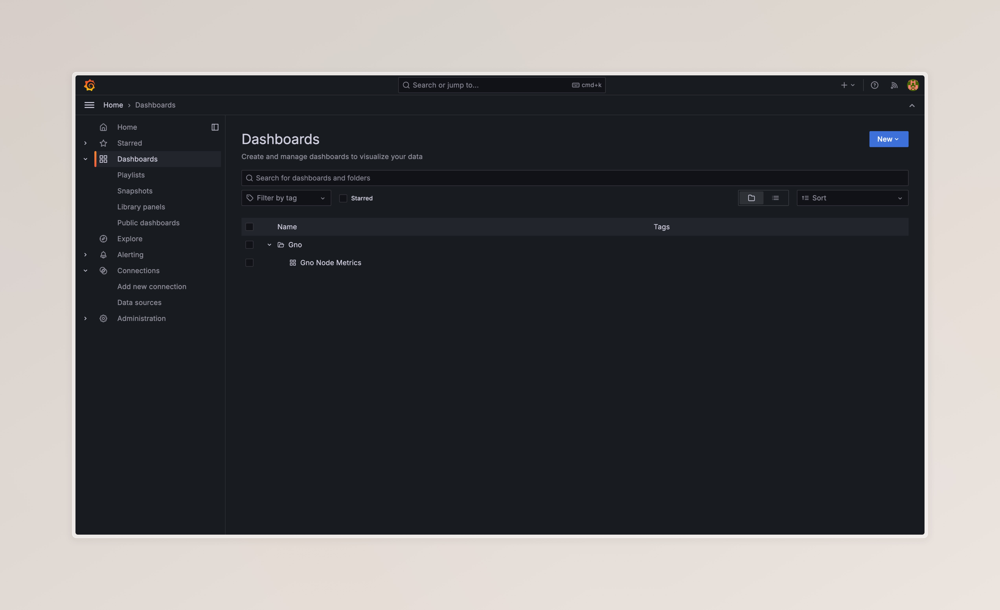
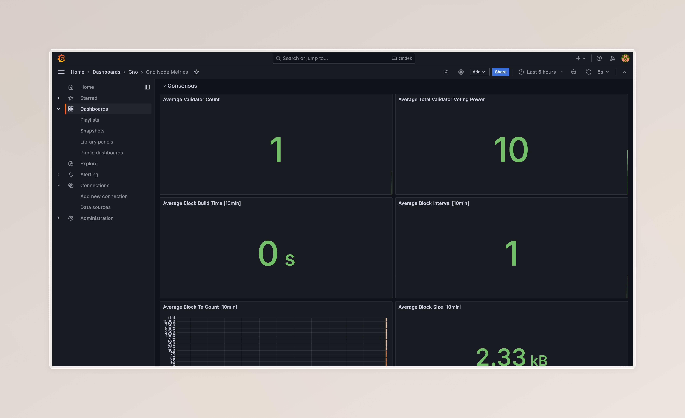

# Open Telemetry overview

The purpose of this Telemetry documentation is to showcase the different node metrics exposed by the Gno node through
OpenTelemetry, without having to do extraneous setup.

The containerized setup is the following:

- Grafana dashboard
- Prometheus
- OpenTelemetry collector (separate service that needs to run)
- 1 RPC Gnoland node, with 1s block times and configured telemetry (enabled)
- 1 Validator Gnoland node, with 1s block times and configured telemetry (enabled)
- Supernova process that simulates load periodically (generates network traffic)

## Metrics type

Metrics collected are defined within codebase at `tm2/pkg/telemetry/metrics/metrics.go`.
They are collected by the OTEL collector who forwards them to Prometheus.

They are of three different types which can be used in Grafana adding different ypt of suffixes to the metrics name :

- Histogram ("_sum", "_count", "_bucket"): Collect variations of values along time
- Gauge: Measure a single value at the time it is read
- Counter ("_total"): A value that accumulates over time

## Starting the containers

### Step 1: Spinning up Docker

Make sure you have Docker installed and running on your system. After that, within the `misc/telemetry` folder run the
following command:

```bash
make up
```

This will build out the required Docker images for this simulation, and start the services

### Step 2: Open Grafana

When you've verified that the `telemetry` containers are up and running, head on over to <http://localhost:3000> to open
the Grafana dashboard.

After you've logged in, on the left hand side, click on
`Dashboards -> Gno -> Gno Open Telemetry Metrics`:


This will open up the predefined Gno Metrics dashboards (added for ease of use):


Periodically, these metrics will be updated as the `supernova` process is simulating network traffic.

### Step 3: Stopping the cluster

To stop the cluster, you can run:

```shell
make down
```

which will stop the Docker containers. Additionally, you can delete the Docker volumes with `make clean`.
