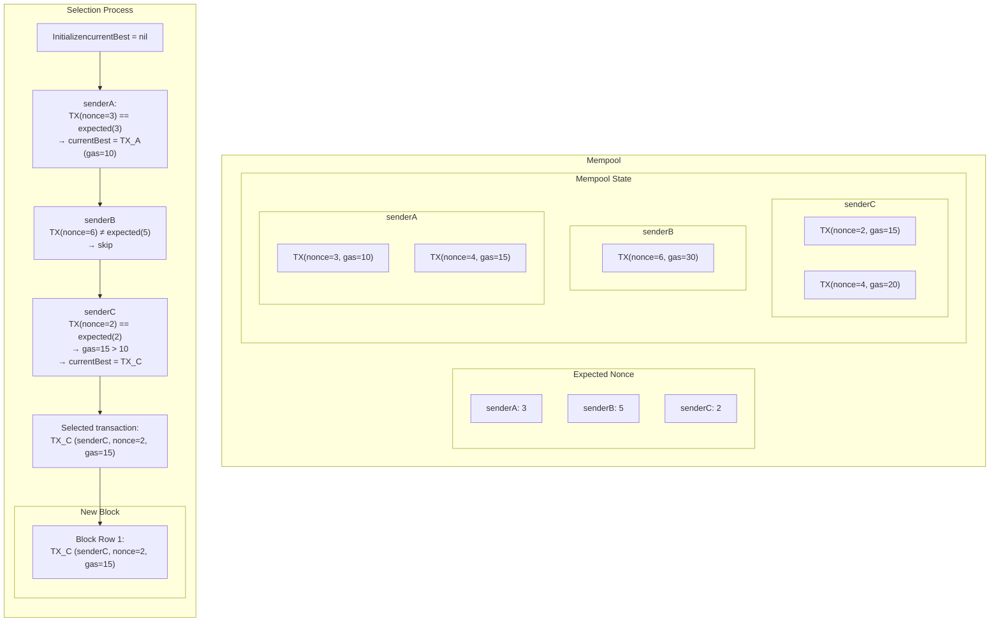

# Mempool Redesign

## 1. Motivation

The current mempool implementation in Gno.land (`CListMempool`) contains core structural flaws that limit its reliability and robustness. These problems stem from incorrect transaction ordering, lack of execution guarantees, and susceptibility to denial-of-service (DoS) scenarios. Below are the main problems:

### 1.1. Transaction Misordering

Transactions are not returned in the correct order of account sequence (nonce). This leads to scenarios where transactions fail despite being valid, simply because they are executed in the wrong order. For example:

* TX1 funds a new account (nonce 1)
* TX2 deploys a Realm from that newly funded account (nonce 1 from the new account)
* The mempool returns TX2 before TX1 due to gas-based ordering
* TX2 fails because the account doesn't yet exist

This breaks atomicity and forces users to re-submit transactions.

### 1.2. Inefficient Gas Limit Handling

The current implementation relies on user-defined gas limits instead of the actual gas used, resulting in inefficient block space usage. A transaction can declare a high gas limit, get included in a block, and use only a fraction of the declared gas — effectively blocking other legitimate transactions.

### 1.3. Lack of Control over Prioritization

There is no support for application-level prioritization logic, such as transaction lanes, governance queueing, or account-based throughput fairness. The mempool is a flat structure where only gas price determines inclusion order.

These problems reduce reliability, create unfair execution environments, and limit future extensibility.

---

## 2. Design Overview

The new mempool architecture is designed from the ground up to address these core issues. The system ensures determinism, fair prioritization, and protection against abuse.

### 2.1. Sequential Execution Enforcement

Each sender’s transactions are stored in a list sorted by nonce. The mempool maintains the expected nonce for each sender and only considers the transaction with the exact expected nonce as valid for selection. This eliminates the possibility of out-of-order execution.

> **Problem resolved:** Transaction misordering. By always selecting only the next valid nonce, dependent transactions cannot be executed prematurely.

### 2.2. Prioritization Within Valid Candidates

Among all transactions that are valid (i.e., match the expected nonce), the mempool selects the one with the highest gas price. This provides a fair prioritization mechanism without violating execution correctness.

> **Problem resolved:** Order fairness. High-fee transactions are still prioritized — but only if they're executable.

### 2.3. Sender-Based Isolation and Fairness

Transactions are grouped by sender. Each sender contributes at most one transaction (the one with expected nonce) at a time to the candidate pool. This avoids starvation and enables fair contribution across participants.

> **Problem resolved:** Throughput fairness and spam prevention. One sender cannot flood the mempool with follow-up transactions until prior ones are confirmed.

### 2.4. Stateless, Deterministic Behavior

The system avoids internal dependencies between transactions and keeps selection logic stateless from one block to the next. Any validator node can deterministically produce the same block candidate set, without relying on timing or shared state.

> **Problem resolved:** Inconsistent node behavior. Block inclusion is fully deterministic and network-agnostic.

---

## 3. Transaction Selection Walkthrough

**Explanation:**

1. Each sender has its transactions grouped and sorted by nonce inside the mempool.
2. `expectedNonce` is tracked per sender and defines the only eligible transaction for selection.
3. During selection, we iterate over **only the first transaction (i.e. lowest nonce)** for each sender:

   * `senderA` has matching nonce 3 and becomes the initial best candidate.
   * `senderB` has nonce 6 but expected is 5 → skipped.
   * `senderC` has matching nonce 2 and higher gas than A → it becomes the selected transaction.
4. TX_C is selected and added to the block.

This approach is linear, deterministic, and prevents execution gaps and unfair prioritization.

This diagram illustrates how a single transaction is processed: stored, validated, and potentially selected depending on its nonce and fee.

---

## 4. Expected Impact

The new design addresses all major pain points in the current system:

* ✅ Prevents execution errors by enforcing nonce order
* ✅ Improves fairness via fee prioritization only among valid candidates
* ✅ Eliminates gas limit manipulation vector
* ✅ Reduces mempool bloat by filtering only executable transactions
* ✅ Establishes a flexible and extensible architecture for future features like lanes or access lists

The system aligns with best practices from high-performance blockchain runtimes and prepares Gno.land for production-grade reliability.

---

## 5. Roadmap & Progress Tracking

This redesign effort was initiated based on the problems outlined in [Issue #1830](https://github.com/gnolang/gno/issues/1830), which highlighted fundamental flaws in the existing mempool such as unordered transaction execution, lack of prioritization control, and inefficiency in gas handling.

For those interested in detailed progress updates, weekly implementation logs, and future plans, please refer to my [Builder Journey](https://github.com/gnolang/hackerspace/issues/108). It serves as the central place for tracking how the mempool redesign evolves over time.
